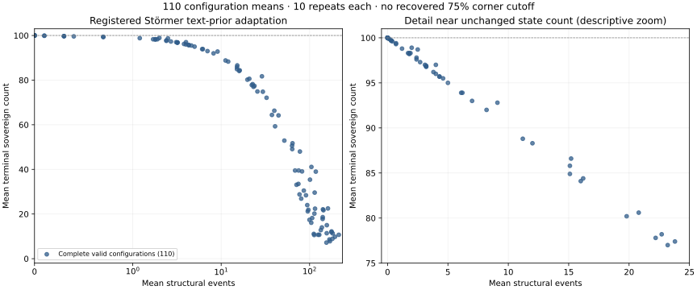

# Emergent polarity: measured findings

The complete frozen workload retained **28,520 / 28,520 sessions across 572 / 572 arms**. Registered judges used **100,000 draws** and seed **2026100202**. Valid sessions: 28,281; invalid sessions retained: 239. Every arm has its registered count. No replacement seeds, fitted defaults or reduced precision samples were used.

These are findings from a named source reconstruction. No original EPM executable was recovered, so this is not author-code docking. Source compatibility conditions on an estimated reconstruction distribution; **compatibility is not equivalence**. The figures retain their digitization uncertainty and original size-20 variability separately from precision-distribution uncertainty.

## Registered result families

| Family | Judged rows and verdicts |
| --- | --- |
| alliance | 23 Fails, 15 Holds, 13 Inconclusive |
| allocation_interaction | 31 Dependence detected, 34 Inconclusive, 15 Unresolved |
| defense | 15 Fails, 19 Holds, 17 Inconclusive |
| original_categories | 15 Compatible, 17 Incompatible |
| original_means | 15 Compatible, 1 Incompatible |
| pra_categories | 14 Compatible, 2 Incompatible |
| selection | 2 Fails, 322 Holds, 104 Inconclusive, 14 Unresolved |
| support_control | 4 Fails, 100 Inconclusive, 24 Unresolved |
| tax_categories | 1 Compatible, 4 Incompatible, 3 Unresolved |
| unquantified | 5 Untestable |

Reported source-direction/counterexample rows are separate: 22 Holds, 3 Inconclusive, 9 Unresolved.

## Defense, alliances and the meaning of stability

The initial P2/P3 hypotheses predict positive defense/alliance effects on the probability of **2–10 sovereigns**, excluding hegemony. Mean polarity and hegemonic probability answer different questions. A reproduced negative source contrast can hold as a counterexample while the corresponding positive hypothesis fails. Source-direction rows remain unresolved where digitization spans zero.

| Uniform nonzero-share aggregate | Estimate | 95% bootstrap interval | Holm p | Verdict |
| --- | --- | --- | --- | --- |
| defense/registered_nonzero_aggregate/mean_polarity | 31.9082 | [30.88642857142857, 32.938223214285706] | 0.00101999 | Holds |
| defense/registered_nonzero_aggregate/hegemony | 0.0325 | [0.02107142857142857, 0.04392857142857143] | 0.00101999 | Holds |
| defense/registered_nonzero_aggregate/power_politics | -0.488929 | [-0.5053571428571428, -0.4725] | 0.00101999 | Fails |
| alliance/registered_nonzero_aggregate/mean_polarity | 21.8489 | [20.81891964285714, 22.86429464285714] | 0.00101999 | Holds |
| alliance/registered_nonzero_aggregate/hegemony | -0.1225 | [-0.13392857142857142, -0.11142857142857142] | 0.00101999 | Fails |
| alliance/registered_nonzero_aggregate/power_politics | -0.326786 | [-0.3432142857142857, -0.31035714285714283] | 0.00101999 | Fails |

Uniform weighting covers all seven nonzero predator shares and both counterpart settings. The complete matrix below retains conflicting strata; aggregates cannot erase them. Chapter 5 allocation contrasts hold its damage convention fixed, and footnote 5 is a new author-motivated interaction study without a published factorial target. Stocks-support controls are separately registered reconstruction controls.

## Received populations and invalidity

| Population | Arms | Received / registered | Valid / invalid | Category denominator |
| --- | --- | --- | --- | --- |
| alliance_ambiguity | 80 | 1600 / 1600 | 1600 / 0 | 1600 |
| allocation | 64 | 12800 / 12800 | 12796 / 4 | 12796 |
| ambiguity | 192 | 3840 / 3840 | 3605 / 235 | 3605 |
| original | 32 | 640 / 640 | 640 / 0 | 640 |
| overextension | 1 | 20 / 20 | 20 / 0 | 20 |
| pra | 16 | 320 / 320 | 320 / 0 | 320 |
| precision | 32 | 6400 / 6400 | 6400 / 0 | 6400 |
| radax | 16 | 320 / 320 | 320 / 0 | 320 |
| stoermer | 110 | 1100 / 1100 | 1100 / 0 | 1100 |
| support_control | 16 | 320 / 320 | 320 / 0 | 320 |
| two_level | 8 | 160 / 160 | 160 / 0 | 160 |
| two_level_precision | 5 | 1000 / 1000 | 1000 / 0 | 1000 |

Original source-size sessions and precision-extension sessions remain separate. PRA source-size sessions and matching 200-session factorial distribution arms also remain separate. Tax source knots were visually inferred; missing precision knots retain Unresolved verdicts instead of interpolation or replacement.

Arm integrity issue counts: `{"invalid sessions retained outside valid category denominator": 18}`. Global issues: `[]`. Raw invalid reasons and affected policies are retained per arm in the summary JSON and matrix. Descriptive outcomes below condition on valid sessions and do not resolve invalid strata.

## Resources and direct stock observations

The signed source reading permits negative stocks and negative allocations: positive destruction and signed resource creation are separate quantities. Neither is a casualty measure. Floor-zero and reject-nonpositive are registered controls, with any invalid sessions retained.

| Population | Valid / invalid | Sessions with signed creation / valid | Positive destruction | Signed creation |
| --- | --- | --- | --- | --- |
| alliance_ambiguity | 1600 / 0 | 153 / 1600 | 3.17566e+10 | 6.16374e+10 |
| allocation | 12796 / 4 | 1228 / 12796 | 3.56295e+24 | 3.56296e+24 |
| ambiguity | 3605 / 235 | 965 / 3605 | 7.50336e+17 | 1.06176e+18 |
| original | 640 / 0 | 99 / 640 | 1.18711e+09 | 1.8886e+09 |
| overextension | 20 / 0 | 0 / 20 | 8.70062e+06 | 0 |
| pra | 320 / 0 | 0 / 320 | 0 | 0 |
| precision | 6400 / 0 | 1013 / 6400 | 4.38912e+12 | 3.50614e+12 |
| radax | 320 / 0 | 90 / 320 | 6.30817e+09 | 6.30305e+09 |
| stoermer | 1100 / 0 | 517 / 1100 | 1.3351e+191 | 2.22173e+191 |
| support_control | 320 / 0 | 43 / 320 | 2.80304e+18 | 2.80304e+18 |
| two_level | 160 / 0 | 0 / 160 | 0 | 0 |
| two_level_precision | 1000 / 0 | 0 / 1000 | 0 | 0 |

Finite resource extremes remain measured findings. In the Störmer adaptation, signed creation totals 2.22173×10^191 abstract units; configuration 068 has a conditional mean of 2.22173×10^190 across ten valid repeats. Pooled costs remain dominated by this unchanged tail. Signed accounting and structural events need separate interpretation; unchanged sovereign counts do not establish peaceful or bounded resource dynamics. No upper-stock cap, replacement seed or new invalidity threshold was introduced.

Direct endpoint stock frequencies count at-or-below-zero stocks among sovereign capitals in EPM and all primitive cells in provincial variants. They exclude absorbed EPM provinces with accounting zeros. Stock frequency uses pooled observed stocks; session frequency uses available sessions. Valid and invalid terminal observations are separate. **Period-exposure frequency was not measured**; no terminal or signed-creation statistic substitutes for it.

| Family / policy / stock unit | Terminal outcome | Nonpositive / observed stocks | Stocks fraction | Sessions with any / available | Sessions fraction | Unavailable / invalid telemetry |
| --- | --- | --- | --- | --- | --- | --- |
| alliance_ambiguity / signed / sovereign_capital_stocks | valid_sessions | 294 / 70925 | 0.00414522 | 208 / 1600 | 0.13 | 0 / 0 |
| allocation / signed / sovereign_capital_stocks | valid_sessions | 4276 / 452128 | 0.0094575 | 1471 / 12796 | 0.114958 | 0 / 0 |
| allocation / signed / sovereign_capital_stocks | invalid_sessions | 13 / 58 | 0.224138 | 4 / 4 | 1 | 0 / 0 |
| ambiguity / floor_zero / sovereign_capital_stocks | valid_sessions | 0 / 6666 | 0 | 0 / 320 | 0 | 0 / 0 |
| ambiguity / reject_nonpositive / sovereign_capital_stocks | valid_sessions | 0 / 6712 | 0 | 0 / 85 | 0 | 0 / 0 |
| ambiguity / reject_nonpositive / sovereign_capital_stocks | invalid_sessions | 241 / 2615 | 0.0921606 | 235 / 235 | 1 | 0 / 0 |
| ambiguity / signed / sovereign_capital_stocks | valid_sessions | 1530 / 78357 | 0.019526 | 1054 / 3200 | 0.329375 | 0 / 0 |
| original / signed / sovereign_capital_stocks | valid_sessions | 189 / 21303 | 0.00887199 | 121 / 640 | 0.189062 | 0 / 0 |
| overextension / signed / primitive_cell_stocks | valid_sessions | 0 / 2000 | 0 | 0 / 20 | 0 | 0 / 0 |
| pra / signed / sovereign_capital_stocks | valid_sessions | 0 / 7176 | 0 | 0 / 320 | 0 | 0 / 0 |
| precision / signed / sovereign_capital_stocks | valid_sessions | 2113 / 209061 | 0.0101071 | 1188 / 6400 | 0.185625 | 0 / 0 |
| radax / signed / sovereign_capital_stocks | valid_sessions | 175 / 7654 | 0.0228639 | 99 / 320 | 0.309375 | 0 / 0 |
| stoermer / signed / sovereign_capital_stocks | valid_sessions | 1958 / 67809 | 0.0288752 | 470 / 1100 | 0.427273 | 0 / 0 |
| support_control / signed / sovereign_capital_stocks | valid_sessions | 174 / 10382 | 0.0167598 | 75 / 320 | 0.234375 | 0 / 0 |
| two_level / signed / primitive_cell_stocks | valid_sessions | 0 / 16000 | 0 | 0 / 160 | 0 | 0 / 0 |
| two_level_precision / signed / primitive_cell_stocks | valid_sessions | 0 / 100000 | 0 | 0 / 1000 | 0 | 0 / 0 |

The committed summary contains initial observations too, all arm-specific stock/session denominators, clock validation and exact dataset/authority hashes. Invalid end-state observations describe the actual aborted state at its attempted clock and never count that aborted period as completed.

## Named alternative readings

These descriptive comparisons retain every registered 20-session alternative. They do not supply new hypothesis tests or make small arms equivalent to the precision baseline. Reported polarity differences are conditional on each arm’s valid sessions; unresolved arms remain unresolved.

| Alternative | Valid / invalid | Conditional mean polarity | Matching original baseline mean | Range of stratum mean differences |
| --- | --- | --- | --- | --- |
| action_memory=war_until_victory | 320 / 0 | 24.0656 | 24.4781 | [-7.5, 4.85] |
| capital_capture=capture_and_fragment | 320 / 0 | 22.5 | 24.4781 | [-32.849999999999994, 9.4] |
| locking=affected_states | 320 / 0 | 24.4281 | 24.4781 | [-22.049999999999997, 21.9] |
| obligation_timing=next_period | 320 / 0 | 43.35 | 42.0938 | [-5.900000000000006, 15.25] |
| province_transfer=primitive_stock_only | 320 / 0 | 23.7344 | 24.4781 | [-11.399999999999999, 9.95] |
| resource_policy=floor_zero | 320 / 0 | 20.8313 | 24.4781 | [-24.699999999999996, 4.1] |
| resource_policy=reject_nonpositive | 85 / 235 | 78.9647 | 24.4781 | [-4.6, 87.75] |
| schlieffen_gate=previous_hostilities | 320 / 0 | 27.0094 | 24.4781 | [-6.5, 18.25] |
| schlieffen_gate=unresolved_war | 320 / 0 | 25.3625 | 24.4781 | [-20.699999999999996, 11.15] |
| threat_threshold=-100.0 | 320 / 0 | 39.7219 | 42.0938 | [-12.149999999999999, 0.0] |
| threat_threshold=100.0 | 320 / 0 | 50.0156 | 42.0938 | [-0.09999999999999964, 27.0] |
| topology=torus | 320 / 0 | 22.3687 | 24.4781 | [-19.5, 5.25] |
| trust_initial=-1000.0 | 320 / 0 | 51.3625 | 42.0938 | [-0.1999999999999993, 32.45] |
| trust_initial=1000.0 | 320 / 0 | 37.1906 | 42.0938 | [-17.299999999999997, 3.0] |
| update=sequential | 320 / 0 | 26.5406 | 24.4781 | [-4.8, 11.549999999999997] |
| victory_timing=after_damage | 320 / 0 | 24.6719 | 24.4781 | [-18.25, 16.299999999999997] |
| victory_timing=after_harvest | 320 / 0 | 24.1844 | 24.4781 | [-24.4, 8.6] |

Radax persistence arms reproduce his recovered experimental design as an attributed comparison, without his unavailable executable or an exact recovered output target. EPM sequential timing is a reconstruction control; Duffy’s concurrent one-conflict protocol, geography and actors differ, so his effect sign has no transferred numeric judge.

## Störmer adaptation and provincial extensions

The Störmer text-prior adaptation contains **110 configuration means across 10 repeats**, rather than 1,100 independent configurations or execution of her appendix listing. Cardinal adjacency, normal draws and original EPM attack rules remain; unsupported trust-threshold, attack-probability, stock-tax and discount dimensions are disclosed in the frozen manifest.

The plotted coordinates are mean structural events (conquests, capital collapses and disconnections) versus mean terminal sovereign count. The zoom is descriptive. No near-corner radius or **75% inertness** gate was recovered, and exact zero structural events does not mean zero fighting, unchanged resources or unchanged trust. Exact-zero repeat fractions and all 110 coordinates remain in JSON.

All 110 configurations have their ten valid repeats. 7 / 110 configuration means and 162 / 1100 individual repeats have exactly zero structural events. These descriptive zero-event counts do not quantify the unrecovered near-corner region or reproduce a 75% inertness claim.

Overextension retained 20 / 20 sessions on the registered 10×10 grid (100 primitive units), 20 valid and 0 invalid, with 4000 mean completed periods among valid outcomes, 12193 capital collapses and 92623 voluntary revolt actions across 81739 domestic episodes, with 2185593.335182336 positive domestic combat damage units. Continuation, collapse and episodes are descriptive: the source illustration starts on a ten-by-ten grid (printed p.129; Figure 5.11 p.130), with an unknown seed. No trajectory fit or curvature threshold was introduced. Voluntary revolt-action counts and contiguous domestic-episode counts remain distinct.

## War-study handoff

Episodes retain domestic/interstate identity, participating capitals, initial sizes, paths, start/end clocks, active-period duration, positive losses, signed creation, end causes, winners and censoring. Duration includes the first conflict period; a cooperative ending period is recorded as an end timestamp rather than an additional active period. Open episodes at stopping are censored. Battle/attack counts, conquest counts and episode counts remain distinct; partial episodes from invalid sessions remain raw evidence and are excluded from valid-session summaries.

| Population | Valid episodes | Censored | Domestic | Mean active-period duration | Uncensored median | End causes |
| --- | --- | --- | --- | --- | --- | --- |
| alliance_ambiguity | 177468 | 399 | 0 | 5.25205 | 1 | {"border_loss": 761, "null": 399, "path_loss": 320, "sovereignty_loss": 8389, "victory": 167599} |
| allocation | 1450003 | 10240 | 0 | 8.65135 | 1 | {"border_loss": 5841, "null": 10240, "path_loss": 2728, "sovereignty_loss": 45468, "victory": 1385726} |
| ambiguity | 411662 | 859 | 0 | 5.03936 | 1 | {"border_loss": 1050, "null": 859, "path_loss": 417, "sovereignty_loss": 26362, "victory": 382974} |
| original | 72307 | 64 | 0 | 4.24504 | 1 | {"border_loss": 200, "null": 64, "path_loss": 96, "sovereignty_loss": 3783, "victory": 68164} |
| overextension | 342981 | 55 | 81739 | 1.62407 | 1 | {"border_loss": 37450, "null": 55, "path_loss": 4164, "sovereignty_loss": 66006, "victory": 235306} |
| pra | 31495 | 0 | 0 | 1 | 1 | {"victory": 31495} |
| precision | 732287 | 700 | 0 | 4.2797 | 1 | {"border_loss": 2373, "null": 700, "path_loss": 965, "sovereignty_loss": 38533, "victory": 689716} |
| radax | 38432 | 5 | 0 | 2.85182 | 1 | {"border_loss": 81, "null": 5, "path_loss": 35, "sovereignty_loss": 2156, "victory": 36155} |
| stoermer | 99600 | 3590 | 0 | 34.5348 | 1 | {"border_loss": 1254, "null": 3590, "path_loss": 277, "sovereignty_loss": 10052, "victory": 84427} |
| support_control | 37897 | 204 | 0 | 3.89044 | 1 | {"border_loss": 102, "null": 204, "path_loss": 43, "sovereignty_loss": 132, "victory": 37416} |
| two_level | 26319 | 0 | 3 | 1 | 1 | {"victory": 26319} |
| two_level_precision | 162704 | 0 | 11 | 1 | 1 | {"victory": 162704} |

No casualty calibration, real-world war-size fit, AI deception or intent inference follows from these abstract resources and territorial conflicts.

## Execution, corrections and provenance

Pre-domestic reviewed results used the complete assembled dataset: 28,200 unchanged non-sequential raw records from engine head `62c3bb30cf24a5869eb6a3a768f731a37f908290` and all 320 sequential records from corrected head `c00c4a65f2347924ab67c8b33e27a1877bbc0848`. Corrected native executable SHA256: `4d78f0cc55969f6500c1c4338b6e4e688e11d0cfdc73d6edc970285ee3c90786`. Manifest SHA256: `ce2c794b2abc3dc62983801584fee8b1c79b78bbb36936f1333879cc7f3bffbb`. Exact source-file SHA256: `6a145c270bcea488966201e81e92460b64fad86b037f43981583fa8af3e3b6e2`. Exact resolved-export SHA256: `dedbca5ab649a18ca258edaab8562a3288f58c711f750f7b9377f4c27aced766`. Python: `3.13.5 (main, Jun 11 2025, 15:36:57) [Clang 17.0.0 (clang-1700.0.13.3)]`. Rust: `rustc 1.98.1 (48a229cea 2026-09-01)`. Sampler: `random.binomialvariate`.

- `/opt/homebrew/opt/python@3.13/bin/python3.13 survey/polarity/run.py --binary /Users/nathan/.config/superpowers/worktrees/SugarScape/polarity/survey/out/polarity-telemetry-frozen-release-binary --manifest survey/polarity/studies.json --out survey/out/polarity-telemetry-sessions.jsonl --validate --resolved-out survey/out/polarity-telemetry-resolved.json`: 0.0568913 wall seconds, exit 0, 2026-10-03T04:16:57.755582+00:00 to 2026-10-03T04:16:57.813044+00:00.
- `/opt/homebrew/opt/python@3.13/bin/python3.13 survey/polarity/run.py --binary /Users/nathan/.config/superpowers/worktrees/SugarScape/polarity/survey/out/polarity-telemetry-frozen-release-binary --manifest survey/polarity/studies.json --out survey/out/polarity-telemetry-sessions.jsonl`: 1482.36 wall seconds, exit 0, 2026-10-03T04:16:57.823878+00:00 to 2026-10-03T04:41:40.174339+00:00.
- `/opt/homebrew/opt/python@3.13/bin/python3.13 survey/polarity/analysis.py --resolved survey/out/polarity-telemetry-resolved.json --manifest survey/polarity/studies.json --source docs/superpowers/specs/2026-10-02-emergent-polarity-source-figures.json --sessions survey/out/polarity-telemetry-sessions.jsonl --output survey/out/polarity-telemetry-findings`: 1054.86 wall seconds, exit 1, 2026-10-03T04:41:41.167434+00:00 to 2026-10-03T04:59:16.025273+00:00.
- `/opt/homebrew/opt/python@3.13/bin/python3.13 survey/polarity/analysis.py --resolved survey/out/polarity-telemetry-resolved.json --manifest survey/polarity/studies.json --source docs/superpowers/specs/2026-10-02-emergent-polarity-source-figures.json --sessions survey/out/polarity-telemetry-sessions.jsonl --output survey/out/polarity-telemetry-findings`: 1235.17 wall seconds, exit 0, 2026-10-03T05:06:47.051261+00:00 to 2026-10-03T05:27:22.222779+00:00.
- `/opt/homebrew/opt/python@3.13/bin/python3.13 survey/polarity/stock_diagnostics.py --resolved survey/out/polarity-telemetry-resolved.json --manifest survey/polarity/studies.json --sessions survey/out/polarity-telemetry-sessions.jsonl --output survey/out/polarity-telemetry-stock-diagnostics.json`: 18.2599 wall seconds, exit 0, 2026-10-03T05:27:22.224207+00:00 to 2026-10-03T05:27:40.484768+00:00.
- `/opt/homebrew/opt/python@3.13/bin/python3.13 survey/polarity/run.py --binary /Users/nathan/.config/superpowers/worktrees/SugarScape/polarity/survey/out/polarity-sequential-frozen-release-binary --manifest survey/polarity/studies.json --out survey/out/polarity-sequential-sessions.jsonl --validate --resolved-out survey/out/polarity-sequential-resolved.json`: 0.0593817 wall seconds, exit 0, 2026-10-03T05:19:29.171383+00:00 to 2026-10-03T05:19:29.231409+00:00.
- `/opt/homebrew/opt/python@3.13/bin/python3.13 survey/polarity/run.py --binary /Users/nathan/.config/superpowers/worktrees/SugarScape/polarity/survey/out/polarity-sequential-frozen-release-binary --manifest survey/polarity/studies.json --out survey/out/polarity-sequential-sessions.jsonl --arm ambiguity.p000.r2.update.sequential`: 74.993 wall seconds, exit 0, 2026-10-03T05:19:29.248112+00:00 to 2026-10-03T05:20:44.242532+00:00.
- `/opt/homebrew/opt/python@3.13/bin/python3.13 survey/polarity/run.py --binary /Users/nathan/.config/superpowers/worktrees/SugarScape/polarity/survey/out/polarity-sequential-frozen-release-binary --manifest survey/polarity/studies.json --out survey/out/polarity-sequential-sessions.jsonl --arm ambiguity.p000.r3.update.sequential`: 72.7858 wall seconds, exit 0, 2026-10-03T05:20:44.243163+00:00 to 2026-10-03T05:21:57.030405+00:00.
- `/opt/homebrew/opt/python@3.13/bin/python3.13 survey/polarity/run.py --binary /Users/nathan/.config/superpowers/worktrees/SugarScape/polarity/survey/out/polarity-sequential-frozen-release-binary --manifest survey/polarity/studies.json --out survey/out/polarity-sequential-sessions.jsonl --arm ambiguity.p005.r2.update.sequential`: 27.5422 wall seconds, exit 0, 2026-10-03T05:21:57.030991+00:00 to 2026-10-03T05:22:24.573982+00:00.
- `/opt/homebrew/opt/python@3.13/bin/python3.13 survey/polarity/run.py --binary /Users/nathan/.config/superpowers/worktrees/SugarScape/polarity/survey/out/polarity-sequential-frozen-release-binary --manifest survey/polarity/studies.json --out survey/out/polarity-sequential-sessions.jsonl --arm ambiguity.p005.r3.update.sequential`: 65.6199 wall seconds, exit 0, 2026-10-03T05:22:24.574596+00:00 to 2026-10-03T05:23:30.180499+00:00.
- `/opt/homebrew/opt/python@3.13/bin/python3.13 survey/polarity/run.py --binary /Users/nathan/.config/superpowers/worktrees/SugarScape/polarity/survey/out/polarity-sequential-frozen-release-binary --manifest survey/polarity/studies.json --out survey/out/polarity-sequential-sessions.jsonl --arm ambiguity.p010.r2.update.sequential`: 6.5157 wall seconds, exit 0, 2026-10-03T05:23:30.181218+00:00 to 2026-10-03T05:23:36.696987+00:00.
- `/opt/homebrew/opt/python@3.13/bin/python3.13 survey/polarity/run.py --binary /Users/nathan/.config/superpowers/worktrees/SugarScape/polarity/survey/out/polarity-sequential-frozen-release-binary --manifest survey/polarity/studies.json --out survey/out/polarity-sequential-sessions.jsonl --arm ambiguity.p010.r3.update.sequential`: 65.9338 wall seconds, exit 0, 2026-10-03T05:23:36.697620+00:00 to 2026-10-03T05:24:42.631846+00:00.
- `/opt/homebrew/opt/python@3.13/bin/python3.13 survey/polarity/run.py --binary /Users/nathan/.config/superpowers/worktrees/SugarScape/polarity/survey/out/polarity-sequential-frozen-release-binary --manifest survey/polarity/studies.json --out survey/out/polarity-sequential-sessions.jsonl --arm ambiguity.p020.r2.update.sequential`: 5.20152 wall seconds, exit 0, 2026-10-03T05:24:42.632441+00:00 to 2026-10-03T05:24:47.834376+00:00.
- `/opt/homebrew/opt/python@3.13/bin/python3.13 survey/polarity/run.py --binary /Users/nathan/.config/superpowers/worktrees/SugarScape/polarity/survey/out/polarity-sequential-frozen-release-binary --manifest survey/polarity/studies.json --out survey/out/polarity-sequential-sessions.jsonl --arm ambiguity.p020.r3.update.sequential`: 44.3061 wall seconds, exit 0, 2026-10-03T05:24:47.834959+00:00 to 2026-10-03T05:25:32.141866+00:00.
- `/opt/homebrew/opt/python@3.13/bin/python3.13 survey/polarity/run.py --binary /Users/nathan/.config/superpowers/worktrees/SugarScape/polarity/survey/out/polarity-sequential-frozen-release-binary --manifest survey/polarity/studies.json --out survey/out/polarity-sequential-sessions.jsonl --arm ambiguity.p040.r2.update.sequential`: 3.93923 wall seconds, exit 0, 2026-10-03T05:25:32.142467+00:00 to 2026-10-03T05:25:36.082105+00:00.
- `/opt/homebrew/opt/python@3.13/bin/python3.13 survey/polarity/run.py --binary /Users/nathan/.config/superpowers/worktrees/SugarScape/polarity/survey/out/polarity-sequential-frozen-release-binary --manifest survey/polarity/studies.json --out survey/out/polarity-sequential-sessions.jsonl --arm ambiguity.p040.r3.update.sequential`: 38.3437 wall seconds, exit 0, 2026-10-03T05:25:36.082700+00:00 to 2026-10-03T05:26:14.427161+00:00.
- `/opt/homebrew/opt/python@3.13/bin/python3.13 survey/polarity/run.py --binary /Users/nathan/.config/superpowers/worktrees/SugarScape/polarity/survey/out/polarity-sequential-frozen-release-binary --manifest survey/polarity/studies.json --out survey/out/polarity-sequential-sessions.jsonl --arm ambiguity.p060.r2.update.sequential`: 3.03542 wall seconds, exit 0, 2026-10-03T05:26:14.427773+00:00 to 2026-10-03T05:26:17.463587+00:00.
- `/opt/homebrew/opt/python@3.13/bin/python3.13 survey/polarity/run.py --binary /Users/nathan/.config/superpowers/worktrees/SugarScape/polarity/survey/out/polarity-sequential-frozen-release-binary --manifest survey/polarity/studies.json --out survey/out/polarity-sequential-sessions.jsonl --arm ambiguity.p060.r3.update.sequential`: 33.6339 wall seconds, exit 0, 2026-10-03T05:26:17.464193+00:00 to 2026-10-03T05:26:51.098954+00:00.
- `/opt/homebrew/opt/python@3.13/bin/python3.13 survey/polarity/run.py --binary /Users/nathan/.config/superpowers/worktrees/SugarScape/polarity/survey/out/polarity-sequential-frozen-release-binary --manifest survey/polarity/studies.json --out survey/out/polarity-sequential-sessions.jsonl --arm ambiguity.p080.r2.update.sequential`: 3.15818 wall seconds, exit 0, 2026-10-03T05:26:51.099587+00:00 to 2026-10-03T05:26:54.258169+00:00.
- `/opt/homebrew/opt/python@3.13/bin/python3.13 survey/polarity/run.py --binary /Users/nathan/.config/superpowers/worktrees/SugarScape/polarity/survey/out/polarity-sequential-frozen-release-binary --manifest survey/polarity/studies.json --out survey/out/polarity-sequential-sessions.jsonl --arm ambiguity.p080.r3.update.sequential`: 16.7274 wall seconds, exit 0, 2026-10-03T05:26:54.258789+00:00 to 2026-10-03T05:27:10.986787+00:00.
- `/opt/homebrew/opt/python@3.13/bin/python3.13 survey/polarity/run.py --binary /Users/nathan/.config/superpowers/worktrees/SugarScape/polarity/survey/out/polarity-sequential-frozen-release-binary --manifest survey/polarity/studies.json --out survey/out/polarity-sequential-sessions.jsonl --arm ambiguity.p100.r2.update.sequential`: 3.19741 wall seconds, exit 0, 2026-10-03T05:27:10.987394+00:00 to 2026-10-03T05:27:14.185201+00:00.
- `/opt/homebrew/opt/python@3.13/bin/python3.13 survey/polarity/run.py --binary /Users/nathan/.config/superpowers/worktrees/SugarScape/polarity/survey/out/polarity-sequential-frozen-release-binary --manifest survey/polarity/studies.json --out survey/out/polarity-sequential-sessions.jsonl --arm ambiguity.p100.r3.update.sequential`: 27.4138 wall seconds, exit 0, 2026-10-03T05:27:14.185796+00:00 to 2026-10-03T05:27:41.600266+00:00.
- `/opt/homebrew/opt/python@3.13/bin/python3.13 survey/polarity/export_report.py --resolved survey/out/polarity-sequential-resolved.json --manifest survey/polarity/studies.json --source docs/superpowers/specs/2026-10-02-emergent-polarity-source-figures.json --sessions survey/out/polarity-final-sessions.jsonl --output survey/out/polarity-final-findings`: 1065.53 wall seconds, exit 0, 2026-10-03T05:30:22.975779+00:00 to 2026-10-03T05:48:08.517643+00:00.
- `/opt/homebrew/opt/python@3.13/bin/python3.13 survey/polarity/stock_diagnostics.py --resolved survey/out/polarity-sequential-resolved.json --manifest survey/polarity/studies.json --sessions survey/out/polarity-final-sessions.jsonl --output survey/out/polarity-final-stock-diagnostics.json`: 17.1019 wall seconds, exit 0, 2026-10-03T05:48:08.519228+00:00 to 2026-10-03T05:48:25.626269+00:00.

Complete zero-period authoritative exports preceded both native measurements and matched exactly. Original telemetry engine/source/binary bytes were verified after native execution and the failed report export. All original computation functions and immutable analysis inputs were reverified after the successful serialization repair. Corrected engine/source/binary/resolution bytes and both component datasets were reverified after final analysis. Full commands, byte maps, runtime, ignored raw paths and dataset hashes are committed in execution provenance. Original source PDFs and raw sessions remain ignored.

The [dated diagnostic amendment](2026-10-03-emergent-polarity-telemetry-amendment.md) retains the original interrupted 4,272-record dataset and executable. No complete original study verdict existed. The amended full same-seed dataset supplies direct initial/terminal stock observations while scientific judges stay unchanged. Every pre-existing record field matches for all 4,272 original pairs: 0 missing and 0 mismatches, with matching canonical digests. The committed equivalence receipt binds both datasets and the comparison command/algorithm.

The [dated strict export repair](2026-10-03-emergent-polarity-export-amendment.md) retains the original 1,054.856-second failed sorted-JSON export and all byte-identical scientific computation functions. Both documented analysis entrypoints now preserve censored null causes in strict JSON. The object-map key `"null"` in episode_end_causes represents the count of null causes; each raw censored episode still has actual JSON null.

The [sequential implementation correction](2026-10-03-emergent-polarity-sequential-amendment.md) preserves all 237 original panic records and the [complete original verdicts](2026-10-02-emergent-polarity-pre-sequential-findings.md). A conquest removed a later cached front; the correction skips that obsolete front before visitation or resolution mutation. All 16 arms × 20 original seeds were rerun, with 83 previously valid complete records unchanged, 0 missing and 0 mismatches. All 28,200 unaffected raw lines are byte-identical. The [assembly receipt](2026-10-02-emergent-polarity-assembly-receipt.json) and [every changed result/verdict](2026-10-02-emergent-polarity-sequential-before-after.json) bind both datasets. That pre-domestic registered report remains preserved; rejected stock and nonfinite-ratio invalids remain retained in the domestic amendment too.

Local Rust, standalone survey, actual-binary Python, release WASM, full web and typecheck checks passed; fresh whole-branch independent review and final merge/push/CI/Pages are controller-owned pending publication gates. Stage 4 remains In Progress.

## Domestic source-fidelity amendment (2026-10-03)

The [domestic amendment](2026-10-03-emergent-polarity-domestic-amendment.md) removes the undocumented episode-open veto. Figure 5.7 (printed p.124) reevaluates the province decision each period; pp.126–128 give its stochastic replacement. Selected action memory remains explicit. Renewed voluntary revolt actions can create DD and resource damage inside an existing episode; episode counts are not revolt-action counts.

Current complete data use **27,340 literal unchanged nonprovincial records plus all 1,180 rerun provincial records**. Every one of the 14 provincial arms and its original seeds was rerun. Complete outer records equal their pre-domestic counterparts in 1160 cases; 20 Outcomes changed. These are complete-record comparisons, independent of source-fit scores.

All 863 report rows were recomputed with the unchanged 18 computation functions, 100,000 draws and seed 2026100202. 863 rows are unchanged; 0 results and 0 verdicts change. Every affected and unaffected row, provincial Outcome/stock comparison, episode summary and stock dependency is retained in the [before/after receipt](2026-10-03-emergent-polarity-domestic-before-after.json). Unchanged raw evidence does not itself imply an unchanged downstream Monte Carlo draw schedule.

The [reviewed 863-row pre-domestic findings](2026-10-03-emergent-polarity-pre-domestic-findings.md), summary JSON, descriptive summary and execution provenance remain preserved with original hashes, alongside all earlier amendments, datasets and failures. The original 237 sequential panics and all 83 previously valid same-seed records are retained; the domestic repair cannot enter the sequential EPM branch. The source PDFs, manifest, source intervals, research notes and all scientific computation functions remain unchanged.

Domestic engine head `b1bf1e5ac82bc223aa45b1b9672d9c1f6d4dbb1b`; frozen binary SHA256 `ffbb5e97c8848291b9cd07097cb9002cc404651bb5a938a0e83187cf8924c6d7`; complete current raw SHA256 `5ec59598477b28c3afa8661b5b3d193141117214b2417878c330f0bd7451a7e8`; full report SHA256 `b695753a786aca05e0c4c71cde0eaecb7045fb16473779f0e9ff2dddb5958025`; pre-domestic raw SHA256 `5bec80a14527597742182da4aab1d037f30fddcf42d30669eca2240accb5d802`. Complete authority remains SHA256 `dedbca5ab649a18ca258edaab8562a3288f58c711f750f7b9377f4c27aced766`. All 572 configs use lowest-ID ties; the singleton random-tie draw correction changes no registered configuration. Nullable resource/accounting types match actual invalid WASM JSON and preserve unavailable inspection values.

- `/opt/homebrew/opt/python@3.13/bin/python3.13 survey/polarity/run.py --binary /Users/nathan/.config/superpowers/worktrees/SugarScape/polarity/survey/out/polarity-domestic-frozen-release-binary --manifest survey/polarity/studies.json --out survey/out/polarity-domestic-provincial-sessions.jsonl --validate --resolved-out survey/out/polarity-domestic-resolved.json`: 0.0571629 wall seconds, exit 0, 2026-10-03T06:32:07.728740+00:00 to 2026-10-03T06:32:07.786637+00:00.
- `/opt/homebrew/opt/python@3.13/bin/python3.13 survey/polarity/run.py --binary /Users/nathan/.config/superpowers/worktrees/SugarScape/polarity/survey/out/polarity-domestic-frozen-release-binary --manifest survey/polarity/studies.json --out survey/out/polarity-domestic-provincial-sessions.jsonl --arm two_level.knot00`: 1.22843 wall seconds, exit 0, 2026-10-03T06:32:07.803361+00:00 to 2026-10-03T06:32:09.032661+00:00.
- `/opt/homebrew/opt/python@3.13/bin/python3.13 survey/polarity/run.py --binary /Users/nathan/.config/superpowers/worktrees/SugarScape/polarity/survey/out/polarity-domestic-frozen-release-binary --manifest survey/polarity/studies.json --out survey/out/polarity-domestic-provincial-sessions.jsonl --arm two_level.knot01`: 1.15549 wall seconds, exit 0, 2026-10-03T06:32:09.033616+00:00 to 2026-10-03T06:32:10.189984+00:00.
- `/opt/homebrew/opt/python@3.13/bin/python3.13 survey/polarity/run.py --binary /Users/nathan/.config/superpowers/worktrees/SugarScape/polarity/survey/out/polarity-domestic-frozen-release-binary --manifest survey/polarity/studies.json --out survey/out/polarity-domestic-provincial-sessions.jsonl --arm two_level.knot02`: 0.849318 wall seconds, exit 0, 2026-10-03T06:32:10.190589+00:00 to 2026-10-03T06:32:11.040296+00:00.
- `/opt/homebrew/opt/python@3.13/bin/python3.13 survey/polarity/run.py --binary /Users/nathan/.config/superpowers/worktrees/SugarScape/polarity/survey/out/polarity-domestic-frozen-release-binary --manifest survey/polarity/studies.json --out survey/out/polarity-domestic-provincial-sessions.jsonl --arm two_level.knot03`: 0.960272 wall seconds, exit 0, 2026-10-03T06:32:11.040995+00:00 to 2026-10-03T06:32:12.002058+00:00.
- `/opt/homebrew/opt/python@3.13/bin/python3.13 survey/polarity/run.py --binary /Users/nathan/.config/superpowers/worktrees/SugarScape/polarity/survey/out/polarity-domestic-frozen-release-binary --manifest survey/polarity/studies.json --out survey/out/polarity-domestic-provincial-sessions.jsonl --arm two_level.knot04`: 0.926622 wall seconds, exit 0, 2026-10-03T06:32:12.002780+00:00 to 2026-10-03T06:32:12.930199+00:00.
- `/opt/homebrew/opt/python@3.13/bin/python3.13 survey/polarity/run.py --binary /Users/nathan/.config/superpowers/worktrees/SugarScape/polarity/survey/out/polarity-domestic-frozen-release-binary --manifest survey/polarity/studies.json --out survey/out/polarity-domestic-provincial-sessions.jsonl --arm two_level.knot05`: 1.05422 wall seconds, exit 0, 2026-10-03T06:32:12.930820+00:00 to 2026-10-03T06:32:13.985445+00:00.
- `/opt/homebrew/opt/python@3.13/bin/python3.13 survey/polarity/run.py --binary /Users/nathan/.config/superpowers/worktrees/SugarScape/polarity/survey/out/polarity-domestic-frozen-release-binary --manifest survey/polarity/studies.json --out survey/out/polarity-domestic-provincial-sessions.jsonl --arm two_level.knot06`: 1.1155 wall seconds, exit 0, 2026-10-03T06:32:13.986089+00:00 to 2026-10-03T06:32:15.101980+00:00.
- `/opt/homebrew/opt/python@3.13/bin/python3.13 survey/polarity/run.py --binary /Users/nathan/.config/superpowers/worktrees/SugarScape/polarity/survey/out/polarity-domestic-frozen-release-binary --manifest survey/polarity/studies.json --out survey/out/polarity-domestic-provincial-sessions.jsonl --arm two_level.knot07`: 1.0679 wall seconds, exit 0, 2026-10-03T06:32:15.102673+00:00 to 2026-10-03T06:32:16.171076+00:00.
- `/opt/homebrew/opt/python@3.13/bin/python3.13 survey/polarity/run.py --binary /Users/nathan/.config/superpowers/worktrees/SugarScape/polarity/survey/out/polarity-domestic-frozen-release-binary --manifest survey/polarity/studies.json --out survey/out/polarity-domestic-provincial-sessions.jsonl --arm two_level_precision.tax0`: 30.4699 wall seconds, exit 0, 2026-10-03T06:32:16.171878+00:00 to 2026-10-03T06:32:46.643011+00:00.
- `/opt/homebrew/opt/python@3.13/bin/python3.13 survey/polarity/run.py --binary /Users/nathan/.config/superpowers/worktrees/SugarScape/polarity/survey/out/polarity-domestic-frozen-release-binary --manifest survey/polarity/studies.json --out survey/out/polarity-domestic-provincial-sessions.jsonl --arm two_level_precision.tax0.1`: 0.760566 wall seconds, exit 0, 2026-10-03T06:32:46.644049+00:00 to 2026-10-03T06:32:47.405417+00:00.
- `/opt/homebrew/opt/python@3.13/bin/python3.13 survey/polarity/run.py --binary /Users/nathan/.config/superpowers/worktrees/SugarScape/polarity/survey/out/polarity-domestic-frozen-release-binary --manifest survey/polarity/studies.json --out survey/out/polarity-domestic-provincial-sessions.jsonl --arm two_level_precision.tax0.2`: 0.753266 wall seconds, exit 0, 2026-10-03T06:32:47.406746+00:00 to 2026-10-03T06:32:48.160455+00:00.
- `/opt/homebrew/opt/python@3.13/bin/python3.13 survey/polarity/run.py --binary /Users/nathan/.config/superpowers/worktrees/SugarScape/polarity/survey/out/polarity-domestic-frozen-release-binary --manifest survey/polarity/studies.json --out survey/out/polarity-domestic-provincial-sessions.jsonl --arm two_level_precision.tax0.4`: 0.752571 wall seconds, exit 0, 2026-10-03T06:32:48.161148+00:00 to 2026-10-03T06:32:48.914173+00:00.
- `/opt/homebrew/opt/python@3.13/bin/python3.13 survey/polarity/run.py --binary /Users/nathan/.config/superpowers/worktrees/SugarScape/polarity/survey/out/polarity-domestic-frozen-release-binary --manifest survey/polarity/studies.json --out survey/out/polarity-domestic-provincial-sessions.jsonl --arm two_level_precision.tax1`: 7.95919 wall seconds, exit 0, 2026-10-03T06:32:48.914853+00:00 to 2026-10-03T06:32:56.874791+00:00.
- `/opt/homebrew/opt/python@3.13/bin/python3.13 survey/polarity/run.py --binary /Users/nathan/.config/superpowers/worktrees/SugarScape/polarity/survey/out/polarity-domestic-frozen-release-binary --manifest survey/polarity/studies.json --out survey/out/polarity-domestic-provincial-sessions.jsonl --arm overextension.narrative_observation`: 60.4777 wall seconds, exit 0, 2026-10-03T06:32:56.875532+00:00 to 2026-10-03T06:33:57.354364+00:00.
- `/opt/homebrew/opt/python@3.13/bin/python3.13 survey/out/polarity-domestic-assemble.py`: 29.8293 wall seconds, exit 0, 2026-10-03T06:33:57.504886+00:00 to 2026-10-03T06:34:27.334965+00:00.
- `/opt/homebrew/opt/python@3.13/bin/python3.13 survey/polarity/export_report.py --resolved survey/out/polarity-domestic-resolved.json --manifest survey/polarity/studies.json --source docs/superpowers/specs/2026-10-02-emergent-polarity-source-figures.json --sessions survey/out/polarity-domestic-sessions.jsonl --output survey/out/polarity-domestic-findings`: 1050.08 wall seconds, exit 0, 2026-10-03T06:34:27.846052+00:00 to 2026-10-03T06:51:57.881778+00:00.
- `/opt/homebrew/opt/python@3.13/bin/python3.13 survey/polarity/stock_diagnostics.py --resolved survey/out/polarity-domestic-resolved.json --manifest survey/polarity/studies.json --sessions survey/out/polarity-domestic-sessions.jsonl --output survey/out/polarity-domestic-stock-diagnostics.json`: 17.0712 wall seconds, exit 0, 2026-10-03T06:51:57.888881+00:00 to 2026-10-03T06:52:14.966674+00:00.
- `/opt/homebrew/opt/python@3.13/bin/python3.13 survey/out/polarity-domestic-compare.py`: 2.60363 wall seconds, exit 0, 2026-10-03T06:54:00.925226+00:00 to 2026-10-03T06:54:03.535504+00:00.
- `/opt/homebrew/opt/python@3.13/bin/python3.13 survey/out/polarity-domestic-describe.py`: 31.7388 wall seconds, exit 0, 2026-10-03T06:54:03.542064+00:00 to 2026-10-03T06:54:35.286545+00:00.
- `/opt/homebrew/opt/python@3.13/bin/python3.13 survey/out/polarity-domestic-write-overview.py`: 0.0933872 wall seconds, exit 0, 2026-10-03T06:54:35.533895+00:00 to 2026-10-03T06:54:35.633728+00:00.

The frozen research notes contain 400-unit narrative wording that is superseded by the dated source-example clarification: the actual overextension illustration is 10×10 with unknown seed. It has no quantitative trajectory acceptance target. Five recorded rulings remain explicit: authoritative config/Outcome integrity, direct stock telemetry, strict-null export, sequential obsolete-front correction, and domestic source-fidelity correction. Stage 4 remains In Progress; final review, integration, CI and Pages remain controller-owned.

## Complete registered matrix and arm accounting

Invalid records, duplicate records, incomplete arms and integrity failures are retained. Descriptive arm means condition on available valid sessions and do not resolve source compatibility.

| Claim | Source | Judge | Result and uncertainty | Verdict | Limitations |
| --- | --- | --- | --- | --- | --- |
| figure_10/defense/{'predator_share': 0, 'superiority': 3, 'alliances': False} | cederman1994 printed518 figure_10 | size20 unsmoothed bootstrap means | {"holm_p": 1.0, "p": 1.0, "predictive_interval": [100.0, 100.0], "reconstruction_mean": 100.0, "source_interval": [98.602287, 100]} | Compatible | Predictive check conditions on estimated reconstruction distribution; compatibility is not equivalence.; Original20-run arms remain separate descriptive literal-size samples. |
| figure_10/defense/{'predator_share': 0.05, 'superiority': 3, 'alliances': False} | cederman1994 printed518 figure_10 | size20 unsmoothed bootstrap means | {"holm_p": 1.0, "p": 0.7311526884731153, "predictive_interval": [40.65, 81.1], "reconstruction_mean": 61.67, "source_interval": [65.311309, 69.631512]} | Compatible | Predictive check conditions on estimated reconstruction distribution; compatibility is not equivalence.; Original20-run arms remain separate descriptive literal-size samples. |
| figure_10/defense/{'predator_share': 0.1, 'superiority': 3, 'alliances': False} | cederman1994 printed518 figure_10 | size20 unsmoothed bootstrap means | {"holm_p": 1.0, "p": 0.26653733462665374, "predictive_interval": [20.9, 60.45], "reconstruction_mean": 40.185, "source_interval": [51.58831, 55.908513]} | Compatible | Predictive check conditions on estimated reconstruction distribution; compatibility is not equivalence.; Original20-run arms remain separate descriptive literal-size samples. |
| figure_10/defense/{'predator_share': 0.2, 'superiority': 3, 'alliances': False} | cederman1994 printed518 figure_10 | size20 unsmoothed bootstrap means | {"holm_p": 0.32619673803261967, "p": 0.023299767002329975, "predictive_interval": [7.35, 39.05], "reconstruction_mean": 21.635, "source_interval": [41.550191, 44.345616]} | Compatible | Predictive check conditions on estimated reconstruction distribution; compatibility is not equivalence.; Original20-run arms remain separate descriptive literal-size samples. |
| figure_10/defense/{'predator_share': 0.4, 'superiority': 3, 'alliances': False} | cederman1994 printed518 figure_10 | size20 unsmoothed bootstrap means | {"holm_p": 0.0025599744002559976, "p": 0.00015999840001599985, "predictive_interval": [2.4, 21.05], "reconstruction_mean": 8.815, "source_interval": [34.307497, 37.102922]} | Incompatible | Predictive check conditions on estimated reconstruction distribution; compatibility is not equivalence.; Original20-run arms remain separate descriptive literal-size samples. |
| figure_10/defense/{'predator_share': 0.6, 'superiority': 3, 'alliances': False} | cederman1994 printed518 figure_10 | size20 unsmoothed bootstrap means | {"holm_p": 1.0, "p": 0.6631733682663173, "predictive_interval": [2.35, 12.45], "reconstruction_mean": 4.87, "source_interval": [5.463787, 8.259212]} | Compatible | Predictive check conditions on estimated reconstruction distribution; compatibility is not equivalence.; Original20-run arms remain separate descriptive literal-size samples. |
| figure_10/defense/{'predator_share': 0.8, 'superiority': 3, 'alliances': False} | cederman1994 printed518 figure_10 | size20 unsmoothed bootstrap means | {"holm_p": 0.12659873401265986, "p": 0.008439915600843992, "predictive_interval": [2.4, 7.95], "reconstruction_mean": 3.52, "source_interval": [11.181703, 13.977128]} | Compatible | Predictive check conditions on estimated reconstruction distribution; compatibility is not equivalence.; Original20-run arms remain separate descriptive literal-size samples. |
| figure_10/defense/{'predator_share': 1, 'superiority': 3, 'alliances': False} | cederman1994 printed518 figure_10 | size20 unsmoothed bootstrap means | {"holm_p": 0.9110308896911031, "p": 0.07007929920700794, "predictive_interval": [2.6, 11.3], "reconstruction_mean": 4.46, "source_interval": [10.292249, 13.087675]} | Compatible | Predictive check conditions on estimated reconstruction distribution; compatibility is not equivalence.; Original20-run arms remain separate descriptive literal-size samples. |
| figure_10/offense/{'predator_share': 0, 'superiority': 2, 'alliances': False} | cederman1994 printed518 figure_10 | size20 unsmoothed bootstrap means | {"holm_p": 1.0, "p": 1.0, "predictive_interval": [100.0, 100.0], "reconstruction_mean": 100.0, "source_interval": [98.602287, 100]} | Compatible | Predictive check conditions on estimated reconstruction distribution; compatibility is not equivalence.; Original20-run arms remain separate descriptive literal-size samples. |
| figure_10/offense/{'predator_share': 0.05, 'superiority': 2, 'alliances': False} | cederman1994 printed518 figure_10 | size20 unsmoothed bootstrap means | {"holm_p": 1.0, "p": 0.5192148078519215, "predictive_interval": [1.55, 11.75], "reconstruction_mean": 3.77, "source_interval": [5.209657, 9.52986]} | Compatible | Predictive check conditions on estimated reconstruction distribution; compatibility is not equivalence.; Original20-run arms remain separate descriptive literal-size samples. |
| figure_10/offense/{'predator_share': 0.1, 'superiority': 2, 'alliances': False} | cederman1994 printed518 figure_10 | size20 unsmoothed bootstrap means | {"holm_p": 1.0, "p": 1.0, "predictive_interval": [1.95, 7.6], "reconstruction_mean": 2.97, "source_interval": [1.397713, 5.717916]} | Compatible | Predictive check conditions on estimated reconstruction distribution; compatibility is not equivalence.; Original20-run arms remain separate descriptive literal-size samples. |
| figure_10/offense/{'predator_share': 0.2, 'superiority': 2, 'alliances': False} | cederman1994 printed518 figure_10 | size20 unsmoothed bootstrap means | {"holm_p": 1.0, "p": 1.0, "predictive_interval": [2.4, 3.55], "reconstruction_mean": 2.9, "source_interval": [2.541296, 5.336722]} | Compatible | Predictive check conditions on estimated reconstruction distribution; compatibility is not equivalence.; Original20-run arms remain separate descriptive literal-size samples. |
| figure_10/offense/{'predator_share': 0.4, 'superiority': 2, 'alliances': False} | cederman1994 printed518 figure_10 | size20 unsmoothed bootstrap means | {"holm_p": 1.0, "p": 1.0, "predictive_interval": [2.75, 4.25], "reconstruction_mean": 3.315, "source_interval": [3.049555, 5.844981]} | Compatible | Predictive check conditions on estimated reconstruction distribution; compatibility is not equivalence.; Original20-run arms remain separate descriptive literal-size samples. |
| figure_10/offense/{'predator_share': 0.6, 'superiority': 2, 'alliances': False} | cederman1994 printed518 figure_10 | size20 unsmoothed bootstrap means | {"holm_p": 1.0, "p": 1.0, "predictive_interval": [3.0, 4.3], "reconstruction_mean": 3.6, "source_interval": [3.049555, 5.844981]} | Compatible | Predictive check conditions on estimated reconstruction distribution; compatibility is not equivalence.; Original20-run arms remain separate descriptive literal-size samples. |
| figure_10/offense/{'predator_share': 0.8, 'superiority': 2, 'alliances': False} | cederman1994 printed518 figure_10 | size20 unsmoothed bootstrap means | {"holm_p": 1.0, "p": 1.0, "predictive_interval": [3.45, 4.6], "reconstruction_mean": 4.01, "source_interval": [3.049555, 5.844981]} | Compatible | Predictive check conditions on estimated reconstruction distribution; compatibility is not equivalence.; Original20-run arms remain separate descriptive literal-size samples. |
| figure_10/offense/{'predator_share': 1, 'superiority': 2, 'alliances': False} | cederman1994 printed518 figure_10 | size20 unsmoothed bootstrap means | {"holm_p": 1.0, "p": 1.0, "predictive_interval": [3.4, 4.65], "reconstruction_mean": 3.99, "source_interval": [3.17662, 5.972046]} | Compatible | Predictive check conditions on estimated reconstruction distribution; compatibility is not equivalence.; Original20-run arms remain separate descriptive literal-size samples. |
| figure_11/defense/{'predator_share': 0, 'superiority': 3, 'alliances': False} | cederman1994 printed519 figure_11 | size20 Jeffreys multinomial deviance; maximum p across admissible vectors | {"holm_p": 1.0, "p": 1.0, "total_variation_interval": [0.0, 0.0]} | Compatible | Predictive check conditions on estimated reconstruction distribution; compatibility is not equivalence.; Original20-run arms remain separate descriptive literal-size samples. |
| figure_11/defense/{'predator_share': 0.05, 'superiority': 3, 'alliances': False} | cederman1994 printed519 figure_11 | size20 Jeffreys multinomial deviance; maximum p across admissible vectors | {"holm_p": 1.0, "p": 0.980720192798072, "total_variation_interval": [0.06000000000000003, 0.155]} | Compatible | Predictive check conditions on estimated reconstruction distribution; compatibility is not equivalence.; Original20-run arms remain separate descriptive literal-size samples. |
| figure_11/defense/{'predator_share': 0.1, 'superiority': 3, 'alliances': False} | cederman1994 printed519 figure_11 | size20 Jeffreys multinomial deviance; maximum p across admissible vectors | {"holm_p": 1.0, "p": 0.2236277637223628, "total_variation_interval": [0.235, 0.335]} | Compatible | Predictive check conditions on estimated reconstruction distribution; compatibility is not equivalence.; Original20-run arms remain separate descriptive literal-size samples. |
| figure_11/defense/{'predator_share': 0.2, 'superiority': 3, 'alliances': False} | cederman1994 printed519 figure_11 | size20 Jeffreys multinomial deviance; maximum p across admissible vectors | {"holm_p": 0.001019989800101999, "p": 5.999940000599994e-05, "total_variation_interval": [0.5, 0.5]} | Incompatible | Predictive check conditions on estimated reconstruction distribution; compatibility is not equivalence.; Original20-run arms remain separate descriptive literal-size samples. |
| figure_11/defense/{'predator_share': 0.4, 'superiority': 3, 'alliances': False} | cederman1994 printed519 figure_11 | size20 Jeffreys multinomial deviance; maximum p across admissible vectors | {"holm_p": 0.00039999600003999964, "p": 1.999980000199998e-05, "total_variation_interval": [0.46, 0.46]} | Incompatible | Predictive check conditions on estimated reconstruction distribution; compatibility is not equivalence.; Original20-run arms remain separate descriptive literal-size samples. |
| figure_11/defense/{'predator_share': 0.6, 'superiority': 3, 'alliances': False} | cederman1994 printed519 figure_11 | size20 Jeffreys multinomial deviance; maximum p across admissible vectors | {"holm_p": 1.0, "p": 0.11994880051199489, "total_variation_interval": [0.22000000000000003, 0.22000000000000003]} | Compatible | Predictive check conditions on estimated reconstruction distribution; compatibility is not equivalence.; Original20-run arms remain separate descriptive literal-size samples. |
| figure_11/defense/{'predator_share': 0.8, 'superiority': 3, 'alliances': False} | cederman1994 printed519 figure_11 | size20 Jeffreys multinomial deviance; maximum p across admissible vectors | {"holm_p": 0.05204947950520495, "p": 0.0034699653003469966, "total_variation_interval": [0.30500000000000005, 0.30500000000000005]} | Compatible | Predictive check conditions on estimated reconstruction distribution; compatibility is not equivalence.; Original20-run arms remain separate descriptive literal-size samples. |
| figure_11/defense/{'predator_share': 1, 'superiority': 3, 'alliances': False} | cederman1994 printed519 figure_11 | size20 Jeffreys multinomial deviance; maximum p across admissible vectors | {"holm_p": 0.017279827201727983, "p": 0.001079989200107999, "total_variation_interval": [0.37, 0.37]} | Incompatible | Predictive check conditions on estimated reconstruction distribution; compatibility is not equivalence.; Original20-run arms remain separate descriptive literal-size samples. |
| figure_11/offense/{'predator_share': 0, 'superiority': 2, 'alliances': False} | cederman1994 printed519 figure_11 | size20 Jeffreys multinomial deviance; maximum p across admissible vectors | {"holm_p": 1.0, "p": 1.0, "total_variation_interval": [0.0, 0.0]} | Compatible | Predictive check conditions on estimated reconstruction distribution; compatibility is not equivalence.; Original20-run arms remain separate descriptive literal-size samples. |
| figure_11/offense/{'predator_share': 0.05, 'superiority': 2, 'alliances': False} | cederman1994 printed519 figure_11 | size20 Jeffreys multinomial deviance; maximum p across admissible vectors | {"holm_p": 1.0, "p": 0.7340626593734063, "total_variation_interval": [0.125, 0.2]} | Compatible | Predictive check conditions on estimated reconstruction distribution; compatibility is not equivalence.; Original20-run arms remain separate descriptive literal-size samples. |
| figure_11/offense/{'predator_share': 0.1, 'superiority': 2, 'alliances': False} | cederman1994 printed519 figure_11 | size20 Jeffreys multinomial deviance; maximum p across admissible vectors | {"holm_p": 0.33623663763362366, "p": 0.028019719802801973, "total_variation_interval": [0.31000000000000005, 0.41500000000000004]} | Compatible | Predictive check conditions on estimated reconstruction distribution; compatibility is not equivalence.; Original20-run arms remain separate descriptive literal-size samples. |
| figure_11/offense/{'predator_share': 0.2, 'superiority': 2, 'alliances': False} | cederman1994 printed519 figure_11 | size20 Jeffreys multinomial deviance; maximum p across admissible vectors | {"holm_p": 1.0, "p": 0.18719812801871982, "total_variation_interval": [0.21999999999999997, 0.21999999999999997]} | Compatible | Predictive check conditions on estimated reconstruction distribution; compatibility is not equivalence.; Original20-run arms remain separate descriptive literal-size samples. |
| figure_11/offense/{'predator_share': 0.4, 'superiority': 2, 'alliances': False} | cederman1994 printed519 figure_11 | size20 Jeffreys multinomial deviance; maximum p across admissible vectors | {"holm_p": 1.0, "p": 0.16166838331616684, "total_variation_interval": [0.13500000000000004, 0.13500000000000004]} | Compatible | Predictive check conditions on estimated reconstruction distribution; compatibility is not equivalence.; Original20-run arms remain separate descriptive literal-size samples. |
| figure_11/offense/{'predator_share': 0.6, 'superiority': 2, 'alliances': False} | cederman1994 printed519 figure_11 | size20 Jeffreys multinomial deviance; maximum p across admissible vectors | {"holm_p": 1.0, "p": 0.12393876061239388, "total_variation_interval": [0.1, 0.1]} | Compatible | Predictive check conditions on estimated reconstruction distribution; compatibility is not equivalence.; Original20-run arms remain separate descriptive literal-size samples. |
| figure_11/offense/{'predator_share': 0.8, 'superiority': 2, 'alliances': False} | cederman1994 printed519 figure_11 | size20 Jeffreys multinomial deviance; maximum p across admissible vectors | {"holm_p": 0.06621933780662194, "p": 0.0047299527004729955, "total_variation_interval": [0.2, 0.2]} | Compatible | Predictive check conditions on estimated reconstruction distribution; compatibility is not equivalence.; Original20-run arms remain separate descriptive literal-size samples. |
| figure_11/offense/{'predator_share': 1, 'superiority': 2, 'alliances': False} | cederman1994 printed519 figure_11 | size20 Jeffreys multinomial deviance; maximum p across admissible vectors | {"holm_p": 0.0005399946000539995, "p": 2.999970000299997e-05, "total_variation_interval": [0.15, 0.15]} | Incompatible | Predictive check conditions on estimated reconstruction distribution; compatibility is not equivalence.; Original20-run arms remain separate descriptive literal-size samples. |
| figure_13/defense/{'predator_share': 0, 'superiority': 3, 'alliances': True} | cederman1994 printed524 figure_13 | size20 Jeffreys multinomial deviance; maximum p across admissible vectors | {"holm_p": 1.0, "p": 1.0, "total_variation_interval": [0.0, 0.0]} | Compatible | Predictive check conditions on estimated reconstruction distribution; compatibility is not equivalence.; Original20-run arms remain separate descriptive literal-size samples. |
| figure_13/defense/{'predator_share': 0.05, 'superiority': 3, 'alliances': True} | cederman1994 printed524 figure_13 | size20 Jeffreys multinomial deviance; maximum p across admissible vectors | {"holm_p": 0.08553914460855391, "p": 0.006579934200657994, "total_variation_interval": [0.30499999999999994, 0.355]} | Compatible | Predictive check conditions on estimated reconstruction distribution; compatibility is not equivalence.; Original20-run arms remain separate descriptive literal-size samples. |
| figure_13/defense/{'predator_share': 0.1, 'superiority': 3, 'alliances': True} | cederman1994 printed524 figure_13 | size20 Jeffreys multinomial deviance; maximum p across admissible vectors | {"holm_p": 0.00039999600003999964, "p": 1.999980000199998e-05, "total_variation_interval": [0.5249999999999999, 0.575]} | Incompatible | Predictive check conditions on estimated reconstruction distribution; compatibility is not equivalence.; Original20-run arms remain separate descriptive literal-size samples. |
| figure_13/defense/{'predator_share': 0.2, 'superiority': 3, 'alliances': True} | cederman1994 printed524 figure_13 | size20 Jeffreys multinomial deviance; maximum p across admissible vectors | {"holm_p": 0.0003199968000319997, "p": 9.99990000099999e-06, "total_variation_interval": [0.76, 0.76]} | Incompatible | Predictive check conditions on estimated reconstruction distribution; compatibility is not equivalence.; Original20-run arms remain separate descriptive literal-size samples. |
| figure_13/defense/{'predator_share': 0.4, 'superiority': 3, 'alliances': True} | cederman1994 printed524 figure_13 | size20 Jeffreys multinomial deviance; maximum p across admissible vectors | {"holm_p": 0.0003199968000319997, "p": 9.99990000099999e-06, "total_variation_interval": [0.555, 0.555]} | Incompatible | Predictive check conditions on estimated reconstruction distribution; compatibility is not equivalence.; Original20-run arms remain separate descriptive literal-size samples. |
| figure_13/defense/{'predator_share': 0.6, 'superiority': 3, 'alliances': True} | cederman1994 printed524 figure_13 | size20 Jeffreys multinomial deviance; maximum p across admissible vectors | {"holm_p": 0.0003199968000319997, "p": 9.99990000099999e-06, "total_variation_interval": [0.35, 0.35]} | Incompatible | Predictive check conditions on estimated reconstruction distribution; compatibility is not equivalence.; Original20-run arms remain separate descriptive literal-size samples. |
| figure_13/defense/{'predator_share': 0.8, 'superiority': 3, 'alliances': True} | cederman1994 printed524 figure_13 | size20 Jeffreys multinomial deviance; maximum p across admissible vectors | {"holm_p": 0.0003199968000319997, "p": 9.99990000099999e-06, "total_variation_interval": [0.85, 0.85]} | Incompatible | Predictive check conditions on estimated reconstruction distribution; compatibility is not equivalence.; Original20-run arms remain separate descriptive literal-size samples. |
| figure_13/defense/{'predator_share': 1, 'superiority': 3, 'alliances': True} | cederman1994 printed524 figure_13 | size20 Jeffreys multinomial deviance; maximum p across admissible vectors | {"holm_p": 0.0003199968000319997, "p": 9.99990000099999e-06, "total_variation_interval": [0.85, 0.85]} | Incompatible | Predictive check conditions on estimated reconstruction distribution; compatibility is not equivalence.; Original20-run arms remain separate descriptive literal-size samples. |
| figure_13/offense/{'predator_share': 0, 'superiority': 2, 'alliances': True} | cederman1994 printed524 figure_13 | size20 Jeffreys multinomial deviance; maximum p across admissible vectors | {"holm_p": 1.0, "p": 1.0, "total_variation_interval": [0.0, 0.0]} | Compatible | Predictive check conditions on estimated reconstruction distribution; compatibility is not equivalence.; Original20-run arms remain separate descriptive literal-size samples. |
| figure_13/offense/{'predator_share': 0.05, 'superiority': 2, 'alliances': True} | cederman1994 printed524 figure_13 | size20 Jeffreys multinomial deviance; maximum p across admissible vectors | {"holm_p": 0.0003199968000319997, "p": 9.99990000099999e-06, "total_variation_interval": [0.715, 0.9149999999999999]} | Incompatible | Predictive check conditions on estimated reconstruction distribution; compatibility is not equivalence.; Original20-run arms remain separate descriptive literal-size samples. |
| figure_13/offense/{'predator_share': 0.1, 'superiority': 2, 'alliances': True} | cederman1994 printed524 figure_13 | size20 Jeffreys multinomial deviance; maximum p across admissible vectors | {"holm_p": 0.0003199968000319997, "p": 9.99990000099999e-06, "total_variation_interval": [0.615, 0.8]} | Incompatible | Predictive check conditions on estimated reconstruction distribution; compatibility is not equivalence.; Original20-run arms remain separate descriptive literal-size samples. |
| figure_13/offense/{'predator_share': 0.2, 'superiority': 2, 'alliances': True} | cederman1994 printed524 figure_13 | size20 Jeffreys multinomial deviance; maximum p across admissible vectors | {"holm_p": 0.0003199968000319997, "p": 9.99990000099999e-06, "total_variation_interval": [0.905, 0.905]} | Incompatible | Predictive check conditions on estimated reconstruction distribution; compatibility is not equivalence.; Original20-run arms remain separate descriptive literal-size samples. |
| figure_13/offense/{'predator_share': 0.4, 'superiority': 2, 'alliances': True} | cederman1994 printed524 figure_13 | size20 Jeffreys multinomial deviance; maximum p across admissible vectors | {"holm_p": 0.0003199968000319997, "p": 9.99990000099999e-06, "total_variation_interval": [0.85, 0.85]} | Incompatible | Predictive check conditions on estimated reconstruction distribution; compatibility is not equivalence.; Original20-run arms remain separate descriptive literal-size samples. |
| figure_13/offense/{'predator_share': 0.6, 'superiority': 2, 'alliances': True} | cederman1994 printed524 figure_13 | size20 Jeffreys multinomial deviance; maximum p across admissible vectors | {"holm_p": 0.0003199968000319997, "p": 9.99990000099999e-06, "total_variation_interval": [0.9500000000000001, 0.9500000000000001]} | Incompatible | Predictive check conditions on estimated reconstruction distribution; compatibility is not equivalence.; Original20-run arms remain separate descriptive literal-size samples. |
| figure_13/offense/{'predator_share': 0.8, 'superiority': 2, 'alliances': True} | cederman1994 printed524 figure_13 | size20 Jeffreys multinomial deviance; maximum p across admissible vectors | {"holm_p": 0.0003199968000319997, "p": 9.99990000099999e-06, "total_variation_interval": [1.0, 1.0]} | Incompatible | Predictive check conditions on estimated reconstruction distribution; compatibility is not equivalence.; Original20-run arms remain separate descriptive literal-size samples. |
| figure_13/offense/{'predator_share': 1, 'superiority': 2, 'alliances': True} | cederman1994 printed524 figure_13 | size20 Jeffreys multinomial deviance; maximum p across admissible vectors | {"holm_p": 0.0003199968000319997, "p": 9.99990000099999e-06, "total_variation_interval": [0.9500000000000001, 0.9500000000000001]} | Incompatible | Predictive check conditions on estimated reconstruction distribution; compatibility is not equivalence.; Original20-run arms remain separate descriptive literal-size samples. |
| figure_5.6/defense/{'predator_share': 0, 'superiority': 3, 'alliances': False, 'allocation': 'pra'} | cederman1997 printed120 figure_5.6 | size20 Jeffreys multinomial deviance; maximum p across admissible vectors | {"holm_p": 1.0, "p": 1.0, "total_variation_interval": [0.0, 0.0]} | Compatible | Predictive check conditions on estimated reconstruction distribution; compatibility is not equivalence.; PRA uses separately registered matching200-session no-alliance PRA factorial arm; original20 sessions retained separately. |
| figure_5.6/defense/{'predator_share': 0.05, 'superiority': 3, 'alliances': False, 'allocation': 'pra'} | cederman1997 printed120 figure_5.6 | size20 Jeffreys multinomial deviance; maximum p across admissible vectors | {"holm_p": 1.0, "p": 0.7851821481785182, "total_variation_interval": [0.10999999999999996, 0.20999999999999996]} | Compatible | Predictive check conditions on estimated reconstruction distribution; compatibility is not equivalence.; PRA uses separately registered matching200-session no-alliance PRA factorial arm; original20 sessions retained separately. |
| figure_5.6/defense/{'predator_share': 0.1, 'superiority': 3, 'alliances': False, 'allocation': 'pra'} | cederman1997 printed120 figure_5.6 | size20 Jeffreys multinomial deviance; maximum p across admissible vectors | {"holm_p": 1.0, "p": 0.7101328986710133, "total_variation_interval": [0.10500000000000002, 0.20500000000000004]} | Compatible | Predictive check conditions on estimated reconstruction distribution; compatibility is not equivalence.; PRA uses separately registered matching200-session no-alliance PRA factorial arm; original20 sessions retained separately. |
| figure_5.6/defense/{'predator_share': 0.2, 'superiority': 3, 'alliances': False, 'allocation': 'pra'} | cederman1997 printed120 figure_5.6 | size20 Jeffreys multinomial deviance; maximum p across admissible vectors | {"holm_p": 0.7910920890791093, "p": 0.08111918880811192, "total_variation_interval": [0.21499999999999997, 0.21499999999999997]} | Compatible | Predictive check conditions on estimated reconstruction distribution; compatibility is not equivalence.; PRA uses separately registered matching200-session no-alliance PRA factorial arm; original20 sessions retained separately. |
| figure_5.6/defense/{'predator_share': 0.4, 'superiority': 3, 'alliances': False, 'allocation': 'pra'} | cederman1997 printed120 figure_5.6 | size20 Jeffreys multinomial deviance; maximum p across admissible vectors | {"holm_p": 0.25185748142518577, "p": 0.017989820101798983, "total_variation_interval": [0.19, 0.19]} | Compatible | Predictive check conditions on estimated reconstruction distribution; compatibility is not equivalence.; PRA uses separately registered matching200-session no-alliance PRA factorial arm; original20 sessions retained separately. |
| figure_5.6/defense/{'predator_share': 0.6, 'superiority': 3, 'alliances': False, 'allocation': 'pra'} | cederman1997 printed120 figure_5.6 | size20 Jeffreys multinomial deviance; maximum p across admissible vectors | {"holm_p": 0.27481725182748173, "p": 0.02113978860211398, "total_variation_interval": [0.19499999999999998, 0.19499999999999998]} | Compatible | Predictive check conditions on estimated reconstruction distribution; compatibility is not equivalence.; PRA uses separately registered matching200-session no-alliance PRA factorial arm; original20 sessions retained separately. |
| figure_5.6/defense/{'predator_share': 0.8, 'superiority': 3, 'alliances': False, 'allocation': 'pra'} | cederman1997 printed120 figure_5.6 | size20 Jeffreys multinomial deviance; maximum p across admissible vectors | {"holm_p": 1.0, "p": 0.16309836901630984, "total_variation_interval": [0.11000000000000001, 0.11000000000000001]} | Compatible | Predictive check conditions on estimated reconstruction distribution; compatibility is not equivalence.; PRA uses separately registered matching200-session no-alliance PRA factorial arm; original20 sessions retained separately. |
| figure_5.6/defense/{'predator_share': 1, 'superiority': 3, 'alliances': False, 'allocation': 'pra'} | cederman1997 printed120 figure_5.6 | size20 Jeffreys multinomial deviance; maximum p across admissible vectors | {"holm_p": 1.0, "p": 0.7819521804781953, "total_variation_interval": [0.05499999999999999, 0.05499999999999999]} | Compatible | Predictive check conditions on estimated reconstruction distribution; compatibility is not equivalence.; PRA uses separately registered matching200-session no-alliance PRA factorial arm; original20 sessions retained separately. |
| figure_5.6/offense/{'predator_share': 0, 'superiority': 2, 'alliances': False, 'allocation': 'pra'} | cederman1997 printed120 figure_5.6 | size20 Jeffreys multinomial deviance; maximum p across admissible vectors | {"holm_p": 1.0, "p": 1.0, "total_variation_interval": [0.0, 0.0]} | Compatible | Predictive check conditions on estimated reconstruction distribution; compatibility is not equivalence.; PRA uses separately registered matching200-session no-alliance PRA factorial arm; original20 sessions retained separately. |
| figure_5.6/offense/{'predator_share': 0.05, 'superiority': 2, 'alliances': False, 'allocation': 'pra'} | cederman1997 printed120 figure_5.6 | size20 Jeffreys multinomial deviance; maximum p across admissible vectors | {"holm_p": 0.0003199968000319997, "p": 1.999980000199998e-05, "total_variation_interval": [0.5549999999999999, 0.6900000000000001]} | Incompatible | Predictive check conditions on estimated reconstruction distribution; compatibility is not equivalence.; PRA uses separately registered matching200-session no-alliance PRA factorial arm; original20 sessions retained separately. |
| figure_5.6/offense/{'predator_share': 0.1, 'superiority': 2, 'alliances': False, 'allocation': 'pra'} | cederman1997 printed120 figure_5.6 | size20 Jeffreys multinomial deviance; maximum p across admissible vectors | {"holm_p": 0.00044999550004499957, "p": 2.999970000299997e-05, "total_variation_interval": [0.46499999999999997, 0.515]} | Incompatible | Predictive check conditions on estimated reconstruction distribution; compatibility is not equivalence.; PRA uses separately registered matching200-session no-alliance PRA factorial arm; original20 sessions retained separately. |
| figure_5.6/offense/{'predator_share': 0.2, 'superiority': 2, 'alliances': False, 'allocation': 'pra'} | cederman1997 printed120 figure_5.6 | size20 Jeffreys multinomial deviance; maximum p across admissible vectors | {"holm_p": 0.5087949120508795, "p": 0.04239957600423996, "total_variation_interval": [0.17500000000000004, 0.17500000000000004]} | Compatible | Predictive check conditions on estimated reconstruction distribution; compatibility is not equivalence.; PRA uses separately registered matching200-session no-alliance PRA factorial arm; original20 sessions retained separately. |
| figure_5.6/offense/{'predator_share': 0.4, 'superiority': 2, 'alliances': False, 'allocation': 'pra'} | cederman1997 printed120 figure_5.6 | size20 Jeffreys multinomial deviance; maximum p across admissible vectors | {"holm_p": 0.7910920890791093, "p": 0.07910920890791093, "total_variation_interval": [0.07500000000000001, 0.07500000000000001]} | Compatible | Predictive check conditions on estimated reconstruction distribution; compatibility is not equivalence.; PRA uses separately registered matching200-session no-alliance PRA factorial arm; original20 sessions retained separately. |
| figure_5.6/offense/{'predator_share': 0.6, 'superiority': 2, 'alliances': False, 'allocation': 'pra'} | cederman1997 printed120 figure_5.6 | size20 Jeffreys multinomial deviance; maximum p across admissible vectors | {"holm_p": 1.0, "p": 0.5813841861581385, "total_variation_interval": [0.10499999999999998, 0.10499999999999998]} | Compatible | Predictive check conditions on estimated reconstruction distribution; compatibility is not equivalence.; PRA uses separately registered matching200-session no-alliance PRA factorial arm; original20 sessions retained separately. |
| figure_5.6/offense/{'predator_share': 0.8, 'superiority': 2, 'alliances': False, 'allocation': 'pra'} | cederman1997 printed120 figure_5.6 | size20 Jeffreys multinomial deviance; maximum p across admissible vectors | {"holm_p": 0.5416345836541635, "p": 0.04923950760492395, "total_variation_interval": [0.16, 0.16]} | Compatible | Predictive check conditions on estimated reconstruction distribution; compatibility is not equivalence.; PRA uses separately registered matching200-session no-alliance PRA factorial arm; original20 sessions retained separately. |
| figure_5.6/offense/{'predator_share': 1, 'superiority': 2, 'alliances': False, 'allocation': 'pra'} | cederman1997 printed120 figure_5.6 | size20 Jeffreys multinomial deviance; maximum p across admissible vectors | {"holm_p": 1.0, "p": 0.5045649543504565, "total_variation_interval": [0.08000000000000002, 0.08000000000000002]} | Compatible | Predictive check conditions on estimated reconstruction distribution; compatibility is not equivalence.; PRA uses separately registered matching200-session no-alliance PRA factorial arm; original20 sessions retained separately. |
| figure_5.8/tax/{'tax_rate': 0} | cederman1997 printed126 figure_5.8 | size20 Jeffreys multinomial deviance; maximum p across admissible vectors | {"holm_p": 7.999920000799993e-05, "p": 9.99990000099999e-06, "total_variation_interval": [1.0, 1.0]} | Incompatible | Predictive check conditions on estimated reconstruction distribution; compatibility is not equivalence.; Tax abscissae visually inferred; absent precision knots remain unresolved. |
| figure_5.8/tax/{'tax_rate': 0.05} | cederman1997 printed126 figure_5.8 | size20 Jeffreys multinomial deviance; maximum p across admissible vectors | Unavailable | Unresolved | Predictive check conditions on estimated reconstruction distribution; compatibility is not equivalence.; Tax abscissae visually inferred; absent precision knots remain unresolved.; missing/invalid source-size or precision arm, or source hash mismatch |
| figure_5.8/tax/{'tax_rate': 0.1} | cederman1997 printed126 figure_5.8 | size20 Jeffreys multinomial deviance; maximum p across admissible vectors | {"holm_p": 7.999920000799993e-05, "p": 9.99990000099999e-06, "total_variation_interval": [0.7849999999999999, 0.835]} | Incompatible | Predictive check conditions on estimated reconstruction distribution; compatibility is not equivalence.; Tax abscissae visually inferred; absent precision knots remain unresolved. |
| figure_5.8/tax/{'tax_rate': 0.2} | cederman1997 printed126 figure_5.8 | size20 Jeffreys multinomial deviance; maximum p across admissible vectors | {"holm_p": 7.999920000799993e-05, "p": 9.99990000099999e-06, "total_variation_interval": [0.47, 0.57]} | Incompatible | Predictive check conditions on estimated reconstruction distribution; compatibility is not equivalence.; Tax abscissae visually inferred; absent precision knots remain unresolved. |
| figure_5.8/tax/{'tax_rate': 0.4} | cederman1997 printed126 figure_5.8 | size20 Jeffreys multinomial deviance; maximum p across admissible vectors | {"holm_p": 0.14407855921440785, "p": 0.03601963980360196, "total_variation_interval": [0.26, 0.26]} | Compatible | Predictive check conditions on estimated reconstruction distribution; compatibility is not equivalence.; Tax abscissae visually inferred; absent precision knots remain unresolved. |
| figure_5.8/tax/{'tax_rate': 0.6} | cederman1997 printed126 figure_5.8 | size20 Jeffreys multinomial deviance; maximum p across admissible vectors | Unavailable | Unresolved | Predictive check conditions on estimated reconstruction distribution; compatibility is not equivalence.; Tax abscissae visually inferred; absent precision knots remain unresolved.; missing/invalid source-size or precision arm, or source hash mismatch |
| figure_5.8/tax/{'tax_rate': 0.8} | cederman1997 printed126 figure_5.8 | size20 Jeffreys multinomial deviance; maximum p across admissible vectors | Unavailable | Unresolved | Predictive check conditions on estimated reconstruction distribution; compatibility is not equivalence.; Tax abscissae visually inferred; absent precision knots remain unresolved.; missing/invalid source-size or precision arm, or source hash mismatch |
| figure_5.8/tax/{'tax_rate': 1} | cederman1997 printed126 figure_5.8 | size20 Jeffreys multinomial deviance; maximum p across admissible vectors | {"holm_p": 0.004099959000409996, "p": 0.0008199918000819992, "total_variation_interval": [0.32, 0.32]} | Incompatible | Predictive check conditions on estimated reconstruction distribution; compatibility is not equivalence.; Tax abscissae visually inferred; absent precision knots remain unresolved. |
| defense/0.0/False/mean_polarity | Cederman1994 Figs10/11/13 | session bootstrap treatment-minus-control; two-sided inclusive tails | {"estimate": 0.0, "holm_p": 1.0, "interval": [0.0, 0.0], "p": 1.0} | Inconclusive | Positive/negative mean and hegemony contrasts have separate interpretations. |
| defense/0.0/False/hegemony | Cederman1994 Figs10/11/13 | session bootstrap treatment-minus-control; two-sided inclusive tails | {"estimate": 0.0, "holm_p": 1.0, "interval": [0.0, 0.0], "p": 1.0} | Inconclusive | Positive/negative mean and hegemony contrasts have separate interpretations. |
| defense/0.0/False/power_politics | Cederman1994 Figs10/11/13 | session bootstrap treatment-minus-control; two-sided inclusive tails | {"estimate": 0.0, "holm_p": 1.0, "interval": [0.0, 0.0], "p": 1.0} | Inconclusive | Positive/negative mean and hegemony contrasts have separate interpretations. |
| defense/0.0/True/mean_polarity | Cederman1994 Figs10/11/13 | session bootstrap treatment-minus-control; two-sided inclusive tails | {"estimate": 0.0, "holm_p": 1.0, "interval": [0.0, 0.0], "p": 1.0} | Inconclusive | Positive/negative mean and hegemony contrasts have separate interpretations. |
| defense/0.0/True/hegemony | Cederman1994 Figs10/11/13 | session bootstrap treatment-minus-control; two-sided inclusive tails | {"estimate": 0.0, "holm_p": 1.0, "interval": [0.0, 0.0], "p": 1.0} | Inconclusive | Positive/negative mean and hegemony contrasts have separate interpretations. |
| defense/0.0/True/power_politics | Cederman1994 Figs10/11/13 | session bootstrap treatment-minus-control; two-sided inclusive tails | {"estimate": 0.0, "holm_p": 1.0, "interval": [0.0, 0.0], "p": 1.0} | Inconclusive | Positive/negative mean and hegemony contrasts have separate interpretations. |
| defense/0.05/False/mean_polarity | Cederman1994 Figs10/11/13 | session bootstrap treatment-minus-control; two-sided inclusive tails | {"estimate": 57.9, "holm_p": 0.001019989800101999, "interval": [51.075, 64.60000000000001], "p": 1.999980000199998e-05} | Holds | Positive/negative mean and hegemony contrasts have separate interpretations. |
| defense/0.05/False/hegemony | Cederman1994 Figs10/11/13 | session bootstrap treatment-minus-control; two-sided inclusive tails | {"estimate": -0.135, "holm_p": 0.08125918740812592, "interval": [-0.225, -0.044999999999999984], "p": 0.004779952200477995} | Inconclusive | Positive/negative mean and hegemony contrasts have separate interpretations. |
| defense/0.05/False/power_politics | Cederman1994 Figs10/11/13 | session bootstrap treatment-minus-control; two-sided inclusive tails | {"estimate": -0.45000000000000007, "holm_p": 0.001019989800101999, "interval": [-0.53, -0.37], "p": 1.999980000199998e-05} | Fails | Positive/negative mean and hegemony contrasts have separate interpretations. |
| defense/0.05/True/mean_polarity | Cederman1994 Figs10/11/13 | session bootstrap treatment-minus-control; two-sided inclusive tails | {"estimate": 60.39, "holm_p": 0.001019989800101999, "interval": [56.335, 64.31], "p": 1.999980000199998e-05} | Holds | Positive/negative mean and hegemony contrasts have separate interpretations. |
| defense/0.05/True/hegemony | Cederman1994 Figs10/11/13 | session bootstrap treatment-minus-control; two-sided inclusive tails | {"estimate": 0.0, "holm_p": 1.0, "interval": [0.0, 0.0], "p": 1.0} | Inconclusive | Positive/negative mean and hegemony contrasts have separate interpretations. |
| defense/0.05/True/power_politics | Cederman1994 Figs10/11/13 | session bootstrap treatment-minus-control; two-sided inclusive tails | {"estimate": -0.32, "holm_p": 0.001019989800101999, "interval": [-0.385, -0.255], "p": 1.999980000199998e-05} | Fails | Positive/negative mean and hegemony contrasts have separate interpretations. |
| defense/0.1/False/mean_polarity | Cederman1994 Figs10/11/13 | session bootstrap treatment-minus-control; two-sided inclusive tails | {"estimate": 37.215, "holm_p": 0.001019989800101999, "interval": [30.8, 43.754999999999995], "p": 1.999980000199998e-05} | Holds | Positive/negative mean and hegemony contrasts have separate interpretations. |
| defense/0.1/False/hegemony | Cederman1994 Figs10/11/13 | session bootstrap treatment-minus-control; two-sided inclusive tails | {"estimate": 0.13499999999999998, "holm_p": 0.020879791202087977, "interval": [0.05499999999999999, 0.21500000000000002], "p": 0.0011599884001159987} | Holds | Positive/negative mean and hegemony contrasts have separate interpretations. |
| defense/0.1/False/power_politics | Cederman1994 Figs10/11/13 | session bootstrap treatment-minus-control; two-sided inclusive tails | {"estimate": -0.54, "holm_p": 0.001019989800101999, "interval": [-0.62, -0.45999999999999996], "p": 1.999980000199998e-05} | Fails | Positive/negative mean and hegemony contrasts have separate interpretations. |
| defense/0.1/True/mean_polarity | Cederman1994 Figs10/11/13 | session bootstrap treatment-minus-control; two-sided inclusive tails | {"estimate": 70.17999999999999, "holm_p": 0.001019989800101999, "interval": [67.10499999999999, 73.175], "p": 1.999980000199998e-05} | Holds | Positive/negative mean and hegemony contrasts have separate interpretations. |
| defense/0.1/True/hegemony | Cederman1994 Figs10/11/13 | session bootstrap treatment-minus-control; two-sided inclusive tails | {"estimate": 0.0, "holm_p": 1.0, "interval": [0.0, 0.0], "p": 1.0} | Inconclusive | Positive/negative mean and hegemony contrasts have separate interpretations. |
| defense/0.1/True/power_politics | Cederman1994 Figs10/11/13 | session bootstrap treatment-minus-control; two-sided inclusive tails | {"estimate": -0.715, "holm_p": 0.001019989800101999, "interval": [-0.775, -0.65], "p": 1.999980000199998e-05} | Fails | Positive/negative mean and hegemony contrasts have separate interpretations. |
| defense/0.2/False/mean_polarity | Cederman1994 Figs10/11/13 | session bootstrap treatment-minus-control; two-sided inclusive tails | {"estimate": 18.735000000000003, "holm_p": 0.001019989800101999, "interval": [13.77, 23.935], "p": 1.999980000199998e-05} | Holds | Positive/negative mean and hegemony contrasts have separate interpretations. |
| defense/0.2/False/hegemony | Cederman1994 Figs10/11/13 | session bootstrap treatment-minus-control; two-sided inclusive tails | {"estimate": 0.125, "holm_p": 0.001019989800101999, "interval": [0.06999999999999999, 0.18000000000000002], "p": 3.999960000399996e-05} | Holds | Positive/negative mean and hegemony contrasts have separate interpretations. |
| defense/0.2/False/power_politics | Cederman1994 Figs10/11/13 | session bootstrap treatment-minus-control; two-sided inclusive tails | {"estimate": -0.36, "holm_p": 0.001019989800101999, "interval": [-0.43499999999999994, -0.28500000000000003], "p": 1.999980000199998e-05} | Fails | Positive/negative mean and hegemony contrasts have separate interpretations. |
| defense/0.2/True/mean_polarity | Cederman1994 Figs10/11/13 | session bootstrap treatment-minus-control; two-sided inclusive tails | {"estimate": 65.57, "holm_p": 0.001019989800101999, "interval": [62.464999999999996, 68.63], "p": 1.999980000199998e-05} | Holds | Positive/negative mean and hegemony contrasts have separate interpretations. |
| defense/0.2/True/hegemony | Cederman1994 Figs10/11/13 | session bootstrap treatment-minus-control; two-sided inclusive tails | {"estimate": 0.0, "holm_p": 1.0, "interval": [0.0, 0.0], "p": 1.0} | Inconclusive | Positive/negative mean and hegemony contrasts have separate interpretations. |
| defense/0.2/True/power_politics | Cederman1994 Figs10/11/13 | session bootstrap treatment-minus-control; two-sided inclusive tails | {"estimate": -0.9, "holm_p": 0.001019989800101999, "interval": [-0.94, -0.855], "p": 1.999980000199998e-05} | Fails | Positive/negative mean and hegemony contrasts have separate interpretations. |
| defense/0.4/False/mean_polarity | Cederman1994 Figs10/11/13 | session bootstrap treatment-minus-control; two-sided inclusive tails | {"estimate": 5.5, "holm_p": 0.001019989800101999, "interval": [2.5599999999999996, 8.785], "p": 1.999980000199998e-05} | Holds | Positive/negative mean and hegemony contrasts have separate interpretations. |
| defense/0.4/False/hegemony | Cederman1994 Figs10/11/13 | session bootstrap treatment-minus-control; two-sided inclusive tails | {"estimate": 0.12000000000000001, "holm_p": 0.001019989800101999, "interval": [0.06999999999999999, 0.175], "p": 1.999980000199998e-05} | Holds | Positive/negative mean and hegemony contrasts have separate interpretations. |
| defense/0.4/False/power_politics | Cederman1994 Figs10/11/13 | session bootstrap treatment-minus-control; two-sided inclusive tails | {"estimate": -0.19999999999999996, "holm_p": 0.001019989800101999, "interval": [-0.26, -0.14], "p": 1.999980000199998e-05} | Fails | Positive/negative mean and hegemony contrasts have separate interpretations. |
| defense/0.4/True/mean_polarity | Cederman1994 Figs10/11/13 | session bootstrap treatment-minus-control; two-sided inclusive tails | {"estimate": 47.165, "holm_p": 0.001019989800101999, "interval": [43.674875, 50.675], "p": 1.999980000199998e-05} | Holds | Positive/negative mean and hegemony contrasts have separate interpretations. |
| defense/0.4/True/hegemony | Cederman1994 Figs10/11/13 | session bootstrap treatment-minus-control; two-sided inclusive tails | {"estimate": 0.0, "holm_p": 1.0, "interval": [0.0, 0.0], "p": 1.0} | Inconclusive | Positive/negative mean and hegemony contrasts have separate interpretations. |
| defense/0.4/True/power_politics | Cederman1994 Figs10/11/13 | session bootstrap treatment-minus-control; two-sided inclusive tails | {"estimate": -0.87, "holm_p": 0.001019989800101999, "interval": [-0.9149999999999999, -0.8200000000000001], "p": 1.999980000199998e-05} | Fails | Positive/negative mean and hegemony contrasts have separate interpretations. |
| defense/0.6/False/mean_polarity | Cederman1994 Figs10/11/13 | session bootstrap treatment-minus-control; two-sided inclusive tails | {"estimate": 1.27, "holm_p": 1.0, "interval": [-0.30500000000000016, 3.28], "p": 0.14491855081449184} | Inconclusive | Positive/negative mean and hegemony contrasts have separate interpretations. |
| defense/0.6/False/hegemony | Cederman1994 Figs10/11/13 | session bootstrap treatment-minus-control; two-sided inclusive tails | {"estimate": 0.085, "holm_p": 0.0029399706002939973, "interval": [0.04, 0.13], "p": 0.00013999860001399987} | Holds | Positive/negative mean and hegemony contrasts have separate interpretations. |
| defense/0.6/False/power_politics | Cederman1994 Figs10/11/13 | session bootstrap treatment-minus-control; two-sided inclusive tails | {"estimate": -0.10499999999999998, "holm_p": 0.001019989800101999, "interval": [-0.15500000000000003, -0.05499999999999994], "p": 1.999980000199998e-05} | Fails | Positive/negative mean and hegemony contrasts have separate interpretations. |
| defense/0.6/True/mean_polarity | Cederman1994 Figs10/11/13 | session bootstrap treatment-minus-control; two-sided inclusive tails | {"estimate": 34.525, "holm_p": 0.001019989800101999, "interval": [31.035000000000004, 38.035000000000004], "p": 1.999980000199998e-05} | Holds | Positive/negative mean and hegemony contrasts have separate interpretations. |
| defense/0.6/True/hegemony | Cederman1994 Figs10/11/13 | session bootstrap treatment-minus-control; two-sided inclusive tails | {"estimate": 0.0, "holm_p": 1.0, "interval": [0.0, 0.0], "p": 1.0} | Inconclusive | Positive/negative mean and hegemony contrasts have separate interpretations. |
| defense/0.6/True/power_politics | Cederman1994 Figs10/11/13 | session bootstrap treatment-minus-control; two-sided inclusive tails | {"estimate": -0.8, "holm_p": 0.001019989800101999, "interval": [-0.855, -0.74], "p": 1.999980000199998e-05} | Fails | Positive/negative mean and hegemony contrasts have separate interpretations. |
| defense/0.8/False/mean_polarity | Cederman1994 Figs10/11/13 | session bootstrap treatment-minus-control; two-sided inclusive tails | {"estimate": -0.48999999999999977, "holm_p": 1.0, "interval": [-1.1899999999999995, 0.6200000000000001], "p": 0.32009679903200966} | Inconclusive | Positive/negative mean and hegemony contrasts have separate interpretations. |
| defense/0.8/False/hegemony | Cederman1994 Figs10/11/13 | session bootstrap treatment-minus-control; two-sided inclusive tails | {"estimate": 0.07, "holm_p": 0.005599944000559995, "interval": [0.030000000000000002, 0.11], "p": 0.00027999720002799973} | Holds | Positive/negative mean and hegemony contrasts have separate interpretations. |
| defense/0.8/False/power_politics | Cederman1994 Figs10/11/13 | session bootstrap treatment-minus-control; two-sided inclusive tails | {"estimate": -0.07999999999999996, "holm_p": 0.005599944000559995, "interval": [-0.125, -0.03500000000000003], "p": 0.00027999720002799973} | Fails | Positive/negative mean and hegemony contrasts have separate interpretations. |
| defense/0.8/True/mean_polarity | Cederman1994 Figs10/11/13 | session bootstrap treatment-minus-control; two-sided inclusive tails | {"estimate": 26.884999999999998, "holm_p": 0.001019989800101999, "interval": [23.970000000000002, 29.835124999999977], "p": 1.999980000199998e-05} | Holds | Positive/negative mean and hegemony contrasts have separate interpretations. |
| defense/0.8/True/hegemony | Cederman1994 Figs10/11/13 | session bootstrap treatment-minus-control; two-sided inclusive tails | {"estimate": 0.0, "holm_p": 1.0, "interval": [0.0, 0.0], "p": 1.0} | Inconclusive | Positive/negative mean and hegemony contrasts have separate interpretations. |
| defense/0.8/True/power_politics | Cederman1994 Figs10/11/13 | session bootstrap treatment-minus-control; two-sided inclusive tails | {"estimate": -0.76, "holm_p": 0.001019989800101999, "interval": [-0.8200000000000001, -0.6950000000000001], "p": 1.999980000199998e-05} | Fails | Positive/negative mean and hegemony contrasts have separate interpretations. |
| defense/1.0/False/mean_polarity | Cederman1994 Figs10/11/13 | session bootstrap treatment-minus-control; two-sided inclusive tails | {"estimate": 0.46999999999999975, "holm_p": 1.0, "interval": [-0.79, 2.0949999999999998], "p": 0.5635943640563594} | Inconclusive | Positive/negative mean and hegemony contrasts have separate interpretations. |
| defense/1.0/False/hegemony | Cederman1994 Figs10/11/13 | session bootstrap treatment-minus-control; two-sided inclusive tails | {"estimate": 0.055, "holm_p": 0.0013799862001379986, "interval": [0.025, 0.09], "p": 5.999940000599994e-05} | Holds | Positive/negative mean and hegemony contrasts have separate interpretations. |
| defense/1.0/False/power_politics | Cederman1994 Figs10/11/13 | session bootstrap treatment-minus-control; two-sided inclusive tails | {"estimate": -0.07499999999999996, "holm_p": 0.0013799862001379986, "interval": [-0.11499999999999999, -0.040000000000000036], "p": 5.999940000599994e-05} | Fails | Positive/negative mean and hegemony contrasts have separate interpretations. |
| defense/1.0/True/mean_polarity | Cederman1994 Figs10/11/13 | session bootstrap treatment-minus-control; two-sided inclusive tails | {"estimate": 21.400000000000002, "holm_p": 0.001019989800101999, "interval": [18.67, 24.18], "p": 1.999980000199998e-05} | Holds | Positive/negative mean and hegemony contrasts have separate interpretations. |
| defense/1.0/True/hegemony | Cederman1994 Figs10/11/13 | session bootstrap treatment-minus-control; two-sided inclusive tails | {"estimate": 0.0, "holm_p": 1.0, "interval": [0.0, 0.0], "p": 1.0} | Inconclusive | Positive/negative mean and hegemony contrasts have separate interpretations. |
| defense/1.0/True/power_politics | Cederman1994 Figs10/11/13 | session bootstrap treatment-minus-control; two-sided inclusive tails | {"estimate": -0.67, "holm_p": 0.001019989800101999, "interval": [-0.74, -0.595], "p": 1.999980000199998e-05} | Fails | Positive/negative mean and hegemony contrasts have separate interpretations. |
| defense/registered_nonzero_aggregate/mean_polarity | Cederman1994 Figs10/11/13 | Uniform weighting of seven nonzero shares and both counterpart settings | {"estimate": 31.908214285714283, "holm_p": 0.001019989800101999, "interval": [30.88642857142857, 32.938223214285706], "p": 1.999980000199998e-05} | Holds | Aggregate cannot hide conflicting strata. |
| defense/registered_nonzero_aggregate/hegemony | Cederman1994 Figs10/11/13 | Uniform weighting of seven nonzero shares and both counterpart settings | {"estimate": 0.0325, "holm_p": 0.001019989800101999, "interval": [0.02107142857142857, 0.04392857142857143], "p": 1.999980000199998e-05} | Holds | Aggregate cannot hide conflicting strata. |
| defense/registered_nonzero_aggregate/power_politics | Cederman1994 Figs10/11/13 | Uniform weighting of seven nonzero shares and both counterpart settings | {"estimate": -0.4889285714285714, "holm_p": 0.001019989800101999, "interval": [-0.5053571428571428, -0.4725], "p": 1.999980000199998e-05} | Fails | Aggregate cannot hide conflicting strata. |
| alliance/0.0/2/mean_polarity | Cederman1994 Figs10/11/13 | session bootstrap treatment-minus-control; two-sided inclusive tails | {"estimate": 0.0, "holm_p": 1.0, "interval": [0.0, 0.0], "p": 1.0} | Inconclusive | Positive/negative mean and hegemony contrasts have separate interpretations. |
| alliance/0.0/2/hegemony | Cederman1994 Figs10/11/13 | session bootstrap treatment-minus-control; two-sided inclusive tails | {"estimate": 0.0, "holm_p": 1.0, "interval": [0.0, 0.0], "p": 1.0} | Inconclusive | Positive/negative mean and hegemony contrasts have separate interpretations. |
| alliance/0.0/2/power_politics | Cederman1994 Figs10/11/13 | session bootstrap treatment-minus-control; two-sided inclusive tails | {"estimate": 0.0, "holm_p": 1.0, "interval": [0.0, 0.0], "p": 1.0} | Inconclusive | Positive/negative mean and hegemony contrasts have separate interpretations. |
| alliance/0.0/3/mean_polarity | Cederman1994 Figs10/11/13 | session bootstrap treatment-minus-control; two-sided inclusive tails | {"estimate": 0.0, "holm_p": 1.0, "interval": [0.0, 0.0], "p": 1.0} | Inconclusive | Positive/negative mean and hegemony contrasts have separate interpretations. |
| alliance/0.0/3/hegemony | Cederman1994 Figs10/11/13 | session bootstrap treatment-minus-control; two-sided inclusive tails | {"estimate": 0.0, "holm_p": 1.0, "interval": [0.0, 0.0], "p": 1.0} | Inconclusive | Positive/negative mean and hegemony contrasts have separate interpretations. |
| alliance/0.0/3/power_politics | Cederman1994 Figs10/11/13 | session bootstrap treatment-minus-control; two-sided inclusive tails | {"estimate": 0.0, "holm_p": 1.0, "interval": [0.0, 0.0], "p": 1.0} | Inconclusive | Positive/negative mean and hegemony contrasts have separate interpretations. |
| alliance/0.05/2/mean_polarity | Cederman1994 Figs10/11/13 | session bootstrap treatment-minus-control; two-sided inclusive tails | {"estimate": 25.695, "holm_p": 0.001019989800101999, "interval": [21.885, 29.54], "p": 1.999980000199998e-05} | Holds | Positive/negative mean and hegemony contrasts have separate interpretations. |
| alliance/0.05/2/hegemony | Cederman1994 Figs10/11/13 | session bootstrap treatment-minus-control; two-sided inclusive tails | {"estimate": -0.4, "holm_p": 0.001019989800101999, "interval": [-0.47, -0.335], "p": 1.999980000199998e-05} | Fails | Positive/negative mean and hegemony contrasts have separate interpretations. |
| alliance/0.05/2/power_politics | Cederman1994 Figs10/11/13 | session bootstrap treatment-minus-control; two-sided inclusive tails | {"estimate": -0.24000000000000005, "holm_p": 0.001019989800101999, "interval": [-0.33499999999999996, -0.14500000000000002], "p": 1.999980000199998e-05} | Fails | Positive/negative mean and hegemony contrasts have separate interpretations. |
| alliance/0.05/3/mean_polarity | Cederman1994 Figs10/11/13 | session bootstrap treatment-minus-control; two-sided inclusive tails | {"estimate": 28.185000000000002, "holm_p": 0.001019989800101999, "interval": [21.435000000000002, 35.029999999999994], "p": 1.999980000199998e-05} | Holds | Positive/negative mean and hegemony contrasts have separate interpretations. |
| alliance/0.05/3/hegemony | Cederman1994 Figs10/11/13 | session bootstrap treatment-minus-control; two-sided inclusive tails | {"estimate": -0.265, "holm_p": 0.001019989800101999, "interval": [-0.325, -0.205], "p": 1.999980000199998e-05} | Fails | Positive/negative mean and hegemony contrasts have separate interpretations. |
| alliance/0.05/3/power_politics | Cederman1994 Figs10/11/13 | session bootstrap treatment-minus-control; two-sided inclusive tails | {"estimate": -0.11, "holm_p": 0.001019989800101999, "interval": [-0.155, -0.07], "p": 1.999980000199998e-05} | Fails | Positive/negative mean and hegemony contrasts have separate interpretations. |
| alliance/0.1/2/mean_polarity | Cederman1994 Figs10/11/13 | session bootstrap treatment-minus-control; two-sided inclusive tails | {"estimate": 7.795, "holm_p": 0.001019989800101999, "interval": [5.925000000000001, 9.645000000000001], "p": 1.999980000199998e-05} | Holds | Positive/negative mean and hegemony contrasts have separate interpretations. |
| alliance/0.1/2/hegemony | Cederman1994 Figs10/11/13 | session bootstrap treatment-minus-control; two-sided inclusive tails | {"estimate": -0.15, "holm_p": 0.001019989800101999, "interval": [-0.2, -0.1], "p": 1.999980000199998e-05} | Fails | Positive/negative mean and hegemony contrasts have separate interpretations. |
| alliance/0.1/2/power_politics | Cederman1994 Figs10/11/13 | session bootstrap treatment-minus-control; two-sided inclusive tails | {"estimate": -0.125, "holm_p": 0.03639963600363996, "interval": [-0.20499999999999996, -0.04499999999999993], "p": 0.0025999740002599974} | Fails | Positive/negative mean and hegemony contrasts have separate interpretations. |
| alliance/0.1/3/mean_polarity | Cederman1994 Figs10/11/13 | session bootstrap treatment-minus-control; two-sided inclusive tails | {"estimate": 40.75999999999999, "holm_p": 0.001019989800101999, "interval": [33.824999999999996, 47.64000000000001], "p": 1.999980000199998e-05} | Holds | Positive/negative mean and hegemony contrasts have separate interpretations. |
| alliance/0.1/3/hegemony | Cederman1994 Figs10/11/13 | session bootstrap treatment-minus-control; two-sided inclusive tails | {"estimate": -0.285, "holm_p": 0.001019989800101999, "interval": [-0.35, -0.225], "p": 1.999980000199998e-05} | Fails | Positive/negative mean and hegemony contrasts have separate interpretations. |
| alliance/0.1/3/power_politics | Cederman1994 Figs10/11/13 | session bootstrap treatment-minus-control; two-sided inclusive tails | {"estimate": -0.3, "holm_p": 0.001019989800101999, "interval": [-0.365, -0.235], "p": 1.999980000199998e-05} | Fails | Positive/negative mean and hegemony contrasts have separate interpretations. |
| alliance/0.2/2/mean_polarity | Cederman1994 Figs10/11/13 | session bootstrap treatment-minus-control; two-sided inclusive tails | {"estimate": 3.3800000000000003, "holm_p": 0.001019989800101999, "interval": [2.8400000000000003, 3.965], "p": 1.999980000199998e-05} | Holds | Positive/negative mean and hegemony contrasts have separate interpretations. |
| alliance/0.2/2/hegemony | Cederman1994 Figs10/11/13 | session bootstrap treatment-minus-control; two-sided inclusive tails | {"estimate": -0.035, "holm_p": 0.026559734402655973, "interval": [-0.06, -0.01], "p": 0.0016599834001659983} | Fails | Positive/negative mean and hegemony contrasts have separate interpretations. |
| alliance/0.2/2/power_politics | Cederman1994 Figs10/11/13 | session bootstrap treatment-minus-control; two-sided inclusive tails | {"estimate": -0.05499999999999994, "holm_p": 0.3634363656363437, "interval": [-0.10499999999999998, -0.0050000000000000044], "p": 0.03303966960330397} | Inconclusive | Positive/negative mean and hegemony contrasts have separate interpretations. |
| alliance/0.2/3/mean_polarity | Cederman1994 Figs10/11/13 | session bootstrap treatment-minus-control; two-sided inclusive tails | {"estimate": 50.21499999999999, "holm_p": 0.001019989800101999, "interval": [44.16, 56.05499999999999], "p": 1.999980000199998e-05} | Holds | Positive/negative mean and hegemony contrasts have separate interpretations. |
| alliance/0.2/3/hegemony | Cederman1994 Figs10/11/13 | session bootstrap treatment-minus-control; two-sided inclusive tails | {"estimate": -0.16, "holm_p": 0.001019989800101999, "interval": [-0.21, -0.11], "p": 1.999980000199998e-05} | Fails | Positive/negative mean and hegemony contrasts have separate interpretations. |
| alliance/0.2/3/power_politics | Cederman1994 Figs10/11/13 | session bootstrap treatment-minus-control; two-sided inclusive tails | {"estimate": -0.595, "holm_p": 0.001019989800101999, "interval": [-0.665, -0.525], "p": 1.999980000199998e-05} | Fails | Positive/negative mean and hegemony contrasts have separate interpretations. |
| alliance/0.4/2/mean_polarity | Cederman1994 Figs10/11/13 | session bootstrap treatment-minus-control; two-sided inclusive tails | {"estimate": 3.565, "holm_p": 0.001019989800101999, "interval": [2.9549999999999996, 4.26], "p": 1.999980000199998e-05} | Holds | Positive/negative mean and hegemony contrasts have separate interpretations. |
| alliance/0.4/2/hegemony | Cederman1994 Figs10/11/13 | session bootstrap treatment-minus-control; two-sided inclusive tails | {"estimate": -0.02, "holm_p": 0.36499635003649966, "interval": [-0.04, -0.005], "p": 0.036499635003649965} | Inconclusive | Positive/negative mean and hegemony contrasts have separate interpretations. |
| alliance/0.4/2/power_politics | Cederman1994 Figs10/11/13 | session bootstrap treatment-minus-control; two-sided inclusive tails | {"estimate": -0.04999999999999993, "holm_p": 0.3106968930310697, "interval": [-0.09499999999999997, -0.010000000000000009], "p": 0.023899761002389976} | Inconclusive | Positive/negative mean and hegemony contrasts have separate interpretations. |
| alliance/0.4/3/mean_polarity | Cederman1994 Figs10/11/13 | session bootstrap treatment-minus-control; two-sided inclusive tails | {"estimate": 45.230000000000004, "holm_p": 0.001019989800101999, "interval": [40.51, 49.765], "p": 1.999980000199998e-05} | Holds | Positive/negative mean and hegemony contrasts have separate interpretations. |
| alliance/0.4/3/hegemony | Cederman1994 Figs10/11/13 | session bootstrap treatment-minus-control; two-sided inclusive tails | {"estimate": -0.14, "holm_p": 0.001019989800101999, "interval": [-0.19, -0.095], "p": 1.999980000199998e-05} | Fails | Positive/negative mean and hegemony contrasts have separate interpretations. |
| alliance/0.4/3/power_politics | Cederman1994 Figs10/11/13 | session bootstrap treatment-minus-control; two-sided inclusive tails | {"estimate": -0.72, "holm_p": 0.001019989800101999, "interval": [-0.7849999999999999, -0.6549999999999999], "p": 1.999980000199998e-05} | Fails | Positive/negative mean and hegemony contrasts have separate interpretations. |
| alliance/0.6/2/mean_polarity | Cederman1994 Figs10/11/13 | session bootstrap treatment-minus-control; two-sided inclusive tails | {"estimate": 3.14, "holm_p": 0.001019989800101999, "interval": [2.715, 3.5900000000000003], "p": 1.999980000199998e-05} | Holds | Positive/negative mean and hegemony contrasts have separate interpretations. |
| alliance/0.6/2/hegemony | Cederman1994 Figs10/11/13 | session bootstrap treatment-minus-control; two-sided inclusive tails | {"estimate": -0.015, "holm_p": 0.8926110738892611, "interval": [-0.035, 0.0], "p": 0.0991790082099179} | Inconclusive | Positive/negative mean and hegemony contrasts have separate interpretations. |
| alliance/0.6/2/power_politics | Cederman1994 Figs10/11/13 | session bootstrap treatment-minus-control; two-sided inclusive tails | {"estimate": -0.04499999999999993, "holm_p": 0.34439655603443964, "interval": [-0.08499999999999996, -0.0050000000000000044], "p": 0.02869971300286997} | Inconclusive | Positive/negative mean and hegemony contrasts have separate interpretations. |
| alliance/0.6/3/mean_polarity | Cederman1994 Figs10/11/13 | session bootstrap treatment-minus-control; two-sided inclusive tails | {"estimate": 36.395, "holm_p": 0.001019989800101999, "interval": [32.44, 40.295], "p": 1.999980000199998e-05} | Holds | Positive/negative mean and hegemony contrasts have separate interpretations. |
| alliance/0.6/3/hegemony | Cederman1994 Figs10/11/13 | session bootstrap treatment-minus-control; two-sided inclusive tails | {"estimate": -0.1, "holm_p": 0.001019989800101999, "interval": [-0.145, -0.06], "p": 1.999980000199998e-05} | Fails | Positive/negative mean and hegemony contrasts have separate interpretations. |
| alliance/0.6/3/power_politics | Cederman1994 Figs10/11/13 | session bootstrap treatment-minus-control; two-sided inclusive tails | {"estimate": -0.74, "holm_p": 0.001019989800101999, "interval": [-0.805, -0.67], "p": 1.999980000199998e-05} | Fails | Positive/negative mean and hegemony contrasts have separate interpretations. |
| alliance/0.8/2/mean_polarity | Cederman1994 Figs10/11/13 | session bootstrap treatment-minus-control; two-sided inclusive tails | {"estimate": 3.1850000000000005, "holm_p": 0.001019989800101999, "interval": [2.7198750000000014, 3.6950000000000003], "p": 1.999980000199998e-05} | Holds | Positive/negative mean and hegemony contrasts have separate interpretations. |
| alliance/0.8/2/hegemony | Cederman1994 Figs10/11/13 | session bootstrap treatment-minus-control; two-sided inclusive tails | {"estimate": -0.01, "holm_p": 1.0, "interval": [-0.025, 0.0], "p": 0.2632573674263257} | Inconclusive | Positive/negative mean and hegemony contrasts have separate interpretations. |
| alliance/0.8/2/power_politics | Cederman1994 Figs10/11/13 | session bootstrap treatment-minus-control; two-sided inclusive tails | {"estimate": -0.06499999999999995, "holm_p": 0.026559734402655973, "interval": [-0.10999999999999999, -0.025000000000000022], "p": 0.0017199828001719982} | Fails | Positive/negative mean and hegemony contrasts have separate interpretations. |
| alliance/0.8/3/mean_polarity | Cederman1994 Figs10/11/13 | session bootstrap treatment-minus-control; two-sided inclusive tails | {"estimate": 30.56, "holm_p": 0.001019989800101999, "interval": [27.525, 33.635], "p": 1.999980000199998e-05} | Holds | Positive/negative mean and hegemony contrasts have separate interpretations. |
| alliance/0.8/3/hegemony | Cederman1994 Figs10/11/13 | session bootstrap treatment-minus-control; two-sided inclusive tails | {"estimate": -0.08, "holm_p": 0.001019989800101999, "interval": [-0.12, -0.045], "p": 1.999980000199998e-05} | Fails | Positive/negative mean and hegemony contrasts have separate interpretations. |
| alliance/0.8/3/power_politics | Cederman1994 Figs10/11/13 | session bootstrap treatment-minus-control; two-sided inclusive tails | {"estimate": -0.745, "holm_p": 0.001019989800101999, "interval": [-0.8099999999999999, -0.6799999999999999], "p": 1.999980000199998e-05} | Fails | Positive/negative mean and hegemony contrasts have separate interpretations. |
| alliance/1.0/2/mean_polarity | Cederman1994 Figs10/11/13 | session bootstrap treatment-minus-control; two-sided inclusive tails | {"estimate": 3.425, "holm_p": 0.001019989800101999, "interval": [2.88, 4.0249999999999995], "p": 1.999980000199998e-05} | Holds | Positive/negative mean and hegemony contrasts have separate interpretations. |
| alliance/1.0/2/hegemony | Cederman1994 Figs10/11/13 | session bootstrap treatment-minus-control; two-sided inclusive tails | {"estimate": 0.0, "holm_p": 1.0, "interval": [0.0, 0.0], "p": 1.0} | Inconclusive | Positive/negative mean and hegemony contrasts have separate interpretations. |
| alliance/1.0/2/power_politics | Cederman1994 Figs10/11/13 | session bootstrap treatment-minus-control; two-sided inclusive tails | {"estimate": -0.09499999999999997, "holm_p": 0.001019989800101999, "interval": [-0.14, -0.05499999999999994], "p": 1.999980000199998e-05} | Fails | Positive/negative mean and hegemony contrasts have separate interpretations. |
| alliance/1.0/3/mean_polarity | Cederman1994 Figs10/11/13 | session bootstrap treatment-minus-control; two-sided inclusive tails | {"estimate": 24.355, "holm_p": 0.001019989800101999, "interval": [21.295, 27.385], "p": 1.999980000199998e-05} | Holds | Positive/negative mean and hegemony contrasts have separate interpretations. |
| alliance/1.0/3/hegemony | Cederman1994 Figs10/11/13 | session bootstrap treatment-minus-control; two-sided inclusive tails | {"estimate": -0.055, "holm_p": 0.001019989800101999, "interval": [-0.09, -0.025], "p": 5.999940000599994e-05} | Fails | Positive/negative mean and hegemony contrasts have separate interpretations. |
| alliance/1.0/3/power_politics | Cederman1994 Figs10/11/13 | session bootstrap treatment-minus-control; two-sided inclusive tails | {"estimate": -0.6900000000000001, "holm_p": 0.001019989800101999, "interval": [-0.76, -0.62], "p": 1.999980000199998e-05} | Fails | Positive/negative mean and hegemony contrasts have separate interpretations. |
| alliance/registered_nonzero_aggregate/mean_polarity | Cederman1994 Figs10/11/13 | Uniform weighting of seven nonzero shares and both counterpart settings | {"estimate": 21.84892857142857, "holm_p": 0.001019989800101999, "interval": [20.81891964285714, 22.86429464285714], "p": 1.999980000199998e-05} | Holds | Aggregate cannot hide conflicting strata. |
| alliance/registered_nonzero_aggregate/hegemony | Cederman1994 Figs10/11/13 | Uniform weighting of seven nonzero shares and both counterpart settings | {"estimate": -0.12249999999999998, "holm_p": 0.001019989800101999, "interval": [-0.13392857142857142, -0.11142857142857142], "p": 1.999980000199998e-05} | Fails | Aggregate cannot hide conflicting strata. |
| alliance/registered_nonzero_aggregate/power_politics | Cederman1994 Figs10/11/13 | Uniform weighting of seven nonzero shares and both counterpart settings | {"estimate": -0.3267857142857143, "holm_p": 0.001019989800101999, "interval": [-0.3432142857142857, -0.31035714285714283], "p": 1.999980000199998e-05} | Fails | Aggregate cannot hide conflicting strata. |
| allocation_interaction/0.0/2/category_0 | Cederman1997 printed121 fn5 | (PRA alliance-minus-none)-(equal alliance-minus-none) | {"estimate": 0.0, "holm_p": 1.0, "interval": [0.0, 0.0], "p": 1.0} | Inconclusive | Author-motivated robustness, no published factorial target; no detected difference is inconclusive. |
| allocation_interaction/0.0/2/category_1 | Cederman1997 printed121 fn5 | (PRA alliance-minus-none)-(equal alliance-minus-none) | {"estimate": 0.0, "holm_p": 1.0, "interval": [0.0, 0.0], "p": 1.0} | Inconclusive | Author-motivated robustness, no published factorial target; no detected difference is inconclusive. |
| allocation_interaction/0.0/2/category_2 | Cederman1997 printed121 fn5 | (PRA alliance-minus-none)-(equal alliance-minus-none) | {"estimate": 0.0, "holm_p": 1.0, "interval": [0.0, 0.0], "p": 1.0} | Inconclusive | Author-motivated robustness, no published factorial target; no detected difference is inconclusive. |
| allocation_interaction/0.0/2/category_3 | Cederman1997 printed121 fn5 | (PRA alliance-minus-none)-(equal alliance-minus-none) | {"estimate": 0.0, "holm_p": 1.0, "interval": [0.0, 0.0], "p": 1.0} | Inconclusive | Author-motivated robustness, no published factorial target; no detected difference is inconclusive. |
| allocation_interaction/0.0/2/category_4 | Cederman1997 printed121 fn5 | (PRA alliance-minus-none)-(equal alliance-minus-none) | {"estimate": 0.0, "holm_p": 1.0, "interval": [0.0, 0.0], "p": 1.0} | Inconclusive | Author-motivated robustness, no published factorial target; no detected difference is inconclusive. |
| allocation_interaction/0.0/3/category_0 | Cederman1997 printed121 fn5 | (PRA alliance-minus-none)-(equal alliance-minus-none) | {"estimate": 0.0, "holm_p": 1.0, "interval": [0.0, 0.0], "p": 1.0} | Inconclusive | Author-motivated robustness, no published factorial target; no detected difference is inconclusive. |
| allocation_interaction/0.0/3/category_1 | Cederman1997 printed121 fn5 | (PRA alliance-minus-none)-(equal alliance-minus-none) | {"estimate": 0.0, "holm_p": 1.0, "interval": [0.0, 0.0], "p": 1.0} | Inconclusive | Author-motivated robustness, no published factorial target; no detected difference is inconclusive. |
| allocation_interaction/0.0/3/category_2 | Cederman1997 printed121 fn5 | (PRA alliance-minus-none)-(equal alliance-minus-none) | {"estimate": 0.0, "holm_p": 1.0, "interval": [0.0, 0.0], "p": 1.0} | Inconclusive | Author-motivated robustness, no published factorial target; no detected difference is inconclusive. |
| allocation_interaction/0.0/3/category_3 | Cederman1997 printed121 fn5 | (PRA alliance-minus-none)-(equal alliance-minus-none) | {"estimate": 0.0, "holm_p": 1.0, "interval": [0.0, 0.0], "p": 1.0} | Inconclusive | Author-motivated robustness, no published factorial target; no detected difference is inconclusive. |
| allocation_interaction/0.0/3/category_4 | Cederman1997 printed121 fn5 | (PRA alliance-minus-none)-(equal alliance-minus-none) | {"estimate": 0.0, "holm_p": 1.0, "interval": [0.0, 0.0], "p": 1.0} | Inconclusive | Author-motivated robustness, no published factorial target; no detected difference is inconclusive. |
| allocation_interaction/0.05/2/category_0 | Cederman1997 printed121 fn5 | (PRA alliance-minus-none)-(equal alliance-minus-none) | {"estimate": 0.245, "holm_p": 0.0015999840001599986, "interval": [0.14999999999999997, 0.34], "p": 1.999980000199998e-05} | Dependence detected | Author-motivated robustness, no published factorial target; no detected difference is inconclusive. |
| allocation_interaction/0.05/2/category_1 | Cederman1997 printed121 fn5 | (PRA alliance-minus-none)-(equal alliance-minus-none) | {"estimate": -0.14999999999999997, "holm_p": 0.08329916700832991, "interval": [-0.24000000000000002, -0.055], "p": 0.0016999830001699983} | Inconclusive | Author-motivated robustness, no published factorial target; no detected difference is inconclusive. |
| allocation_interaction/0.05/2/category_2 | Cederman1997 printed121 fn5 | (PRA alliance-minus-none)-(equal alliance-minus-none) | {"estimate": -0.03, "holm_p": 1.0, "interval": [-0.125, 0.06499999999999999], "p": 0.5387746122538775} | Inconclusive | Author-motivated robustness, no published factorial target; no detected difference is inconclusive. |
| allocation_interaction/0.05/2/category_3 | Cederman1997 printed121 fn5 | (PRA alliance-minus-none)-(equal alliance-minus-none) | {"estimate": 0.029999999999999992, "holm_p": 1.0, "interval": [-0.060000000000000074, 0.12000000000000005], "p": 0.5513144868551314} | Inconclusive | Author-motivated robustness, no published factorial target; no detected difference is inconclusive. |
| allocation_interaction/0.05/2/category_4 | Cederman1997 printed121 fn5 | (PRA alliance-minus-none)-(equal alliance-minus-none) | {"estimate": -0.095, "holm_p": 0.11327886721132789, "interval": [-0.15999999999999998, -0.034999999999999996], "p": 0.0023599764002359977} | Inconclusive | Author-motivated robustness, no published factorial target; no detected difference is inconclusive. |
| allocation_interaction/0.05/3/category_0 | Cederman1997 printed121 fn5 | (PRA alliance-minus-none)-(equal alliance-minus-none) | {"estimate": -0.35, "holm_p": 0.0015999840001599986, "interval": [-0.425, -0.27499999999999997], "p": 1.999980000199998e-05} | Dependence detected | Author-motivated robustness, no published factorial target; no detected difference is inconclusive. |
| allocation_interaction/0.05/3/category_1 | Cederman1997 printed121 fn5 | (PRA alliance-minus-none)-(equal alliance-minus-none) | {"estimate": -0.0049999999999999975, "holm_p": 1.0, "interval": [-0.04000000000000001, 0.030000000000000002], "p": 0.8937710622893771} | Inconclusive | Author-motivated robustness, no published factorial target; no detected difference is inconclusive. |
| allocation_interaction/0.05/3/category_2 | Cederman1997 printed121 fn5 | (PRA alliance-minus-none)-(equal alliance-minus-none) | {"estimate": 0.005, "holm_p": 1.0, "interval": [0.0, 0.015], "p": 0.7319326806731933} | Inconclusive | Author-motivated robustness, no published factorial target; no detected difference is inconclusive. |
| allocation_interaction/0.05/3/category_3 | Cederman1997 printed121 fn5 | (PRA alliance-minus-none)-(equal alliance-minus-none) | {"estimate": 0.365, "holm_p": 0.0015999840001599986, "interval": [0.27, 0.45999999999999996], "p": 1.999980000199998e-05} | Dependence detected | Author-motivated robustness, no published factorial target; no detected difference is inconclusive. |
| allocation_interaction/0.05/3/category_4 | Cederman1997 printed121 fn5 | (PRA alliance-minus-none)-(equal alliance-minus-none) | {"estimate": -0.015000000000000013, "holm_p": 1.0, "interval": [-0.13500000000000012, 0.10499999999999998], "p": 0.8280317196828032} | Inconclusive | Author-motivated robustness, no published factorial target; no detected difference is inconclusive. |
| allocation_interaction/0.1/2/category_0 | Cederman1997 printed121 fn5 | (PRA alliance-minus-none)-(equal alliance-minus-none) | {"estimate": 0.3, "holm_p": 0.0015999840001599986, "interval": [0.21999999999999997, 0.38], "p": 1.999980000199998e-05} | Dependence detected | Author-motivated robustness, no published factorial target; no detected difference is inconclusive. |
| allocation_interaction/0.1/2/category_1 | Cederman1997 printed121 fn5 | (PRA alliance-minus-none)-(equal alliance-minus-none) | {"estimate": 0.029999999999999964, "holm_p": 1.0, "interval": [-0.06512499999999821, 0.12500000000000006], "p": 0.5656343436565634} | Inconclusive | Author-motivated robustness, no published factorial target; no detected difference is inconclusive. |
| allocation_interaction/0.1/2/category_2 | Cederman1997 printed121 fn5 | (PRA alliance-minus-none)-(equal alliance-minus-none) | {"estimate": -0.2749999999999999, "holm_p": 0.002319976800231998, "interval": [-0.405, -0.14500000000000002], "p": 3.999960000399996e-05} | Dependence detected | Author-motivated robustness, no published factorial target; no detected difference is inconclusive. |
| allocation_interaction/0.1/2/category_3 | Cederman1997 printed121 fn5 | (PRA alliance-minus-none)-(equal alliance-minus-none) | {"estimate": -0.04999999999999999, "holm_p": 1.0, "interval": [-0.14999999999999997, 0.04999999999999999], "p": 0.3389566104338957} | Inconclusive | Author-motivated robustness, no published factorial target; no detected difference is inconclusive. |
| allocation_interaction/0.1/2/category_4 | Cederman1997 printed121 fn5 | (PRA alliance-minus-none)-(equal alliance-minus-none) | {"estimate": -0.005, "holm_p": 1.0, "interval": [-0.015, 0.0], "p": 0.7336526634733652} | Inconclusive | Author-motivated robustness, no published factorial target; no detected difference is inconclusive. |
| allocation_interaction/0.1/3/category_0 | Cederman1997 printed121 fn5 | (PRA alliance-minus-none)-(equal alliance-minus-none) | {"estimate": -0.385, "holm_p": 0.0015999840001599986, "interval": [-0.47, -0.30000000000000004], "p": 1.999980000199998e-05} | Dependence detected | Author-motivated robustness, no published factorial target; no detected difference is inconclusive. |
| allocation_interaction/0.1/3/category_1 | Cederman1997 printed121 fn5 | (PRA alliance-minus-none)-(equal alliance-minus-none) | {"estimate": -0.07, "holm_p": 0.989990100098999, "interval": [-0.13, -0.010000000000000009], "p": 0.022499775002249978} | Inconclusive | Author-motivated robustness, no published factorial target; no detected difference is inconclusive. |
| allocation_interaction/0.1/3/category_2 | Cederman1997 printed121 fn5 | (PRA alliance-minus-none)-(equal alliance-minus-none) | {"estimate": 0.060000000000000005, "holm_p": 0.013519864801351986, "interval": [0.025, 0.09999999999999999], "p": 0.0002599974000259997} | Dependence detected | Author-motivated robustness, no published factorial target; no detected difference is inconclusive. |
| allocation_interaction/0.1/3/category_3 | Cederman1997 printed121 fn5 | (PRA alliance-minus-none)-(equal alliance-minus-none) | {"estimate": 0.5599999999999999, "holm_p": 0.0015999840001599986, "interval": [0.45, 0.6699999999999999], "p": 1.999980000199998e-05} | Dependence detected | Author-motivated robustness, no published factorial target; no detected difference is inconclusive. |
| allocation_interaction/0.1/3/category_4 | Cederman1997 printed121 fn5 | (PRA alliance-minus-none)-(equal alliance-minus-none) | {"estimate": -0.16499999999999992, "holm_p": 0.7343926560734393, "interval": [-0.2950000000000001, -0.030000000000000082], "p": 0.016319836801631984} | Inconclusive | Author-motivated robustness, no published factorial target; no detected difference is inconclusive. |
| allocation_interaction/0.2/2/category_0 | Cederman1997 printed121 fn5 | (PRA alliance-minus-none)-(equal alliance-minus-none) | {"estimate": 0.23, "holm_p": 0.0015999840001599986, "interval": [0.16499999999999998, 0.29500000000000004], "p": 1.999980000199998e-05} | Dependence detected | Author-motivated robustness, no published factorial target; no detected difference is inconclusive. |
| allocation_interaction/0.2/2/category_1 | Cederman1997 printed121 fn5 | (PRA alliance-minus-none)-(equal alliance-minus-none) | {"estimate": 0.355, "holm_p": 0.0015999840001599986, "interval": [0.26999999999999996, 0.44000000000000006], "p": 1.999980000199998e-05} | Dependence detected | Author-motivated robustness, no published factorial target; no detected difference is inconclusive. |
| allocation_interaction/0.2/2/category_2 | Cederman1997 printed121 fn5 | (PRA alliance-minus-none)-(equal alliance-minus-none) | {"estimate": -0.735, "holm_p": 0.0015999840001599986, "interval": [-0.8450000000000001, -0.6200000000000001], "p": 1.999980000199998e-05} | Dependence detected | Author-motivated robustness, no published factorial target; no detected difference is inconclusive. |
| allocation_interaction/0.2/2/category_3 | Cederman1997 printed121 fn5 | (PRA alliance-minus-none)-(equal alliance-minus-none) | {"estimate": 0.15000000000000002, "holm_p": 0.013519864801351986, "interval": [0.07, 0.22999999999999998], "p": 0.0002599974000259997} | Dependence detected | Author-motivated robustness, no published factorial target; no detected difference is inconclusive. |
| allocation_interaction/0.2/2/category_4 | Cederman1997 printed121 fn5 | (PRA alliance-minus-none)-(equal alliance-minus-none) | {"estimate": 0.0, "holm_p": 1.0, "interval": [0.0, 0.0], "p": 1.0} | Inconclusive | Author-motivated robustness, no published factorial target; no detected difference is inconclusive. |
| allocation_interaction/0.2/3/category_0 | Cederman1997 printed121 fn5 | (PRA alliance-minus-none)-(equal alliance-minus-none) | {"estimate": -0.28, "holm_p": 0.0015999840001599986, "interval": [-0.37, -0.19], "p": 1.999980000199998e-05} | Dependence detected | Author-motivated robustness, no published factorial target; no detected difference is inconclusive. |
| allocation_interaction/0.2/3/category_1 | Cederman1997 printed121 fn5 | (PRA alliance-minus-none)-(equal alliance-minus-none) | {"estimate": -0.21, "holm_p": 0.0015999840001599986, "interval": [-0.285, -0.135], "p": 1.999980000199998e-05} | Dependence detected | Author-motivated robustness, no published factorial target; no detected difference is inconclusive. |
| allocation_interaction/0.2/3/category_2 | Cederman1997 printed121 fn5 | (PRA alliance-minus-none)-(equal alliance-minus-none) | {"estimate": 0.11000000000000001, "holm_p": 0.016999830001699984, "interval": [0.05, 0.17], "p": 0.00033999660003399966} | Dependence detected | Author-motivated robustness, no published factorial target; no detected difference is inconclusive. |
| allocation_interaction/0.2/3/category_3 | Cederman1997 printed121 fn5 | (PRA alliance-minus-none)-(equal alliance-minus-none) | {"estimate": 0.48999999999999994, "holm_p": 0.0015999840001599986, "interval": [0.375, 0.605], "p": 1.999980000199998e-05} | Dependence detected | Author-motivated robustness, no published factorial target; no detected difference is inconclusive. |
| allocation_interaction/0.2/3/category_4 | Cederman1997 printed121 fn5 | (PRA alliance-minus-none)-(equal alliance-minus-none) | {"estimate": -0.11000000000000004, "holm_p": 1.0, "interval": [-0.22999999999999998, 0.009999999999999995], "p": 0.07381926180738192} | Inconclusive | Author-motivated robustness, no published factorial target; no detected difference is inconclusive. |
| allocation_interaction/0.4/2/category_0 | Cederman1997 printed121 fn5 | (PRA alliance-minus-none)-(equal alliance-minus-none) | {"estimate": 0.135, "holm_p": 0.003359966400335997, "interval": [0.07499999999999998, 0.19999999999999998], "p": 5.999940000599994e-05} | Dependence detected | Author-motivated robustness, no published factorial target; no detected difference is inconclusive. |
| allocation_interaction/0.4/2/category_1 | Cederman1997 printed121 fn5 | (PRA alliance-minus-none)-(equal alliance-minus-none) | {"estimate": 0.315, "holm_p": 0.0015999840001599986, "interval": [0.23500000000000001, 0.395], "p": 1.999980000199998e-05} | Dependence detected | Author-motivated robustness, no published factorial target; no detected difference is inconclusive. |
| allocation_interaction/0.4/2/category_2 | Cederman1997 printed121 fn5 | (PRA alliance-minus-none)-(equal alliance-minus-none) | {"estimate": -0.6050000000000001, "holm_p": 0.0015999840001599986, "interval": [-0.72, -0.495], "p": 1.999980000199998e-05} | Dependence detected | Author-motivated robustness, no published factorial target; no detected difference is inconclusive. |
| allocation_interaction/0.4/2/category_3 | Cederman1997 printed121 fn5 | (PRA alliance-minus-none)-(equal alliance-minus-none) | {"estimate": 0.155, "holm_p": 0.002319976800231998, "interval": [0.08000000000000002, 0.22999999999999998], "p": 3.999960000399996e-05} | Dependence detected | Author-motivated robustness, no published factorial target; no detected difference is inconclusive. |
| allocation_interaction/0.4/2/category_4 | Cederman1997 printed121 fn5 | (PRA alliance-minus-none)-(equal alliance-minus-none) | {"estimate": 0.0, "holm_p": 1.0, "interval": [0.0, 0.0], "p": 1.0} | Inconclusive | Author-motivated robustness, no published factorial target; no detected difference is inconclusive. |
| allocation_interaction/0.4/3/category_0 | Cederman1997 printed121 fn5 | (PRA alliance-minus-none)-(equal alliance-minus-none) | {"estimate": -0.065, "holm_p": 1.0, "interval": [-0.15999999999999998, 0.02999999999999997], "p": 0.19195808041919582} | Inconclusive | Author-motivated robustness, no published factorial target; no detected difference is inconclusive. |
| allocation_interaction/0.4/3/category_1 | Cederman1997 printed121 fn5 | (PRA alliance-minus-none)-(equal alliance-minus-none) | {"estimate": -0.21499999999999997, "holm_p": 0.0015999840001599986, "interval": [-0.30499999999999994, -0.12500000000000003], "p": 1.999980000199998e-05} | Dependence detected | Author-motivated robustness, no published factorial target; no detected difference is inconclusive. |
| allocation_interaction/0.4/3/category_2 | Cederman1997 printed121 fn5 | (PRA alliance-minus-none)-(equal alliance-minus-none) | {"estimate": 0.29, "holm_p": 0.0015999840001599986, "interval": [0.19999999999999998, 0.38], "p": 1.999980000199998e-05} | Dependence detected | Author-motivated robustness, no published factorial target; no detected difference is inconclusive. |
| allocation_interaction/0.4/3/category_3 | Cederman1997 printed121 fn5 | (PRA alliance-minus-none)-(equal alliance-minus-none) | {"estimate": 0.08500000000000008, "holm_p": 1.0, "interval": [-0.025000000000000022, 0.1999999999999999], "p": 0.13449865501344987} | Inconclusive | Author-motivated robustness, no published factorial target; no detected difference is inconclusive. |
| allocation_interaction/0.4/3/category_4 | Cederman1997 printed121 fn5 | (PRA alliance-minus-none)-(equal alliance-minus-none) | {"estimate": -0.09500000000000003, "holm_p": 1.0, "interval": [-0.18499999999999997, -0.0050000000000000044], "p": 0.03849961500384996} | Inconclusive | Author-motivated robustness, no published factorial target; no detected difference is inconclusive. |
| allocation_interaction/0.6/2/category_0 | Cederman1997 printed121 fn5 | (PRA alliance-minus-none)-(equal alliance-minus-none) | {"estimate": -0.03, "holm_p": 1.0, "interval": [-0.10499999999999998, 0.04000000000000001], "p": 0.4526154738452616} | Inconclusive | Author-motivated robustness, no published factorial target; no detected difference is inconclusive. |
| allocation_interaction/0.6/2/category_1 | Cederman1997 printed121 fn5 | (PRA alliance-minus-none)-(equal alliance-minus-none) | {"estimate": 0.25, "holm_p": 0.0015999840001599986, "interval": [0.175, 0.325], "p": 1.999980000199998e-05} | Dependence detected | Author-motivated robustness, no published factorial target; no detected difference is inconclusive. |
| allocation_interaction/0.6/2/category_2 | Cederman1997 printed121 fn5 | (PRA alliance-minus-none)-(equal alliance-minus-none) | {"estimate": -0.3749999999999999, "holm_p": 0.0015999840001599986, "interval": [-0.49, -0.26], "p": 1.999980000199998e-05} | Dependence detected | Author-motivated robustness, no published factorial target; no detected difference is inconclusive. |
| allocation_interaction/0.6/2/category_3 | Cederman1997 printed121 fn5 | (PRA alliance-minus-none)-(equal alliance-minus-none) | {"estimate": 0.155, "holm_p": 0.0015999840001599986, "interval": [0.09, 0.22000000000000003], "p": 1.999980000199998e-05} | Dependence detected | Author-motivated robustness, no published factorial target; no detected difference is inconclusive. |
| allocation_interaction/0.6/2/category_4 | Cederman1997 printed121 fn5 | (PRA alliance-minus-none)-(equal alliance-minus-none) | {"estimate": 0.0, "holm_p": 1.0, "interval": [0.0, 0.0], "p": 1.0} | Inconclusive | Author-motivated robustness, no published factorial target; no detected difference is inconclusive. |
| allocation_interaction/0.6/3/category_0 | Cederman1997 printed121 fn5 | (PRA alliance-minus-none)-(equal alliance-minus-none) | {"estimate": 0.09999999999999998, "holm_p": 1.0, "interval": [0.010000000000000009, 0.18999999999999997], "p": 0.03315966840331597} | Inconclusive | Author-motivated robustness, no published factorial target; no detected difference is inconclusive. |
| allocation_interaction/0.6/3/category_1 | Cederman1997 printed121 fn5 | (PRA alliance-minus-none)-(equal alliance-minus-none) | {"estimate": -0.13999999999999996, "holm_p": 0.15271847281527184, "interval": [-0.235, -0.04500000000000004], "p": 0.0033199668003319966} | Inconclusive | Author-motivated robustness, no published factorial target; no detected difference is inconclusive. |
| allocation_interaction/0.6/3/category_2 | Cederman1997 printed121 fn5 | (PRA alliance-minus-none)-(equal alliance-minus-none) | {"estimate": 0.375, "holm_p": 0.0015999840001599986, "interval": [0.2700000000000001, 0.48], "p": 1.999980000199998e-05} | Dependence detected | Author-motivated robustness, no published factorial target; no detected difference is inconclusive. |
| allocation_interaction/0.6/3/category_3 | Cederman1997 printed121 fn5 | (PRA alliance-minus-none)-(equal alliance-minus-none) | {"estimate": -0.21000000000000005, "holm_p": 0.006479935200647994, "interval": [-0.31499999999999995, -0.10500000000000004], "p": 0.00011999880001199988} | Dependence detected | Author-motivated robustness, no published factorial target; no detected difference is inconclusive. |
| allocation_interaction/0.6/3/category_4 | Cederman1997 printed121 fn5 | (PRA alliance-minus-none)-(equal alliance-minus-none) | {"estimate": -0.125, "holm_p": 0.01059989400105999, "interval": [-0.19, -0.05999999999999999], "p": 0.0001999980000199998} | Dependence detected | Author-motivated robustness, no published factorial target; no detected difference is inconclusive. |
| allocation_interaction/0.8/2/category_0 | Cederman1997 printed121 fn5 | (PRA alliance-minus-none)-(equal alliance-minus-none) | Unavailable | Unresolved | Author-motivated robustness, no published factorial target; no detected difference is inconclusive.; missing or invalid factorial arms |
| allocation_interaction/0.8/2/category_1 | Cederman1997 printed121 fn5 | (PRA alliance-minus-none)-(equal alliance-minus-none) | Unavailable | Unresolved | Author-motivated robustness, no published factorial target; no detected difference is inconclusive.; missing or invalid factorial arms |
| allocation_interaction/0.8/2/category_2 | Cederman1997 printed121 fn5 | (PRA alliance-minus-none)-(equal alliance-minus-none) | Unavailable | Unresolved | Author-motivated robustness, no published factorial target; no detected difference is inconclusive.; missing or invalid factorial arms |
| allocation_interaction/0.8/2/category_3 | Cederman1997 printed121 fn5 | (PRA alliance-minus-none)-(equal alliance-minus-none) | Unavailable | Unresolved | Author-motivated robustness, no published factorial target; no detected difference is inconclusive.; missing or invalid factorial arms |
| allocation_interaction/0.8/2/category_4 | Cederman1997 printed121 fn5 | (PRA alliance-minus-none)-(equal alliance-minus-none) | Unavailable | Unresolved | Author-motivated robustness, no published factorial target; no detected difference is inconclusive.; missing or invalid factorial arms |
| allocation_interaction/0.8/3/category_0 | Cederman1997 printed121 fn5 | (PRA alliance-minus-none)-(equal alliance-minus-none) | Unavailable | Unresolved | Author-motivated robustness, no published factorial target; no detected difference is inconclusive.; missing or invalid factorial arms |
| allocation_interaction/0.8/3/category_1 | Cederman1997 printed121 fn5 | (PRA alliance-minus-none)-(equal alliance-minus-none) | Unavailable | Unresolved | Author-motivated robustness, no published factorial target; no detected difference is inconclusive.; missing or invalid factorial arms |
| allocation_interaction/0.8/3/category_2 | Cederman1997 printed121 fn5 | (PRA alliance-minus-none)-(equal alliance-minus-none) | Unavailable | Unresolved | Author-motivated robustness, no published factorial target; no detected difference is inconclusive.; missing or invalid factorial arms |
| allocation_interaction/0.8/3/category_3 | Cederman1997 printed121 fn5 | (PRA alliance-minus-none)-(equal alliance-minus-none) | Unavailable | Unresolved | Author-motivated robustness, no published factorial target; no detected difference is inconclusive.; missing or invalid factorial arms |
| allocation_interaction/0.8/3/category_4 | Cederman1997 printed121 fn5 | (PRA alliance-minus-none)-(equal alliance-minus-none) | Unavailable | Unresolved | Author-motivated robustness, no published factorial target; no detected difference is inconclusive.; missing or invalid factorial arms |
| allocation_interaction/1.0/2/category_0 | Cederman1997 printed121 fn5 | (PRA alliance-minus-none)-(equal alliance-minus-none) | Unavailable | Unresolved | Author-motivated robustness, no published factorial target; no detected difference is inconclusive.; missing or invalid factorial arms |
| allocation_interaction/1.0/2/category_1 | Cederman1997 printed121 fn5 | (PRA alliance-minus-none)-(equal alliance-minus-none) | Unavailable | Unresolved | Author-motivated robustness, no published factorial target; no detected difference is inconclusive.; missing or invalid factorial arms |
| allocation_interaction/1.0/2/category_2 | Cederman1997 printed121 fn5 | (PRA alliance-minus-none)-(equal alliance-minus-none) | Unavailable | Unresolved | Author-motivated robustness, no published factorial target; no detected difference is inconclusive.; missing or invalid factorial arms |
| allocation_interaction/1.0/2/category_3 | Cederman1997 printed121 fn5 | (PRA alliance-minus-none)-(equal alliance-minus-none) | Unavailable | Unresolved | Author-motivated robustness, no published factorial target; no detected difference is inconclusive.; missing or invalid factorial arms |
| allocation_interaction/1.0/2/category_4 | Cederman1997 printed121 fn5 | (PRA alliance-minus-none)-(equal alliance-minus-none) | Unavailable | Unresolved | Author-motivated robustness, no published factorial target; no detected difference is inconclusive.; missing or invalid factorial arms |
| allocation_interaction/1.0/3/category_0 | Cederman1997 printed121 fn5 | (PRA alliance-minus-none)-(equal alliance-minus-none) | {"estimate": 0.17, "holm_p": 0.003359966400335997, "interval": [0.09, 0.25], "p": 5.999940000599994e-05} | Dependence detected | Author-motivated robustness, no published factorial target; no detected difference is inconclusive. |
| allocation_interaction/1.0/3/category_1 | Cederman1997 printed121 fn5 | (PRA alliance-minus-none)-(equal alliance-minus-none) | {"estimate": -0.14, "holm_p": 0.15039849601503985, "interval": [-0.235, -0.04499999999999999], "p": 0.0031999680003199967} | Inconclusive | Author-motivated robustness, no published factorial target; no detected difference is inconclusive. |
| allocation_interaction/1.0/3/category_2 | Cederman1997 printed121 fn5 | (PRA alliance-minus-none)-(equal alliance-minus-none) | {"estimate": 0.53, "holm_p": 0.0015999840001599986, "interval": [0.425, 0.635], "p": 1.999980000199998e-05} | Dependence detected | Author-motivated robustness, no published factorial target; no detected difference is inconclusive. |
| allocation_interaction/1.0/3/category_3 | Cederman1997 printed121 fn5 | (PRA alliance-minus-none)-(equal alliance-minus-none) | {"estimate": -0.525, "holm_p": 0.0015999840001599986, "interval": [-0.6100000000000001, -0.43500000000000005], "p": 1.999980000199998e-05} | Dependence detected | Author-motivated robustness, no published factorial target; no detected difference is inconclusive. |
| allocation_interaction/1.0/3/category_4 | Cederman1997 printed121 fn5 | (PRA alliance-minus-none)-(equal alliance-minus-none) | {"estimate": -0.035, "holm_p": 1.0, "interval": [-0.085, 0.015], "p": 0.17731822681773182} | Inconclusive | Author-motivated robustness, no published factorial target; no detected difference is inconclusive. |
| support_control/support_control.p000.r2/mean_polarity | Cederman1997 printed121 fn5; explicit support reconstruction | Stocks-support minus front-commitment-support; independent whole-session bootstrap | {"estimate": 0.0, "holm_p": 1.0, "interval": [0.0, 0.0], "p": 1.0} | Inconclusive | Separate reconstruction control; primary allocation interaction uses front commitments.; Same seed labels imply pairing only when identical initialization is verified; bootstrap does not assume paired tapes. |
| support_control/support_control.p000.r2/hegemony | Cederman1997 printed121 fn5; explicit support reconstruction | Stocks-support minus front-commitment-support; independent whole-session bootstrap | {"estimate": 0.0, "holm_p": 1.0, "interval": [0.0, 0.0], "p": 1.0} | Inconclusive | Separate reconstruction control; primary allocation interaction uses front commitments.; Same seed labels imply pairing only when identical initialization is verified; bootstrap does not assume paired tapes. |
| support_control/support_control.p000.r2/power_politics | Cederman1997 printed121 fn5; explicit support reconstruction | Stocks-support minus front-commitment-support; independent whole-session bootstrap | {"estimate": 0.0, "holm_p": 1.0, "interval": [0.0, 0.0], "p": 1.0} | Inconclusive | Separate reconstruction control; primary allocation interaction uses front commitments.; Same seed labels imply pairing only when identical initialization is verified; bootstrap does not assume paired tapes. |
| support_control/support_control.p000.r2/category_0 | Cederman1997 printed121 fn5; explicit support reconstruction | Stocks-support minus front-commitment-support; independent whole-session bootstrap | {"estimate": 0.0, "holm_p": 1.0, "interval": [0.0, 0.0], "p": 1.0} | Inconclusive | Separate reconstruction control; primary allocation interaction uses front commitments.; Same seed labels imply pairing only when identical initialization is verified; bootstrap does not assume paired tapes. |
| support_control/support_control.p000.r2/category_1 | Cederman1997 printed121 fn5; explicit support reconstruction | Stocks-support minus front-commitment-support; independent whole-session bootstrap | {"estimate": 0.0, "holm_p": 1.0, "interval": [0.0, 0.0], "p": 1.0} | Inconclusive | Separate reconstruction control; primary allocation interaction uses front commitments.; Same seed labels imply pairing only when identical initialization is verified; bootstrap does not assume paired tapes. |
| support_control/support_control.p000.r2/category_2 | Cederman1997 printed121 fn5; explicit support reconstruction | Stocks-support minus front-commitment-support; independent whole-session bootstrap | {"estimate": 0.0, "holm_p": 1.0, "interval": [0.0, 0.0], "p": 1.0} | Inconclusive | Separate reconstruction control; primary allocation interaction uses front commitments.; Same seed labels imply pairing only when identical initialization is verified; bootstrap does not assume paired tapes. |
| support_control/support_control.p000.r2/category_3 | Cederman1997 printed121 fn5; explicit support reconstruction | Stocks-support minus front-commitment-support; independent whole-session bootstrap | {"estimate": 0.0, "holm_p": 1.0, "interval": [0.0, 0.0], "p": 1.0} | Inconclusive | Separate reconstruction control; primary allocation interaction uses front commitments.; Same seed labels imply pairing only when identical initialization is verified; bootstrap does not assume paired tapes. |
| support_control/support_control.p000.r2/category_4 | Cederman1997 printed121 fn5; explicit support reconstruction | Stocks-support minus front-commitment-support; independent whole-session bootstrap | {"estimate": 0.0, "holm_p": 1.0, "interval": [0.0, 0.0], "p": 1.0} | Inconclusive | Separate reconstruction control; primary allocation interaction uses front commitments.; Same seed labels imply pairing only when identical initialization is verified; bootstrap does not assume paired tapes. |
| support_control/support_control.p000.r3/mean_polarity | Cederman1997 printed121 fn5; explicit support reconstruction | Stocks-support minus front-commitment-support; independent whole-session bootstrap | {"estimate": 0.0, "holm_p": 1.0, "interval": [0.0, 0.0], "p": 1.0} | Inconclusive | Separate reconstruction control; primary allocation interaction uses front commitments.; Same seed labels imply pairing only when identical initialization is verified; bootstrap does not assume paired tapes. |
| support_control/support_control.p000.r3/hegemony | Cederman1997 printed121 fn5; explicit support reconstruction | Stocks-support minus front-commitment-support; independent whole-session bootstrap | {"estimate": 0.0, "holm_p": 1.0, "interval": [0.0, 0.0], "p": 1.0} | Inconclusive | Separate reconstruction control; primary allocation interaction uses front commitments.; Same seed labels imply pairing only when identical initialization is verified; bootstrap does not assume paired tapes. |
| support_control/support_control.p000.r3/power_politics | Cederman1997 printed121 fn5; explicit support reconstruction | Stocks-support minus front-commitment-support; independent whole-session bootstrap | {"estimate": 0.0, "holm_p": 1.0, "interval": [0.0, 0.0], "p": 1.0} | Inconclusive | Separate reconstruction control; primary allocation interaction uses front commitments.; Same seed labels imply pairing only when identical initialization is verified; bootstrap does not assume paired tapes. |
| support_control/support_control.p000.r3/category_0 | Cederman1997 printed121 fn5; explicit support reconstruction | Stocks-support minus front-commitment-support; independent whole-session bootstrap | {"estimate": 0.0, "holm_p": 1.0, "interval": [0.0, 0.0], "p": 1.0} | Inconclusive | Separate reconstruction control; primary allocation interaction uses front commitments.; Same seed labels imply pairing only when identical initialization is verified; bootstrap does not assume paired tapes. |
| support_control/support_control.p000.r3/category_1 | Cederman1997 printed121 fn5; explicit support reconstruction | Stocks-support minus front-commitment-support; independent whole-session bootstrap | {"estimate": 0.0, "holm_p": 1.0, "interval": [0.0, 0.0], "p": 1.0} | Inconclusive | Separate reconstruction control; primary allocation interaction uses front commitments.; Same seed labels imply pairing only when identical initialization is verified; bootstrap does not assume paired tapes. |
| support_control/support_control.p000.r3/category_2 | Cederman1997 printed121 fn5; explicit support reconstruction | Stocks-support minus front-commitment-support; independent whole-session bootstrap | {"estimate": 0.0, "holm_p": 1.0, "interval": [0.0, 0.0], "p": 1.0} | Inconclusive | Separate reconstruction control; primary allocation interaction uses front commitments.; Same seed labels imply pairing only when identical initialization is verified; bootstrap does not assume paired tapes. |
| support_control/support_control.p000.r3/category_3 | Cederman1997 printed121 fn5; explicit support reconstruction | Stocks-support minus front-commitment-support; independent whole-session bootstrap | {"estimate": 0.0, "holm_p": 1.0, "interval": [0.0, 0.0], "p": 1.0} | Inconclusive | Separate reconstruction control; primary allocation interaction uses front commitments.; Same seed labels imply pairing only when identical initialization is verified; bootstrap does not assume paired tapes. |
| support_control/support_control.p000.r3/category_4 | Cederman1997 printed121 fn5; explicit support reconstruction | Stocks-support minus front-commitment-support; independent whole-session bootstrap | {"estimate": 0.0, "holm_p": 1.0, "interval": [0.0, 0.0], "p": 1.0} | Inconclusive | Separate reconstruction control; primary allocation interaction uses front commitments.; Same seed labels imply pairing only when identical initialization is verified; bootstrap does not assume paired tapes. |
| support_control/support_control.p005.r2/mean_polarity | Cederman1997 printed121 fn5; explicit support reconstruction | Stocks-support minus front-commitment-support; independent whole-session bootstrap | {"estimate": -11.670000000000002, "holm_p": 0.7463925360746393, "interval": [-18.58, -3.6449999999999996], "p": 0.006219937800621994} | Inconclusive | Separate reconstruction control; primary allocation interaction uses front commitments.; Same seed labels imply pairing only when identical initialization is verified; bootstrap does not assume paired tapes. |
| support_control/support_control.p005.r2/hegemony | Cederman1997 printed121 fn5; explicit support reconstruction | Stocks-support minus front-commitment-support; independent whole-session bootstrap | {"estimate": 0.0, "holm_p": 1.0, "interval": [0.0, 0.0], "p": 1.0} | Inconclusive | Separate reconstruction control; primary allocation interaction uses front commitments.; Same seed labels imply pairing only when identical initialization is verified; bootstrap does not assume paired tapes. |
| support_control/support_control.p005.r2/power_politics | Cederman1997 printed121 fn5; explicit support reconstruction | Stocks-support minus front-commitment-support; independent whole-session bootstrap | {"estimate": 0.265, "holm_p": 1.0, "interval": [0.03999999999999998, 0.49], "p": 0.021079789202107978} | Inconclusive | Separate reconstruction control; primary allocation interaction uses front commitments.; Same seed labels imply pairing only when identical initialization is verified; bootstrap does not assume paired tapes. |
| support_control/support_control.p005.r2/category_0 | Cederman1997 printed121 fn5; explicit support reconstruction | Stocks-support minus front-commitment-support; independent whole-session bootstrap | {"estimate": 0.0, "holm_p": 1.0, "interval": [0.0, 0.0], "p": 1.0} | Inconclusive | Separate reconstruction control; primary allocation interaction uses front commitments.; Same seed labels imply pairing only when identical initialization is verified; bootstrap does not assume paired tapes. |
| support_control/support_control.p005.r2/category_1 | Cederman1997 printed121 fn5; explicit support reconstruction | Stocks-support minus front-commitment-support; independent whole-session bootstrap | {"estimate": -0.005, "holm_p": 1.0, "interval": [-0.015, 0.0], "p": 0.7329126708732913} | Inconclusive | Separate reconstruction control; primary allocation interaction uses front commitments.; Same seed labels imply pairing only when identical initialization is verified; bootstrap does not assume paired tapes. |
| support_control/support_control.p005.r2/category_2 | Cederman1997 printed121 fn5; explicit support reconstruction | Stocks-support minus front-commitment-support; independent whole-session bootstrap | {"estimate": 0.27, "holm_p": 1.0, "interval": [0.044999999999999984, 0.495], "p": 0.01827981720182798} | Inconclusive | Separate reconstruction control; primary allocation interaction uses front commitments.; Same seed labels imply pairing only when identical initialization is verified; bootstrap does not assume paired tapes. |
| support_control/support_control.p005.r2/category_3 | Cederman1997 printed121 fn5; explicit support reconstruction | Stocks-support minus front-commitment-support; independent whole-session bootstrap | {"estimate": -0.235, "holm_p": 1.0, "interval": [-0.46, -0.010000000000000009], "p": 0.04427955720442796} | Inconclusive | Separate reconstruction control; primary allocation interaction uses front commitments.; Same seed labels imply pairing only when identical initialization is verified; bootstrap does not assume paired tapes. |
| support_control/support_control.p005.r2/category_4 | Cederman1997 printed121 fn5; explicit support reconstruction | Stocks-support minus front-commitment-support; independent whole-session bootstrap | {"estimate": -0.03, "holm_p": 0.5538744612553874, "interval": [-0.055, -0.01], "p": 0.004539954600453995} | Inconclusive | Separate reconstruction control; primary allocation interaction uses front commitments.; Same seed labels imply pairing only when identical initialization is verified; bootstrap does not assume paired tapes. |
| support_control/support_control.p005.r3/mean_polarity | Cederman1997 printed121 fn5; explicit support reconstruction | Stocks-support minus front-commitment-support; independent whole-session bootstrap | {"estimate": -2.4949999999999903, "holm_p": 1.0, "interval": [-14.894999999999996, 8.815124999999982], "p": 0.7057129428705713} | Inconclusive | Separate reconstruction control; primary allocation interaction uses front commitments.; Same seed labels imply pairing only when identical initialization is verified; bootstrap does not assume paired tapes. |
| support_control/support_control.p005.r3/hegemony | Cederman1997 printed121 fn5; explicit support reconstruction | Stocks-support minus front-commitment-support; independent whole-session bootstrap | {"estimate": 0.0, "holm_p": 1.0, "interval": [0.0, 0.0], "p": 1.0} | Inconclusive | Separate reconstruction control; primary allocation interaction uses front commitments.; Same seed labels imply pairing only when identical initialization is verified; bootstrap does not assume paired tapes. |
| support_control/support_control.p005.r3/power_politics | Cederman1997 printed121 fn5; explicit support reconstruction | Stocks-support minus front-commitment-support; independent whole-session bootstrap | {"estimate": -0.005, "holm_p": 1.0, "interval": [-0.015, 0.0], "p": 0.7362926370736292} | Inconclusive | Separate reconstruction control; primary allocation interaction uses front commitments.; Same seed labels imply pairing only when identical initialization is verified; bootstrap does not assume paired tapes. |
| support_control/support_control.p005.r3/category_0 | Cederman1997 printed121 fn5; explicit support reconstruction | Stocks-support minus front-commitment-support; independent whole-session bootstrap | {"estimate": 0.0, "holm_p": 1.0, "interval": [0.0, 0.0], "p": 1.0} | Inconclusive | Separate reconstruction control; primary allocation interaction uses front commitments.; Same seed labels imply pairing only when identical initialization is verified; bootstrap does not assume paired tapes. |
| support_control/support_control.p005.r3/category_1 | Cederman1997 printed121 fn5; explicit support reconstruction | Stocks-support minus front-commitment-support; independent whole-session bootstrap | {"estimate": 0.0, "holm_p": 1.0, "interval": [0.0, 0.0], "p": 1.0} | Inconclusive | Separate reconstruction control; primary allocation interaction uses front commitments.; Same seed labels imply pairing only when identical initialization is verified; bootstrap does not assume paired tapes. |
| support_control/support_control.p005.r3/category_2 | Cederman1997 printed121 fn5; explicit support reconstruction | Stocks-support minus front-commitment-support; independent whole-session bootstrap | {"estimate": -0.005, "holm_p": 1.0, "interval": [-0.015, 0.0], "p": 0.7353726462735373} | Inconclusive | Separate reconstruction control; primary allocation interaction uses front commitments.; Same seed labels imply pairing only when identical initialization is verified; bootstrap does not assume paired tapes. |
| support_control/support_control.p005.r3/category_3 | Cederman1997 printed121 fn5; explicit support reconstruction | Stocks-support minus front-commitment-support; independent whole-session bootstrap | {"estimate": 0.02999999999999997, "holm_p": 1.0, "interval": [-0.18000000000000002, 0.255], "p": 0.8269317306826932} | Inconclusive | Separate reconstruction control; primary allocation interaction uses front commitments.; Same seed labels imply pairing only when identical initialization is verified; bootstrap does not assume paired tapes. |
| support_control/support_control.p005.r3/category_4 | Cederman1997 printed121 fn5; explicit support reconstruction | Stocks-support minus front-commitment-support; independent whole-session bootstrap | {"estimate": -0.025000000000000022, "holm_p": 1.0, "interval": [-0.24999999999999994, 0.18500000000000005], "p": 0.8614313856861432} | Inconclusive | Separate reconstruction control; primary allocation interaction uses front commitments.; Same seed labels imply pairing only when identical initialization is verified; bootstrap does not assume paired tapes. |
| support_control/support_control.p010.r2/mean_polarity | Cederman1997 printed121 fn5; explicit support reconstruction | Stocks-support minus front-commitment-support; independent whole-session bootstrap | {"estimate": -1.4000000000000004, "holm_p": 1.0, "interval": [-5.295, 2.585000000000001], "p": 0.48515514844851554} | Inconclusive | Separate reconstruction control; primary allocation interaction uses front commitments.; Same seed labels imply pairing only when identical initialization is verified; bootstrap does not assume paired tapes. |
| support_control/support_control.p010.r2/hegemony | Cederman1997 printed121 fn5; explicit support reconstruction | Stocks-support minus front-commitment-support; independent whole-session bootstrap | {"estimate": 0.0, "holm_p": 1.0, "interval": [0.0, 0.0], "p": 1.0} | Inconclusive | Separate reconstruction control; primary allocation interaction uses front commitments.; Same seed labels imply pairing only when identical initialization is verified; bootstrap does not assume paired tapes. |
| support_control/support_control.p010.r2/power_politics | Cederman1997 printed121 fn5; explicit support reconstruction | Stocks-support minus front-commitment-support; independent whole-session bootstrap | {"estimate": -0.0050000000000000044, "holm_p": 1.0, "interval": [-0.23500000000000004, 0.21999999999999997], "p": 0.985490145098549} | Inconclusive | Separate reconstruction control; primary allocation interaction uses front commitments.; Same seed labels imply pairing only when identical initialization is verified; bootstrap does not assume paired tapes. |
| support_control/support_control.p010.r2/category_0 | Cederman1997 printed121 fn5; explicit support reconstruction | Stocks-support minus front-commitment-support; independent whole-session bootstrap | {"estimate": 0.0, "holm_p": 1.0, "interval": [0.0, 0.0], "p": 1.0} | Inconclusive | Separate reconstruction control; primary allocation interaction uses front commitments.; Same seed labels imply pairing only when identical initialization is verified; bootstrap does not assume paired tapes. |
| support_control/support_control.p010.r2/category_1 | Cederman1997 printed121 fn5; explicit support reconstruction | Stocks-support minus front-commitment-support; independent whole-session bootstrap | {"estimate": -0.01, "holm_p": 1.0, "interval": [-0.025, 0.0], "p": 0.2673973260267397} | Inconclusive | Separate reconstruction control; primary allocation interaction uses front commitments.; Same seed labels imply pairing only when identical initialization is verified; bootstrap does not assume paired tapes. |
| support_control/support_control.p010.r2/category_2 | Cederman1997 printed121 fn5; explicit support reconstruction | Stocks-support minus front-commitment-support; independent whole-session bootstrap | {"estimate": 0.0050000000000000044, "holm_p": 1.0, "interval": [-0.22499999999999998, 0.22999999999999998], "p": 0.978810211897881} | Inconclusive | Separate reconstruction control; primary allocation interaction uses front commitments.; Same seed labels imply pairing only when identical initialization is verified; bootstrap does not assume paired tapes. |
| support_control/support_control.p010.r2/category_3 | Cederman1997 printed121 fn5; explicit support reconstruction | Stocks-support minus front-commitment-support; independent whole-session bootstrap | {"estimate": 0.0050000000000000044, "holm_p": 1.0, "interval": [-0.22000000000000003, 0.23500000000000004], "p": 0.992790072099279} | Inconclusive | Separate reconstruction control; primary allocation interaction uses front commitments.; Same seed labels imply pairing only when identical initialization is verified; bootstrap does not assume paired tapes. |
| support_control/support_control.p010.r2/category_4 | Cederman1997 printed121 fn5; explicit support reconstruction | Stocks-support minus front-commitment-support; independent whole-session bootstrap | {"estimate": 0.0, "holm_p": 1.0, "interval": [0.0, 0.0], "p": 1.0} | Inconclusive | Separate reconstruction control; primary allocation interaction uses front commitments.; Same seed labels imply pairing only when identical initialization is verified; bootstrap does not assume paired tapes. |
| support_control/support_control.p010.r3/mean_polarity | Cederman1997 printed121 fn5; explicit support reconstruction | Stocks-support minus front-commitment-support; independent whole-session bootstrap | {"estimate": 1.7899999999999991, "holm_p": 1.0, "interval": [-12.775124999999997, 16.005000000000003], "p": 0.8006719932800672} | Inconclusive | Separate reconstruction control; primary allocation interaction uses front commitments.; Same seed labels imply pairing only when identical initialization is verified; bootstrap does not assume paired tapes. |
| support_control/support_control.p010.r3/hegemony | Cederman1997 printed121 fn5; explicit support reconstruction | Stocks-support minus front-commitment-support; independent whole-session bootstrap | {"estimate": 0.0, "holm_p": 1.0, "interval": [0.0, 0.0], "p": 1.0} | Inconclusive | Separate reconstruction control; primary allocation interaction uses front commitments.; Same seed labels imply pairing only when identical initialization is verified; bootstrap does not assume paired tapes. |
| support_control/support_control.p010.r3/power_politics | Cederman1997 printed121 fn5; explicit support reconstruction | Stocks-support minus front-commitment-support; independent whole-session bootstrap | {"estimate": 0.0, "holm_p": 1.0, "interval": [-0.075, 0.11499999999999999], "p": 0.9667103328966711} | Inconclusive | Separate reconstruction control; primary allocation interaction uses front commitments.; Same seed labels imply pairing only when identical initialization is verified; bootstrap does not assume paired tapes. |
| support_control/support_control.p010.r3/category_0 | Cederman1997 printed121 fn5; explicit support reconstruction | Stocks-support minus front-commitment-support; independent whole-session bootstrap | {"estimate": 0.0, "holm_p": 1.0, "interval": [0.0, 0.0], "p": 1.0} | Inconclusive | Separate reconstruction control; primary allocation interaction uses front commitments.; Same seed labels imply pairing only when identical initialization is verified; bootstrap does not assume paired tapes. |
| support_control/support_control.p010.r3/category_1 | Cederman1997 printed121 fn5; explicit support reconstruction | Stocks-support minus front-commitment-support; independent whole-session bootstrap | {"estimate": 0.0, "holm_p": 1.0, "interval": [0.0, 0.0], "p": 1.0} | Inconclusive | Separate reconstruction control; primary allocation interaction uses front commitments.; Same seed labels imply pairing only when identical initialization is verified; bootstrap does not assume paired tapes. |
| support_control/support_control.p010.r3/category_2 | Cederman1997 printed121 fn5; explicit support reconstruction | Stocks-support minus front-commitment-support; independent whole-session bootstrap | {"estimate": 0.0, "holm_p": 1.0, "interval": [-0.075, 0.11499999999999999], "p": 0.965190348096519} | Inconclusive | Separate reconstruction control; primary allocation interaction uses front commitments.; Same seed labels imply pairing only when identical initialization is verified; bootstrap does not assume paired tapes. |
| support_control/support_control.p010.r3/category_3 | Cederman1997 printed121 fn5; explicit support reconstruction | Stocks-support minus front-commitment-support; independent whole-session bootstrap | {"estimate": -0.014999999999999902, "holm_p": 1.0, "interval": [-0.245, 0.20999999999999996], "p": 0.9181908180918191} | Inconclusive | Separate reconstruction control; primary allocation interaction uses front commitments.; Same seed labels imply pairing only when identical initialization is verified; bootstrap does not assume paired tapes. |
| support_control/support_control.p010.r3/category_4 | Cederman1997 printed121 fn5; explicit support reconstruction | Stocks-support minus front-commitment-support; independent whole-session bootstrap | {"estimate": 0.015000000000000013, "holm_p": 1.0, "interval": [-0.20500000000000002, 0.245], "p": 0.926970730292697} | Inconclusive | Separate reconstruction control; primary allocation interaction uses front commitments.; Same seed labels imply pairing only when identical initialization is verified; bootstrap does not assume paired tapes. |
| support_control/support_control.p020.r2/mean_polarity | Cederman1997 printed121 fn5; explicit support reconstruction | Stocks-support minus front-commitment-support; independent whole-session bootstrap | {"estimate": -2.365, "holm_p": 0.24599754002459978, "interval": [-3.7699999999999996, -0.8699999999999992], "p": 0.001999980000199998} | Inconclusive | Separate reconstruction control; primary allocation interaction uses front commitments.; Same seed labels imply pairing only when identical initialization is verified; bootstrap does not assume paired tapes. |
| support_control/support_control.p020.r2/hegemony | Cederman1997 printed121 fn5; explicit support reconstruction | Stocks-support minus front-commitment-support; independent whole-session bootstrap | {"estimate": 0.0, "holm_p": 1.0, "interval": [0.0, 0.0], "p": 1.0} | Inconclusive | Separate reconstruction control; primary allocation interaction uses front commitments.; Same seed labels imply pairing only when identical initialization is verified; bootstrap does not assume paired tapes. |
| support_control/support_control.p020.r2/power_politics | Cederman1997 printed121 fn5; explicit support reconstruction | Stocks-support minus front-commitment-support; independent whole-session bootstrap | {"estimate": 0.18000000000000005, "holm_p": 1.0, "interval": [0.020000000000000018, 0.30500000000000005], "p": 0.03145968540314597} | Inconclusive | Separate reconstruction control; primary allocation interaction uses front commitments.; Same seed labels imply pairing only when identical initialization is verified; bootstrap does not assume paired tapes. |
| support_control/support_control.p020.r2/category_0 | Cederman1997 printed121 fn5; explicit support reconstruction | Stocks-support minus front-commitment-support; independent whole-session bootstrap | {"estimate": 0.0, "holm_p": 1.0, "interval": [0.0, 0.0], "p": 1.0} | Inconclusive | Separate reconstruction control; primary allocation interaction uses front commitments.; Same seed labels imply pairing only when identical initialization is verified; bootstrap does not assume paired tapes. |
| support_control/support_control.p020.r2/category_1 | Cederman1997 printed121 fn5; explicit support reconstruction | Stocks-support minus front-commitment-support; independent whole-session bootstrap | {"estimate": -0.025, "holm_p": 1.0, "interval": [-0.05, -0.005], "p": 0.012499875001249987} | Inconclusive | Separate reconstruction control; primary allocation interaction uses front commitments.; Same seed labels imply pairing only when identical initialization is verified; bootstrap does not assume paired tapes. |
| support_control/support_control.p020.r2/category_2 | Cederman1997 printed121 fn5; explicit support reconstruction | Stocks-support minus front-commitment-support; independent whole-session bootstrap | {"estimate": 0.20500000000000007, "holm_p": 1.0, "interval": [0.04500000000000004, 0.33499999999999996], "p": 0.016419835801641983} | Inconclusive | Separate reconstruction control; primary allocation interaction uses front commitments.; Same seed labels imply pairing only when identical initialization is verified; bootstrap does not assume paired tapes. |
| support_control/support_control.p020.r2/category_3 | Cederman1997 printed121 fn5; explicit support reconstruction | Stocks-support minus front-commitment-support; independent whole-session bootstrap | {"estimate": -0.18000000000000002, "holm_p": 1.0, "interval": [-0.31, -0.020000000000000018], "p": 0.03203967960320397} | Inconclusive | Separate reconstruction control; primary allocation interaction uses front commitments.; Same seed labels imply pairing only when identical initialization is verified; bootstrap does not assume paired tapes. |
| support_control/support_control.p020.r2/category_4 | Cederman1997 printed121 fn5; explicit support reconstruction | Stocks-support minus front-commitment-support; independent whole-session bootstrap | {"estimate": 0.0, "holm_p": 1.0, "interval": [0.0, 0.0], "p": 1.0} | Inconclusive | Separate reconstruction control; primary allocation interaction uses front commitments.; Same seed labels imply pairing only when identical initialization is verified; bootstrap does not assume paired tapes. |
| support_control/support_control.p020.r3/mean_polarity | Cederman1997 printed121 fn5; explicit support reconstruction | Stocks-support minus front-commitment-support; independent whole-session bootstrap | {"estimate": -3.9250000000000043, "holm_p": 1.0, "interval": [-13.455125, 6.2549999999999955], "p": 0.4269157308426916} | Inconclusive | Separate reconstruction control; primary allocation interaction uses front commitments.; Same seed labels imply pairing only when identical initialization is verified; bootstrap does not assume paired tapes. |
| support_control/support_control.p020.r3/hegemony | Cederman1997 printed121 fn5; explicit support reconstruction | Stocks-support minus front-commitment-support; independent whole-session bootstrap | {"estimate": 0.0, "holm_p": 1.0, "interval": [0.0, 0.0], "p": 1.0} | Inconclusive | Separate reconstruction control; primary allocation interaction uses front commitments.; Same seed labels imply pairing only when identical initialization is verified; bootstrap does not assume paired tapes. |
| support_control/support_control.p020.r3/power_politics | Cederman1997 printed121 fn5; explicit support reconstruction | Stocks-support minus front-commitment-support; independent whole-session bootstrap | {"estimate": -0.135, "holm_p": 0.0025599744002559976, "interval": [-0.185, -0.09], "p": 1.999980000199998e-05} | Fails | Separate reconstruction control; primary allocation interaction uses front commitments.; Same seed labels imply pairing only when identical initialization is verified; bootstrap does not assume paired tapes. |
| support_control/support_control.p020.r3/category_0 | Cederman1997 printed121 fn5; explicit support reconstruction | Stocks-support minus front-commitment-support; independent whole-session bootstrap | {"estimate": 0.0, "holm_p": 1.0, "interval": [0.0, 0.0], "p": 1.0} | Inconclusive | Separate reconstruction control; primary allocation interaction uses front commitments.; Same seed labels imply pairing only when identical initialization is verified; bootstrap does not assume paired tapes. |
| support_control/support_control.p020.r3/category_1 | Cederman1997 printed121 fn5; explicit support reconstruction | Stocks-support minus front-commitment-support; independent whole-session bootstrap | {"estimate": 0.0, "holm_p": 1.0, "interval": [0.0, 0.0], "p": 1.0} | Inconclusive | Separate reconstruction control; primary allocation interaction uses front commitments.; Same seed labels imply pairing only when identical initialization is verified; bootstrap does not assume paired tapes. |
| support_control/support_control.p020.r3/category_2 | Cederman1997 printed121 fn5; explicit support reconstruction | Stocks-support minus front-commitment-support; independent whole-session bootstrap | {"estimate": -0.135, "holm_p": 0.0025599744002559976, "interval": [-0.185, -0.09], "p": 1.999980000199998e-05} | Fails | Separate reconstruction control; primary allocation interaction uses front commitments.; Same seed labels imply pairing only when identical initialization is verified; bootstrap does not assume paired tapes. |
| support_control/support_control.p020.r3/category_3 | Cederman1997 printed121 fn5; explicit support reconstruction | Stocks-support minus front-commitment-support; independent whole-session bootstrap | {"estimate": 0.26, "holm_p": 0.07439925600743992, "interval": [0.13, 0.36], "p": 0.0005999940000599994} | Inconclusive | Separate reconstruction control; primary allocation interaction uses front commitments.; Same seed labels imply pairing only when identical initialization is verified; bootstrap does not assume paired tapes. |
| support_control/support_control.p020.r3/category_4 | Cederman1997 printed121 fn5; explicit support reconstruction | Stocks-support minus front-commitment-support; independent whole-session bootstrap | {"estimate": -0.12499999999999999, "holm_p": 1.0, "interval": [-0.215, 0.0], "p": 0.05365946340536595} | Inconclusive | Separate reconstruction control; primary allocation interaction uses front commitments.; Same seed labels imply pairing only when identical initialization is verified; bootstrap does not assume paired tapes. |
| support_control/support_control.p040.r2/mean_polarity | Cederman1997 printed121 fn5; explicit support reconstruction | Stocks-support minus front-commitment-support; independent whole-session bootstrap | {"estimate": -1.1899999999999995, "holm_p": 1.0, "interval": [-2.455, 0.0699999999999994], "p": 0.06501934980650194} | Inconclusive | Separate reconstruction control; primary allocation interaction uses front commitments.; Same seed labels imply pairing only when identical initialization is verified; bootstrap does not assume paired tapes. |
| support_control/support_control.p040.r2/hegemony | Cederman1997 printed121 fn5; explicit support reconstruction | Stocks-support minus front-commitment-support; independent whole-session bootstrap | {"estimate": 0.0, "holm_p": 1.0, "interval": [0.0, 0.0], "p": 1.0} | Inconclusive | Separate reconstruction control; primary allocation interaction uses front commitments.; Same seed labels imply pairing only when identical initialization is verified; bootstrap does not assume paired tapes. |
| support_control/support_control.p040.r2/power_politics | Cederman1997 printed121 fn5; explicit support reconstruction | Stocks-support minus front-commitment-support; independent whole-session bootstrap | {"estimate": 0.15000000000000002, "holm_p": 1.0, "interval": [-0.010000000000000009, 0.275], "p": 0.06639933600663993} | Inconclusive | Separate reconstruction control; primary allocation interaction uses front commitments.; Same seed labels imply pairing only when identical initialization is verified; bootstrap does not assume paired tapes. |
| support_control/support_control.p040.r2/category_0 | Cederman1997 printed121 fn5; explicit support reconstruction | Stocks-support minus front-commitment-support; independent whole-session bootstrap | {"estimate": 0.0, "holm_p": 1.0, "interval": [0.0, 0.0], "p": 1.0} | Inconclusive | Separate reconstruction control; primary allocation interaction uses front commitments.; Same seed labels imply pairing only when identical initialization is verified; bootstrap does not assume paired tapes. |
| support_control/support_control.p040.r2/category_1 | Cederman1997 printed121 fn5; explicit support reconstruction | Stocks-support minus front-commitment-support; independent whole-session bootstrap | {"estimate": -0.045, "holm_p": 0.022499775002249978, "interval": [-0.075, -0.02], "p": 0.0001799982000179998} | Fails | Separate reconstruction control; primary allocation interaction uses front commitments.; Same seed labels imply pairing only when identical initialization is verified; bootstrap does not assume paired tapes. |
| support_control/support_control.p040.r2/category_2 | Cederman1997 printed121 fn5; explicit support reconstruction | Stocks-support minus front-commitment-support; independent whole-session bootstrap | {"estimate": 0.19500000000000006, "holm_p": 1.0, "interval": [0.03500000000000003, 0.32499999999999996], "p": 0.021259787402125977} | Inconclusive | Separate reconstruction control; primary allocation interaction uses front commitments.; Same seed labels imply pairing only when identical initialization is verified; bootstrap does not assume paired tapes. |
| support_control/support_control.p040.r2/category_3 | Cederman1997 printed121 fn5; explicit support reconstruction | Stocks-support minus front-commitment-support; independent whole-session bootstrap | {"estimate": -0.15, "holm_p": 1.0, "interval": [-0.275, 0.010000000000000009], "p": 0.06695933040669594} | Inconclusive | Separate reconstruction control; primary allocation interaction uses front commitments.; Same seed labels imply pairing only when identical initialization is verified; bootstrap does not assume paired tapes. |
| support_control/support_control.p040.r2/category_4 | Cederman1997 printed121 fn5; explicit support reconstruction | Stocks-support minus front-commitment-support; independent whole-session bootstrap | {"estimate": 0.0, "holm_p": 1.0, "interval": [0.0, 0.0], "p": 1.0} | Inconclusive | Separate reconstruction control; primary allocation interaction uses front commitments.; Same seed labels imply pairing only when identical initialization is verified; bootstrap does not assume paired tapes. |
| support_control/support_control.p040.r3/mean_polarity | Cederman1997 printed121 fn5; explicit support reconstruction | Stocks-support minus front-commitment-support; independent whole-session bootstrap | {"estimate": -3.879999999999999, "holm_p": 1.0, "interval": [-11.945, 5.079999999999998], "p": 0.3733362666373336} | Inconclusive | Separate reconstruction control; primary allocation interaction uses front commitments.; Same seed labels imply pairing only when identical initialization is verified; bootstrap does not assume paired tapes. |
| support_control/support_control.p040.r3/hegemony | Cederman1997 printed121 fn5; explicit support reconstruction | Stocks-support minus front-commitment-support; independent whole-session bootstrap | {"estimate": 0.0, "holm_p": 1.0, "interval": [0.0, 0.0], "p": 1.0} | Inconclusive | Separate reconstruction control; primary allocation interaction uses front commitments.; Same seed labels imply pairing only when identical initialization is verified; bootstrap does not assume paired tapes. |
| support_control/support_control.p040.r3/power_politics | Cederman1997 printed121 fn5; explicit support reconstruction | Stocks-support minus front-commitment-support; independent whole-session bootstrap | {"estimate": -0.10999999999999999, "holm_p": 1.0, "interval": [-0.31499999999999995, 0.10999999999999999], "p": 0.32245677543224566} | Inconclusive | Separate reconstruction control; primary allocation interaction uses front commitments.; Same seed labels imply pairing only when identical initialization is verified; bootstrap does not assume paired tapes. |
| support_control/support_control.p040.r3/category_0 | Cederman1997 printed121 fn5; explicit support reconstruction | Stocks-support minus front-commitment-support; independent whole-session bootstrap | {"estimate": 0.0, "holm_p": 1.0, "interval": [0.0, 0.0], "p": 1.0} | Inconclusive | Separate reconstruction control; primary allocation interaction uses front commitments.; Same seed labels imply pairing only when identical initialization is verified; bootstrap does not assume paired tapes. |
| support_control/support_control.p040.r3/category_1 | Cederman1997 printed121 fn5; explicit support reconstruction | Stocks-support minus front-commitment-support; independent whole-session bootstrap | {"estimate": 0.0, "holm_p": 1.0, "interval": [0.0, 0.0], "p": 1.0} | Inconclusive | Separate reconstruction control; primary allocation interaction uses front commitments.; Same seed labels imply pairing only when identical initialization is verified; bootstrap does not assume paired tapes. |
| support_control/support_control.p040.r3/category_2 | Cederman1997 printed121 fn5; explicit support reconstruction | Stocks-support minus front-commitment-support; independent whole-session bootstrap | {"estimate": -0.10999999999999999, "holm_p": 1.0, "interval": [-0.31000000000000005, 0.10999999999999999], "p": 0.32315676843231567} | Inconclusive | Separate reconstruction control; primary allocation interaction uses front commitments.; Same seed labels imply pairing only when identical initialization is verified; bootstrap does not assume paired tapes. |
| support_control/support_control.p040.r3/category_3 | Cederman1997 printed121 fn5; explicit support reconstruction | Stocks-support minus front-commitment-support; independent whole-session bootstrap | {"estimate": 0.16499999999999992, "holm_p": 1.0, "interval": [-0.05500000000000005, 0.37], "p": 0.14241857581424186} | Inconclusive | Separate reconstruction control; primary allocation interaction uses front commitments.; Same seed labels imply pairing only when identical initialization is verified; bootstrap does not assume paired tapes. |
| support_control/support_control.p040.r3/category_4 | Cederman1997 printed121 fn5; explicit support reconstruction | Stocks-support minus front-commitment-support; independent whole-session bootstrap | {"estimate": -0.055, "holm_p": 0.005039949600503996, "interval": [-0.09, -0.025], "p": 3.999960000399996e-05} | Fails | Separate reconstruction control; primary allocation interaction uses front commitments.; Same seed labels imply pairing only when identical initialization is verified; bootstrap does not assume paired tapes. |
| support_control/support_control.p060.r2/mean_polarity | Cederman1997 printed121 fn5; explicit support reconstruction | Stocks-support minus front-commitment-support; independent whole-session bootstrap | {"estimate": -1.1850000000000005, "holm_p": 1.0, "interval": [-2.4450000000000003, 0.07000000000000028], "p": 0.06581934180658193} | Inconclusive | Separate reconstruction control; primary allocation interaction uses front commitments.; Same seed labels imply pairing only when identical initialization is verified; bootstrap does not assume paired tapes. |
| support_control/support_control.p060.r2/hegemony | Cederman1997 printed121 fn5; explicit support reconstruction | Stocks-support minus front-commitment-support; independent whole-session bootstrap | {"estimate": 0.0, "holm_p": 1.0, "interval": [0.0, 0.0], "p": 1.0} | Inconclusive | Separate reconstruction control; primary allocation interaction uses front commitments.; Same seed labels imply pairing only when identical initialization is verified; bootstrap does not assume paired tapes. |
| support_control/support_control.p060.r2/power_politics | Cederman1997 printed121 fn5; explicit support reconstruction | Stocks-support minus front-commitment-support; independent whole-session bootstrap | {"estimate": 0.11499999999999999, "holm_p": 1.0, "interval": [-0.04499999999999993, 0.24], "p": 0.14449855501444986} | Inconclusive | Separate reconstruction control; primary allocation interaction uses front commitments.; Same seed labels imply pairing only when identical initialization is verified; bootstrap does not assume paired tapes. |
| support_control/support_control.p060.r2/category_0 | Cederman1997 printed121 fn5; explicit support reconstruction | Stocks-support minus front-commitment-support; independent whole-session bootstrap | {"estimate": 0.0, "holm_p": 1.0, "interval": [0.0, 0.0], "p": 1.0} | Inconclusive | Separate reconstruction control; primary allocation interaction uses front commitments.; Same seed labels imply pairing only when identical initialization is verified; bootstrap does not assume paired tapes. |
| support_control/support_control.p060.r2/category_1 | Cederman1997 printed121 fn5; explicit support reconstruction | Stocks-support minus front-commitment-support; independent whole-session bootstrap | {"estimate": -0.03, "holm_p": 0.5686943130568695, "interval": [-0.055, -0.01], "p": 0.004699953000469995} | Inconclusive | Separate reconstruction control; primary allocation interaction uses front commitments.; Same seed labels imply pairing only when identical initialization is verified; bootstrap does not assume paired tapes. |
| support_control/support_control.p060.r2/category_2 | Cederman1997 printed121 fn5; explicit support reconstruction | Stocks-support minus front-commitment-support; independent whole-session bootstrap | {"estimate": 0.14500000000000002, "holm_p": 1.0, "interval": [-0.015000000000000013, 0.27], "p": 0.07537924620753793} | Inconclusive | Separate reconstruction control; primary allocation interaction uses front commitments.; Same seed labels imply pairing only when identical initialization is verified; bootstrap does not assume paired tapes. |
| support_control/support_control.p060.r2/category_3 | Cederman1997 printed121 fn5; explicit support reconstruction | Stocks-support minus front-commitment-support; independent whole-session bootstrap | {"estimate": -0.11499999999999999, "holm_p": 1.0, "interval": [-0.24, 0.044999999999999984], "p": 0.14551854481455184} | Inconclusive | Separate reconstruction control; primary allocation interaction uses front commitments.; Same seed labels imply pairing only when identical initialization is verified; bootstrap does not assume paired tapes. |
| support_control/support_control.p060.r2/category_4 | Cederman1997 printed121 fn5; explicit support reconstruction | Stocks-support minus front-commitment-support; independent whole-session bootstrap | {"estimate": 0.0, "holm_p": 1.0, "interval": [0.0, 0.0], "p": 1.0} | Inconclusive | Separate reconstruction control; primary allocation interaction uses front commitments.; Same seed labels imply pairing only when identical initialization is verified; bootstrap does not assume paired tapes. |
| support_control/support_control.p060.r3/mean_polarity | Cederman1997 printed121 fn5; explicit support reconstruction | Stocks-support minus front-commitment-support; independent whole-session bootstrap | {"estimate": 4.015000000000001, "holm_p": 1.0, "interval": [-3.51, 12.85], "p": 0.34017659823401764} | Inconclusive | Separate reconstruction control; primary allocation interaction uses front commitments.; Same seed labels imply pairing only when identical initialization is verified; bootstrap does not assume paired tapes. |
| support_control/support_control.p060.r3/hegemony | Cederman1997 printed121 fn5; explicit support reconstruction | Stocks-support minus front-commitment-support; independent whole-session bootstrap | {"estimate": 0.0, "holm_p": 1.0, "interval": [0.0, 0.0], "p": 1.0} | Inconclusive | Separate reconstruction control; primary allocation interaction uses front commitments.; Same seed labels imply pairing only when identical initialization is verified; bootstrap does not assume paired tapes. |
| support_control/support_control.p060.r3/power_politics | Cederman1997 printed121 fn5; explicit support reconstruction | Stocks-support minus front-commitment-support; independent whole-session bootstrap | {"estimate": -0.09999999999999998, "holm_p": 1.0, "interval": [-0.325, 0.13], "p": 0.4064159358406416} | Inconclusive | Separate reconstruction control; primary allocation interaction uses front commitments.; Same seed labels imply pairing only when identical initialization is verified; bootstrap does not assume paired tapes. |
| support_control/support_control.p060.r3/category_0 | Cederman1997 printed121 fn5; explicit support reconstruction | Stocks-support minus front-commitment-support; independent whole-session bootstrap | {"estimate": 0.0, "holm_p": 1.0, "interval": [0.0, 0.0], "p": 1.0} | Inconclusive | Separate reconstruction control; primary allocation interaction uses front commitments.; Same seed labels imply pairing only when identical initialization is verified; bootstrap does not assume paired tapes. |
| support_control/support_control.p060.r3/category_1 | Cederman1997 printed121 fn5; explicit support reconstruction | Stocks-support minus front-commitment-support; independent whole-session bootstrap | {"estimate": 0.0, "holm_p": 1.0, "interval": [0.0, 0.0], "p": 1.0} | Inconclusive | Separate reconstruction control; primary allocation interaction uses front commitments.; Same seed labels imply pairing only when identical initialization is verified; bootstrap does not assume paired tapes. |
| support_control/support_control.p060.r3/category_2 | Cederman1997 printed121 fn5; explicit support reconstruction | Stocks-support minus front-commitment-support; independent whole-session bootstrap | {"estimate": -0.09999999999999998, "holm_p": 1.0, "interval": [-0.32999999999999996, 0.13], "p": 0.4087159128408716} | Inconclusive | Separate reconstruction control; primary allocation interaction uses front commitments.; Same seed labels imply pairing only when identical initialization is verified; bootstrap does not assume paired tapes. |
| support_control/support_control.p060.r3/category_3 | Cederman1997 printed121 fn5; explicit support reconstruction | Stocks-support minus front-commitment-support; independent whole-session bootstrap | {"estimate": 0.10999999999999999, "holm_p": 1.0, "interval": [-0.12, 0.33999999999999997], "p": 0.36079639203607966} | Inconclusive | Separate reconstruction control; primary allocation interaction uses front commitments.; Same seed labels imply pairing only when identical initialization is verified; bootstrap does not assume paired tapes. |
| support_control/support_control.p060.r3/category_4 | Cederman1997 printed121 fn5; explicit support reconstruction | Stocks-support minus front-commitment-support; independent whole-session bootstrap | {"estimate": -0.01, "holm_p": 1.0, "interval": [-0.025, 0.0], "p": 0.26783732162678375} | Inconclusive | Separate reconstruction control; primary allocation interaction uses front commitments.; Same seed labels imply pairing only when identical initialization is verified; bootstrap does not assume paired tapes. |
| support_control/support_control.p080.r2/mean_polarity | Cederman1997 printed121 fn5; explicit support reconstruction | Stocks-support minus front-commitment-support; independent whole-session bootstrap | Unavailable | Unresolved | Separate reconstruction control; primary allocation interaction uses front commitments.; Same seed labels imply pairing only when identical initialization is verified; bootstrap does not assume paired tapes.; missing or invalid support-control arm/baseline |
| support_control/support_control.p080.r2/hegemony | Cederman1997 printed121 fn5; explicit support reconstruction | Stocks-support minus front-commitment-support; independent whole-session bootstrap | Unavailable | Unresolved | Separate reconstruction control; primary allocation interaction uses front commitments.; Same seed labels imply pairing only when identical initialization is verified; bootstrap does not assume paired tapes.; missing or invalid support-control arm/baseline |
| support_control/support_control.p080.r2/power_politics | Cederman1997 printed121 fn5; explicit support reconstruction | Stocks-support minus front-commitment-support; independent whole-session bootstrap | Unavailable | Unresolved | Separate reconstruction control; primary allocation interaction uses front commitments.; Same seed labels imply pairing only when identical initialization is verified; bootstrap does not assume paired tapes.; missing or invalid support-control arm/baseline |
| support_control/support_control.p080.r2/category_0 | Cederman1997 printed121 fn5; explicit support reconstruction | Stocks-support minus front-commitment-support; independent whole-session bootstrap | Unavailable | Unresolved | Separate reconstruction control; primary allocation interaction uses front commitments.; Same seed labels imply pairing only when identical initialization is verified; bootstrap does not assume paired tapes.; missing or invalid support-control arm/baseline |
| support_control/support_control.p080.r2/category_1 | Cederman1997 printed121 fn5; explicit support reconstruction | Stocks-support minus front-commitment-support; independent whole-session bootstrap | Unavailable | Unresolved | Separate reconstruction control; primary allocation interaction uses front commitments.; Same seed labels imply pairing only when identical initialization is verified; bootstrap does not assume paired tapes.; missing or invalid support-control arm/baseline |
| support_control/support_control.p080.r2/category_2 | Cederman1997 printed121 fn5; explicit support reconstruction | Stocks-support minus front-commitment-support; independent whole-session bootstrap | Unavailable | Unresolved | Separate reconstruction control; primary allocation interaction uses front commitments.; Same seed labels imply pairing only when identical initialization is verified; bootstrap does not assume paired tapes.; missing or invalid support-control arm/baseline |
| support_control/support_control.p080.r2/category_3 | Cederman1997 printed121 fn5; explicit support reconstruction | Stocks-support minus front-commitment-support; independent whole-session bootstrap | Unavailable | Unresolved | Separate reconstruction control; primary allocation interaction uses front commitments.; Same seed labels imply pairing only when identical initialization is verified; bootstrap does not assume paired tapes.; missing or invalid support-control arm/baseline |
| support_control/support_control.p080.r2/category_4 | Cederman1997 printed121 fn5; explicit support reconstruction | Stocks-support minus front-commitment-support; independent whole-session bootstrap | Unavailable | Unresolved | Separate reconstruction control; primary allocation interaction uses front commitments.; Same seed labels imply pairing only when identical initialization is verified; bootstrap does not assume paired tapes.; missing or invalid support-control arm/baseline |
| support_control/support_control.p080.r3/mean_polarity | Cederman1997 printed121 fn5; explicit support reconstruction | Stocks-support minus front-commitment-support; independent whole-session bootstrap | Unavailable | Unresolved | Separate reconstruction control; primary allocation interaction uses front commitments.; Same seed labels imply pairing only when identical initialization is verified; bootstrap does not assume paired tapes.; missing or invalid support-control arm/baseline |
| support_control/support_control.p080.r3/hegemony | Cederman1997 printed121 fn5; explicit support reconstruction | Stocks-support minus front-commitment-support; independent whole-session bootstrap | Unavailable | Unresolved | Separate reconstruction control; primary allocation interaction uses front commitments.; Same seed labels imply pairing only when identical initialization is verified; bootstrap does not assume paired tapes.; missing or invalid support-control arm/baseline |
| support_control/support_control.p080.r3/power_politics | Cederman1997 printed121 fn5; explicit support reconstruction | Stocks-support minus front-commitment-support; independent whole-session bootstrap | Unavailable | Unresolved | Separate reconstruction control; primary allocation interaction uses front commitments.; Same seed labels imply pairing only when identical initialization is verified; bootstrap does not assume paired tapes.; missing or invalid support-control arm/baseline |
| support_control/support_control.p080.r3/category_0 | Cederman1997 printed121 fn5; explicit support reconstruction | Stocks-support minus front-commitment-support; independent whole-session bootstrap | Unavailable | Unresolved | Separate reconstruction control; primary allocation interaction uses front commitments.; Same seed labels imply pairing only when identical initialization is verified; bootstrap does not assume paired tapes.; missing or invalid support-control arm/baseline |
| support_control/support_control.p080.r3/category_1 | Cederman1997 printed121 fn5; explicit support reconstruction | Stocks-support minus front-commitment-support; independent whole-session bootstrap | Unavailable | Unresolved | Separate reconstruction control; primary allocation interaction uses front commitments.; Same seed labels imply pairing only when identical initialization is verified; bootstrap does not assume paired tapes.; missing or invalid support-control arm/baseline |
| support_control/support_control.p080.r3/category_2 | Cederman1997 printed121 fn5; explicit support reconstruction | Stocks-support minus front-commitment-support; independent whole-session bootstrap | Unavailable | Unresolved | Separate reconstruction control; primary allocation interaction uses front commitments.; Same seed labels imply pairing only when identical initialization is verified; bootstrap does not assume paired tapes.; missing or invalid support-control arm/baseline |
| support_control/support_control.p080.r3/category_3 | Cederman1997 printed121 fn5; explicit support reconstruction | Stocks-support minus front-commitment-support; independent whole-session bootstrap | Unavailable | Unresolved | Separate reconstruction control; primary allocation interaction uses front commitments.; Same seed labels imply pairing only when identical initialization is verified; bootstrap does not assume paired tapes.; missing or invalid support-control arm/baseline |
| support_control/support_control.p080.r3/category_4 | Cederman1997 printed121 fn5; explicit support reconstruction | Stocks-support minus front-commitment-support; independent whole-session bootstrap | Unavailable | Unresolved | Separate reconstruction control; primary allocation interaction uses front commitments.; Same seed labels imply pairing only when identical initialization is verified; bootstrap does not assume paired tapes.; missing or invalid support-control arm/baseline |
| support_control/support_control.p100.r2/mean_polarity | Cederman1997 printed121 fn5; explicit support reconstruction | Stocks-support minus front-commitment-support; independent whole-session bootstrap | Unavailable | Unresolved | Separate reconstruction control; primary allocation interaction uses front commitments.; Same seed labels imply pairing only when identical initialization is verified; bootstrap does not assume paired tapes.; missing or invalid support-control arm/baseline |
| support_control/support_control.p100.r2/hegemony | Cederman1997 printed121 fn5; explicit support reconstruction | Stocks-support minus front-commitment-support; independent whole-session bootstrap | Unavailable | Unresolved | Separate reconstruction control; primary allocation interaction uses front commitments.; Same seed labels imply pairing only when identical initialization is verified; bootstrap does not assume paired tapes.; missing or invalid support-control arm/baseline |
| support_control/support_control.p100.r2/power_politics | Cederman1997 printed121 fn5; explicit support reconstruction | Stocks-support minus front-commitment-support; independent whole-session bootstrap | Unavailable | Unresolved | Separate reconstruction control; primary allocation interaction uses front commitments.; Same seed labels imply pairing only when identical initialization is verified; bootstrap does not assume paired tapes.; missing or invalid support-control arm/baseline |
| support_control/support_control.p100.r2/category_0 | Cederman1997 printed121 fn5; explicit support reconstruction | Stocks-support minus front-commitment-support; independent whole-session bootstrap | Unavailable | Unresolved | Separate reconstruction control; primary allocation interaction uses front commitments.; Same seed labels imply pairing only when identical initialization is verified; bootstrap does not assume paired tapes.; missing or invalid support-control arm/baseline |
| support_control/support_control.p100.r2/category_1 | Cederman1997 printed121 fn5; explicit support reconstruction | Stocks-support minus front-commitment-support; independent whole-session bootstrap | Unavailable | Unresolved | Separate reconstruction control; primary allocation interaction uses front commitments.; Same seed labels imply pairing only when identical initialization is verified; bootstrap does not assume paired tapes.; missing or invalid support-control arm/baseline |
| support_control/support_control.p100.r2/category_2 | Cederman1997 printed121 fn5; explicit support reconstruction | Stocks-support minus front-commitment-support; independent whole-session bootstrap | Unavailable | Unresolved | Separate reconstruction control; primary allocation interaction uses front commitments.; Same seed labels imply pairing only when identical initialization is verified; bootstrap does not assume paired tapes.; missing or invalid support-control arm/baseline |
| support_control/support_control.p100.r2/category_3 | Cederman1997 printed121 fn5; explicit support reconstruction | Stocks-support minus front-commitment-support; independent whole-session bootstrap | Unavailable | Unresolved | Separate reconstruction control; primary allocation interaction uses front commitments.; Same seed labels imply pairing only when identical initialization is verified; bootstrap does not assume paired tapes.; missing or invalid support-control arm/baseline |
| support_control/support_control.p100.r2/category_4 | Cederman1997 printed121 fn5; explicit support reconstruction | Stocks-support minus front-commitment-support; independent whole-session bootstrap | Unavailable | Unresolved | Separate reconstruction control; primary allocation interaction uses front commitments.; Same seed labels imply pairing only when identical initialization is verified; bootstrap does not assume paired tapes.; missing or invalid support-control arm/baseline |
| support_control/support_control.p100.r3/mean_polarity | Cederman1997 printed121 fn5; explicit support reconstruction | Stocks-support minus front-commitment-support; independent whole-session bootstrap | {"estimate": 0.75, "holm_p": 1.0, "interval": [-2.7399999999999993, 4.330124999999971], "p": 0.6816131838681613} | Inconclusive | Separate reconstruction control; primary allocation interaction uses front commitments.; Same seed labels imply pairing only when identical initialization is verified; bootstrap does not assume paired tapes. |
| support_control/support_control.p100.r3/hegemony | Cederman1997 printed121 fn5; explicit support reconstruction | Stocks-support minus front-commitment-support; independent whole-session bootstrap | {"estimate": 0.0, "holm_p": 1.0, "interval": [0.0, 0.0], "p": 1.0} | Inconclusive | Separate reconstruction control; primary allocation interaction uses front commitments.; Same seed labels imply pairing only when identical initialization is verified; bootstrap does not assume paired tapes. |
| support_control/support_control.p100.r3/power_politics | Cederman1997 printed121 fn5; explicit support reconstruction | Stocks-support minus front-commitment-support; independent whole-session bootstrap | {"estimate": -0.14500000000000002, "holm_p": 1.0, "interval": [-0.36999999999999994, 0.06499999999999995], "p": 0.1962580374196258} | Inconclusive | Separate reconstruction control; primary allocation interaction uses front commitments.; Same seed labels imply pairing only when identical initialization is verified; bootstrap does not assume paired tapes. |
| support_control/support_control.p100.r3/category_0 | Cederman1997 printed121 fn5; explicit support reconstruction | Stocks-support minus front-commitment-support; independent whole-session bootstrap | {"estimate": 0.0, "holm_p": 1.0, "interval": [0.0, 0.0], "p": 1.0} | Inconclusive | Separate reconstruction control; primary allocation interaction uses front commitments.; Same seed labels imply pairing only when identical initialization is verified; bootstrap does not assume paired tapes. |
| support_control/support_control.p100.r3/category_1 | Cederman1997 printed121 fn5; explicit support reconstruction | Stocks-support minus front-commitment-support; independent whole-session bootstrap | {"estimate": -0.005, "holm_p": 1.0, "interval": [-0.015, 0.0], "p": 0.7329126708732913} | Inconclusive | Separate reconstruction control; primary allocation interaction uses front commitments.; Same seed labels imply pairing only when identical initialization is verified; bootstrap does not assume paired tapes. |
| support_control/support_control.p100.r3/category_2 | Cederman1997 printed121 fn5; explicit support reconstruction | Stocks-support minus front-commitment-support; independent whole-session bootstrap | {"estimate": -0.14, "holm_p": 1.0, "interval": [-0.36499999999999994, 0.06999999999999995], "p": 0.2097379026209738} | Inconclusive | Separate reconstruction control; primary allocation interaction uses front commitments.; Same seed labels imply pairing only when identical initialization is verified; bootstrap does not assume paired tapes. |
| support_control/support_control.p100.r3/category_3 | Cederman1997 printed121 fn5; explicit support reconstruction | Stocks-support minus front-commitment-support; independent whole-session bootstrap | {"estimate": 0.16499999999999998, "holm_p": 1.0, "interval": [-0.04500000000000001, 0.385], "p": 0.13549864501354986} | Inconclusive | Separate reconstruction control; primary allocation interaction uses front commitments.; Same seed labels imply pairing only when identical initialization is verified; bootstrap does not assume paired tapes. |
| support_control/support_control.p100.r3/category_4 | Cederman1997 printed121 fn5; explicit support reconstruction | Stocks-support minus front-commitment-support; independent whole-session bootstrap | {"estimate": -0.02, "holm_p": 1.0, "interval": [-0.04, -0.005], "p": 0.03609963900360996} | Inconclusive | Separate reconstruction control; primary allocation interaction uses front commitments.; Same seed labels imply pairing only when identical initialization is verified; bootstrap does not assume paired tapes. |
| selection/original.p005.r2.a0 | Cederman1994 predator selection discussion | Session predator-capital share minus initial share | {"estimate": 0.8866666666666665, "holm_p": 0.008839911600883993, "interval": [0.8099999999999999, 0.95], "p": 1.999980000199998e-05} | Holds | Pure-type settings cannot test selection; dependent provinces are not counted as sovereign capitals. |
| selection/precision.p005.r2.a0 | Cederman1994 predator selection discussion | Session predator-capital share minus initial share | {"estimate": 0.8561310633810634, "holm_p": 0.008839911600883993, "interval": [0.8217110445110445, 0.8876515963203463], "p": 1.999980000199998e-05} | Holds | Pure-type settings cannot test selection; dependent provinces are not counted as sovereign capitals. |
| selection/original.p005.r2.a1 | Cederman1994 predator selection discussion | Session predator-capital share minus initial share | {"estimate": 0.13141602817113382, "holm_p": 0.008839911600883993, "interval": [0.04763996684358427, 0.2435411957449313], "p": 1.999980000199998e-05} | Holds | Pure-type settings cannot test selection; dependent provinces are not counted as sovereign capitals. |
| selection/precision.p005.r2.a1 | Cederman1994 predator selection discussion | Session predator-capital share minus initial share | {"estimate": 0.2617084871135139, "holm_p": 0.008839911600883993, "interval": [0.2142722271731454, 0.3108012189339265], "p": 1.999980000199998e-05} | Holds | Pure-type settings cannot test selection; dependent provinces are not counted as sovereign capitals. |
| selection/original.p005.r3.a0 | Cederman1994 predator selection discussion | Session predator-capital share minus initial share | {"estimate": 0.20555575879519541, "holm_p": 0.0997590024099759, "interval": [0.06152895021645022, 0.37755050505050497], "p": 0.0008599914000859991} | Inconclusive | Pure-type settings cannot test selection; dependent provinces are not counted as sovereign capitals. |
| selection/precision.p005.r3.a0 | Cederman1994 predator selection discussion | Session predator-capital share minus initial share | {"estimate": 0.33688634228422787, "holm_p": 0.008839911600883993, "interval": [0.2765510493012434, 0.39851006977877457], "p": 1.999980000199998e-05} | Holds | Pure-type settings cannot test selection; dependent provinces are not counted as sovereign capitals. |
| selection/original.p005.r3.a1 | Cederman1994 predator selection discussion | Session predator-capital share minus initial share | {"estimate": -0.0012578133868544924, "holm_p": 1.0, "interval": [-0.003520357486005459, 0.0005279097974251939], "p": 0.2108378916210838} | Inconclusive | Pure-type settings cannot test selection; dependent provinces are not counted as sovereign capitals. |
| selection/precision.p005.r3.a1 | Cederman1994 predator selection discussion | Session predator-capital share minus initial share | {"estimate": 0.0019637265075173067, "holm_p": 0.042839571604283956, "interval": [0.0008669957545660251, 0.003117276671498055], "p": 0.0003599964000359996} | Holds | Pure-type settings cannot test selection; dependent provinces are not counted as sovereign capitals. |
| selection/original.p010.r2.a0 | Cederman1994 predator selection discussion | Session predator-capital share minus initial share | {"estimate": 0.8450000000000001, "holm_p": 0.008839911600883993, "interval": [0.7750000000000001, 0.9], "p": 1.999980000199998e-05} | Holds | Pure-type settings cannot test selection; dependent provinces are not counted as sovereign capitals. |
| selection/precision.p010.r2.a0 | Cederman1994 predator selection discussion | Session predator-capital share minus initial share | {"estimate": 0.8302321428571429, "holm_p": 0.008839911600883993, "interval": [0.8038986607142857, 0.8543453869047619], "p": 1.999980000199998e-05} | Holds | Pure-type settings cannot test selection; dependent provinces are not counted as sovereign capitals. |
| selection/original.p010.r2.a1 | Cederman1994 predator selection discussion | Session predator-capital share minus initial share | {"estimate": 0.562458744958745, "holm_p": 0.008839911600883993, "interval": [0.42767918424168433, 0.6941184371184371], "p": 1.999980000199998e-05} | Holds | Pure-type settings cannot test selection; dependent provinces are not counted as sovereign capitals. |
| selection/precision.p010.r2.a1 | Cederman1994 predator selection discussion | Session predator-capital share minus initial share | {"estimate": 0.5630990873844994, "holm_p": 0.008839911600883993, "interval": [0.5130498198249095, 0.6121410460892018], "p": 1.999980000199998e-05} | Holds | Pure-type settings cannot test selection; dependent provinces are not counted as sovereign capitals. |
| selection/original.p010.r3.a0 | Cederman1994 predator selection discussion | Session predator-capital share minus initial share | {"estimate": 0.30235888294711827, "holm_p": 0.008839911600883993, "interval": [0.1351010101010101, 0.4861319073083779], "p": 1.999980000199998e-05} | Holds | Pure-type settings cannot test selection; dependent provinces are not counted as sovereign capitals. |
| selection/precision.p010.r3.a0 | Cederman1994 predator selection discussion | Session predator-capital share minus initial share | {"estimate": 0.4917556865174785, "holm_p": 0.008839911600883993, "interval": [0.43173851562482335, 0.5511915856420198], "p": 1.999980000199998e-05} | Holds | Pure-type settings cannot test selection; dependent provinces are not counted as sovereign capitals. |
| selection/original.p010.r3.a1 | Cederman1994 predator selection discussion | Session predator-capital share minus initial share | {"estimate": 0.0023355229029490736, "holm_p": 1.0, "interval": [-0.00372973451044117, 0.008371349543612456], "p": 0.4406755932440676} | Inconclusive | Pure-type settings cannot test selection; dependent provinces are not counted as sovereign capitals. |
| selection/precision.p010.r3.a1 | Cederman1994 predator selection discussion | Session predator-capital share minus initial share | {"estimate": 0.006195104826711511, "holm_p": 0.008839911600883993, "interval": [0.0033807696262019675, 0.009116781170215681], "p": 1.999980000199998e-05} | Holds | Pure-type settings cannot test selection; dependent provinces are not counted as sovereign capitals. |
| selection/original.p020.r2.a0 | Cederman1994 predator selection discussion | Session predator-capital share minus initial share | {"estimate": 0.7785714285714287, "holm_p": 0.008839911600883993, "interval": [0.7357142857142858, 0.8], "p": 1.999980000199998e-05} | Holds | Pure-type settings cannot test selection; dependent provinces are not counted as sovereign capitals. |
| selection/precision.p020.r2.a0 | Cederman1994 predator selection discussion | Session predator-capital share minus initial share | {"estimate": 0.756393217893218, "holm_p": 0.008839911600883993, "interval": [0.7368261183261184, 0.7738333333333334], "p": 1.999980000199998e-05} | Holds | Pure-type settings cannot test selection; dependent provinces are not counted as sovereign capitals. |
| selection/original.p020.r2.a1 | Cederman1994 predator selection discussion | Session predator-capital share minus initial share | {"estimate": 0.6054203827573393, "holm_p": 0.008839911600883993, "interval": [0.48835516536603496, 0.7113782051282052], "p": 1.999980000199998e-05} | Holds | Pure-type settings cannot test selection; dependent provinces are not counted as sovereign capitals. |
| selection/precision.p020.r2.a1 | Cederman1994 predator selection discussion | Session predator-capital share minus initial share | {"estimate": 0.6477758793464463, "holm_p": 0.008839911600883993, "interval": [0.6154328695361464, 0.6790237800174453], "p": 1.999980000199998e-05} | Holds | Pure-type settings cannot test selection; dependent provinces are not counted as sovereign capitals. |
| selection/original.p020.r3.a0 | Cederman1994 predator selection discussion | Session predator-capital share minus initial share | {"estimate": 0.5887414965986395, "holm_p": 0.008839911600883993, "interval": [0.45059523809523816, 0.7141666666666666], "p": 1.999980000199998e-05} | Holds | Pure-type settings cannot test selection; dependent provinces are not counted as sovereign capitals. |
| selection/precision.p020.r3.a0 | Cederman1994 predator selection discussion | Session predator-capital share minus initial share | {"estimate": 0.5143358897344691, "holm_p": 0.008839911600883993, "interval": [0.4672489589985542, 0.5606316117116977], "p": 1.999980000199998e-05} | Holds | Pure-type settings cannot test selection; dependent provinces are not counted as sovereign capitals. |
| selection/original.p020.r3.a1 | Cederman1994 predator selection discussion | Session predator-capital share minus initial share | {"estimate": 0.027277334720884366, "holm_p": 0.48363516364836345, "interval": [0.006207202612765447, 0.05432454354958684], "p": 0.004519954800451995} | Inconclusive | Pure-type settings cannot test selection; dependent provinces are not counted as sovereign capitals. |
| selection/precision.p020.r3.a1 | Cederman1994 predator selection discussion | Session predator-capital share minus initial share | {"estimate": 0.01730775897384546, "holm_p": 0.008839911600883993, "interval": [0.009157009309692356, 0.027320092082332267], "p": 1.999980000199998e-05} | Holds | Pure-type settings cannot test selection; dependent provinces are not counted as sovereign capitals. |
| selection/original.p040.r2.a0 | Cederman1994 predator selection discussion | Session predator-capital share minus initial share | {"estimate": 0.5791666666666666, "holm_p": 0.008839911600883993, "interval": [0.5458333333333333, 0.6], "p": 1.999980000199998e-05} | Holds | Pure-type settings cannot test selection; dependent provinces are not counted as sovereign capitals. |
| selection/precision.p040.r2.a0 | Cederman1994 predator selection discussion | Session predator-capital share minus initial share | {"estimate": 0.5782619047619048, "holm_p": 0.008839911600883993, "interval": [0.564297619047619, 0.5902499999999999], "p": 1.999980000199998e-05} | Holds | Pure-type settings cannot test selection; dependent provinces are not counted as sovereign capitals. |
| selection/original.p040.r2.a1 | Cederman1994 predator selection discussion | Session predator-capital share minus initial share | {"estimate": 0.4668725248720177, "holm_p": 0.008839911600883993, "interval": [0.3847912440838404, 0.5415454306722686], "p": 1.999980000199998e-05} | Holds | Pure-type settings cannot test selection; dependent provinces are not counted as sovereign capitals. |
| selection/precision.p040.r2.a1 | Cederman1994 predator selection discussion | Session predator-capital share minus initial share | {"estimate": 0.5057009136883948, "holm_p": 0.008839911600883993, "interval": [0.48270142517838377, 0.5274347555966304], "p": 1.999980000199998e-05} | Holds | Pure-type settings cannot test selection; dependent provinces are not counted as sovereign capitals. |
| selection/original.p040.r3.a0 | Cederman1994 predator selection discussion | Session predator-capital share minus initial share | {"estimate": 0.5322619047619048, "holm_p": 0.008839911600883993, "interval": [0.4595238095238095, 0.5900000000000001], "p": 1.999980000199998e-05} | Holds | Pure-type settings cannot test selection; dependent provinces are not counted as sovereign capitals. |
| selection/precision.p040.r3.a0 | Cederman1994 predator selection discussion | Session predator-capital share minus initial share | {"estimate": 0.4762688171329776, "holm_p": 0.008839911600883993, "interval": [0.4469457565862475, 0.50437404892306], "p": 1.999980000199998e-05} | Holds | Pure-type settings cannot test selection; dependent provinces are not counted as sovereign capitals. |
| selection/original.p040.r3.a1 | Cederman1994 predator selection discussion | Session predator-capital share minus initial share | {"estimate": 0.05099389746016699, "holm_p": 0.32615673843261567, "interval": [0.013073728960073859, 0.09869770664768077], "p": 0.003019969800301997} | Inconclusive | Pure-type settings cannot test selection; dependent provinces are not counted as sovereign capitals. |
| selection/precision.p040.r3.a1 | Cederman1994 predator selection discussion | Session predator-capital share minus initial share | {"estimate": 0.057351920379871114, "holm_p": 0.008839911600883993, "interval": [0.04115317638757004, 0.07508821716262287], "p": 1.999980000199998e-05} | Holds | Pure-type settings cannot test selection; dependent provinces are not counted as sovereign capitals. |
| selection/original.p060.r2.a0 | Cederman1994 predator selection discussion | Session predator-capital share minus initial share | {"estimate": 0.34904761904761905, "holm_p": 0.008839911600883993, "interval": [0.29904761904761906, 0.39], "p": 1.999980000199998e-05} | Holds | Pure-type settings cannot test selection; dependent provinces are not counted as sovereign capitals. |
| selection/precision.p060.r2.a0 | Cederman1994 predator selection discussion | Session predator-capital share minus initial share | {"estimate": 0.3874345238095238, "holm_p": 0.008839911600883993, "interval": [0.3792261904761905, 0.3944047619047619], "p": 1.999980000199998e-05} | Holds | Pure-type settings cannot test selection; dependent provinces are not counted as sovereign capitals. |
| selection/original.p060.r2.a1 | Cederman1994 predator selection discussion | Session predator-capital share minus initial share | {"estimate": 0.35706168831168833, "holm_p": 0.008839911600883993, "interval": [0.3153950216450217, 0.38920454545454547], "p": 1.999980000199998e-05} | Holds | Pure-type settings cannot test selection; dependent provinces are not counted as sovereign capitals. |
| selection/precision.p060.r2.a1 | Cederman1994 predator selection discussion | Session predator-capital share minus initial share | {"estimate": 0.3458033355533356, "holm_p": 0.008839911600883993, "interval": [0.32964466713841717, 0.3605979843073593], "p": 1.999980000199998e-05} | Holds | Pure-type settings cannot test selection; dependent provinces are not counted as sovereign capitals. |
| selection/original.p060.r3.a0 | Cederman1994 predator selection discussion | Session predator-capital share minus initial share | {"estimate": 0.32083333333333336, "holm_p": 0.008839911600883993, "interval": [0.25000000000000006, 0.3791666666666667], "p": 1.999980000199998e-05} | Holds | Pure-type settings cannot test selection; dependent provinces are not counted as sovereign capitals. |
| selection/precision.p060.r3.a0 | Cederman1994 predator selection discussion | Session predator-capital share minus initial share | {"estimate": 0.3449455856416641, "holm_p": 0.008839911600883993, "interval": [0.32651072466023445, 0.36193834969172856], "p": 1.999980000199998e-05} | Holds | Pure-type settings cannot test selection; dependent provinces are not counted as sovereign capitals. |
| selection/original.p060.r3.a1 | Cederman1994 predator selection discussion | Session predator-capital share minus initial share | {"estimate": 0.07898667767682263, "holm_p": 0.0912590874091259, "interval": [0.029617345074373726, 0.13391540434600052], "p": 0.0007799922000779992} | Inconclusive | Pure-type settings cannot test selection; dependent provinces are not counted as sovereign capitals. |
| selection/precision.p060.r3.a1 | Cederman1994 predator selection discussion | Session predator-capital share minus initial share | {"estimate": 0.06860573618707921, "holm_p": 0.008839911600883993, "interval": [0.05146059642152109, 0.08651078685272628], "p": 1.999980000199998e-05} | Holds | Pure-type settings cannot test selection; dependent provinces are not counted as sovereign capitals. |
| selection/original.p080.r2.a0 | Cederman1994 predator selection discussion | Session predator-capital share minus initial share | {"estimate": 0.18452380952380948, "holm_p": 0.008839911600883993, "interval": [0.16071428571428564, 0.19999999999999996], "p": 1.999980000199998e-05} | Holds | Pure-type settings cannot test selection; dependent provinces are not counted as sovereign capitals. |
| selection/precision.p080.r2.a0 | Cederman1994 predator selection discussion | Session predator-capital share minus initial share | {"estimate": 0.1898766233766233, "holm_p": 0.008839911600883993, "interval": [0.18298809523809517, 0.19570995670995667], "p": 1.999980000199998e-05} | Holds | Pure-type settings cannot test selection; dependent provinces are not counted as sovereign capitals. |
| selection/original.p080.r2.a1 | Cederman1994 predator selection discussion | Session predator-capital share minus initial share | {"estimate": 0.1812865497076023, "holm_p": 0.008839911600883993, "interval": [0.1494152046783625, 0.19999999999999996], "p": 1.999980000199998e-05} | Holds | Pure-type settings cannot test selection; dependent provinces are not counted as sovereign capitals. |
| selection/precision.p080.r2.a1 | Cederman1994 predator selection discussion | Session predator-capital share minus initial share | {"estimate": 0.1676939209412226, "holm_p": 0.008839911600883993, "interval": [0.15620055244166145, 0.17812451997883788], "p": 1.999980000199998e-05} | Holds | Pure-type settings cannot test selection; dependent provinces are not counted as sovereign capitals. |
| selection/original.p080.r3.a0 | Cederman1994 predator selection discussion | Session predator-capital share minus initial share | {"estimate": 0.1722188449848024, "holm_p": 0.008839911600883993, "interval": [0.14030395136778112, 0.19999999999999996], "p": 1.999980000199998e-05} | Holds | Pure-type settings cannot test selection; dependent provinces are not counted as sovereign capitals. |
| selection/precision.p080.r3.a0 | Cederman1994 predator selection discussion | Session predator-capital share minus initial share | {"estimate": 0.18103950216450213, "holm_p": 0.008839911600883993, "interval": [0.17224783549783546, 0.18896212121212116], "p": 1.999980000199998e-05} | Holds | Pure-type settings cannot test selection; dependent provinces are not counted as sovereign capitals. |
| selection/original.p080.r3.a1 | Cederman1994 predator selection discussion | Session predator-capital share minus initial share | {"estimate": 0.045836065559465025, "holm_p": 0.008839911600883993, "interval": [0.022707841305349814, 0.07148385026939844], "p": 1.999980000199998e-05} | Holds | Pure-type settings cannot test selection; dependent provinces are not counted as sovereign capitals. |
| selection/precision.p080.r3.a1 | Cederman1994 predator selection discussion | Session predator-capital share minus initial share | {"estimate": 0.042271026357748764, "holm_p": 0.008839911600883993, "interval": [0.03043428135346892, 0.05442517002227811], "p": 1.999980000199998e-05} | Holds | Pure-type settings cannot test selection; dependent provinces are not counted as sovereign capitals. |
| selection/radax.p005.r2 | Cederman1994 predator selection discussion | Session predator-capital share minus initial share | {"estimate": 0.7971861471861471, "holm_p": 0.008839911600883993, "interval": [0.6805194805194804, 0.8999999999999998], "p": 1.999980000199998e-05} | Holds | Pure-type settings cannot test selection; dependent provinces are not counted as sovereign capitals. |
| selection/pra.p005.r2 | Cederman1994 predator selection discussion | Session predator-capital share minus initial share | {"estimate": 0.95, "holm_p": 0.008839911600883993, "interval": [0.95, 0.95], "p": 1.999980000199998e-05} | Holds | Pure-type settings cannot test selection; dependent provinces are not counted as sovereign capitals. |
| selection/allocation.p005.r2.equal.a0 | Cederman1994 predator selection discussion | Session predator-capital share minus initial share | {"estimate": 0.8836690142362151, "holm_p": 0.008839911600883993, "interval": [0.8502158988744962, 0.9167228598636729], "p": 1.999980000199998e-05} | Holds | Pure-type settings cannot test selection; dependent provinces are not counted as sovereign capitals. |
| selection/allocation.p005.r2.equal.a1 | Cederman1994 predator selection discussion | Session predator-capital share minus initial share | {"estimate": 0.11031336684372929, "holm_p": 0.008839911600883993, "interval": [0.08028238706097801, 0.14352005128474796], "p": 1.999980000199998e-05} | Holds | Pure-type settings cannot test selection; dependent provinces are not counted as sovereign capitals. |
| selection/allocation.p005.r2.pra.a0 | Cederman1994 predator selection discussion | Session predator-capital share minus initial share | {"estimate": 0.91675, "holm_p": 0.008839911600883993, "interval": [0.88825, 0.9405], "p": 1.999980000199998e-05} | Holds | Pure-type settings cannot test selection; dependent provinces are not counted as sovereign capitals. |
| selection/allocation.p005.r2.pra.a1 | Cederman1994 predator selection discussion | Session predator-capital share minus initial share | {"estimate": 0.1891650928243282, "holm_p": 0.008839911600883993, "interval": [0.15454497242146228, 0.22578495457488865], "p": 1.999980000199998e-05} | Holds | Pure-type settings cannot test selection; dependent provinces are not counted as sovereign capitals. |
| selection/ambiguity.p005.r2.schlieffen_gate.previous_hostilities | Cederman1994 predator selection discussion | Session predator-capital share minus initial share | {"estimate": 0.8791666666666667, "holm_p": 0.008839911600883993, "interval": [0.7916666666666666, 0.95], "p": 1.999980000199998e-05} | Holds | Pure-type settings cannot test selection; dependent provinces are not counted as sovereign capitals. |
| selection/ambiguity.p005.r2.schlieffen_gate.unresolved_war | Cederman1994 predator selection discussion | Session predator-capital share minus initial share | {"estimate": 0.6669949494949494, "holm_p": 0.008839911600883993, "interval": [0.4967171717171716, 0.8219696969696969], "p": 1.999980000199998e-05} | Holds | Pure-type settings cannot test selection; dependent provinces are not counted as sovereign capitals. |
| selection/ambiguity.p005.r2.action_memory.war_until_victory | Cederman1994 predator selection discussion | Session predator-capital share minus initial share | {"estimate": 0.8458333333333332, "holm_p": 0.008839911600883993, "interval": [0.7416666666666666, 0.9333333333333333], "p": 1.999980000199998e-05} | Holds | Pure-type settings cannot test selection; dependent provinces are not counted as sovereign capitals. |
| selection/ambiguity.p005.r2.victory_timing.after_damage | Cederman1994 predator selection discussion | Session predator-capital share minus initial share | {"estimate": 0.4564249639249639, "holm_p": 0.008839911600883993, "interval": [0.3136868686868687, 0.6004819624819611], "p": 1.999980000199998e-05} | Holds | Pure-type settings cannot test selection; dependent provinces are not counted as sovereign capitals. |
| selection/ambiguity.p005.r2.victory_timing.after_harvest | Cederman1994 predator selection discussion | Session predator-capital share minus initial share | {"estimate": 0.705, "holm_p": 0.008839911600883993, "interval": [0.5725, 0.8291666666666666], "p": 1.999980000199998e-05} | Holds | Pure-type settings cannot test selection; dependent provinces are not counted as sovereign capitals. |
| selection/ambiguity.p005.r2.resource_policy.floor_zero | Cederman1994 predator selection discussion | Session predator-capital share minus initial share | {"estimate": 0.9025000000000001, "holm_p": 0.008839911600883993, "interval": [0.8074999999999999, 0.95], "p": 1.999980000199998e-05} | Holds | Pure-type settings cannot test selection; dependent provinces are not counted as sovereign capitals. |
| selection/ambiguity.p005.r2.resource_policy.reject_nonpositive | Cederman1994 predator selection discussion | Session predator-capital share minus initial share | Unavailable | Unresolved | Pure-type settings cannot test selection; dependent provinces are not counted as sovereign capitals.; missing or invalid selection measurements |
| selection/ambiguity.p005.r2.capital_capture.capture_and_fragment | Cederman1994 predator selection discussion | Session predator-capital share minus initial share | {"estimate": 0.8424999999999999, "holm_p": 0.008839911600883993, "interval": [0.7, 0.95], "p": 1.999980000199998e-05} | Holds | Pure-type settings cannot test selection; dependent provinces are not counted as sovereign capitals. |
| selection/ambiguity.p005.r2.province_transfer.primitive_stock_only | Cederman1994 predator selection discussion | Session predator-capital share minus initial share | {"estimate": 0.9083333333333332, "holm_p": 0.008839911600883993, "interval": [0.8416666666666666, 0.95], "p": 1.999980000199998e-05} | Holds | Pure-type settings cannot test selection; dependent provinces are not counted as sovereign capitals. |
| selection/ambiguity.p005.r2.locking.affected_states | Cederman1994 predator selection discussion | Session predator-capital share minus initial share | {"estimate": 0.8049999999999999, "holm_p": 0.008839911600883993, "interval": [0.6599999999999999, 0.925], "p": 1.999980000199998e-05} | Holds | Pure-type settings cannot test selection; dependent provinces are not counted as sovereign capitals. |
| selection/ambiguity.p005.r2.topology.torus | Cederman1994 predator selection discussion | Session predator-capital share minus initial share | {"estimate": 0.8033333333333333, "holm_p": 0.008839911600883993, "interval": [0.6699999999999999, 0.9125], "p": 1.999980000199998e-05} | Holds | Pure-type settings cannot test selection; dependent provinces are not counted as sovereign capitals. |
| selection/ambiguity.p005.r2.update.sequential | Cederman1994 predator selection discussion | Session predator-capital share minus initial share | {"estimate": 0.8858333333333333, "holm_p": 0.008839911600883993, "interval": [0.7741666666666667, 0.95], "p": 1.999980000199998e-05} | Holds | Pure-type settings cannot test selection; dependent provinces are not counted as sovereign capitals. |
| selection/alliance_ambiguity.p005.r2.trust_initial.-1000 | Cederman1994 predator selection discussion | Session predator-capital share minus initial share | {"estimate": 0.21204491643346132, "holm_p": 0.008839911600883993, "interval": [0.07490572662999134, 0.3781921817743213], "p": 1.999980000199998e-05} | Holds | Pure-type settings cannot test selection; dependent provinces are not counted as sovereign capitals. |
| selection/alliance_ambiguity.p005.r2.trust_initial.1000 | Cederman1994 predator selection discussion | Session predator-capital share minus initial share | {"estimate": 0.30128769857711885, "holm_p": 0.008839911600883993, "interval": [0.1586910292846425, 0.4624659272649255], "p": 1.999980000199998e-05} | Holds | Pure-type settings cannot test selection; dependent provinces are not counted as sovereign capitals. |
| selection/alliance_ambiguity.p005.r2.threat_threshold.-100 | Cederman1994 predator selection discussion | Session predator-capital share minus initial share | {"estimate": 0.43191500728299087, "holm_p": 0.008839911600883993, "interval": [0.2683716598724296, 0.602074992468383], "p": 1.999980000199998e-05} | Holds | Pure-type settings cannot test selection; dependent provinces are not counted as sovereign capitals. |
| selection/alliance_ambiguity.p005.r2.threat_threshold.100 | Cederman1994 predator selection discussion | Session predator-capital share minus initial share | {"estimate": 0.1104718910477174, "holm_p": 0.008839911600883993, "interval": [0.02354937622797671, 0.22892834637372247], "p": 1.999980000199998e-05} | Holds | Pure-type settings cannot test selection; dependent provinces are not counted as sovereign capitals. |
| selection/alliance_ambiguity.p005.r2.obligation_timing.next_period | Cederman1994 predator selection discussion | Session predator-capital share minus initial share | {"estimate": 0.2478459376775101, "holm_p": 0.008839911600883993, "interval": [0.11241502071415772, 0.4047399014725498], "p": 1.999980000199998e-05} | Holds | Pure-type settings cannot test selection; dependent provinces are not counted as sovereign capitals. |
| selection/radax.p005.r3 | Cederman1994 predator selection discussion | Session predator-capital share minus initial share | {"estimate": 0.25457070707070706, "holm_p": 0.13223867761322386, "interval": [0.09406565656565656, 0.4445454545454545], "p": 0.0011599884001159987} | Inconclusive | Pure-type settings cannot test selection; dependent provinces are not counted as sovereign capitals. |
| selection/pra.p005.r3 | Cederman1994 predator selection discussion | Session predator-capital share minus initial share | {"estimate": 0.28457070707070703, "holm_p": 0.12879871201287987, "interval": [0.0945959595959596, 0.4750252525252526], "p": 0.001119988800111999} | Inconclusive | Pure-type settings cannot test selection; dependent provinces are not counted as sovereign capitals. |
| selection/allocation.p005.r3.equal.a0 | Cederman1994 predator selection discussion | Session predator-capital share minus initial share | {"estimate": 0.09119522998866852, "holm_p": 0.008839911600883993, "interval": [0.05368963482503458, 0.12980554326802085], "p": 1.999980000199998e-05} | Holds | Pure-type settings cannot test selection; dependent provinces are not counted as sovereign capitals. |
| selection/allocation.p005.r3.equal.a1 | Cederman1994 predator selection discussion | Session predator-capital share minus initial share | {"estimate": 0.0008129980957936726, "holm_p": 0.19039809601903981, "interval": [0.0003111247908122114, 0.0013193056025709493], "p": 0.0016999830001699983} | Inconclusive | Pure-type settings cannot test selection; dependent provinces are not counted as sovereign capitals. |
| selection/allocation.p005.r3.pra.a0 | Cederman1994 predator selection discussion | Session predator-capital share minus initial share | {"estimate": 0.42757854050711186, "holm_p": 0.008839911600883993, "interval": [0.36109621727478874, 0.49406338899196045], "p": 1.999980000199998e-05} | Holds | Pure-type settings cannot test selection; dependent provinces are not counted as sovereign capitals. |
| selection/allocation.p005.r3.pra.a1 | Cederman1994 predator selection discussion | Session predator-capital share minus initial share | {"estimate": 0.009756790859513708, "holm_p": 0.008839911600883993, "interval": [0.006061211124400982, 0.014196652428791708], "p": 1.999980000199998e-05} | Holds | Pure-type settings cannot test selection; dependent provinces are not counted as sovereign capitals. |
| selection/ambiguity.p005.r3.schlieffen_gate.previous_hostilities | Cederman1994 predator selection discussion | Session predator-capital share minus initial share | {"estimate": 0.12219696969696969, "holm_p": 1.0, "interval": [-0.00020202020202020403, 0.26515151515151514], "p": 0.053499465005349946} | Inconclusive | Pure-type settings cannot test selection; dependent provinces are not counted as sovereign capitals. |
| selection/ambiguity.p005.r3.schlieffen_gate.unresolved_war | Cederman1994 predator selection discussion | Session predator-capital share minus initial share | {"estimate": 0.12547540864091386, "holm_p": 1.0, "interval": [4.129454072833798e-05, 0.2689850973648883], "p": 0.04917950820491795} | Inconclusive | Pure-type settings cannot test selection; dependent provinces are not counted as sovereign capitals. |
| selection/ambiguity.p005.r3.action_memory.war_until_victory | Cederman1994 predator selection discussion | Session predator-capital share minus initial share | {"estimate": 0.2993960167634689, "holm_p": 0.008839911600883993, "interval": [0.1261142351348537, 0.4892944913048005], "p": 1.999980000199998e-05} | Holds | Pure-type settings cannot test selection; dependent provinces are not counted as sovereign capitals. |
| selection/ambiguity.p005.r3.victory_timing.after_damage | Cederman1994 predator selection discussion | Session predator-capital share minus initial share | {"estimate": 0.11811816676732581, "holm_p": 0.008839911600883993, "interval": [0.049582590612002375, 0.20514491502595747], "p": 1.999980000199998e-05} | Holds | Pure-type settings cannot test selection; dependent provinces are not counted as sovereign capitals. |
| selection/ambiguity.p005.r3.victory_timing.after_harvest | Cederman1994 predator selection discussion | Session predator-capital share minus initial share | {"estimate": 0.1104040404040404, "holm_p": 0.008839911600883993, "interval": [0.049595959595959596, 0.18207070707070705], "p": 1.999980000199998e-05} | Holds | Pure-type settings cannot test selection; dependent provinces are not counted as sovereign capitals. |
| selection/ambiguity.p005.r3.resource_policy.floor_zero | Cederman1994 predator selection discussion | Session predator-capital share minus initial share | {"estimate": 0.37995425043812137, "holm_p": 0.01063989360106399, "interval": [0.18965517423581937, 0.5703037128037127], "p": 7.999920000799993e-05} | Holds | Pure-type settings cannot test selection; dependent provinces are not counted as sovereign capitals. |
| selection/ambiguity.p005.r3.resource_policy.reject_nonpositive | Cederman1994 predator selection discussion | Session predator-capital share minus initial share | Unavailable | Unresolved | Pure-type settings cannot test selection; dependent provinces are not counted as sovereign capitals.; missing or invalid selection measurements |
| selection/ambiguity.p005.r3.capital_capture.capture_and_fragment | Cederman1994 predator selection discussion | Session predator-capital share minus initial share | {"estimate": 0.5257123870281765, "holm_p": 0.008839911600883993, "interval": [0.332707336523126, 0.7157123870281765], "p": 1.999980000199998e-05} | Holds | Pure-type settings cannot test selection; dependent provinces are not counted as sovereign capitals. |
| selection/ambiguity.p005.r3.province_transfer.primitive_stock_only | Cederman1994 predator selection discussion | Session predator-capital share minus initial share | {"estimate": 0.3326015254586683, "holm_p": 0.008839911600883993, "interval": [0.1426020408163265, 0.5226267779839209], "p": 1.999980000199998e-05} | Holds | Pure-type settings cannot test selection; dependent provinces are not counted as sovereign capitals. |
| selection/ambiguity.p005.r3.locking.affected_states | Cederman1994 predator selection discussion | Session predator-capital share minus initial share | {"estimate": 0.4246469800041228, "holm_p": 0.008839911600883993, "interval": [0.23462121212121206, 0.61510101010101], "p": 1.999980000199998e-05} | Holds | Pure-type settings cannot test selection; dependent provinces are not counted as sovereign capitals. |
| selection/ambiguity.p005.r3.topology.torus | Cederman1994 predator selection discussion | Session predator-capital share minus initial share | {"estimate": 0.36273358585858584, "holm_p": 0.013099869001309987, "interval": [0.17273358585858584, 0.568125], "p": 9.99990000099999e-05} | Holds | Pure-type settings cannot test selection; dependent provinces are not counted as sovereign capitals. |
| selection/ambiguity.p005.r3.update.sequential | Cederman1994 predator selection discussion | Session predator-capital share minus initial share | {"estimate": 0.23757575757575755, "holm_p": 0.008839911600883993, "interval": [0.095, 0.42755050505050496], "p": 5.999940000599994e-05} | Holds | Pure-type settings cannot test selection; dependent provinces are not counted as sovereign capitals. |
| selection/alliance_ambiguity.p005.r3.trust_initial.-1000 | Cederman1994 predator selection discussion | Session predator-capital share minus initial share | {"estimate": 0.0003120160745857494, "holm_p": 0.013099869001309987, "interval": [0.00013265567063035325, 0.0005176756580067461], "p": 9.99990000099999e-05} | Holds | Pure-type settings cannot test selection; dependent provinces are not counted as sovereign capitals. |
| selection/alliance_ambiguity.p005.r3.trust_initial.1000 | Cederman1994 predator selection discussion | Session predator-capital share minus initial share | {"estimate": 0.0037133269526984426, "holm_p": 1.0, "interval": [-0.0009583168165257728, 0.008848247992523041], "p": 0.13289867101328987} | Inconclusive | Pure-type settings cannot test selection; dependent provinces are not counted as sovereign capitals. |
| selection/alliance_ambiguity.p005.r3.threat_threshold.-100 | Cederman1994 predator selection discussion | Session predator-capital share minus initial share | {"estimate": 0.0009591489899713132, "holm_p": 1.0, "interval": [-0.001081528798373098, 0.0030153488625489803], "p": 0.35535644643553566} | Inconclusive | Pure-type settings cannot test selection; dependent provinces are not counted as sovereign capitals. |
| selection/alliance_ambiguity.p005.r3.threat_threshold.100 | Cederman1994 predator selection discussion | Session predator-capital share minus initial share | {"estimate": -0.0005628623512454304, "holm_p": 1.0, "interval": [-0.004575310509424294, 0.0030347245305423366], "p": 0.7960520394796052} | Inconclusive | Pure-type settings cannot test selection; dependent provinces are not counted as sovereign capitals. |
| selection/alliance_ambiguity.p005.r3.obligation_timing.next_period | Cederman1994 predator selection discussion | Session predator-capital share minus initial share | {"estimate": 0.004741348025046001, "holm_p": 0.7425525744742553, "interval": [0.001152135646703679, 0.008704969366261264], "p": 0.007139928600713993} | Inconclusive | Pure-type settings cannot test selection; dependent provinces are not counted as sovereign capitals. |
| selection/radax.p010.r2 | Cederman1994 predator selection discussion | Session predator-capital share minus initial share | {"estimate": 0.7795833333333333, "holm_p": 0.008839911600883993, "interval": [0.6566666666666667, 0.8833333333333334], "p": 1.999980000199998e-05} | Holds | Pure-type settings cannot test selection; dependent provinces are not counted as sovereign capitals. |
| selection/pra.p010.r2 | Cederman1994 predator selection discussion | Session predator-capital share minus initial share | {"estimate": 0.9, "holm_p": 0.008839911600883993, "interval": [0.9, 0.9], "p": 1.999980000199998e-05} | Holds | Pure-type settings cannot test selection; dependent provinces are not counted as sovereign capitals. |
| selection/allocation.p010.r2.equal.a0 | Cederman1994 predator selection discussion | Session predator-capital share minus initial share | {"estimate": 0.9, "holm_p": 0.008839911600883993, "interval": [0.9, 0.9], "p": 1.999980000199998e-05} | Holds | Pure-type settings cannot test selection; dependent provinces are not counted as sovereign capitals. |
| selection/allocation.p010.r2.equal.a1 | Cederman1994 predator selection discussion | Session predator-capital share minus initial share | {"estimate": 0.4124304290018558, "holm_p": 0.008839911600883993, "interval": [0.3623423876726535, 0.4628279735349685], "p": 1.999980000199998e-05} | Holds | Pure-type settings cannot test selection; dependent provinces are not counted as sovereign capitals. |
| selection/allocation.p010.r2.pra.a0 | Cederman1994 predator selection discussion | Session predator-capital share minus initial share | {"estimate": 0.9, "holm_p": 0.008839911600883993, "interval": [0.9, 0.9], "p": 1.999980000199998e-05} | Holds | Pure-type settings cannot test selection; dependent provinces are not counted as sovereign capitals. |
| selection/allocation.p010.r2.pra.a1 | Cederman1994 predator selection discussion | Session predator-capital share minus initial share | {"estimate": 0.3711661000863933, "holm_p": 0.008839911600883993, "interval": [0.32950446590894295, 0.41365215344029743], "p": 1.999980000199998e-05} | Holds | Pure-type settings cannot test selection; dependent provinces are not counted as sovereign capitals. |
| selection/ambiguity.p010.r2.schlieffen_gate.previous_hostilities | Cederman1994 predator selection discussion | Session predator-capital share minus initial share | {"estimate": 0.7954761904761904, "holm_p": 0.008839911600883993, "interval": [0.6692857142857143, 0.9], "p": 1.999980000199998e-05} | Holds | Pure-type settings cannot test selection; dependent provinces are not counted as sovereign capitals. |
| selection/ambiguity.p010.r2.schlieffen_gate.unresolved_war | Cederman1994 predator selection discussion | Session predator-capital share minus initial share | {"estimate": 0.8416666666666666, "holm_p": 0.008839911600883993, "interval": [0.775, 0.9], "p": 1.999980000199998e-05} | Holds | Pure-type settings cannot test selection; dependent provinces are not counted as sovereign capitals. |
| selection/ambiguity.p010.r2.action_memory.war_until_victory | Cederman1994 predator selection discussion | Session predator-capital share minus initial share | {"estimate": 0.8833333333333334, "holm_p": 0.008839911600883993, "interval": [0.85, 0.9], "p": 1.999980000199998e-05} | Holds | Pure-type settings cannot test selection; dependent provinces are not counted as sovereign capitals. |
| selection/ambiguity.p010.r2.victory_timing.after_damage | Cederman1994 predator selection discussion | Session predator-capital share minus initial share | {"estimate": 0.6572294372294373, "holm_p": 0.008839911600883993, "interval": [0.5487445887445888, 0.7566666666666667], "p": 1.999980000199998e-05} | Holds | Pure-type settings cannot test selection; dependent provinces are not counted as sovereign capitals. |
| selection/ambiguity.p010.r2.victory_timing.after_harvest | Cederman1994 predator selection discussion | Session predator-capital share minus initial share | {"estimate": 0.6456547619047619, "holm_p": 0.008839911600883993, "interval": [0.552797619047619, 0.7391681547619043], "p": 1.999980000199998e-05} | Holds | Pure-type settings cannot test selection; dependent provinces are not counted as sovereign capitals. |
| selection/ambiguity.p010.r2.resource_policy.floor_zero | Cederman1994 predator selection discussion | Session predator-capital share minus initial share | {"estimate": 0.9, "holm_p": 0.008839911600883993, "interval": [0.9, 0.9], "p": 1.999980000199998e-05} | Holds | Pure-type settings cannot test selection; dependent provinces are not counted as sovereign capitals. |
| selection/ambiguity.p010.r2.resource_policy.reject_nonpositive | Cederman1994 predator selection discussion | Session predator-capital share minus initial share | Unavailable | Unresolved | Pure-type settings cannot test selection; dependent provinces are not counted as sovereign capitals.; missing or invalid selection measurements |
| selection/ambiguity.p010.r2.capital_capture.capture_and_fragment | Cederman1994 predator selection discussion | Session predator-capital share minus initial share | {"estimate": 0.7966666666666666, "holm_p": 0.008839911600883993, "interval": [0.7100000000000001, 0.8666666666666666], "p": 1.999980000199998e-05} | Holds | Pure-type settings cannot test selection; dependent provinces are not counted as sovereign capitals. |
| selection/ambiguity.p010.r2.province_transfer.primitive_stock_only | Cederman1994 predator selection discussion | Session predator-capital share minus initial share | {"estimate": 0.8700000000000001, "holm_p": 0.008839911600883993, "interval": [0.8099999999999999, 0.9], "p": 1.999980000199998e-05} | Holds | Pure-type settings cannot test selection; dependent provinces are not counted as sovereign capitals. |
| selection/ambiguity.p010.r2.locking.affected_states | Cederman1994 predator selection discussion | Session predator-capital share minus initial share | {"estimate": 0.8875, "holm_p": 0.008839911600883993, "interval": [0.8625, 0.9], "p": 1.999980000199998e-05} | Holds | Pure-type settings cannot test selection; dependent provinces are not counted as sovereign capitals. |
| selection/ambiguity.p010.r2.topology.torus | Cederman1994 predator selection discussion | Session predator-capital share minus initial share | {"estimate": 0.797943722943723, "holm_p": 0.008839911600883993, "interval": [0.6991341991341992, 0.8833333333333334], "p": 1.999980000199998e-05} | Holds | Pure-type settings cannot test selection; dependent provinces are not counted as sovereign capitals. |
| selection/ambiguity.p010.r2.update.sequential | Cederman1994 predator selection discussion | Session predator-capital share minus initial share | {"estimate": 0.9, "holm_p": 0.008839911600883993, "interval": [0.9, 0.9], "p": 1.999980000199998e-05} | Holds | Pure-type settings cannot test selection; dependent provinces are not counted as sovereign capitals. |
| selection/alliance_ambiguity.p010.r2.trust_initial.-1000 | Cederman1994 predator selection discussion | Session predator-capital share minus initial share | {"estimate": 0.25341142546498036, "holm_p": 0.008839911600883993, "interval": [0.14607603646243628, 0.3775531162774167], "p": 1.999980000199998e-05} | Holds | Pure-type settings cannot test selection; dependent provinces are not counted as sovereign capitals. |
| selection/alliance_ambiguity.p010.r2.trust_initial.1000 | Cederman1994 predator selection discussion | Session predator-capital share minus initial share | {"estimate": 0.6767370444021388, "holm_p": 0.008839911600883993, "interval": [0.5291288507090394, 0.8076336477987421], "p": 1.999980000199998e-05} | Holds | Pure-type settings cannot test selection; dependent provinces are not counted as sovereign capitals. |
| selection/alliance_ambiguity.p010.r2.threat_threshold.-100 | Cederman1994 predator selection discussion | Session predator-capital share minus initial share | {"estimate": 0.6534858958246055, "holm_p": 0.008839911600883993, "interval": [0.5021330819717916, 0.7923387096774194], "p": 1.999980000199998e-05} | Holds | Pure-type settings cannot test selection; dependent provinces are not counted as sovereign capitals. |
| selection/alliance_ambiguity.p010.r2.threat_threshold.100 | Cederman1994 predator selection discussion | Session predator-capital share minus initial share | {"estimate": 0.34482543238857444, "holm_p": 0.008839911600883993, "interval": [0.22314673733456453, 0.4773123326977282], "p": 1.999980000199998e-05} | Holds | Pure-type settings cannot test selection; dependent provinces are not counted as sovereign capitals. |
| selection/alliance_ambiguity.p010.r2.obligation_timing.next_period | Cederman1994 predator selection discussion | Session predator-capital share minus initial share | {"estimate": 0.5901400273224044, "holm_p": 0.008839911600883993, "interval": [0.42569672131147546, 0.7437500000000001], "p": 1.999980000199998e-05} | Holds | Pure-type settings cannot test selection; dependent provinces are not counted as sovereign capitals. |
| selection/radax.p010.r3 | Cederman1994 predator selection discussion | Session predator-capital share minus initial share | {"estimate": 0.38846934833408714, "holm_p": 0.008839911600883993, "interval": [0.21062185639039654, 0.5690850293984622], "p": 1.999980000199998e-05} | Holds | Pure-type settings cannot test selection; dependent provinces are not counted as sovereign capitals. |
| selection/pra.p010.r3 | Cederman1994 predator selection discussion | Session predator-capital share minus initial share | {"estimate": 0.5852020202020202, "holm_p": 0.008839911600883993, "interval": [0.40520202020202023, 0.7651010101010101], "p": 1.999980000199998e-05} | Holds | Pure-type settings cannot test selection; dependent provinces are not counted as sovereign capitals. |
| selection/allocation.p010.r3.equal.a0 | Cederman1994 predator selection discussion | Session predator-capital share minus initial share | {"estimate": 0.19302836413965985, "holm_p": 0.008839911600883993, "interval": [0.14352793884795856, 0.2450842084924292], "p": 1.999980000199998e-05} | Holds | Pure-type settings cannot test selection; dependent provinces are not counted as sovereign capitals. |
| selection/allocation.p010.r3.equal.a1 | Cederman1994 predator selection discussion | Session predator-capital share minus initial share | {"estimate": 0.0004930210357483771, "holm_p": 1.0, "interval": [-0.0009804170266675312, 0.0020860332925595726], "p": 0.5397746022539774} | Inconclusive | Pure-type settings cannot test selection; dependent provinces are not counted as sovereign capitals. |
| selection/allocation.p010.r3.pra.a0 | Cederman1994 predator selection discussion | Session predator-capital share minus initial share | {"estimate": 0.5893792033526938, "holm_p": 0.008839911600883993, "interval": [0.530722113997114, 0.6479545542475034], "p": 1.999980000199998e-05} | Holds | Pure-type settings cannot test selection; dependent provinces are not counted as sovereign capitals. |
| selection/allocation.p010.r3.pra.a1 | Cederman1994 predator selection discussion | Session predator-capital share minus initial share | {"estimate": 0.04761549340902442, "holm_p": 0.008839911600883993, "interval": [0.031150733571986958, 0.0667862178439403], "p": 1.999980000199998e-05} | Holds | Pure-type settings cannot test selection; dependent provinces are not counted as sovereign capitals. |
| selection/ambiguity.p010.r3.schlieffen_gate.previous_hostilities | Cederman1994 predator selection discussion | Session predator-capital share minus initial share | {"estimate": 0.3944991042340085, "holm_p": 0.008839911600883993, "interval": [0.2127577107069007, 0.5855618036030408], "p": 1.999980000199998e-05} | Holds | Pure-type settings cannot test selection; dependent provinces are not counted as sovereign capitals. |
| selection/ambiguity.p010.r3.schlieffen_gate.unresolved_war | Cederman1994 predator selection discussion | Session predator-capital share minus initial share | {"estimate": 0.4901094831818259, "holm_p": 0.008839911600883993, "interval": [0.30950468064936604, 0.67], "p": 1.999980000199998e-05} | Holds | Pure-type settings cannot test selection; dependent provinces are not counted as sovereign capitals. |
| selection/ambiguity.p010.r3.action_memory.war_until_victory | Cederman1994 predator selection discussion | Session predator-capital share minus initial share | {"estimate": 0.3163512677798392, "holm_p": 0.01063989360106399, "interval": [0.14276930014430014, 0.4980313337456194], "p": 7.999920000799993e-05} | Holds | Pure-type settings cannot test selection; dependent provinces are not counted as sovereign capitals. |
| selection/ambiguity.p010.r3.victory_timing.after_damage | Cederman1994 predator selection discussion | Session predator-capital share minus initial share | {"estimate": 0.2705818387961245, "holm_p": 0.008839911600883993, "interval": [0.15846009843331274, 0.3845461889301174], "p": 1.999980000199998e-05} | Holds | Pure-type settings cannot test selection; dependent provinces are not counted as sovereign capitals. |
| selection/ambiguity.p010.r3.victory_timing.after_harvest | Cederman1994 predator selection discussion | Session predator-capital share minus initial share | {"estimate": 0.3184817882166925, "holm_p": 0.008839911600883993, "interval": [0.1792211059681605, 0.46610523762769707], "p": 1.999980000199998e-05} | Holds | Pure-type settings cannot test selection; dependent provinces are not counted as sovereign capitals. |
| selection/ambiguity.p010.r3.resource_policy.floor_zero | Cederman1994 predator selection discussion | Session predator-capital share minus initial share | {"estimate": 0.5846969696969697, "holm_p": 0.008839911600883993, "interval": [0.40388888888888885, 0.7650505050505051], "p": 1.999980000199998e-05} | Holds | Pure-type settings cannot test selection; dependent provinces are not counted as sovereign capitals. |
| selection/ambiguity.p010.r3.resource_policy.reject_nonpositive | Cederman1994 predator selection discussion | Session predator-capital share minus initial share | Unavailable | Unresolved | Pure-type settings cannot test selection; dependent provinces are not counted as sovereign capitals.; missing or invalid selection measurements |
| selection/ambiguity.p010.r3.capital_capture.capture_and_fragment | Cederman1994 predator selection discussion | Session predator-capital share minus initial share | {"estimate": 0.49460081682311613, "holm_p": 0.008839911600883993, "interval": [0.3131020260989733, 0.6752744546094299], "p": 1.999980000199998e-05} | Holds | Pure-type settings cannot test selection; dependent provinces are not counted as sovereign capitals. |
| selection/ambiguity.p010.r3.province_transfer.primitive_stock_only | Cederman1994 predator selection discussion | Session predator-capital share minus initial share | {"estimate": 0.3902090671413506, "holm_p": 0.008839911600883993, "interval": [0.20778583453893237, 0.5844920837413069], "p": 1.999980000199998e-05} | Holds | Pure-type settings cannot test selection; dependent provinces are not counted as sovereign capitals. |
| selection/ambiguity.p010.r3.locking.affected_states | Cederman1994 predator selection discussion | Session predator-capital share minus initial share | {"estimate": 0.45858585858585854, "holm_p": 0.008839911600883993, "interval": [0.2705050505050505, 0.6418181818181818], "p": 1.999980000199998e-05} | Holds | Pure-type settings cannot test selection; dependent provinces are not counted as sovereign capitals. |
| selection/ambiguity.p010.r3.topology.torus | Cederman1994 predator selection discussion | Session predator-capital share minus initial share | {"estimate": 0.48202226345083493, "holm_p": 0.008839911600883993, "interval": [0.2988930117501546, 0.6617687074829932], "p": 1.999980000199998e-05} | Holds | Pure-type settings cannot test selection; dependent provinces are not counted as sovereign capitals. |
| selection/ambiguity.p010.r3.update.sequential | Cederman1994 predator selection discussion | Session predator-capital share minus initial share | {"estimate": 0.22551156277019208, "holm_p": 0.21311786882131178, "interval": [0.08665359875919902, 0.40560935334946324], "p": 0.0019199808001919981} | Inconclusive | Pure-type settings cannot test selection; dependent provinces are not counted as sovereign capitals. |
| selection/alliance_ambiguity.p010.r3.trust_initial.-1000 | Cederman1994 predator selection discussion | Session predator-capital share minus initial share | {"estimate": 0.0029304439620220315, "holm_p": 1.0, "interval": [-0.002532537560364743, 0.009237239891651086], "p": 0.3305366946330537} | Inconclusive | Pure-type settings cannot test selection; dependent provinces are not counted as sovereign capitals. |
| selection/alliance_ambiguity.p010.r3.trust_initial.1000 | Cederman1994 predator selection discussion | Session predator-capital share minus initial share | {"estimate": 0.00944895354955767, "holm_p": 0.008839911600883993, "interval": [0.0037849159074773812, 0.016277991660487344], "p": 5.999940000599994e-05} | Holds | Pure-type settings cannot test selection; dependent provinces are not counted as sovereign capitals. |
| selection/alliance_ambiguity.p010.r3.threat_threshold.-100 | Cederman1994 predator selection discussion | Session predator-capital share minus initial share | {"estimate": 0.012975953936824413, "holm_p": 1.0, "interval": [-0.0038815047788752577, 0.0414002374444295], "p": 0.34135658643413563} | Inconclusive | Pure-type settings cannot test selection; dependent provinces are not counted as sovereign capitals. |
| selection/alliance_ambiguity.p010.r3.threat_threshold.100 | Cederman1994 predator selection discussion | Session predator-capital share minus initial share | {"estimate": 0.0033366665134289845, "holm_p": 1.0, "interval": [-0.001186573591557618, 0.008248918001826077], "p": 0.15673843261567386} | Inconclusive | Pure-type settings cannot test selection; dependent provinces are not counted as sovereign capitals. |
| selection/alliance_ambiguity.p010.r3.obligation_timing.next_period | Cederman1994 predator selection discussion | Session predator-capital share minus initial share | {"estimate": 0.006610760202366504, "holm_p": 0.16497835021649784, "interval": [0.002280950592211344, 0.011483306942272793], "p": 0.0014599854001459986} | Inconclusive | Pure-type settings cannot test selection; dependent provinces are not counted as sovereign capitals. |
| selection/radax.p020.r2 | Cederman1994 predator selection discussion | Session predator-capital share minus initial share | {"estimate": 0.7073809523809524, "holm_p": 0.008839911600883993, "interval": [0.6088095238095238, 0.7833333333333334], "p": 1.999980000199998e-05} | Holds | Pure-type settings cannot test selection; dependent provinces are not counted as sovereign capitals. |
| selection/pra.p020.r2 | Cederman1994 predator selection discussion | Session predator-capital share minus initial share | {"estimate": 0.8, "holm_p": 0.008839911600883993, "interval": [0.8, 0.8], "p": 1.999980000199998e-05} | Holds | Pure-type settings cannot test selection; dependent provinces are not counted as sovereign capitals. |
| selection/allocation.p020.r2.equal.a0 | Cederman1994 predator selection discussion | Session predator-capital share minus initial share | {"estimate": 0.8, "holm_p": 0.008839911600883993, "interval": [0.8, 0.8], "p": 1.999980000199998e-05} | Holds | Pure-type settings cannot test selection; dependent provinces are not counted as sovereign capitals. |
| selection/allocation.p020.r2.equal.a1 | Cederman1994 predator selection discussion | Session predator-capital share minus initial share | {"estimate": 0.6229392277720613, "holm_p": 0.008839911600883993, "interval": [0.5868214089682834, 0.6575074339430782], "p": 1.999980000199998e-05} | Holds | Pure-type settings cannot test selection; dependent provinces are not counted as sovereign capitals. |
| selection/allocation.p020.r2.pra.a0 | Cederman1994 predator selection discussion | Session predator-capital share minus initial share | {"estimate": 0.8, "holm_p": 0.008839911600883993, "interval": [0.8, 0.8], "p": 1.999980000199998e-05} | Holds | Pure-type settings cannot test selection; dependent provinces are not counted as sovereign capitals. |
| selection/allocation.p020.r2.pra.a1 | Cederman1994 predator selection discussion | Session predator-capital share minus initial share | {"estimate": 0.5170774232968088, "holm_p": 0.008839911600883993, "interval": [0.4787689379776454, 0.5549124398004245], "p": 1.999980000199998e-05} | Holds | Pure-type settings cannot test selection; dependent provinces are not counted as sovereign capitals. |
| selection/ambiguity.p020.r2.schlieffen_gate.previous_hostilities | Cederman1994 predator selection discussion | Session predator-capital share minus initial share | {"estimate": 0.7044444444444445, "holm_p": 0.008839911600883993, "interval": [0.5988888888888889, 0.79], "p": 1.999980000199998e-05} | Holds | Pure-type settings cannot test selection; dependent provinces are not counted as sovereign capitals. |
| selection/ambiguity.p020.r2.schlieffen_gate.unresolved_war | Cederman1994 predator selection discussion | Session predator-capital share minus initial share | {"estimate": 0.7875, "holm_p": 0.008839911600883993, "interval": [0.7625000000000001, 0.8], "p": 1.999980000199998e-05} | Holds | Pure-type settings cannot test selection; dependent provinces are not counted as sovereign capitals. |
| selection/ambiguity.p020.r2.action_memory.war_until_victory | Cederman1994 predator selection discussion | Session predator-capital share minus initial share | {"estimate": 0.745, "holm_p": 0.008839911600883993, "interval": [0.675, 0.8], "p": 1.999980000199998e-05} | Holds | Pure-type settings cannot test selection; dependent provinces are not counted as sovereign capitals. |
| selection/ambiguity.p020.r2.victory_timing.after_damage | Cederman1994 predator selection discussion | Session predator-capital share minus initial share | {"estimate": 0.582288961038961, "holm_p": 0.008839911600883993, "interval": [0.4870183982683983, 0.6708333333333333], "p": 1.999980000199998e-05} | Holds | Pure-type settings cannot test selection; dependent provinces are not counted as sovereign capitals. |
| selection/ambiguity.p020.r2.victory_timing.after_harvest | Cederman1994 predator selection discussion | Session predator-capital share minus initial share | {"estimate": 0.6101190476190477, "holm_p": 0.008839911600883993, "interval": [0.5425, 0.6760714285714287], "p": 1.999980000199998e-05} | Holds | Pure-type settings cannot test selection; dependent provinces are not counted as sovereign capitals. |
| selection/ambiguity.p020.r2.resource_policy.floor_zero | Cederman1994 predator selection discussion | Session predator-capital share minus initial share | {"estimate": 0.8, "holm_p": 0.008839911600883993, "interval": [0.8, 0.8], "p": 1.999980000199998e-05} | Holds | Pure-type settings cannot test selection; dependent provinces are not counted as sovereign capitals. |
| selection/ambiguity.p020.r2.resource_policy.reject_nonpositive | Cederman1994 predator selection discussion | Session predator-capital share minus initial share | Unavailable | Unresolved | Pure-type settings cannot test selection; dependent provinces are not counted as sovereign capitals.; missing or invalid selection measurements |
| selection/ambiguity.p020.r2.capital_capture.capture_and_fragment | Cederman1994 predator selection discussion | Session predator-capital share minus initial share | {"estimate": 0.75, "holm_p": 0.008839911600883993, "interval": [0.6666666666666667, 0.8], "p": 1.999980000199998e-05} | Holds | Pure-type settings cannot test selection; dependent provinces are not counted as sovereign capitals. |
| selection/ambiguity.p020.r2.province_transfer.primitive_stock_only | Cederman1994 predator selection discussion | Session predator-capital share minus initial share | {"estimate": 0.7875, "holm_p": 0.008839911600883993, "interval": [0.7625000000000001, 0.8], "p": 1.999980000199998e-05} | Holds | Pure-type settings cannot test selection; dependent provinces are not counted as sovereign capitals. |
| selection/ambiguity.p020.r2.locking.affected_states | Cederman1994 predator selection discussion | Session predator-capital share minus initial share | {"estimate": 0.765, "holm_p": 0.008839911600883993, "interval": [0.7250000000000001, 0.8], "p": 1.999980000199998e-05} | Holds | Pure-type settings cannot test selection; dependent provinces are not counted as sovereign capitals. |
| selection/ambiguity.p020.r2.topology.torus | Cederman1994 predator selection discussion | Session predator-capital share minus initial share | {"estimate": 0.7833333333333334, "holm_p": 0.008839911600883993, "interval": [0.7500000000000001, 0.8], "p": 1.999980000199998e-05} | Holds | Pure-type settings cannot test selection; dependent provinces are not counted as sovereign capitals. |
| selection/ambiguity.p020.r2.update.sequential | Cederman1994 predator selection discussion | Session predator-capital share minus initial share | {"estimate": 0.78, "holm_p": 0.008839911600883993, "interval": [0.74, 0.8], "p": 1.999980000199998e-05} | Holds | Pure-type settings cannot test selection; dependent provinces are not counted as sovereign capitals. |
| selection/alliance_ambiguity.p020.r2.trust_initial.-1000 | Cederman1994 predator selection discussion | Session predator-capital share minus initial share | {"estimate": 0.5394229481090095, "holm_p": 0.008839911600883993, "interval": [0.4006809307753202, 0.6671571994182288], "p": 1.999980000199998e-05} | Holds | Pure-type settings cannot test selection; dependent provinces are not counted as sovereign capitals. |
| selection/alliance_ambiguity.p020.r2.trust_initial.1000 | Cederman1994 predator selection discussion | Session predator-capital share minus initial share | {"estimate": 0.6202651515151516, "holm_p": 0.008839911600883993, "interval": [0.5058049242424243, 0.7250000000000001], "p": 1.999980000199998e-05} | Holds | Pure-type settings cannot test selection; dependent provinces are not counted as sovereign capitals. |
| selection/alliance_ambiguity.p020.r2.threat_threshold.-100 | Cederman1994 predator selection discussion | Session predator-capital share minus initial share | {"estimate": 0.7315476190476191, "holm_p": 0.008839911600883993, "interval": [0.6363095238095238, 0.8], "p": 1.999980000199998e-05} | Holds | Pure-type settings cannot test selection; dependent provinces are not counted as sovereign capitals. |
| selection/alliance_ambiguity.p020.r2.threat_threshold.100 | Cederman1994 predator selection discussion | Session predator-capital share minus initial share | {"estimate": 0.6374299719887955, "holm_p": 0.008839911600883993, "interval": [0.5314705882352941, 0.7275], "p": 1.999980000199998e-05} | Holds | Pure-type settings cannot test selection; dependent provinces are not counted as sovereign capitals. |
| selection/alliance_ambiguity.p020.r2.obligation_timing.next_period | Cederman1994 predator selection discussion | Session predator-capital share minus initial share | {"estimate": 0.7158333333333334, "holm_p": 0.008839911600883993, "interval": [0.65, 0.7733333333333333], "p": 1.999980000199998e-05} | Holds | Pure-type settings cannot test selection; dependent provinces are not counted as sovereign capitals. |
| selection/radax.p020.r3 | Cederman1994 predator selection discussion | Session predator-capital share minus initial share | {"estimate": 0.5668696744161583, "holm_p": 0.008839911600883993, "interval": [0.4072810154989831, 0.7039518900343643], "p": 1.999980000199998e-05} | Holds | Pure-type settings cannot test selection; dependent provinces are not counted as sovereign capitals. |
| selection/pra.p020.r3 | Cederman1994 predator selection discussion | Session predator-capital share minus initial share | {"estimate": 0.72, "holm_p": 0.008839911600883993, "interval": [0.6, 0.8], "p": 1.999980000199998e-05} | Holds | Pure-type settings cannot test selection; dependent provinces are not counted as sovereign capitals. |
| selection/allocation.p020.r3.equal.a0 | Cederman1994 predator selection discussion | Session predator-capital share minus initial share | {"estimate": 0.283856984221304, "holm_p": 0.008839911600883993, "interval": [0.2318894596002233, 0.33626636436287716], "p": 1.999980000199998e-05} | Holds | Pure-type settings cannot test selection; dependent provinces are not counted as sovereign capitals. |
| selection/allocation.p020.r3.equal.a1 | Cederman1994 predator selection discussion | Session predator-capital share minus initial share | {"estimate": 0.005462981004687658, "holm_p": 0.01999980000199998, "interval": [0.002581920452530189, 0.008438116653930464], "p": 0.00015999840001599985} | Holds | Pure-type settings cannot test selection; dependent provinces are not counted as sovereign capitals. |
| selection/allocation.p020.r3.pra.a0 | Cederman1994 predator selection discussion | Session predator-capital share minus initial share | {"estimate": 0.6921526488719512, "holm_p": 0.008839911600883993, "interval": [0.652233250650307, 0.7281221396985847], "p": 1.999980000199998e-05} | Holds | Pure-type settings cannot test selection; dependent provinces are not counted as sovereign capitals. |
| selection/allocation.p020.r3.pra.a1 | Cederman1994 predator selection discussion | Session predator-capital share minus initial share | {"estimate": 0.12172386213895098, "holm_p": 0.008839911600883993, "interval": [0.09193120495417671, 0.15408316117699447], "p": 1.999980000199998e-05} | Holds | Pure-type settings cannot test selection; dependent provinces are not counted as sovereign capitals. |
| selection/ambiguity.p020.r3.schlieffen_gate.previous_hostilities | Cederman1994 predator selection discussion | Session predator-capital share minus initial share | {"estimate": 0.4359184136917936, "holm_p": 0.008839911600883993, "interval": [0.2721903426438818, 0.5959405914818287], "p": 1.999980000199998e-05} | Holds | Pure-type settings cannot test selection; dependent provinces are not counted as sovereign capitals. |
| selection/ambiguity.p020.r3.schlieffen_gate.unresolved_war | Cederman1994 predator selection discussion | Session predator-capital share minus initial share | {"estimate": 0.48901062858758, "holm_p": 0.008839911600883993, "interval": [0.3310520572201077, 0.6361596184865699], "p": 1.999980000199998e-05} | Holds | Pure-type settings cannot test selection; dependent provinces are not counted as sovereign capitals. |
| selection/ambiguity.p020.r3.action_memory.war_until_victory | Cederman1994 predator selection discussion | Session predator-capital share minus initial share | {"estimate": 0.6295959595959596, "holm_p": 0.008839911600883993, "interval": [0.49252525252525253, 0.7433333333333334], "p": 1.999980000199998e-05} | Holds | Pure-type settings cannot test selection; dependent provinces are not counted as sovereign capitals. |
| selection/ambiguity.p020.r3.victory_timing.after_damage | Cederman1994 predator selection discussion | Session predator-capital share minus initial share | {"estimate": 0.5265763303134438, "holm_p": 0.008839911600883993, "interval": [0.39803707174841196, 0.6453282828282829], "p": 1.999980000199998e-05} | Holds | Pure-type settings cannot test selection; dependent provinces are not counted as sovereign capitals. |
| selection/ambiguity.p020.r3.victory_timing.after_harvest | Cederman1994 predator selection discussion | Session predator-capital share minus initial share | {"estimate": 0.42221881242971265, "holm_p": 0.008839911600883993, "interval": [0.28772696591136215, 0.5549411630036628], "p": 1.999980000199998e-05} | Holds | Pure-type settings cannot test selection; dependent provinces are not counted as sovereign capitals. |
| selection/ambiguity.p020.r3.resource_policy.floor_zero | Cederman1994 predator selection discussion | Session predator-capital share minus initial share | {"estimate": 0.7308333333333333, "holm_p": 0.008839911600883993, "interval": [0.6216666666666667, 0.8], "p": 1.999980000199998e-05} | Holds | Pure-type settings cannot test selection; dependent provinces are not counted as sovereign capitals. |
| selection/ambiguity.p020.r3.resource_policy.reject_nonpositive | Cederman1994 predator selection discussion | Session predator-capital share minus initial share | Unavailable | Unresolved | Pure-type settings cannot test selection; dependent provinces are not counted as sovereign capitals.; missing or invalid selection measurements |
| selection/ambiguity.p020.r3.capital_capture.capture_and_fragment | Cederman1994 predator selection discussion | Session predator-capital share minus initial share | {"estimate": 0.6430091733663162, "holm_p": 0.008839911600883993, "interval": [0.5009173366316223, 0.7602040816326532], "p": 1.999980000199998e-05} | Holds | Pure-type settings cannot test selection; dependent provinces are not counted as sovereign capitals. |
| selection/ambiguity.p020.r3.province_transfer.primitive_stock_only | Cederman1994 predator selection discussion | Session predator-capital share minus initial share | {"estimate": 0.4950918937446972, "holm_p": 0.008839911600883993, "interval": [0.3347743247977261, 0.6486800502300261], "p": 1.999980000199998e-05} | Holds | Pure-type settings cannot test selection; dependent provinces are not counted as sovereign capitals. |
| selection/ambiguity.p020.r3.locking.affected_states | Cederman1994 predator selection discussion | Session predator-capital share minus initial share | {"estimate": 0.47919907937791556, "holm_p": 0.008839911600883993, "interval": [0.3161421947420836, 0.6405760065443165], "p": 1.999980000199998e-05} | Holds | Pure-type settings cannot test selection; dependent provinces are not counted as sovereign capitals. |
| selection/ambiguity.p020.r3.topology.torus | Cederman1994 predator selection discussion | Session predator-capital share minus initial share | {"estimate": 0.5928171268507403, "holm_p": 0.008839911600883993, "interval": [0.46935261604641854, 0.7023809523809523], "p": 1.999980000199998e-05} | Holds | Pure-type settings cannot test selection; dependent provinces are not counted as sovereign capitals. |
| selection/ambiguity.p020.r3.update.sequential | Cederman1994 predator selection discussion | Session predator-capital share minus initial share | {"estimate": 0.6239540816326531, "holm_p": 0.008839911600883993, "interval": [0.48061224489795923, 0.76], "p": 1.999980000199998e-05} | Holds | Pure-type settings cannot test selection; dependent provinces are not counted as sovereign capitals. |
| selection/alliance_ambiguity.p020.r3.trust_initial.-1000 | Cederman1994 predator selection discussion | Session predator-capital share minus initial share | {"estimate": 0.00862159114478319, "holm_p": 0.5299947000529995, "interval": [0.0022729692782285805, 0.015692731800095356], "p": 0.004999950000499995} | Inconclusive | Pure-type settings cannot test selection; dependent provinces are not counted as sovereign capitals. |
| selection/alliance_ambiguity.p020.r3.trust_initial.1000 | Cederman1994 predator selection discussion | Session predator-capital share minus initial share | {"estimate": 0.017820095072051546, "holm_p": 0.8706112938870612, "interval": [0.0037672062111337393, 0.034896211607694544], "p": 0.008619913800861991} | Inconclusive | Pure-type settings cannot test selection; dependent provinces are not counted as sovereign capitals. |
| selection/alliance_ambiguity.p020.r3.threat_threshold.-100 | Cederman1994 predator selection discussion | Session predator-capital share minus initial share | {"estimate": 0.025070554772696187, "holm_p": 0.008839911600883993, "interval": [0.011673944443007025, 0.04098158533268607], "p": 1.999980000199998e-05} | Holds | Pure-type settings cannot test selection; dependent provinces are not counted as sovereign capitals. |
| selection/alliance_ambiguity.p020.r3.threat_threshold.100 | Cederman1994 predator selection discussion | Session predator-capital share minus initial share | {"estimate": -0.0005948972454504403, "holm_p": 1.0, "interval": [-0.010245247772348176, 0.009280948807248583], "p": 0.9015509844901551} | Inconclusive | Pure-type settings cannot test selection; dependent provinces are not counted as sovereign capitals. |
| selection/alliance_ambiguity.p020.r3.obligation_timing.next_period | Cederman1994 predator selection discussion | Session predator-capital share minus initial share | {"estimate": -0.003326693054818279, "holm_p": 1.0, "interval": [-0.016937928567980376, 0.009601934063865943], "p": 0.6403535964640353} | Inconclusive | Pure-type settings cannot test selection; dependent provinces are not counted as sovereign capitals. |
| selection/radax.p040.r2 | Cederman1994 predator selection discussion | Session predator-capital share minus initial share | {"estimate": 0.575, "holm_p": 0.008839911600883993, "interval": [0.525, 0.6], "p": 1.999980000199998e-05} | Holds | Pure-type settings cannot test selection; dependent provinces are not counted as sovereign capitals. |
| selection/pra.p040.r2 | Cederman1994 predator selection discussion | Session predator-capital share minus initial share | {"estimate": 0.6, "holm_p": 0.008839911600883993, "interval": [0.6, 0.6], "p": 1.999980000199998e-05} | Holds | Pure-type settings cannot test selection; dependent provinces are not counted as sovereign capitals. |
| selection/allocation.p040.r2.equal.a0 | Cederman1994 predator selection discussion | Session predator-capital share minus initial share | {"estimate": 0.6, "holm_p": 0.008839911600883993, "interval": [0.6, 0.6], "p": 1.999980000199998e-05} | Holds | Pure-type settings cannot test selection; dependent provinces are not counted as sovereign capitals. |
| selection/allocation.p040.r2.equal.a1 | Cederman1994 predator selection discussion | Session predator-capital share minus initial share | {"estimate": 0.5193689112953819, "holm_p": 0.008839911600883993, "interval": [0.496380869658627, 0.5408228943635193], "p": 1.999980000199998e-05} | Holds | Pure-type settings cannot test selection; dependent provinces are not counted as sovereign capitals. |
| selection/allocation.p040.r2.pra.a0 | Cederman1994 predator selection discussion | Session predator-capital share minus initial share | {"estimate": 0.6, "holm_p": 0.008839911600883993, "interval": [0.6, 0.6], "p": 1.999980000199998e-05} | Holds | Pure-type settings cannot test selection; dependent provinces are not counted as sovereign capitals. |
| selection/allocation.p040.r2.pra.a1 | Cederman1994 predator selection discussion | Session predator-capital share minus initial share | {"estimate": 0.4155141327290053, "holm_p": 0.008839911600883993, "interval": [0.3850678900207272, 0.4453333208813342], "p": 1.999980000199998e-05} | Holds | Pure-type settings cannot test selection; dependent provinces are not counted as sovereign capitals. |
| selection/ambiguity.p040.r2.schlieffen_gate.previous_hostilities | Cederman1994 predator selection discussion | Session predator-capital share minus initial share | {"estimate": 0.5712499999999999, "holm_p": 0.008839911600883993, "interval": [0.5237499999999999, 0.6], "p": 1.999980000199998e-05} | Holds | Pure-type settings cannot test selection; dependent provinces are not counted as sovereign capitals. |
| selection/ambiguity.p040.r2.schlieffen_gate.unresolved_war | Cederman1994 predator selection discussion | Session predator-capital share minus initial share | {"estimate": 0.575, "holm_p": 0.008839911600883993, "interval": [0.5333333333333333, 0.6], "p": 1.999980000199998e-05} | Holds | Pure-type settings cannot test selection; dependent provinces are not counted as sovereign capitals. |
| selection/ambiguity.p040.r2.action_memory.war_until_victory | Cederman1994 predator selection discussion | Session predator-capital share minus initial share | {"estimate": 0.6, "holm_p": 0.008839911600883993, "interval": [0.6, 0.6], "p": 1.999980000199998e-05} | Holds | Pure-type settings cannot test selection; dependent provinces are not counted as sovereign capitals. |
| selection/ambiguity.p040.r2.victory_timing.after_damage | Cederman1994 predator selection discussion | Session predator-capital share minus initial share | {"estimate": 0.4732142857142857, "holm_p": 0.008839911600883993, "interval": [0.3952380952380952, 0.5392857142857144], "p": 1.999980000199998e-05} | Holds | Pure-type settings cannot test selection; dependent provinces are not counted as sovereign capitals. |
| selection/ambiguity.p040.r2.victory_timing.after_harvest | Cederman1994 predator selection discussion | Session predator-capital share minus initial share | {"estimate": 0.43386446886446883, "holm_p": 0.008839911600883993, "interval": [0.3613079212454212, 0.5010728021978018], "p": 1.999980000199998e-05} | Holds | Pure-type settings cannot test selection; dependent provinces are not counted as sovereign capitals. |
| selection/ambiguity.p040.r2.resource_policy.floor_zero | Cederman1994 predator selection discussion | Session predator-capital share minus initial share | {"estimate": 0.6, "holm_p": 0.008839911600883993, "interval": [0.6, 0.6], "p": 1.999980000199998e-05} | Holds | Pure-type settings cannot test selection; dependent provinces are not counted as sovereign capitals. |
| selection/ambiguity.p040.r2.resource_policy.reject_nonpositive | Cederman1994 predator selection discussion | Session predator-capital share minus initial share | Unavailable | Unresolved | Pure-type settings cannot test selection; dependent provinces are not counted as sovereign capitals.; missing or invalid selection measurements |
| selection/ambiguity.p040.r2.capital_capture.capture_and_fragment | Cederman1994 predator selection discussion | Session predator-capital share minus initial share | {"estimate": 0.5645833333333333, "holm_p": 0.008839911600883993, "interval": [0.5104166666666667, 0.6], "p": 1.999980000199998e-05} | Holds | Pure-type settings cannot test selection; dependent provinces are not counted as sovereign capitals. |
| selection/ambiguity.p040.r2.province_transfer.primitive_stock_only | Cederman1994 predator selection discussion | Session predator-capital share minus initial share | {"estimate": 0.5875, "holm_p": 0.008839911600883993, "interval": [0.5625, 0.6], "p": 1.999980000199998e-05} | Holds | Pure-type settings cannot test selection; dependent provinces are not counted as sovereign capitals. |
| selection/ambiguity.p040.r2.locking.affected_states | Cederman1994 predator selection discussion | Session predator-capital share minus initial share | {"estimate": 0.5875, "holm_p": 0.008839911600883993, "interval": [0.5625, 0.6], "p": 1.999980000199998e-05} | Holds | Pure-type settings cannot test selection; dependent provinces are not counted as sovereign capitals. |
| selection/ambiguity.p040.r2.topology.torus | Cederman1994 predator selection discussion | Session predator-capital share minus initial share | {"estimate": 0.5589285714285714, "holm_p": 0.008839911600883993, "interval": [0.4892857142857142, 0.6], "p": 1.999980000199998e-05} | Holds | Pure-type settings cannot test selection; dependent provinces are not counted as sovereign capitals. |
| selection/ambiguity.p040.r2.update.sequential | Cederman1994 predator selection discussion | Session predator-capital share minus initial share | {"estimate": 0.6, "holm_p": 0.008839911600883993, "interval": [0.6, 0.6], "p": 1.999980000199998e-05} | Holds | Pure-type settings cannot test selection; dependent provinces are not counted as sovereign capitals. |
| selection/alliance_ambiguity.p040.r2.trust_initial.-1000 | Cederman1994 predator selection discussion | Session predator-capital share minus initial share | {"estimate": 0.4456475468975468, "holm_p": 0.008839911600883993, "interval": [0.35474183802308795, 0.5275000000000001], "p": 1.999980000199998e-05} | Holds | Pure-type settings cannot test selection; dependent provinces are not counted as sovereign capitals. |
| selection/alliance_ambiguity.p040.r2.trust_initial.1000 | Cederman1994 predator selection discussion | Session predator-capital share minus initial share | {"estimate": 0.5070924908424909, "holm_p": 0.008839911600883993, "interval": [0.44679407051282044, 0.5616666666666666], "p": 1.999980000199998e-05} | Holds | Pure-type settings cannot test selection; dependent provinces are not counted as sovereign capitals. |
| selection/alliance_ambiguity.p040.r2.threat_threshold.-100 | Cederman1994 predator selection discussion | Session predator-capital share minus initial share | {"estimate": 0.49970238095238095, "holm_p": 0.008839911600883993, "interval": [0.425595238095238, 0.5636904761904762], "p": 1.999980000199998e-05} | Holds | Pure-type settings cannot test selection; dependent provinces are not counted as sovereign capitals. |
| selection/alliance_ambiguity.p040.r2.threat_threshold.100 | Cederman1994 predator selection discussion | Session predator-capital share minus initial share | {"estimate": 0.4796428571428571, "holm_p": 0.008839911600883993, "interval": [0.3976831501831502, 0.5529761904761904], "p": 1.999980000199998e-05} | Holds | Pure-type settings cannot test selection; dependent provinces are not counted as sovereign capitals. |
| selection/alliance_ambiguity.p040.r2.obligation_timing.next_period | Cederman1994 predator selection discussion | Session predator-capital share minus initial share | {"estimate": 0.45174603174603173, "holm_p": 0.008839911600883993, "interval": [0.34063492063492057, 0.5478571428571428], "p": 1.999980000199998e-05} | Holds | Pure-type settings cannot test selection; dependent provinces are not counted as sovereign capitals. |
| selection/radax.p040.r3 | Cederman1994 predator selection discussion | Session predator-capital share minus initial share | {"estimate": 0.519047619047619, "holm_p": 0.008839911600883993, "interval": [0.4607142857142857, 0.5708333333333333], "p": 1.999980000199998e-05} | Holds | Pure-type settings cannot test selection; dependent provinces are not counted as sovereign capitals. |
| selection/pra.p040.r3 | Cederman1994 predator selection discussion | Session predator-capital share minus initial share | {"estimate": 0.5698979591836735, "holm_p": 0.008839911600883993, "interval": [0.5096938775510204, 0.6], "p": 1.999980000199998e-05} | Holds | Pure-type settings cannot test selection; dependent provinces are not counted as sovereign capitals. |
| selection/allocation.p040.r3.equal.a0 | Cederman1994 predator selection discussion | Session predator-capital share minus initial share | {"estimate": 0.3511711776558251, "holm_p": 0.008839911600883993, "interval": [0.31065038907968967, 0.391001407817157], "p": 1.999980000199998e-05} | Holds | Pure-type settings cannot test selection; dependent provinces are not counted as sovereign capitals. |
| selection/allocation.p040.r3.equal.a1 | Cederman1994 predator selection discussion | Session predator-capital share minus initial share | {"estimate": 0.008526407786388145, "holm_p": 0.013099869001309987, "interval": [0.0040923624233243135, 0.013288573681336215], "p": 9.99990000099999e-05} | Holds | Pure-type settings cannot test selection; dependent provinces are not counted as sovereign capitals. |
| selection/allocation.p040.r3.pra.a0 | Cederman1994 predator selection discussion | Session predator-capital share minus initial share | {"estimate": 0.5850000108251673, "holm_p": 0.008839911600883993, "interval": [0.5700516746600234, 0.597], "p": 1.999980000199998e-05} | Holds | Pure-type settings cannot test selection; dependent provinces are not counted as sovereign capitals. |
| selection/allocation.p040.r3.pra.a1 | Cederman1994 predator selection discussion | Session predator-capital share minus initial share | {"estimate": 0.2226573903189756, "holm_p": 0.008839911600883993, "interval": [0.18965529736497572, 0.256661892290388], "p": 1.999980000199998e-05} | Holds | Pure-type settings cannot test selection; dependent provinces are not counted as sovereign capitals. |
| selection/ambiguity.p040.r3.schlieffen_gate.previous_hostilities | Cederman1994 predator selection discussion | Session predator-capital share minus initial share | {"estimate": 0.497753164556962, "holm_p": 0.008839911600883993, "interval": [0.41575949367088605, 0.5675], "p": 1.999980000199998e-05} | Holds | Pure-type settings cannot test selection; dependent provinces are not counted as sovereign capitals. |
| selection/ambiguity.p040.r3.schlieffen_gate.unresolved_war | Cederman1994 predator selection discussion | Session predator-capital share minus initial share | {"estimate": 0.36489783598031017, "holm_p": 0.008839911600883993, "interval": [0.24914089347079038, 0.47511261261261256], "p": 1.999980000199998e-05} | Holds | Pure-type settings cannot test selection; dependent provinces are not counted as sovereign capitals. |
| selection/ambiguity.p040.r3.action_memory.war_until_victory | Cederman1994 predator selection discussion | Session predator-capital share minus initial share | {"estimate": 0.49121527777777774, "holm_p": 0.008839911600883993, "interval": [0.38493055555555555, 0.575], "p": 1.999980000199998e-05} | Holds | Pure-type settings cannot test selection; dependent provinces are not counted as sovereign capitals. |
| selection/ambiguity.p040.r3.victory_timing.after_damage | Cederman1994 predator selection discussion | Session predator-capital share minus initial share | {"estimate": 0.4865964590964591, "holm_p": 0.008839911600883993, "interval": [0.42869047619047623, 0.54], "p": 1.999980000199998e-05} | Holds | Pure-type settings cannot test selection; dependent provinces are not counted as sovereign capitals. |
| selection/ambiguity.p040.r3.victory_timing.after_harvest | Cederman1994 predator selection discussion | Session predator-capital share minus initial share | {"estimate": 0.48666666666666664, "holm_p": 0.008839911600883993, "interval": [0.4195833333333333, 0.54625], "p": 1.999980000199998e-05} | Holds | Pure-type settings cannot test selection; dependent provinces are not counted as sovereign capitals. |
| selection/ambiguity.p040.r3.resource_policy.floor_zero | Cederman1994 predator selection discussion | Session predator-capital share minus initial share | {"estimate": 0.5681818181818181, "holm_p": 0.008839911600883993, "interval": [0.5045454545454545, 0.6], "p": 1.999980000199998e-05} | Holds | Pure-type settings cannot test selection; dependent provinces are not counted as sovereign capitals. |
| selection/ambiguity.p040.r3.resource_policy.reject_nonpositive | Cederman1994 predator selection discussion | Session predator-capital share minus initial share | Unavailable | Unresolved | Pure-type settings cannot test selection; dependent provinces are not counted as sovereign capitals.; missing or invalid selection measurements |
| selection/ambiguity.p040.r3.capital_capture.capture_and_fragment | Cederman1994 predator selection discussion | Session predator-capital share minus initial share | {"estimate": 0.43313492063492054, "holm_p": 0.008839911600883993, "interval": [0.3091269841269841, 0.542063492063492], "p": 1.999980000199998e-05} | Holds | Pure-type settings cannot test selection; dependent provinces are not counted as sovereign capitals. |
| selection/ambiguity.p040.r3.province_transfer.primitive_stock_only | Cederman1994 predator selection discussion | Session predator-capital share minus initial share | {"estimate": 0.4691666666666666, "holm_p": 0.008839911600883993, "interval": [0.3775, 0.5491666666666666], "p": 1.999980000199998e-05} | Holds | Pure-type settings cannot test selection; dependent provinces are not counted as sovereign capitals. |
| selection/ambiguity.p040.r3.locking.affected_states | Cederman1994 predator selection discussion | Session predator-capital share minus initial share | {"estimate": 0.5406101834673264, "holm_p": 0.008839911600883993, "interval": [0.4514223871366728, 0.6], "p": 1.999980000199998e-05} | Holds | Pure-type settings cannot test selection; dependent provinces are not counted as sovereign capitals. |
| selection/ambiguity.p040.r3.topology.torus | Cederman1994 predator selection discussion | Session predator-capital share minus initial share | {"estimate": 0.4875, "holm_p": 0.008839911600883993, "interval": [0.41416666666666657, 0.5533333333333333], "p": 1.999980000199998e-05} | Holds | Pure-type settings cannot test selection; dependent provinces are not counted as sovereign capitals. |
| selection/ambiguity.p040.r3.update.sequential | Cederman1994 predator selection discussion | Session predator-capital share minus initial share | {"estimate": 0.5213632375520947, "holm_p": 0.008839911600883993, "interval": [0.4334711559552534, 0.5900000000000001], "p": 1.999980000199998e-05} | Holds | Pure-type settings cannot test selection; dependent provinces are not counted as sovereign capitals. |
| selection/alliance_ambiguity.p040.r3.trust_initial.-1000 | Cederman1994 predator selection discussion | Session predator-capital share minus initial share | {"estimate": 0.006952689568797357, "holm_p": 1.0, "interval": [-0.005870490251847644, 0.02037568095012142], "p": 0.2950170498295017} | Inconclusive | Pure-type settings cannot test selection; dependent provinces are not counted as sovereign capitals. |
| selection/alliance_ambiguity.p040.r3.trust_initial.1000 | Cederman1994 predator selection discussion | Session predator-capital share minus initial share | {"estimate": 0.17791269148016575, "holm_p": 0.01999980000199998, "interval": [0.0708138158407815, 0.29628283585646953], "p": 0.00015999840001599985} | Holds | Pure-type settings cannot test selection; dependent provinces are not counted as sovereign capitals. |
| selection/alliance_ambiguity.p040.r3.threat_threshold.-100 | Cederman1994 predator selection discussion | Session predator-capital share minus initial share | {"estimate": 0.06621888923929586, "holm_p": 1.0, "interval": [-0.0029327336615984473, 0.15663232879071767], "p": 0.06887931120688794} | Inconclusive | Pure-type settings cannot test selection; dependent provinces are not counted as sovereign capitals. |
| selection/alliance_ambiguity.p040.r3.threat_threshold.100 | Cederman1994 predator selection discussion | Session predator-capital share minus initial share | {"estimate": 0.010632816623682356, "holm_p": 1.0, "interval": [-0.008977778295979556, 0.035270208561726545], "p": 0.34801651983480164} | Inconclusive | Pure-type settings cannot test selection; dependent provinces are not counted as sovereign capitals. |
| selection/alliance_ambiguity.p040.r3.obligation_timing.next_period | Cederman1994 predator selection discussion | Session predator-capital share minus initial share | {"estimate": 0.023818171603085574, "holm_p": 1.0, "interval": [0.0017846775368725396, 0.04703436564616385], "p": 0.03333966660333397} | Inconclusive | Pure-type settings cannot test selection; dependent provinces are not counted as sovereign capitals. |
| selection/radax.p060.r2 | Cederman1994 predator selection discussion | Session predator-capital share minus initial share | {"estimate": 0.4, "holm_p": 0.008839911600883993, "interval": [0.4, 0.4], "p": 1.999980000199998e-05} | Holds | Pure-type settings cannot test selection; dependent provinces are not counted as sovereign capitals. |
| selection/pra.p060.r2 | Cederman1994 predator selection discussion | Session predator-capital share minus initial share | {"estimate": 0.4, "holm_p": 0.008839911600883993, "interval": [0.4, 0.4], "p": 1.999980000199998e-05} | Holds | Pure-type settings cannot test selection; dependent provinces are not counted as sovereign capitals. |
| selection/allocation.p060.r2.equal.a0 | Cederman1994 predator selection discussion | Session predator-capital share minus initial share | {"estimate": 0.4, "holm_p": 0.008839911600883993, "interval": [0.4, 0.4], "p": 1.999980000199998e-05} | Holds | Pure-type settings cannot test selection; dependent provinces are not counted as sovereign capitals. |
| selection/allocation.p060.r2.equal.a1 | Cederman1994 predator selection discussion | Session predator-capital share minus initial share | {"estimate": 0.3554206349635916, "holm_p": 0.008839911600883993, "interval": [0.3403225681632609, 0.3694059310014032], "p": 1.999980000199998e-05} | Holds | Pure-type settings cannot test selection; dependent provinces are not counted as sovereign capitals. |
| selection/allocation.p060.r2.pra.a0 | Cederman1994 predator selection discussion | Session predator-capital share minus initial share | {"estimate": 0.4, "holm_p": 0.008839911600883993, "interval": [0.4, 0.4], "p": 1.999980000199998e-05} | Holds | Pure-type settings cannot test selection; dependent provinces are not counted as sovereign capitals. |
| selection/allocation.p060.r2.pra.a1 | Cederman1994 predator selection discussion | Session predator-capital share minus initial share | {"estimate": 0.27674818718146893, "holm_p": 0.008839911600883993, "interval": [0.255909590393947, 0.2970660966365291], "p": 1.999980000199998e-05} | Holds | Pure-type settings cannot test selection; dependent provinces are not counted as sovereign capitals. |
| selection/ambiguity.p060.r2.schlieffen_gate.previous_hostilities | Cederman1994 predator selection discussion | Session predator-capital share minus initial share | {"estimate": 0.4, "holm_p": 0.008839911600883993, "interval": [0.4, 0.4], "p": 1.999980000199998e-05} | Holds | Pure-type settings cannot test selection; dependent provinces are not counted as sovereign capitals. |
| selection/ambiguity.p060.r2.schlieffen_gate.unresolved_war | Cederman1994 predator selection discussion | Session predator-capital share minus initial share | {"estimate": 0.375, "holm_p": 0.008839911600883993, "interval": [0.3375, 0.4], "p": 1.999980000199998e-05} | Holds | Pure-type settings cannot test selection; dependent provinces are not counted as sovereign capitals. |
| selection/ambiguity.p060.r2.action_memory.war_until_victory | Cederman1994 predator selection discussion | Session predator-capital share minus initial share | {"estimate": 0.39, "holm_p": 0.008839911600883993, "interval": [0.37000000000000005, 0.4], "p": 1.999980000199998e-05} | Holds | Pure-type settings cannot test selection; dependent provinces are not counted as sovereign capitals. |
| selection/ambiguity.p060.r2.victory_timing.after_damage | Cederman1994 predator selection discussion | Session predator-capital share minus initial share | {"estimate": 0.32268356643356644, "holm_p": 0.008839911600883993, "interval": [0.2634032634032634, 0.375], "p": 1.999980000199998e-05} | Holds | Pure-type settings cannot test selection; dependent provinces are not counted as sovereign capitals. |
| selection/ambiguity.p060.r2.victory_timing.after_harvest | Cederman1994 predator selection discussion | Session predator-capital share minus initial share | {"estimate": 0.35577380952380955, "holm_p": 0.008839911600883993, "interval": [0.31827380952380957, 0.3875], "p": 1.999980000199998e-05} | Holds | Pure-type settings cannot test selection; dependent provinces are not counted as sovereign capitals. |
| selection/ambiguity.p060.r2.resource_policy.floor_zero | Cederman1994 predator selection discussion | Session predator-capital share minus initial share | {"estimate": 0.4, "holm_p": 0.008839911600883993, "interval": [0.4, 0.4], "p": 1.999980000199998e-05} | Holds | Pure-type settings cannot test selection; dependent provinces are not counted as sovereign capitals. |
| selection/ambiguity.p060.r2.resource_policy.reject_nonpositive | Cederman1994 predator selection discussion | Session predator-capital share minus initial share | Unavailable | Unresolved | Pure-type settings cannot test selection; dependent provinces are not counted as sovereign capitals.; missing or invalid selection measurements |
| selection/ambiguity.p060.r2.capital_capture.capture_and_fragment | Cederman1994 predator selection discussion | Session predator-capital share minus initial share | {"estimate": 0.4, "holm_p": 0.008839911600883993, "interval": [0.4, 0.4], "p": 1.999980000199998e-05} | Holds | Pure-type settings cannot test selection; dependent provinces are not counted as sovereign capitals. |
| selection/ambiguity.p060.r2.province_transfer.primitive_stock_only | Cederman1994 predator selection discussion | Session predator-capital share minus initial share | {"estimate": 0.4, "holm_p": 0.008839911600883993, "interval": [0.4, 0.4], "p": 1.999980000199998e-05} | Holds | Pure-type settings cannot test selection; dependent provinces are not counted as sovereign capitals. |
| selection/ambiguity.p060.r2.locking.affected_states | Cederman1994 predator selection discussion | Session predator-capital share minus initial share | {"estimate": 0.3633333333333334, "holm_p": 0.008839911600883993, "interval": [0.30666666666666664, 0.4], "p": 1.999980000199998e-05} | Holds | Pure-type settings cannot test selection; dependent provinces are not counted as sovereign capitals. |
| selection/ambiguity.p060.r2.topology.torus | Cederman1994 predator selection discussion | Session predator-capital share minus initial share | {"estimate": 0.4, "holm_p": 0.008839911600883993, "interval": [0.4, 0.4], "p": 1.999980000199998e-05} | Holds | Pure-type settings cannot test selection; dependent provinces are not counted as sovereign capitals. |
| selection/ambiguity.p060.r2.update.sequential | Cederman1994 predator selection discussion | Session predator-capital share minus initial share | {"estimate": 0.4, "holm_p": 0.008839911600883993, "interval": [0.4, 0.4], "p": 1.999980000199998e-05} | Holds | Pure-type settings cannot test selection; dependent provinces are not counted as sovereign capitals. |
| selection/alliance_ambiguity.p060.r2.trust_initial.-1000 | Cederman1994 predator selection discussion | Session predator-capital share minus initial share | {"estimate": 0.2907088744588745, "holm_p": 0.008839911600883993, "interval": [0.23410714285714285, 0.3431547619047619], "p": 1.999980000199998e-05} | Holds | Pure-type settings cannot test selection; dependent provinces are not counted as sovereign capitals. |
| selection/alliance_ambiguity.p060.r2.trust_initial.1000 | Cederman1994 predator selection discussion | Session predator-capital share minus initial share | {"estimate": 0.3645238095238096, "holm_p": 0.008839911600883993, "interval": [0.31619047619047624, 0.4], "p": 1.999980000199998e-05} | Holds | Pure-type settings cannot test selection; dependent provinces are not counted as sovereign capitals. |
| selection/alliance_ambiguity.p060.r2.threat_threshold.-100 | Cederman1994 predator selection discussion | Session predator-capital share minus initial share | {"estimate": 0.33063492063492067, "holm_p": 0.008839911600883993, "interval": [0.2607142857142858, 0.3816666666666667], "p": 1.999980000199998e-05} | Holds | Pure-type settings cannot test selection; dependent provinces are not counted as sovereign capitals. |
| selection/alliance_ambiguity.p060.r2.threat_threshold.100 | Cederman1994 predator selection discussion | Session predator-capital share minus initial share | {"estimate": 0.35736111111111113, "holm_p": 0.008839911600883993, "interval": [0.30680555555555555, 0.395], "p": 1.999980000199998e-05} | Holds | Pure-type settings cannot test selection; dependent provinces are not counted as sovereign capitals. |
| selection/alliance_ambiguity.p060.r2.obligation_timing.next_period | Cederman1994 predator selection discussion | Session predator-capital share minus initial share | {"estimate": 0.3754166666666667, "holm_p": 0.008839911600883993, "interval": [0.3466666666666667, 0.4], "p": 1.999980000199998e-05} | Holds | Pure-type settings cannot test selection; dependent provinces are not counted as sovereign capitals. |
| selection/radax.p060.r3 | Cederman1994 predator selection discussion | Session predator-capital share minus initial share | {"estimate": 0.3679597701149425, "holm_p": 0.008839911600883993, "interval": [0.3163793103448276, 0.4], "p": 1.999980000199998e-05} | Holds | Pure-type settings cannot test selection; dependent provinces are not counted as sovereign capitals. |
| selection/pra.p060.r3 | Cederman1994 predator selection discussion | Session predator-capital share minus initial share | {"estimate": 0.4, "holm_p": 0.008839911600883993, "interval": [0.4, 0.4], "p": 1.999980000199998e-05} | Holds | Pure-type settings cannot test selection; dependent provinces are not counted as sovereign capitals. |
| selection/allocation.p060.r3.equal.a0 | Cederman1994 predator selection discussion | Session predator-capital share minus initial share | {"estimate": 0.2944976497613903, "holm_p": 0.008839911600883993, "interval": [0.2699224061472173, 0.31827297353417455], "p": 1.999980000199998e-05} | Holds | Pure-type settings cannot test selection; dependent provinces are not counted as sovereign capitals. |
| selection/allocation.p060.r3.equal.a1 | Cederman1994 predator selection discussion | Session predator-capital share minus initial share | {"estimate": 0.015776443390681766, "holm_p": 0.008839911600883993, "interval": [0.008707351932110079, 0.023564002328846093], "p": 1.999980000199998e-05} | Holds | Pure-type settings cannot test selection; dependent provinces are not counted as sovereign capitals. |
| selection/allocation.p060.r3.pra.a0 | Cederman1994 predator selection discussion | Session predator-capital share minus initial share | {"estimate": 0.39796875, "holm_p": 0.008839911600883993, "interval": [0.39390625000000007, 0.4], "p": 1.999980000199998e-05} | Holds | Pure-type settings cannot test selection; dependent provinces are not counted as sovereign capitals. |
| selection/allocation.p060.r3.pra.a1 | Cederman1994 predator selection discussion | Session predator-capital share minus initial share | {"estimate": 0.22054227496852785, "holm_p": 0.008839911600883993, "interval": [0.19502208449088107, 0.24573794321117792], "p": 1.999980000199998e-05} | Holds | Pure-type settings cannot test selection; dependent provinces are not counted as sovereign capitals. |
| selection/ambiguity.p060.r3.schlieffen_gate.previous_hostilities | Cederman1994 predator selection discussion | Session predator-capital share minus initial share | {"estimate": 0.294085960960961, "holm_p": 0.008839911600883993, "interval": [0.22481512762762765, 0.3588888888888889], "p": 1.999980000199998e-05} | Holds | Pure-type settings cannot test selection; dependent provinces are not counted as sovereign capitals. |
| selection/ambiguity.p060.r3.schlieffen_gate.unresolved_war | Cederman1994 predator selection discussion | Session predator-capital share minus initial share | {"estimate": 0.36198581560283694, "holm_p": 0.008839911600883993, "interval": [0.3129432624113475, 0.4], "p": 1.999980000199998e-05} | Holds | Pure-type settings cannot test selection; dependent provinces are not counted as sovereign capitals. |
| selection/ambiguity.p060.r3.action_memory.war_until_victory | Cederman1994 predator selection discussion | Session predator-capital share minus initial share | {"estimate": 0.3398015873015873, "holm_p": 0.008839911600883993, "interval": [0.2926587301587301, 0.3801587301587302], "p": 1.999980000199998e-05} | Holds | Pure-type settings cannot test selection; dependent provinces are not counted as sovereign capitals. |
| selection/ambiguity.p060.r3.victory_timing.after_damage | Cederman1994 predator selection discussion | Session predator-capital share minus initial share | {"estimate": 0.2924077964519141, "holm_p": 0.008839911600883993, "interval": [0.2308461718020542, 0.3482142857142857], "p": 1.999980000199998e-05} | Holds | Pure-type settings cannot test selection; dependent provinces are not counted as sovereign capitals. |
| selection/ambiguity.p060.r3.victory_timing.after_harvest | Cederman1994 predator selection discussion | Session predator-capital share minus initial share | {"estimate": 0.2752445385370643, "holm_p": 0.008839911600883993, "interval": [0.20448361561119296, 0.34], "p": 1.999980000199998e-05} | Holds | Pure-type settings cannot test selection; dependent provinces are not counted as sovereign capitals. |
| selection/ambiguity.p060.r3.resource_policy.floor_zero | Cederman1994 predator selection discussion | Session predator-capital share minus initial share | {"estimate": 0.4, "holm_p": 0.008839911600883993, "interval": [0.4, 0.4], "p": 1.999980000199998e-05} | Holds | Pure-type settings cannot test selection; dependent provinces are not counted as sovereign capitals. |
| selection/ambiguity.p060.r3.resource_policy.reject_nonpositive | Cederman1994 predator selection discussion | Session predator-capital share minus initial share | Unavailable | Unresolved | Pure-type settings cannot test selection; dependent provinces are not counted as sovereign capitals.; missing or invalid selection measurements |
| selection/ambiguity.p060.r3.capital_capture.capture_and_fragment | Cederman1994 predator selection discussion | Session predator-capital share minus initial share | {"estimate": 0.31312607388316155, "holm_p": 0.008839911600883993, "interval": [0.2373969072164949, 0.37750000000000006], "p": 1.999980000199998e-05} | Holds | Pure-type settings cannot test selection; dependent provinces are not counted as sovereign capitals. |
| selection/ambiguity.p060.r3.province_transfer.primitive_stock_only | Cederman1994 predator selection discussion | Session predator-capital share minus initial share | {"estimate": 0.36346584546472566, "holm_p": 0.008839911600883993, "interval": [0.30618701007838744, 0.4], "p": 1.999980000199998e-05} | Holds | Pure-type settings cannot test selection; dependent provinces are not counted as sovereign capitals. |
| selection/ambiguity.p060.r3.locking.affected_states | Cederman1994 predator selection discussion | Session predator-capital share minus initial share | {"estimate": 0.37333333333333335, "holm_p": 0.008839911600883993, "interval": [0.32999999999999996, 0.4], "p": 1.999980000199998e-05} | Holds | Pure-type settings cannot test selection; dependent provinces are not counted as sovereign capitals. |
| selection/ambiguity.p060.r3.topology.torus | Cederman1994 predator selection discussion | Session predator-capital share minus initial share | {"estimate": 0.2896929824561404, "holm_p": 0.008839911600883993, "interval": [0.215, 0.3566666666666667], "p": 1.999980000199998e-05} | Holds | Pure-type settings cannot test selection; dependent provinces are not counted as sovereign capitals. |
| selection/ambiguity.p060.r3.update.sequential | Cederman1994 predator selection discussion | Session predator-capital share minus initial share | {"estimate": 0.34792667581789066, "holm_p": 0.008839911600883993, "interval": [0.288249256463052, 0.4], "p": 1.999980000199998e-05} | Holds | Pure-type settings cannot test selection; dependent provinces are not counted as sovereign capitals. |
| selection/alliance_ambiguity.p060.r3.trust_initial.-1000 | Cederman1994 predator selection discussion | Session predator-capital share minus initial share | {"estimate": 0.034204973845790916, "holm_p": 1.0, "interval": [0.00655873820394704, 0.06598159561121691], "p": 0.01115988840111599} | Inconclusive | Pure-type settings cannot test selection; dependent provinces are not counted as sovereign capitals. |
| selection/alliance_ambiguity.p060.r3.trust_initial.1000 | Cederman1994 predator selection discussion | Session predator-capital share minus initial share | {"estimate": 0.12704215929548, "holm_p": 0.008839911600883993, "interval": [0.0656875534859406, 0.1939340136987196], "p": 1.999980000199998e-05} | Holds | Pure-type settings cannot test selection; dependent provinces are not counted as sovereign capitals. |
| selection/alliance_ambiguity.p060.r3.threat_threshold.-100 | Cederman1994 predator selection discussion | Session predator-capital share minus initial share | {"estimate": 0.08865150190427759, "holm_p": 0.013099869001309987, "interval": [0.036849969959847025, 0.14887949399031755], "p": 9.99990000099999e-05} | Holds | Pure-type settings cannot test selection; dependent provinces are not counted as sovereign capitals. |
| selection/alliance_ambiguity.p060.r3.threat_threshold.100 | Cederman1994 predator selection discussion | Session predator-capital share minus initial share | {"estimate": 0.020054165986357488, "holm_p": 1.0, "interval": [-0.000523493855010479, 0.04338807128221065], "p": 0.05747942520574794} | Inconclusive | Pure-type settings cannot test selection; dependent provinces are not counted as sovereign capitals. |
| selection/alliance_ambiguity.p060.r3.obligation_timing.next_period | Cederman1994 predator selection discussion | Session predator-capital share minus initial share | {"estimate": 0.015475822015158004, "holm_p": 1.0, "interval": [-0.011231192224291251, 0.04786422235043119], "p": 0.3087369126308737} | Inconclusive | Pure-type settings cannot test selection; dependent provinces are not counted as sovereign capitals. |
| selection/radax.p080.r2 | Cederman1994 predator selection discussion | Session predator-capital share minus initial share | {"estimate": 0.16452380952380946, "holm_p": 0.008839911600883993, "interval": [0.1302380952380952, 0.19285714285714278], "p": 1.999980000199998e-05} | Holds | Pure-type settings cannot test selection; dependent provinces are not counted as sovereign capitals. |
| selection/pra.p080.r2 | Cederman1994 predator selection discussion | Session predator-capital share minus initial share | {"estimate": 0.19999999999999996, "holm_p": 0.008839911600883993, "interval": [0.19999999999999996, 0.19999999999999996], "p": 1.999980000199998e-05} | Holds | Pure-type settings cannot test selection; dependent provinces are not counted as sovereign capitals. |
| selection/allocation.p080.r2.equal.a0 | Cederman1994 predator selection discussion | Session predator-capital share minus initial share | {"estimate": 0.19999999999999996, "holm_p": 0.008839911600883993, "interval": [0.19999999999999996, 0.19999999999999996], "p": 1.999980000199998e-05} | Holds | Pure-type settings cannot test selection; dependent provinces are not counted as sovereign capitals. |
| selection/allocation.p080.r2.equal.a1 | Cederman1994 predator selection discussion | Session predator-capital share minus initial share | {"estimate": 0.1822212942286471, "holm_p": 0.008839911600883993, "interval": [0.17458438683457062, 0.18909571133523337], "p": 1.999980000199998e-05} | Holds | Pure-type settings cannot test selection; dependent provinces are not counted as sovereign capitals. |
| selection/allocation.p080.r2.pra.a0 | Cederman1994 predator selection discussion | Session predator-capital share minus initial share | {"estimate": 0.19999999999999996, "holm_p": 0.008839911600883993, "interval": [0.19999999999999996, 0.19999999999999996], "p": 1.999980000199998e-05} | Holds | Pure-type settings cannot test selection; dependent provinces are not counted as sovereign capitals. |
| selection/allocation.p080.r2.pra.a1 | Cederman1994 predator selection discussion | Session predator-capital share minus initial share | Unavailable | Unresolved | Pure-type settings cannot test selection; dependent provinces are not counted as sovereign capitals.; missing or invalid selection measurements |
| selection/ambiguity.p080.r2.schlieffen_gate.previous_hostilities | Cederman1994 predator selection discussion | Session predator-capital share minus initial share | {"estimate": 0.1866071428571428, "holm_p": 0.008839911600883993, "interval": [0.1660714285714285, 0.19999999999999996], "p": 1.999980000199998e-05} | Holds | Pure-type settings cannot test selection; dependent provinces are not counted as sovereign capitals. |
| selection/ambiguity.p080.r2.schlieffen_gate.unresolved_war | Cederman1994 predator selection discussion | Session predator-capital share minus initial share | {"estimate": 0.19166666666666662, "holm_p": 0.008839911600883993, "interval": [0.175, 0.19999999999999996], "p": 1.999980000199998e-05} | Holds | Pure-type settings cannot test selection; dependent provinces are not counted as sovereign capitals. |
| selection/ambiguity.p080.r2.action_memory.war_until_victory | Cederman1994 predator selection discussion | Session predator-capital share minus initial share | {"estimate": 0.1833333333333333, "holm_p": 0.008839911600883993, "interval": [0.14999999999999997, 0.19999999999999996], "p": 1.999980000199998e-05} | Holds | Pure-type settings cannot test selection; dependent provinces are not counted as sovereign capitals. |
| selection/ambiguity.p080.r2.victory_timing.after_damage | Cederman1994 predator selection discussion | Session predator-capital share minus initial share | {"estimate": 0.1928571428571428, "holm_p": 0.008839911600883993, "interval": [0.17857142857142855, 0.19999999999999996], "p": 1.999980000199998e-05} | Holds | Pure-type settings cannot test selection; dependent provinces are not counted as sovereign capitals. |
| selection/ambiguity.p080.r2.victory_timing.after_harvest | Cederman1994 predator selection discussion | Session predator-capital share minus initial share | {"estimate": 0.1727182539682539, "holm_p": 0.008839911600883993, "interval": [0.14632936507936503, 0.19444444444444436], "p": 1.999980000199998e-05} | Holds | Pure-type settings cannot test selection; dependent provinces are not counted as sovereign capitals. |
| selection/ambiguity.p080.r2.resource_policy.floor_zero | Cederman1994 predator selection discussion | Session predator-capital share minus initial share | {"estimate": 0.19999999999999996, "holm_p": 0.008839911600883993, "interval": [0.19999999999999996, 0.19999999999999996], "p": 1.999980000199998e-05} | Holds | Pure-type settings cannot test selection; dependent provinces are not counted as sovereign capitals. |
| selection/ambiguity.p080.r2.resource_policy.reject_nonpositive | Cederman1994 predator selection discussion | Session predator-capital share minus initial share | Unavailable | Unresolved | Pure-type settings cannot test selection; dependent provinces are not counted as sovereign capitals.; missing or invalid selection measurements |
| selection/ambiguity.p080.r2.capital_capture.capture_and_fragment | Cederman1994 predator selection discussion | Session predator-capital share minus initial share | {"estimate": 0.19999999999999996, "holm_p": 0.008839911600883993, "interval": [0.19999999999999996, 0.19999999999999996], "p": 1.999980000199998e-05} | Holds | Pure-type settings cannot test selection; dependent provinces are not counted as sovereign capitals. |
| selection/ambiguity.p080.r2.province_transfer.primitive_stock_only | Cederman1994 predator selection discussion | Session predator-capital share minus initial share | {"estimate": 0.19999999999999996, "holm_p": 0.008839911600883993, "interval": [0.19999999999999996, 0.19999999999999996], "p": 1.999980000199998e-05} | Holds | Pure-type settings cannot test selection; dependent provinces are not counted as sovereign capitals. |
| selection/ambiguity.p080.r2.locking.affected_states | Cederman1994 predator selection discussion | Session predator-capital share minus initial share | {"estimate": 0.19999999999999996, "holm_p": 0.008839911600883993, "interval": [0.19999999999999996, 0.19999999999999996], "p": 1.999980000199998e-05} | Holds | Pure-type settings cannot test selection; dependent provinces are not counted as sovereign capitals. |
| selection/ambiguity.p080.r2.topology.torus | Cederman1994 predator selection discussion | Session predator-capital share minus initial share | {"estimate": 0.19999999999999996, "holm_p": 0.008839911600883993, "interval": [0.19999999999999996, 0.19999999999999996], "p": 1.999980000199998e-05} | Holds | Pure-type settings cannot test selection; dependent provinces are not counted as sovereign capitals. |
| selection/ambiguity.p080.r2.update.sequential | Cederman1994 predator selection discussion | Session predator-capital share minus initial share | {"estimate": 0.18749999999999994, "holm_p": 0.008839911600883993, "interval": [0.16249999999999995, 0.19999999999999996], "p": 1.999980000199998e-05} | Holds | Pure-type settings cannot test selection; dependent provinces are not counted as sovereign capitals. |
| selection/alliance_ambiguity.p080.r2.trust_initial.-1000 | Cederman1994 predator selection discussion | Session predator-capital share minus initial share | {"estimate": 0.16266122766122762, "holm_p": 0.008839911600883993, "interval": [0.13178710178710173, 0.19090909090909086], "p": 1.999980000199998e-05} | Holds | Pure-type settings cannot test selection; dependent provinces are not counted as sovereign capitals. |
| selection/alliance_ambiguity.p080.r2.trust_initial.1000 | Cederman1994 predator selection discussion | Session predator-capital share minus initial share | {"estimate": 0.17926065162907262, "holm_p": 0.008839911600883993, "interval": [0.1547619047619047, 0.19999999999999996], "p": 1.999980000199998e-05} | Holds | Pure-type settings cannot test selection; dependent provinces are not counted as sovereign capitals. |
| selection/alliance_ambiguity.p080.r2.threat_threshold.-100 | Cederman1994 predator selection discussion | Session predator-capital share minus initial share | {"estimate": 0.17333333333333328, "holm_p": 0.008839911600883993, "interval": [0.14111111111111108, 0.19999999999999996], "p": 1.999980000199998e-05} | Holds | Pure-type settings cannot test selection; dependent provinces are not counted as sovereign capitals. |
| selection/alliance_ambiguity.p080.r2.threat_threshold.100 | Cederman1994 predator selection discussion | Session predator-capital share minus initial share | {"estimate": 0.15865196078431368, "holm_p": 0.008839911600883993, "interval": [0.12290032679738556, 0.188235294117647], "p": 1.999980000199998e-05} | Holds | Pure-type settings cannot test selection; dependent provinces are not counted as sovereign capitals. |
| selection/alliance_ambiguity.p080.r2.obligation_timing.next_period | Cederman1994 predator selection discussion | Session predator-capital share minus initial share | {"estimate": 0.18874999999999995, "holm_p": 0.008839911600883993, "interval": [0.17124999999999996, 0.19999999999999996], "p": 1.999980000199998e-05} | Holds | Pure-type settings cannot test selection; dependent provinces are not counted as sovereign capitals. |
| selection/radax.p080.r3 | Cederman1994 predator selection discussion | Session predator-capital share minus initial share | {"estimate": 0.15071428571428566, "holm_p": 0.008839911600883993, "interval": [0.10321428571428568, 0.18999999999999995], "p": 1.999980000199998e-05} | Holds | Pure-type settings cannot test selection; dependent provinces are not counted as sovereign capitals. |
| selection/pra.p080.r3 | Cederman1994 predator selection discussion | Session predator-capital share minus initial share | {"estimate": 0.19999999999999996, "holm_p": 0.008839911600883993, "interval": [0.19999999999999996, 0.19999999999999996], "p": 1.999980000199998e-05} | Holds | Pure-type settings cannot test selection; dependent provinces are not counted as sovereign capitals. |
| selection/allocation.p080.r3.equal.a0 | Cederman1994 predator selection discussion | Session predator-capital share minus initial share | {"estimate": 0.15017502916812359, "holm_p": 0.008839911600883993, "interval": [0.13788222586052287, 0.16189595185730277], "p": 1.999980000199998e-05} | Holds | Pure-type settings cannot test selection; dependent provinces are not counted as sovereign capitals. |
| selection/allocation.p080.r3.equal.a1 | Cederman1994 predator selection discussion | Session predator-capital share minus initial share | {"estimate": 0.011497088926503085, "holm_p": 0.013099869001309987, "interval": [0.0053858771350253675, 0.017815240896689906], "p": 9.99990000099999e-05} | Holds | Pure-type settings cannot test selection; dependent provinces are not counted as sovereign capitals. |
| selection/allocation.p080.r3.pra.a0 | Cederman1994 predator selection discussion | Session predator-capital share minus initial share | {"estimate": 0.19999999999999996, "holm_p": 0.008839911600883993, "interval": [0.19999999999999996, 0.19999999999999996], "p": 1.999980000199998e-05} | Holds | Pure-type settings cannot test selection; dependent provinces are not counted as sovereign capitals. |
| selection/allocation.p080.r3.pra.a1 | Cederman1994 predator selection discussion | Session predator-capital share minus initial share | Unavailable | Unresolved | Pure-type settings cannot test selection; dependent provinces are not counted as sovereign capitals.; missing or invalid selection measurements |
| selection/ambiguity.p080.r3.schlieffen_gate.previous_hostilities | Cederman1994 predator selection discussion | Session predator-capital share minus initial share | {"estimate": 0.14469264069264065, "holm_p": 0.008839911600883993, "interval": [0.09116883116883112, 0.18612121212121208], "p": 1.999980000199998e-05} | Holds | Pure-type settings cannot test selection; dependent provinces are not counted as sovereign capitals. |
| selection/ambiguity.p080.r3.schlieffen_gate.unresolved_war | Cederman1994 predator selection discussion | Session predator-capital share minus initial share | {"estimate": 0.16070675105485227, "holm_p": 0.008839911600883993, "interval": [0.11487341772151893, 0.19999999999999996], "p": 1.999980000199998e-05} | Holds | Pure-type settings cannot test selection; dependent provinces are not counted as sovereign capitals. |
| selection/ambiguity.p080.r3.action_memory.war_until_victory | Cederman1994 predator selection discussion | Session predator-capital share minus initial share | {"estimate": 0.19374999999999995, "holm_p": 0.008839911600883993, "interval": [0.18124999999999997, 0.19999999999999996], "p": 1.999980000199998e-05} | Holds | Pure-type settings cannot test selection; dependent provinces are not counted as sovereign capitals. |
| selection/ambiguity.p080.r3.victory_timing.after_damage | Cederman1994 predator selection discussion | Session predator-capital share minus initial share | {"estimate": 0.17896825396825392, "holm_p": 0.008839911600883993, "interval": [0.1547619047619047, 0.19999999999999996], "p": 1.999980000199998e-05} | Holds | Pure-type settings cannot test selection; dependent provinces are not counted as sovereign capitals. |
| selection/ambiguity.p080.r3.victory_timing.after_harvest | Cederman1994 predator selection discussion | Session predator-capital share minus initial share | {"estimate": 0.16064699189699186, "holm_p": 0.008839911600883993, "interval": [0.1343573093573093, 0.18433441558441555], "p": 1.999980000199998e-05} | Holds | Pure-type settings cannot test selection; dependent provinces are not counted as sovereign capitals. |
| selection/ambiguity.p080.r3.resource_policy.floor_zero | Cederman1994 predator selection discussion | Session predator-capital share minus initial share | {"estimate": 0.19999999999999996, "holm_p": 0.008839911600883993, "interval": [0.19999999999999996, 0.19999999999999996], "p": 1.999980000199998e-05} | Holds | Pure-type settings cannot test selection; dependent provinces are not counted as sovereign capitals. |
| selection/ambiguity.p080.r3.resource_policy.reject_nonpositive | Cederman1994 predator selection discussion | Session predator-capital share minus initial share | Unavailable | Unresolved | Pure-type settings cannot test selection; dependent provinces are not counted as sovereign capitals.; missing or invalid selection measurements |
| selection/ambiguity.p080.r3.capital_capture.capture_and_fragment | Cederman1994 predator selection discussion | Session predator-capital share minus initial share | {"estimate": 0.16481332439078913, "holm_p": 0.008839911600883993, "interval": [0.13102727475966908, 0.19285714285714278], "p": 1.999980000199998e-05} | Holds | Pure-type settings cannot test selection; dependent provinces are not counted as sovereign capitals. |
| selection/ambiguity.p080.r3.province_transfer.primitive_stock_only | Cederman1994 predator selection discussion | Session predator-capital share minus initial share | {"estimate": 0.18999999999999995, "holm_p": 0.008839911600883993, "interval": [0.16999999999999998, 0.19999999999999996], "p": 1.999980000199998e-05} | Holds | Pure-type settings cannot test selection; dependent provinces are not counted as sovereign capitals. |
| selection/ambiguity.p080.r3.locking.affected_states | Cederman1994 predator selection discussion | Session predator-capital share minus initial share | {"estimate": 0.1523717948717948, "holm_p": 0.008839911600883993, "interval": [0.1047435897435897, 0.1915384615384615], "p": 1.999980000199998e-05} | Holds | Pure-type settings cannot test selection; dependent provinces are not counted as sovereign capitals. |
| selection/ambiguity.p080.r3.topology.torus | Cederman1994 predator selection discussion | Session predator-capital share minus initial share | {"estimate": 0.18749999999999994, "holm_p": 0.008839911600883993, "interval": [0.16249999999999995, 0.19999999999999996], "p": 1.999980000199998e-05} | Holds | Pure-type settings cannot test selection; dependent provinces are not counted as sovereign capitals. |
| selection/ambiguity.p080.r3.update.sequential | Cederman1994 predator selection discussion | Session predator-capital share minus initial share | {"estimate": 0.17777777777777773, "holm_p": 0.008839911600883993, "interval": [0.1388888888888888, 0.19999999999999996], "p": 1.999980000199998e-05} | Holds | Pure-type settings cannot test selection; dependent provinces are not counted as sovereign capitals. |
| selection/alliance_ambiguity.p080.r3.trust_initial.-1000 | Cederman1994 predator selection discussion | Session predator-capital share minus initial share | {"estimate": 0.014946018168191754, "holm_p": 1.0, "interval": [-0.002710497983774898, 0.03386656519769285], "p": 0.0999990000099999} | Inconclusive | Pure-type settings cannot test selection; dependent provinces are not counted as sovereign capitals. |
| selection/alliance_ambiguity.p080.r3.trust_initial.1000 | Cederman1994 predator selection discussion | Session predator-capital share minus initial share | {"estimate": 0.060525411237965863, "holm_p": 1.0, "interval": [0.006738975007955469, 0.11324442603870215], "p": 0.02811971880281197} | Inconclusive | Pure-type settings cannot test selection; dependent provinces are not counted as sovereign capitals. |
| selection/alliance_ambiguity.p080.r3.threat_threshold.-100 | Cederman1994 predator selection discussion | Session predator-capital share minus initial share | {"estimate": 0.06773523053826146, "holm_p": 0.008839911600883993, "interval": [0.02935235485558802, 0.10854309991993928], "p": 3.999960000399996e-05} | Holds | Pure-type settings cannot test selection; dependent provinces are not counted as sovereign capitals. |
| selection/alliance_ambiguity.p080.r3.threat_threshold.100 | Cederman1994 predator selection discussion | Session predator-capital share minus initial share | {"estimate": 0.0011491077747070755, "holm_p": 1.0, "interval": [-0.018452926266006687, 0.01934581598920156], "p": 0.8861711382886172} | Inconclusive | Pure-type settings cannot test selection; dependent provinces are not counted as sovereign capitals. |
| selection/alliance_ambiguity.p080.r3.obligation_timing.next_period | Cederman1994 predator selection discussion | Session predator-capital share minus initial share | {"estimate": 0.02673645725656732, "holm_p": 1.0, "interval": [-0.0020123276426907656, 0.056676169360455816], "p": 0.06921930780692193} | Inconclusive | Pure-type settings cannot test selection; dependent provinces are not counted as sovereign capitals. |
| selection/stoermer.configuration000 | Cederman1994 predator selection discussion | Session predator-capital share minus initial share | {"estimate": 0.0035949689820885533, "holm_p": 1.0, "interval": [-0.004893682707533768, 0.011942886083839832], "p": 0.4078759212407876} | Inconclusive | Pure-type settings cannot test selection; dependent provinces are not counted as sovereign capitals. |
| selection/stoermer.configuration002 | Cederman1994 predator selection discussion | Session predator-capital share minus initial share | {"estimate": 0.25218657159833624, "holm_p": 0.008839911600883993, "interval": [0.14395008912655968, 0.36111111111111105], "p": 1.999980000199998e-05} | Holds | Pure-type settings cannot test selection; dependent provinces are not counted as sovereign capitals. |
| selection/stoermer.configuration003 | Cederman1994 predator selection discussion | Session predator-capital share minus initial share | {"estimate": -0.006480904416177659, "holm_p": 0.3182768172318277, "interval": [-0.011629471126157429, -0.0016019186181189117], "p": 0.002919970800291997} | Inconclusive | Pure-type settings cannot test selection; dependent provinces are not counted as sovereign capitals. |
| selection/stoermer.configuration004 | Cederman1994 predator selection discussion | Session predator-capital share minus initial share | {"estimate": 0.030161694022855547, "holm_p": 1.0, "interval": [-0.025538381763427136, 0.09349020387507224], "p": 0.33337666623333767} | Inconclusive | Pure-type settings cannot test selection; dependent provinces are not counted as sovereign capitals. |
| selection/stoermer.configuration005 | Cederman1994 predator selection discussion | Session predator-capital share minus initial share | {"estimate": 0.0005370794522120053, "holm_p": 1.0, "interval": [-0.0014358395654419168, 0.0019410946196660548], "p": 0.5131748682513175} | Inconclusive | Pure-type settings cannot test selection; dependent provinces are not counted as sovereign capitals. |
| selection/stoermer.configuration006 | Cederman1994 predator selection discussion | Session predator-capital share minus initial share | {"estimate": -0.006530600495160388, "holm_p": 0.8221117788822111, "interval": [-0.011879742727641274, -0.0015509590038465747], "p": 0.008059919400805991} | Inconclusive | Pure-type settings cannot test selection; dependent provinces are not counted as sovereign capitals. |
| selection/stoermer.configuration007 | Cederman1994 predator selection discussion | Session predator-capital share minus initial share | {"estimate": 0.11840909090909091, "holm_p": 0.008839911600883993, "interval": [0.08772727272727274, 0.14], "p": 1.999980000199998e-05} | Holds | Pure-type settings cannot test selection; dependent provinces are not counted as sovereign capitals. |
| selection/stoermer.configuration008 | Cederman1994 predator selection discussion | Session predator-capital share minus initial share | {"estimate": -0.0020996785280697787, "holm_p": 1.0, "interval": [-0.0066471207075588165, 0.0020974006231775314], "p": 0.3513764862351377} | Inconclusive | Pure-type settings cannot test selection; dependent provinces are not counted as sovereign capitals. |
| selection/stoermer.configuration009 | Cederman1994 predator selection discussion | Session predator-capital share minus initial share | {"estimate": 0.19407837242814152, "holm_p": 0.022139778602213975, "interval": [0.0752828542208586, 0.3260313728417176], "p": 0.0001799982000179998} | Holds | Pure-type settings cannot test selection; dependent provinces are not counted as sovereign capitals. |
| selection/stoermer.configuration010 | Cederman1994 predator selection discussion | Session predator-capital share minus initial share | {"estimate": 0.031282051282051325, "holm_p": 1.0, "interval": [-0.0028205128205127774, 0.06000000000000005], "p": 0.06861931380686193} | Inconclusive | Pure-type settings cannot test selection; dependent provinces are not counted as sovereign capitals. |
| selection/stoermer.configuration011 | Cederman1994 predator selection discussion | Session predator-capital share minus initial share | {"estimate": 0.0012538353459405794, "holm_p": 1.0, "interval": [-0.07104030910609863, 0.0749090909090909], "p": 0.9786702132978671} | Inconclusive | Pure-type settings cannot test selection; dependent provinces are not counted as sovereign capitals. |
| selection/stoermer.configuration012 | Cederman1994 predator selection discussion | Session predator-capital share minus initial share | {"estimate": 0.2017813765182186, "holm_p": 0.008839911600883993, "interval": [0.17587044534412954, 0.21999999999999997], "p": 1.999980000199998e-05} | Holds | Pure-type settings cannot test selection; dependent provinces are not counted as sovereign capitals. |
| selection/stoermer.configuration014 | Cederman1994 predator selection discussion | Session predator-capital share minus initial share | {"estimate": 0.2120186335403727, "holm_p": 0.008839911600883993, "interval": [0.17714285714285716, 0.24750000000000005], "p": 1.999980000199998e-05} | Holds | Pure-type settings cannot test selection; dependent provinces are not counted as sovereign capitals. |
| selection/stoermer.configuration015 | Cederman1994 predator selection discussion | Session predator-capital share minus initial share | {"estimate": -0.0006595132898519984, "holm_p": 1.0, "interval": [-0.00456427519461392, 0.0028212739641311326], "p": 0.7569724302756973} | Inconclusive | Pure-type settings cannot test selection; dependent provinces are not counted as sovereign capitals. |
| selection/stoermer.configuration016 | Cederman1994 predator selection discussion | Session predator-capital share minus initial share | {"estimate": 0.006789561996202365, "holm_p": 1.0, "interval": [-0.00903832580463019, 0.023224082701606075], "p": 0.4077359226407736} | Inconclusive | Pure-type settings cannot test selection; dependent provinces are not counted as sovereign capitals. |
| selection/stoermer.configuration017 | Cederman1994 predator selection discussion | Session predator-capital share minus initial share | {"estimate": 0.0171237003179614, "holm_p": 1.0, "interval": [-0.005070009311050528, 0.04299632094085498], "p": 0.14759852401475984} | Inconclusive | Pure-type settings cannot test selection; dependent provinces are not counted as sovereign capitals. |
| selection/stoermer.configuration018 | Cederman1994 predator selection discussion | Session predator-capital share minus initial share | {"estimate": 0.0010784918934771738, "holm_p": 1.0, "interval": [-0.0009069415488782123, 0.00303346769823207], "p": 0.2901770982290177} | Inconclusive | Pure-type settings cannot test selection; dependent provinces are not counted as sovereign capitals. |
| selection/stoermer.configuration019 | Cederman1994 predator selection discussion | Session predator-capital share minus initial share | {"estimate": 0.08117519030369819, "holm_p": 1.0, "interval": [0.01280755850727383, 0.1469984440296284], "p": 0.01933980660193398} | Inconclusive | Pure-type settings cannot test selection; dependent provinces are not counted as sovereign capitals. |
| selection/stoermer.configuration020 | Cederman1994 predator selection discussion | Session predator-capital share minus initial share | {"estimate": 6.0606060606061e-05, "holm_p": 1.0, "interval": [0.0, 0.000121212121212122], "p": 0.05471945280547195} | Inconclusive | Pure-type settings cannot test selection; dependent provinces are not counted as sovereign capitals. |
| selection/stoermer.configuration021 | Cederman1994 predator selection discussion | Session predator-capital share minus initial share | {"estimate": -0.0005099794410603681, "holm_p": 1.0, "interval": [-0.003332166997580532, 0.0021935815657096913], "p": 0.7330126698733013} | Inconclusive | Pure-type settings cannot test selection; dependent provinces are not counted as sovereign capitals. |
| selection/stoermer.configuration022 | Cederman1994 predator selection discussion | Session predator-capital share minus initial share | {"estimate": 0.20243689384455302, "holm_p": 0.008839911600883993, "interval": [0.07847109165792703, 0.3430827486777143], "p": 5.999940000599994e-05} | Holds | Pure-type settings cannot test selection; dependent provinces are not counted as sovereign capitals. |
| selection/stoermer.configuration023 | Cederman1994 predator selection discussion | Session predator-capital share minus initial share | {"estimate": -0.007261564846647917, "holm_p": 1.0, "interval": [-0.015339687003946056, 0.0011312621885734785], "p": 0.08893911060889391} | Inconclusive | Pure-type settings cannot test selection; dependent provinces are not counted as sovereign capitals. |
| selection/stoermer.configuration024 | Cederman1994 predator selection discussion | Session predator-capital share minus initial share | {"estimate": 0.004525419657516449, "holm_p": 1.0, "interval": [-0.011694271236994014, 0.02259706933002842], "p": 0.6305936940630593} | Inconclusive | Pure-type settings cannot test selection; dependent provinces are not counted as sovereign capitals. |
| selection/stoermer.configuration025 | Cederman1994 predator selection discussion | Session predator-capital share minus initial share | {"estimate": -0.0029096169437524246, "holm_p": 1.0, "interval": [-0.019711194206550247, 0.013201659318262305], "p": 0.7400525994740053} | Inconclusive | Pure-type settings cannot test selection; dependent provinces are not counted as sovereign capitals. |
| selection/stoermer.configuration026 | Cederman1994 predator selection discussion | Session predator-capital share minus initial share | {"estimate": 0.46810871690515654, "holm_p": 0.008839911600883993, "interval": [0.36298426147439306, 0.5694456115779645], "p": 1.999980000199998e-05} | Holds | Pure-type settings cannot test selection; dependent provinces are not counted as sovereign capitals. |
| selection/stoermer.configuration027 | Cederman1994 predator selection discussion | Session predator-capital share minus initial share | {"estimate": 0.08797880315244701, "holm_p": 0.008839911600883993, "interval": [0.050646715109546596, 0.1291733573904795], "p": 1.999980000199998e-05} | Holds | Pure-type settings cannot test selection; dependent provinces are not counted as sovereign capitals. |
| selection/stoermer.configuration028 | Cederman1994 predator selection discussion | Session predator-capital share minus initial share | {"estimate": -0.0016016461608566845, "holm_p": 1.0, "interval": [-0.006272005772005785, 0.0024970868730267324], "p": 0.5037149628503715} | Inconclusive | Pure-type settings cannot test selection; dependent provinces are not counted as sovereign capitals. |
| selection/stoermer.configuration029 | Cederman1994 predator selection discussion | Session predator-capital share minus initial share | {"estimate": 0.0963588670641664, "holm_p": 0.008839911600883993, "interval": [0.05473286085153404, 0.13672904498449626], "p": 1.999980000199998e-05} | Holds | Pure-type settings cannot test selection; dependent provinces are not counted as sovereign capitals. |
| selection/stoermer.configuration030 | Cederman1994 predator selection discussion | Session predator-capital share minus initial share | {"estimate": 0.45468954248366017, "holm_p": 0.008839911600883993, "interval": [0.2716013071895425, 0.6408333333333334], "p": 1.999980000199998e-05} | Holds | Pure-type settings cannot test selection; dependent provinces are not counted as sovereign capitals. |
| selection/stoermer.configuration031 | Cederman1994 predator selection discussion | Session predator-capital share minus initial share | {"estimate": 0.008590974478143294, "holm_p": 0.7349926500734992, "interval": [0.0023942027005877165, 0.014492650539213137], "p": 0.006999930000699993} | Inconclusive | Pure-type settings cannot test selection; dependent provinces are not counted as sovereign capitals. |
| selection/stoermer.configuration032 | Cederman1994 predator selection discussion | Session predator-capital share minus initial share | {"estimate": 0.013333333333333353, "holm_p": 1.0, "interval": [2.2204460492503132e-17, 0.020000000000000018], "p": 0.025219747802521973} | Inconclusive | Pure-type settings cannot test selection; dependent provinces are not counted as sovereign capitals. |
| selection/stoermer.configuration033 | Cederman1994 predator selection discussion | Session predator-capital share minus initial share | {"estimate": 0.030088544439897086, "holm_p": 1.0, "interval": [-0.008632620240171706, 0.0696949037804301], "p": 0.13219867801321986} | Inconclusive | Pure-type settings cannot test selection; dependent provinces are not counted as sovereign capitals. |
| selection/stoermer.configuration034 | Cederman1994 predator selection discussion | Session predator-capital share minus initial share | {"estimate": -0.0011111111111111072, "holm_p": 1.0, "interval": [-0.0032323232323232254, 0.00060606060606061], "p": 0.2662573374266257} | Inconclusive | Pure-type settings cannot test selection; dependent provinces are not counted as sovereign capitals. |
| selection/stoermer.configuration035 | Cederman1994 predator selection discussion | Session predator-capital share minus initial share | {"estimate": -0.0011604328383550883, "holm_p": 1.0, "interval": [-0.004267962339575003, 0.0018484124523385104], "p": 0.4436755632443676} | Inconclusive | Pure-type settings cannot test selection; dependent provinces are not counted as sovereign capitals. |
| selection/stoermer.configuration036 | Cederman1994 predator selection discussion | Session predator-capital share minus initial share | {"estimate": -0.0002528735632183907, "holm_p": 1.0, "interval": [-0.0007586206896551719, 0.0], "p": 0.6977530224697753} | Inconclusive | Pure-type settings cannot test selection; dependent provinces are not counted as sovereign capitals. |
| selection/stoermer.configuration037 | Cederman1994 predator selection discussion | Session predator-capital share minus initial share | {"estimate": -0.004461976489735941, "holm_p": 1.0, "interval": [-0.009084705043167541, 0.0006551550082865675], "p": 0.08271917280827192} | Inconclusive | Pure-type settings cannot test selection; dependent provinces are not counted as sovereign capitals. |
| selection/stoermer.configuration038 | Cederman1994 predator selection discussion | Session predator-capital share minus initial share | {"estimate": -0.01571047072621175, "holm_p": 0.9519904800951989, "interval": [-0.02692817876620182, -0.0038398811999542995], "p": 0.00951990480095199} | Inconclusive | Pure-type settings cannot test selection; dependent provinces are not counted as sovereign capitals. |
| selection/stoermer.configuration039 | Cederman1994 predator selection discussion | Session predator-capital share minus initial share | {"estimate": -0.0005050505050504972, "holm_p": 1.0, "interval": [-0.0020305091733662907, 0.0010255617398474471], "p": 0.6121938780612194} | Inconclusive | Pure-type settings cannot test selection; dependent provinces are not counted as sovereign capitals. |
| selection/stoermer.configuration040 | Cederman1994 predator selection discussion | Session predator-capital share minus initial share | {"estimate": -0.002699211186265836, "holm_p": 1.0, "interval": [-0.007781953503050705, 0.0016820889282816998], "p": 0.2685773142268577} | Inconclusive | Pure-type settings cannot test selection; dependent provinces are not counted as sovereign capitals. |
| selection/stoermer.configuration041 | Cederman1994 predator selection discussion | Session predator-capital share minus initial share | {"estimate": 0.004209853638425043, "holm_p": 0.22219777802221977, "interval": [0.0014219748505462705, 0.006997732426303816], "p": 0.002019979800201998} | Inconclusive | Pure-type settings cannot test selection; dependent provinces are not counted as sovereign capitals. |
| selection/stoermer.configuration042 | Cederman1994 predator selection discussion | Session predator-capital share minus initial share | {"estimate": -0.002361620036421067, "holm_p": 1.0, "interval": [-0.005652264925684791, 0.0007725326085330368], "p": 0.13789862101378986} | Inconclusive | Pure-type settings cannot test selection; dependent provinces are not counted as sovereign capitals. |
| selection/stoermer.configuration043 | Cederman1994 predator selection discussion | Session predator-capital share minus initial share | {"estimate": 0.0004898469228366148, "holm_p": 0.008839911600883993, "interval": [0.0002449234614183074, 0.0007397688222430491], "p": 1.999980000199998e-05} | Holds | Pure-type settings cannot test selection; dependent provinces are not counted as sovereign capitals. |
| selection/stoermer.configuration044 | Cederman1994 predator selection discussion | Session predator-capital share minus initial share | {"estimate": -0.000652651320744968, "holm_p": 0.008839911600883993, "interval": [-0.0007670887557116868, -0.0005494196197425527], "p": 1.999980000199998e-05} | Fails | Pure-type settings cannot test selection; dependent provinces are not counted as sovereign capitals. |
| selection/stoermer.configuration045 | Cederman1994 predator selection discussion | Session predator-capital share minus initial share | {"estimate": 0.6631688963210702, "holm_p": 0.008839911600883993, "interval": [0.5379682274247491, 0.7675], "p": 1.999980000199998e-05} | Holds | Pure-type settings cannot test selection; dependent provinces are not counted as sovereign capitals. |
| selection/stoermer.configuration046 | Cederman1994 predator selection discussion | Session predator-capital share minus initial share | {"estimate": 0.000703283484074918, "holm_p": 1.0, "interval": [-0.004181216051435554, 0.005379189350940172], "p": 0.7658523414765852} | Inconclusive | Pure-type settings cannot test selection; dependent provinces are not counted as sovereign capitals. |
| selection/stoermer.configuration047 | Cederman1994 predator selection discussion | Session predator-capital share minus initial share | {"estimate": 0.02259716797916174, "holm_p": 1.0, "interval": [-0.011228449912660435, 0.06582080604611366], "p": 0.26255737442625576} | Inconclusive | Pure-type settings cannot test selection; dependent provinces are not counted as sovereign capitals. |
| selection/stoermer.configuration048 | Cederman1994 predator selection discussion | Session predator-capital share minus initial share | {"estimate": 0.03519874529458665, "holm_p": 0.022139778602213975, "interval": [0.018397588609432625, 0.04992197905007847], "p": 0.0001799982000179998} | Holds | Pure-type settings cannot test selection; dependent provinces are not counted as sovereign capitals. |
| selection/stoermer.configuration049 | Cederman1994 predator selection discussion | Session predator-capital share minus initial share | {"estimate": 0.006361678606621577, "holm_p": 1.0, "interval": [0.0009886283282417086, 0.011992984391465835], "p": 0.01863981360186398} | Inconclusive | Pure-type settings cannot test selection; dependent provinces are not counted as sovereign capitals. |
| selection/stoermer.configuration050 | Cederman1994 predator selection discussion | Session predator-capital share minus initial share | {"estimate": -0.001033174008398008, "holm_p": 1.0, "interval": [-0.006700633881484985, 0.004632824560036164], "p": 0.7206527934720652} | Inconclusive | Pure-type settings cannot test selection; dependent provinces are not counted as sovereign capitals. |
| selection/stoermer.configuration051 | Cederman1994 predator selection discussion | Session predator-capital share minus initial share | {"estimate": 0.0006868686868686802, "holm_p": 1.0, "interval": [0.00017171717171717005, 0.0012020202020201903], "p": 0.011599884001159988} | Inconclusive | Pure-type settings cannot test selection; dependent provinces are not counted as sovereign capitals. |
| selection/stoermer.configuration052 | Cederman1994 predator selection discussion | Session predator-capital share minus initial share | {"estimate": 0.00017171717171717005, "holm_p": 1.0, "interval": [0.0, 0.0005151515151515101], "p": 0.6975130248697513} | Inconclusive | Pure-type settings cannot test selection; dependent provinces are not counted as sovereign capitals. |
| selection/stoermer.configuration054 | Cederman1994 predator selection discussion | Session predator-capital share minus initial share | {"estimate": 0.18341649578491687, "holm_p": 0.008839911600883993, "interval": [0.15257575757575761, 0.21353915090757197], "p": 1.999980000199998e-05} | Holds | Pure-type settings cannot test selection; dependent provinces are not counted as sovereign capitals. |
| selection/stoermer.configuration055 | Cederman1994 predator selection discussion | Session predator-capital share minus initial share | {"estimate": 0.02442251033902577, "holm_p": 1.0, "interval": [0.00024580682475419115, 0.051180221321328385], "p": 0.047239527604723955} | Inconclusive | Pure-type settings cannot test selection; dependent provinces are not counted as sovereign capitals. |
| selection/stoermer.configuration056 | Cederman1994 predator selection discussion | Session predator-capital share minus initial share | {"estimate": 0.3647029438905869, "holm_p": 0.008839911600883993, "interval": [0.2934748503784545, 0.4363863329652803], "p": 1.999980000199998e-05} | Holds | Pure-type settings cannot test selection; dependent provinces are not counted as sovereign capitals. |
| selection/stoermer.configuration057 | Cederman1994 predator selection discussion | Session predator-capital share minus initial share | {"estimate": 0.03162847554291581, "holm_p": 1.0, "interval": [0.006517379813996626, 0.05705405788110902], "p": 0.01071989280107199} | Inconclusive | Pure-type settings cannot test selection; dependent provinces are not counted as sovereign capitals. |
| selection/stoermer.configuration058 | Cederman1994 predator selection discussion | Session predator-capital share minus initial share | {"estimate": 0.0024308925384743164, "holm_p": 1.0, "interval": [-0.01709943979025739, 0.021218098814792707], "p": 0.8020719792802072} | Inconclusive | Pure-type settings cannot test selection; dependent provinces are not counted as sovereign capitals. |
| selection/stoermer.configuration059 | Cederman1994 predator selection discussion | Session predator-capital share minus initial share | {"estimate": -0.00298595583246698, "holm_p": 1.0, "interval": [-0.013559535050886702, 0.007818883197383006], "p": 0.5880141198588014} | Inconclusive | Pure-type settings cannot test selection; dependent provinces are not counted as sovereign capitals. |
| selection/stoermer.configuration060 | Cederman1994 predator selection discussion | Session predator-capital share minus initial share | {"estimate": 0.0, "holm_p": 1.0, "interval": [0.0, 0.0], "p": 1.0} | Inconclusive | Pure-type settings cannot test selection; dependent provinces are not counted as sovereign capitals. |
| selection/stoermer.configuration061 | Cederman1994 predator selection discussion | Session predator-capital share minus initial share | {"estimate": 0.2112977463712758, "holm_p": 0.008839911600883993, "interval": [0.13278855519480517, 0.2868181818181818], "p": 1.999980000199998e-05} | Holds | Pure-type settings cannot test selection; dependent provinces are not counted as sovereign capitals. |
| selection/stoermer.configuration062 | Cederman1994 predator selection discussion | Session predator-capital share minus initial share | {"estimate": 0.01433227769616724, "holm_p": 1.0, "interval": [-0.0010096999913090429, 0.03215469747940125], "p": 0.07039929600703992} | Inconclusive | Pure-type settings cannot test selection; dependent provinces are not counted as sovereign capitals. |
| selection/stoermer.configuration063 | Cederman1994 predator selection discussion | Session predator-capital share minus initial share | {"estimate": -0.000749709646432789, "holm_p": 1.0, "interval": [-0.004913399989799128, 0.003774513651133649], "p": 0.7051929480705192} | Inconclusive | Pure-type settings cannot test selection; dependent provinces are not counted as sovereign capitals. |
| selection/stoermer.configuration064 | Cederman1994 predator selection discussion | Session predator-capital share minus initial share | {"estimate": 0.005344490976852412, "holm_p": 1.0, "interval": [-0.005757860518690039, 0.018218665028752138], "p": 0.3946760532394676} | Inconclusive | Pure-type settings cannot test selection; dependent provinces are not counted as sovereign capitals. |
| selection/stoermer.configuration065 | Cederman1994 predator selection discussion | Session predator-capital share minus initial share | {"estimate": 0.32154715219421104, "holm_p": 0.008839911600883993, "interval": [0.24040336134453782, 0.4033333333333333], "p": 1.999980000199998e-05} | Holds | Pure-type settings cannot test selection; dependent provinces are not counted as sovereign capitals. |
| selection/stoermer.configuration066 | Cederman1994 predator selection discussion | Session predator-capital share minus initial share | {"estimate": 0.006005094236968334, "holm_p": 1.0, "interval": [-0.01106713022120003, 0.022890604721316002], "p": 0.4931350686493135} | Inconclusive | Pure-type settings cannot test selection; dependent provinces are not counted as sovereign capitals. |
| selection/stoermer.configuration067 | Cederman1994 predator selection discussion | Session predator-capital share minus initial share | {"estimate": 0.11992906779184617, "holm_p": 0.008839911600883993, "interval": [0.0707231365126102, 0.18486890718389767], "p": 1.999980000199998e-05} | Holds | Pure-type settings cannot test selection; dependent provinces are not counted as sovereign capitals. |
| selection/stoermer.configuration068 | Cederman1994 predator selection discussion | Session predator-capital share minus initial share | {"estimate": 0.1680015330762794, "holm_p": 0.008839911600883993, "interval": [0.10794338788146843, 0.23814556322838604], "p": 1.999980000199998e-05} | Holds | Pure-type settings cannot test selection; dependent provinces are not counted as sovereign capitals. |
| selection/stoermer.configuration069 | Cederman1994 predator selection discussion | Session predator-capital share minus initial share | {"estimate": 0.05545454545454551, "holm_p": 0.008839911600883993, "interval": [0.046363636363636426, 0.06000000000000005], "p": 1.999980000199998e-05} | Holds | Pure-type settings cannot test selection; dependent provinces are not counted as sovereign capitals. |
| selection/stoermer.configuration070 | Cederman1994 predator selection discussion | Session predator-capital share minus initial share | {"estimate": 0.04097599797854147, "holm_p": 1.0, "interval": [-0.001853699640147376, 0.11045198731434665], "p": 0.08455915440845592} | Inconclusive | Pure-type settings cannot test selection; dependent provinces are not counted as sovereign capitals. |
| selection/stoermer.configuration071 | Cederman1994 predator selection discussion | Session predator-capital share minus initial share | {"estimate": 0.32990633270238534, "holm_p": 0.008839911600883993, "interval": [0.1626215341675868, 0.5090798675009202], "p": 1.999980000199998e-05} | Holds | Pure-type settings cannot test selection; dependent provinces are not counted as sovereign capitals. |
| selection/stoermer.configuration072 | Cederman1994 predator selection discussion | Session predator-capital share minus initial share | {"estimate": 0.22383842566451265, "holm_p": 0.008839911600883993, "interval": [0.16805087887153106, 0.2798966267227137], "p": 1.999980000199998e-05} | Holds | Pure-type settings cannot test selection; dependent provinces are not counted as sovereign capitals. |
| selection/stoermer.configuration073 | Cederman1994 predator selection discussion | Session predator-capital share minus initial share | {"estimate": 0.0, "holm_p": 1.0, "interval": [0.0, 0.0], "p": 1.0} | Inconclusive | Pure-type settings cannot test selection; dependent provinces are not counted as sovereign capitals. |
| selection/stoermer.configuration074 | Cederman1994 predator selection discussion | Session predator-capital share minus initial share | {"estimate": -0.02726045744908736, "holm_p": 0.03145968540314597, "interval": [-0.0538960768205843, -0.007583065150539947], "p": 0.0002599974000259997} | Fails | Pure-type settings cannot test selection; dependent provinces are not counted as sovereign capitals. |
| selection/stoermer.configuration075 | Cederman1994 predator selection discussion | Session predator-capital share minus initial share | {"estimate": 0.25189754689754684, "holm_p": 0.008839911600883993, "interval": [0.18363636363636363, 0.30738095238095237], "p": 1.999980000199998e-05} | Holds | Pure-type settings cannot test selection; dependent provinces are not counted as sovereign capitals. |
| selection/stoermer.configuration076 | Cederman1994 predator selection discussion | Session predator-capital share minus initial share | {"estimate": 0.2415157881334352, "holm_p": 0.008839911600883993, "interval": [0.13377450980392158, 0.35740896358543417], "p": 1.999980000199998e-05} | Holds | Pure-type settings cannot test selection; dependent provinces are not counted as sovereign capitals. |
| selection/stoermer.configuration077 | Cederman1994 predator selection discussion | Session predator-capital share minus initial share | {"estimate": 0.040000000000000036, "holm_p": 0.008839911600883993, "interval": [0.040000000000000036, 0.040000000000000036], "p": 1.999980000199998e-05} | Holds | Pure-type settings cannot test selection; dependent provinces are not counted as sovereign capitals. |
| selection/stoermer.configuration078 | Cederman1994 predator selection discussion | Session predator-capital share minus initial share | {"estimate": 0.0, "holm_p": 1.0, "interval": [0.0, 0.0], "p": 1.0} | Inconclusive | Pure-type settings cannot test selection; dependent provinces are not counted as sovereign capitals. |
| selection/stoermer.configuration079 | Cederman1994 predator selection discussion | Session predator-capital share minus initial share | {"estimate": -4.009352857026194e-06, "holm_p": 1.0, "interval": [-0.007464440321583188, 0.007921645388704655], "p": 0.979370206297937} | Inconclusive | Pure-type settings cannot test selection; dependent provinces are not counted as sovereign capitals. |
| selection/stoermer.configuration080 | Cederman1994 predator selection discussion | Session predator-capital share minus initial share | {"estimate": 0.1213964751364029, "holm_p": 0.008839911600883993, "interval": [0.08463262887078722, 0.15690093479252165], "p": 1.999980000199998e-05} | Holds | Pure-type settings cannot test selection; dependent provinces are not counted as sovereign capitals. |
| selection/stoermer.configuration081 | Cederman1994 predator selection discussion | Session predator-capital share minus initial share | {"estimate": 0.004298627049521139, "holm_p": 1.0, "interval": [-0.0032551426082031904, 0.012261742208528836], "p": 0.2822571774282257} | Inconclusive | Pure-type settings cannot test selection; dependent provinces are not counted as sovereign capitals. |
| selection/stoermer.configuration082 | Cederman1994 predator selection discussion | Session predator-capital share minus initial share | {"estimate": 0.004540675781778675, "holm_p": 0.008839911600883993, "interval": [0.0008559825054670455, 0.010922896333981144], "p": 5.999940000599994e-05} | Holds | Pure-type settings cannot test selection; dependent provinces are not counted as sovereign capitals. |
| selection/stoermer.configuration083 | Cederman1994 predator selection discussion | Session predator-capital share minus initial share | {"estimate": 0.33775530025530026, "holm_p": 0.008839911600883993, "interval": [0.2775316558441559, 0.40562049062049066], "p": 1.999980000199998e-05} | Holds | Pure-type settings cannot test selection; dependent provinces are not counted as sovereign capitals. |
| selection/stoermer.configuration084 | Cederman1994 predator selection discussion | Session predator-capital share minus initial share | {"estimate": 0.09178278704594492, "holm_p": 0.008839911600883993, "interval": [0.045475051264524925, 0.14365846365846363], "p": 5.999940000599994e-05} | Holds | Pure-type settings cannot test selection; dependent provinces are not counted as sovereign capitals. |
| selection/stoermer.configuration085 | Cederman1994 predator selection discussion | Session predator-capital share minus initial share | {"estimate": -0.000242424242424244, "holm_p": 1.0, "interval": [-0.000727272727272732, 0.0], "p": 0.6951930480695193} | Inconclusive | Pure-type settings cannot test selection; dependent provinces are not counted as sovereign capitals. |
| selection/stoermer.configuration086 | Cederman1994 predator selection discussion | Session predator-capital share minus initial share | {"estimate": 0.006440582173148851, "holm_p": 1.0, "interval": [-0.00857188493128579, 0.022516292707048406], "p": 0.42441575584244157} | Inconclusive | Pure-type settings cannot test selection; dependent provinces are not counted as sovereign capitals. |
| selection/stoermer.configuration087 | Cederman1994 predator selection discussion | Session predator-capital share minus initial share | {"estimate": 0.37155624568668044, "holm_p": 0.008839911600883993, "interval": [0.26625603864734304, 0.4774603174603175], "p": 1.999980000199998e-05} | Holds | Pure-type settings cannot test selection; dependent provinces are not counted as sovereign capitals. |
| selection/stoermer.configuration088 | Cederman1994 predator selection discussion | Session predator-capital share minus initial share | {"estimate": 0.002535976161351497, "holm_p": 1.0, "interval": [-0.004058528836754657, 0.009518847531379535], "p": 0.47327526724732755} | Inconclusive | Pure-type settings cannot test selection; dependent provinces are not counted as sovereign capitals. |
| selection/stoermer.configuration089 | Cederman1994 predator selection discussion | Session predator-capital share minus initial share | {"estimate": 0.033639353400222914, "holm_p": 1.0, "interval": [0.008333333333333281, 0.05498550724637676], "p": 0.01093989060109399} | Inconclusive | Pure-type settings cannot test selection; dependent provinces are not counted as sovereign capitals. |
| selection/stoermer.configuration090 | Cederman1994 predator selection discussion | Session predator-capital share minus initial share | {"estimate": 0.05809796038100441, "holm_p": 0.008839911600883993, "interval": [0.03045423330509425, 0.09086944209145113], "p": 1.999980000199998e-05} | Holds | Pure-type settings cannot test selection; dependent provinces are not counted as sovereign capitals. |
| selection/stoermer.configuration091 | Cederman1994 predator selection discussion | Session predator-capital share minus initial share | {"estimate": 0.2590873015873016, "holm_p": 0.015119848801511985, "interval": [0.11623015873015871, 0.395], "p": 0.00011999880001199988} | Holds | Pure-type settings cannot test selection; dependent provinces are not counted as sovereign capitals. |
| selection/stoermer.configuration092 | Cederman1994 predator selection discussion | Session predator-capital share minus initial share | {"estimate": 0.08569462017481157, "holm_p": 0.008839911600883993, "interval": [0.05068662923677065, 0.12171292315891616], "p": 1.999980000199998e-05} | Holds | Pure-type settings cannot test selection; dependent provinces are not counted as sovereign capitals. |
| selection/stoermer.configuration093 | Cederman1994 predator selection discussion | Session predator-capital share minus initial share | {"estimate": -0.011748197248113445, "holm_p": 1.0, "interval": [-0.026162032938761383, -0.001090955625846093], "p": 0.02093979060209398} | Inconclusive | Pure-type settings cannot test selection; dependent provinces are not counted as sovereign capitals. |
| selection/stoermer.configuration094 | Cederman1994 predator selection discussion | Session predator-capital share minus initial share | {"estimate": 0.004255354423933644, "holm_p": 1.0, "interval": [0.0009781482760321703, 0.007341072143025484], "p": 0.010859891401085989} | Inconclusive | Pure-type settings cannot test selection; dependent provinces are not counted as sovereign capitals. |
| selection/stoermer.configuration095 | Cederman1994 predator selection discussion | Session predator-capital share minus initial share | {"estimate": 0.010854586495398767, "holm_p": 1.0, "interval": [0.0006468690203880231, 0.020379352640854574], "p": 0.03825961740382596} | Inconclusive | Pure-type settings cannot test selection; dependent provinces are not counted as sovereign capitals. |
| selection/stoermer.configuration096 | Cederman1994 predator selection discussion | Session predator-capital share minus initial share | {"estimate": 0.29283193847452155, "holm_p": 0.008839911600883993, "interval": [0.2467595012439961, 0.33526496869143924], "p": 1.999980000199998e-05} | Holds | Pure-type settings cannot test selection; dependent provinces are not counted as sovereign capitals. |
| selection/stoermer.configuration097 | Cederman1994 predator selection discussion | Session predator-capital share minus initial share | {"estimate": 0.0, "holm_p": 1.0, "interval": [0.0, 0.0], "p": 1.0} | Inconclusive | Pure-type settings cannot test selection; dependent provinces are not counted as sovereign capitals. |
| selection/stoermer.configuration098 | Cederman1994 predator selection discussion | Session predator-capital share minus initial share | {"estimate": 0.006362718665350228, "holm_p": 1.0, "interval": [-0.046440686628186637, 0.06598541809068123], "p": 0.8597514024859751} | Inconclusive | Pure-type settings cannot test selection; dependent provinces are not counted as sovereign capitals. |
| selection/stoermer.configuration099 | Cederman1994 predator selection discussion | Session predator-capital share minus initial share | {"estimate": 0.03230769230769235, "holm_p": 0.03145968540314597, "interval": [0.016923076923076975, 0.040000000000000036], "p": 0.0002599974000259997} | Holds | Pure-type settings cannot test selection; dependent provinces are not counted as sovereign capitals. |
| selection/stoermer.configuration101 | Cederman1994 predator selection discussion | Session predator-capital share minus initial share | {"estimate": 0.0, "holm_p": 1.0, "interval": [0.0, 0.0], "p": 1.0} | Inconclusive | Pure-type settings cannot test selection; dependent provinces are not counted as sovereign capitals. |
| selection/stoermer.configuration102 | Cederman1994 predator selection discussion | Session predator-capital share minus initial share | {"estimate": 0.0, "holm_p": 1.0, "interval": [0.0, 0.0], "p": 1.0} | Inconclusive | Pure-type settings cannot test selection; dependent provinces are not counted as sovereign capitals. |
| selection/stoermer.configuration103 | Cederman1994 predator selection discussion | Session predator-capital share minus initial share | {"estimate": 0.584760101010101, "holm_p": 0.008839911600883993, "interval": [0.45295454545454544, 0.711919191919192], "p": 1.999980000199998e-05} | Holds | Pure-type settings cannot test selection; dependent provinces are not counted as sovereign capitals. |
| selection/stoermer.configuration104 | Cederman1994 predator selection discussion | Session predator-capital share minus initial share | {"estimate": -0.002599045599782278, "holm_p": 1.0, "interval": [-0.005394237588068349, -0.00016098990420871094], "p": 0.04023959760402396} | Inconclusive | Pure-type settings cannot test selection; dependent provinces are not counted as sovereign capitals. |
| selection/stoermer.configuration105 | Cederman1994 predator selection discussion | Session predator-capital share minus initial share | {"estimate": 0.11358974358974364, "holm_p": 0.06371936280637193, "interval": [0.05547008547008553, 0.17000000000000004], "p": 0.0005399946000539995} | Inconclusive | Pure-type settings cannot test selection; dependent provinces are not counted as sovereign capitals. |
| selection/stoermer.configuration106 | Cederman1994 predator selection discussion | Session predator-capital share minus initial share | {"estimate": 0.008945903302463531, "holm_p": 1.0, "interval": [1.1895246258164516e-05, 0.019846353561187247], "p": 0.04959950400495995} | Inconclusive | Pure-type settings cannot test selection; dependent provinces are not counted as sovereign capitals. |
| selection/stoermer.configuration107 | Cederman1994 predator selection discussion | Session predator-capital share minus initial share | {"estimate": 0.4383432594810304, "holm_p": 0.008839911600883993, "interval": [0.3617547608337082, 0.5054914435409792], "p": 1.999980000199998e-05} | Holds | Pure-type settings cannot test selection; dependent provinces are not counted as sovereign capitals. |
| selection/stoermer.configuration108 | Cederman1994 predator selection discussion | Session predator-capital share minus initial share | {"estimate": 0.1472549586636274, "holm_p": 0.008839911600883993, "interval": [0.08500035911800617, 0.23490196078431375], "p": 1.999980000199998e-05} | Holds | Pure-type settings cannot test selection; dependent provinces are not counted as sovereign capitals. |
| selection/stoermer.configuration109 | Cederman1994 predator selection discussion | Session predator-capital share minus initial share | {"estimate": -0.000525252525252523, "holm_p": 1.0, "interval": [-0.0023838383838383826, 0.0006464646464646506], "p": 0.6977730222697773} | Inconclusive | Pure-type settings cannot test selection; dependent provinces are not counted as sovereign capitals. |
| selection/support_control.p005.r2 | Cederman1994 predator selection discussion | Session predator-capital share minus initial share | {"estimate": 0.41816454856210583, "holm_p": 0.008839911600883993, "interval": [0.26376411620117995, 0.5774260813339201], "p": 1.999980000199998e-05} | Holds | Pure-type settings cannot test selection; dependent provinces are not counted as sovereign capitals. |
| selection/support_control.p005.r3 | Cederman1994 predator selection discussion | Session predator-capital share minus initial share | {"estimate": 0.008206556962289804, "holm_p": 1.0, "interval": [0.00021481423336965096, 0.0226180093249421], "p": 0.025039749602503974} | Inconclusive | Pure-type settings cannot test selection; dependent provinces are not counted as sovereign capitals. |
| selection/support_control.p010.r2 | Cederman1994 predator selection discussion | Session predator-capital share minus initial share | {"estimate": 0.3913804190978104, "holm_p": 0.008839911600883993, "interval": [0.264427453886693, 0.5256307151483781], "p": 1.999980000199998e-05} | Holds | Pure-type settings cannot test selection; dependent provinces are not counted as sovereign capitals. |
| selection/support_control.p010.r3 | Cederman1994 predator selection discussion | Session predator-capital share minus initial share | {"estimate": 0.06914493460401129, "holm_p": 0.008839911600883993, "interval": [0.012977679393104126, 0.16492905567670849], "p": 5.999940000599994e-05} | Holds | Pure-type settings cannot test selection; dependent provinces are not counted as sovereign capitals. |
| selection/support_control.p020.r2 | Cederman1994 predator selection discussion | Session predator-capital share minus initial share | {"estimate": 0.6187179487179487, "holm_p": 0.008839911600883993, "interval": [0.5044871794871795, 0.7203846153846154], "p": 1.999980000199998e-05} | Holds | Pure-type settings cannot test selection; dependent provinces are not counted as sovereign capitals. |
| selection/support_control.p020.r3 | Cederman1994 predator selection discussion | Session predator-capital share minus initial share | {"estimate": 0.03525403483707656, "holm_p": 0.8033919660803392, "interval": [0.007620780439419127, 0.06835067149590017], "p": 0.007799922000779992} | Inconclusive | Pure-type settings cannot test selection; dependent provinces are not counted as sovereign capitals. |
| selection/support_control.p040.r2 | Cederman1994 predator selection discussion | Session predator-capital share minus initial share | {"estimate": 0.4795508658008658, "holm_p": 0.008839911600883993, "interval": [0.40508658008658005, 0.5467424242424243], "p": 1.999980000199998e-05} | Holds | Pure-type settings cannot test selection; dependent provinces are not counted as sovereign capitals. |
| selection/support_control.p040.r3 | Cederman1994 predator selection discussion | Session predator-capital share minus initial share | {"estimate": 0.20696301031395578, "holm_p": 0.008839911600883993, "interval": [0.12191767548358202, 0.2993309172957392], "p": 1.999980000199998e-05} | Holds | Pure-type settings cannot test selection; dependent provinces are not counted as sovereign capitals. |
| selection/support_control.p060.r2 | Cederman1994 predator selection discussion | Session predator-capital share minus initial share | {"estimate": 0.3672222222222222, "holm_p": 0.008839911600883993, "interval": [0.3344444444444445, 0.395], "p": 1.999980000199998e-05} | Holds | Pure-type settings cannot test selection; dependent provinces are not counted as sovereign capitals. |
| selection/support_control.p060.r3 | Cederman1994 predator selection discussion | Session predator-capital share minus initial share | {"estimate": 0.19269303265663473, "holm_p": 0.008839911600883993, "interval": [0.12679014560290877, 0.2602470044656479], "p": 1.999980000199998e-05} | Holds | Pure-type settings cannot test selection; dependent provinces are not counted as sovereign capitals. |
| selection/support_control.p080.r2 | Cederman1994 predator selection discussion | Session predator-capital share minus initial share | {"estimate": 0.16238095238095235, "holm_p": 0.008839911600883993, "interval": [0.12380952380952377, 0.19499999999999995], "p": 1.999980000199998e-05} | Holds | Pure-type settings cannot test selection; dependent provinces are not counted as sovereign capitals. |
| selection/support_control.p080.r3 | Cederman1994 predator selection discussion | Session predator-capital share minus initial share | {"estimate": 0.12561965800412236, "holm_p": 0.008839911600883993, "interval": [0.08608249977039747, 0.16134954193093723], "p": 1.999980000199998e-05} | Holds | Pure-type settings cannot test selection; dependent provinces are not counted as sovereign capitals. |
| reported_source_direction/defense/0.0/False/power_politics | Cederman1994 Figs10/11/13 | session bootstrap treatment-minus-control; two-sided inclusive tails; compare with recoverable source direction | {"estimate": 0.0, "holm_p": 1.0, "interval": [0.0, 0.0], "p": 1.0} | Unresolved | Positive/negative mean and hegemony contrasts have separate interpretations.; source contrast sign unavailable or digitization spans zero |
| reported_source_direction/defense/0.0/True/power_politics | Cederman1994 Figs10/11/13 | session bootstrap treatment-minus-control; two-sided inclusive tails; compare with recoverable source direction | {"estimate": 0.0, "holm_p": 1.0, "interval": [0.0, 0.0], "p": 1.0} | Unresolved | Positive/negative mean and hegemony contrasts have separate interpretations.; source contrast sign unavailable or digitization spans zero |
| reported_source_direction/defense/0.05/False/power_politics | Cederman1994 Figs10/11/13 | session bootstrap treatment-minus-control; two-sided inclusive tails; compare with recoverable source direction | {"estimate": -0.45000000000000007, "holm_p": 0.001019989800101999, "interval": [-0.53, -0.37], "p": 1.999980000199998e-05} | Holds | Positive/negative mean and hegemony contrasts have separate interpretations. |
| reported_source_direction/defense/0.05/True/power_politics | Cederman1994 Figs10/11/13 | session bootstrap treatment-minus-control; two-sided inclusive tails; compare with recoverable source direction | {"estimate": -0.32, "holm_p": 0.001019989800101999, "interval": [-0.385, -0.255], "p": 1.999980000199998e-05} | Unresolved | Positive/negative mean and hegemony contrasts have separate interpretations.; source contrast sign unavailable or digitization spans zero |
| reported_source_direction/defense/0.1/False/power_politics | Cederman1994 Figs10/11/13 | session bootstrap treatment-minus-control; two-sided inclusive tails; compare with recoverable source direction | {"estimate": -0.54, "holm_p": 0.001019989800101999, "interval": [-0.62, -0.45999999999999996], "p": 1.999980000199998e-05} | Holds | Positive/negative mean and hegemony contrasts have separate interpretations. |
| reported_source_direction/defense/0.1/True/power_politics | Cederman1994 Figs10/11/13 | session bootstrap treatment-minus-control; two-sided inclusive tails; compare with recoverable source direction | {"estimate": -0.715, "holm_p": 0.001019989800101999, "interval": [-0.775, -0.65], "p": 1.999980000199998e-05} | Unresolved | Positive/negative mean and hegemony contrasts have separate interpretations.; source contrast sign unavailable or digitization spans zero |
| reported_source_direction/defense/0.2/False/power_politics | Cederman1994 Figs10/11/13 | session bootstrap treatment-minus-control; two-sided inclusive tails; compare with recoverable source direction | {"estimate": -0.36, "holm_p": 0.001019989800101999, "interval": [-0.43499999999999994, -0.28500000000000003], "p": 1.999980000199998e-05} | Holds | Positive/negative mean and hegemony contrasts have separate interpretations. |
| reported_source_direction/defense/0.2/True/power_politics | Cederman1994 Figs10/11/13 | session bootstrap treatment-minus-control; two-sided inclusive tails; compare with recoverable source direction | {"estimate": -0.9, "holm_p": 0.001019989800101999, "interval": [-0.94, -0.855], "p": 1.999980000199998e-05} | Holds | Positive/negative mean and hegemony contrasts have separate interpretations. |
| reported_source_direction/defense/0.4/False/power_politics | Cederman1994 Figs10/11/13 | session bootstrap treatment-minus-control; two-sided inclusive tails; compare with recoverable source direction | {"estimate": -0.19999999999999996, "holm_p": 0.001019989800101999, "interval": [-0.26, -0.14], "p": 1.999980000199998e-05} | Holds | Positive/negative mean and hegemony contrasts have separate interpretations. |
| reported_source_direction/defense/0.4/True/power_politics | Cederman1994 Figs10/11/13 | session bootstrap treatment-minus-control; two-sided inclusive tails; compare with recoverable source direction | {"estimate": -0.87, "holm_p": 0.001019989800101999, "interval": [-0.9149999999999999, -0.8200000000000001], "p": 1.999980000199998e-05} | Holds | Positive/negative mean and hegemony contrasts have separate interpretations. |
| reported_source_direction/defense/0.6/False/power_politics | Cederman1994 Figs10/11/13 | session bootstrap treatment-minus-control; two-sided inclusive tails; compare with recoverable source direction | {"estimate": -0.10499999999999998, "holm_p": 0.001019989800101999, "interval": [-0.15500000000000003, -0.05499999999999994], "p": 1.999980000199998e-05} | Holds | Positive/negative mean and hegemony contrasts have separate interpretations. |
| reported_source_direction/defense/0.6/True/power_politics | Cederman1994 Figs10/11/13 | session bootstrap treatment-minus-control; two-sided inclusive tails; compare with recoverable source direction | {"estimate": -0.8, "holm_p": 0.001019989800101999, "interval": [-0.855, -0.74], "p": 1.999980000199998e-05} | Holds | Positive/negative mean and hegemony contrasts have separate interpretations. |
| reported_source_direction/defense/0.8/False/power_politics | Cederman1994 Figs10/11/13 | session bootstrap treatment-minus-control; two-sided inclusive tails; compare with recoverable source direction | {"estimate": -0.07999999999999996, "holm_p": 0.005599944000559995, "interval": [-0.125, -0.03500000000000003], "p": 0.00027999720002799973} | Holds | Positive/negative mean and hegemony contrasts have separate interpretations. |
| reported_source_direction/defense/0.8/True/power_politics | Cederman1994 Figs10/11/13 | session bootstrap treatment-minus-control; two-sided inclusive tails; compare with recoverable source direction | {"estimate": -0.76, "holm_p": 0.001019989800101999, "interval": [-0.8200000000000001, -0.6950000000000001], "p": 1.999980000199998e-05} | Holds | Positive/negative mean and hegemony contrasts have separate interpretations. |
| reported_source_direction/defense/1.0/False/power_politics | Cederman1994 Figs10/11/13 | session bootstrap treatment-minus-control; two-sided inclusive tails; compare with recoverable source direction | {"estimate": -0.07499999999999996, "holm_p": 0.0013799862001379986, "interval": [-0.11499999999999999, -0.040000000000000036], "p": 5.999940000599994e-05} | Holds | Positive/negative mean and hegemony contrasts have separate interpretations. |
| reported_source_direction/defense/1.0/True/power_politics | Cederman1994 Figs10/11/13 | session bootstrap treatment-minus-control; two-sided inclusive tails; compare with recoverable source direction | {"estimate": -0.67, "holm_p": 0.001019989800101999, "interval": [-0.74, -0.595], "p": 1.999980000199998e-05} | Unresolved | Positive/negative mean and hegemony contrasts have separate interpretations.; source contrast sign unavailable or digitization spans zero |
| reported_source_direction/defense/registered_nonzero_aggregate/power_politics | Cederman1994 Figs10/11/13 | Uniform weighting of seven nonzero shares and both counterpart settings; compare with recoverable source direction | {"estimate": -0.4889285714285714, "holm_p": 0.001019989800101999, "interval": [-0.5053571428571428, -0.4725], "p": 1.999980000199998e-05} | Holds | Aggregate cannot hide conflicting strata. |
| reported_source_direction/alliance/0.0/2/power_politics | Cederman1994 Figs10/11/13 | session bootstrap treatment-minus-control; two-sided inclusive tails; compare with recoverable source direction | {"estimate": 0.0, "holm_p": 1.0, "interval": [0.0, 0.0], "p": 1.0} | Unresolved | Positive/negative mean and hegemony contrasts have separate interpretations.; source contrast sign unavailable or digitization spans zero |
| reported_source_direction/alliance/0.0/3/power_politics | Cederman1994 Figs10/11/13 | session bootstrap treatment-minus-control; two-sided inclusive tails; compare with recoverable source direction | {"estimate": 0.0, "holm_p": 1.0, "interval": [0.0, 0.0], "p": 1.0} | Unresolved | Positive/negative mean and hegemony contrasts have separate interpretations.; source contrast sign unavailable or digitization spans zero |
| reported_source_direction/alliance/0.05/2/power_politics | Cederman1994 Figs10/11/13 | session bootstrap treatment-minus-control; two-sided inclusive tails; compare with recoverable source direction | {"estimate": -0.24000000000000005, "holm_p": 0.001019989800101999, "interval": [-0.33499999999999996, -0.14500000000000002], "p": 1.999980000199998e-05} | Holds | Positive/negative mean and hegemony contrasts have separate interpretations. |
| reported_source_direction/alliance/0.05/3/power_politics | Cederman1994 Figs10/11/13 | session bootstrap treatment-minus-control; two-sided inclusive tails; compare with recoverable source direction | {"estimate": -0.11, "holm_p": 0.001019989800101999, "interval": [-0.155, -0.07], "p": 1.999980000199998e-05} | Unresolved | Positive/negative mean and hegemony contrasts have separate interpretations.; source contrast sign unavailable or digitization spans zero |
| reported_source_direction/alliance/0.1/2/power_politics | Cederman1994 Figs10/11/13 | session bootstrap treatment-minus-control; two-sided inclusive tails; compare with recoverable source direction | {"estimate": -0.125, "holm_p": 0.03639963600363996, "interval": [-0.20499999999999996, -0.04499999999999993], "p": 0.0025999740002599974} | Holds | Positive/negative mean and hegemony contrasts have separate interpretations. |
| reported_source_direction/alliance/0.1/3/power_politics | Cederman1994 Figs10/11/13 | session bootstrap treatment-minus-control; two-sided inclusive tails; compare with recoverable source direction | {"estimate": -0.3, "holm_p": 0.001019989800101999, "interval": [-0.365, -0.235], "p": 1.999980000199998e-05} | Unresolved | Positive/negative mean and hegemony contrasts have separate interpretations.; source contrast sign unavailable or digitization spans zero |
| reported_source_direction/alliance/0.2/2/power_politics | Cederman1994 Figs10/11/13 | session bootstrap treatment-minus-control; two-sided inclusive tails; compare with recoverable source direction | {"estimate": -0.05499999999999994, "holm_p": 0.3634363656363437, "interval": [-0.10499999999999998, -0.0050000000000000044], "p": 0.03303966960330397} | Inconclusive | Positive/negative mean and hegemony contrasts have separate interpretations. |
| reported_source_direction/alliance/0.2/3/power_politics | Cederman1994 Figs10/11/13 | session bootstrap treatment-minus-control; two-sided inclusive tails; compare with recoverable source direction | {"estimate": -0.595, "holm_p": 0.001019989800101999, "interval": [-0.665, -0.525], "p": 1.999980000199998e-05} | Holds | Positive/negative mean and hegemony contrasts have separate interpretations. |
| reported_source_direction/alliance/0.4/2/power_politics | Cederman1994 Figs10/11/13 | session bootstrap treatment-minus-control; two-sided inclusive tails; compare with recoverable source direction | {"estimate": -0.04999999999999993, "holm_p": 0.3106968930310697, "interval": [-0.09499999999999997, -0.010000000000000009], "p": 0.023899761002389976} | Inconclusive | Positive/negative mean and hegemony contrasts have separate interpretations. |
| reported_source_direction/alliance/0.4/3/power_politics | Cederman1994 Figs10/11/13 | session bootstrap treatment-minus-control; two-sided inclusive tails; compare with recoverable source direction | {"estimate": -0.72, "holm_p": 0.001019989800101999, "interval": [-0.7849999999999999, -0.6549999999999999], "p": 1.999980000199998e-05} | Holds | Positive/negative mean and hegemony contrasts have separate interpretations. |
| reported_source_direction/alliance/0.6/2/power_politics | Cederman1994 Figs10/11/13 | session bootstrap treatment-minus-control; two-sided inclusive tails; compare with recoverable source direction | {"estimate": -0.04499999999999993, "holm_p": 0.34439655603443964, "interval": [-0.08499999999999996, -0.0050000000000000044], "p": 0.02869971300286997} | Inconclusive | Positive/negative mean and hegemony contrasts have separate interpretations. |
| reported_source_direction/alliance/0.6/3/power_politics | Cederman1994 Figs10/11/13 | session bootstrap treatment-minus-control; two-sided inclusive tails; compare with recoverable source direction | {"estimate": -0.74, "holm_p": 0.001019989800101999, "interval": [-0.805, -0.67], "p": 1.999980000199998e-05} | Holds | Positive/negative mean and hegemony contrasts have separate interpretations. |
| reported_source_direction/alliance/0.8/2/power_politics | Cederman1994 Figs10/11/13 | session bootstrap treatment-minus-control; two-sided inclusive tails; compare with recoverable source direction | {"estimate": -0.06499999999999995, "holm_p": 0.026559734402655973, "interval": [-0.10999999999999999, -0.025000000000000022], "p": 0.0017199828001719982} | Holds | Positive/negative mean and hegemony contrasts have separate interpretations. |
| reported_source_direction/alliance/0.8/3/power_politics | Cederman1994 Figs10/11/13 | session bootstrap treatment-minus-control; two-sided inclusive tails; compare with recoverable source direction | {"estimate": -0.745, "holm_p": 0.001019989800101999, "interval": [-0.8099999999999999, -0.6799999999999999], "p": 1.999980000199998e-05} | Holds | Positive/negative mean and hegemony contrasts have separate interpretations. |
| reported_source_direction/alliance/1.0/2/power_politics | Cederman1994 Figs10/11/13 | session bootstrap treatment-minus-control; two-sided inclusive tails; compare with recoverable source direction | {"estimate": -0.09499999999999997, "holm_p": 0.001019989800101999, "interval": [-0.14, -0.05499999999999994], "p": 1.999980000199998e-05} | Holds | Positive/negative mean and hegemony contrasts have separate interpretations. |
| reported_source_direction/alliance/1.0/3/power_politics | Cederman1994 Figs10/11/13 | session bootstrap treatment-minus-control; two-sided inclusive tails; compare with recoverable source direction | {"estimate": -0.6900000000000001, "holm_p": 0.001019989800101999, "interval": [-0.76, -0.62], "p": 1.999980000199998e-05} | Holds | Positive/negative mean and hegemony contrasts have separate interpretations. |
| reported_source_direction/alliance/registered_nonzero_aggregate/power_politics | Cederman1994 Figs10/11/13 | Uniform weighting of seven nonzero shares and both counterpart settings; compare with recoverable source direction | {"estimate": -0.3267857142857143, "holm_p": 0.001019989800101999, "interval": [-0.3432142857142857, -0.31035714285714283], "p": 1.999980000199998e-05} | Holds | Aggregate cannot hide conflicting strata. |
| frequent_power_politics | Approved design evidence boundaries | No quantitative judge | Unavailable | Untestable | No recovered numeric frequency threshold. |
| exponential_takeoff | Approved design evidence boundaries | No quantitative judge | Unavailable | Untestable | No preregistered curvature or unknown-seed trajectory target. |
| representative_overextension | Approved design evidence boundaries | No quantitative judge | Unavailable | Untestable | Single unknown-seed narrative is illustrative; report continuation/collapse descriptively. |
| stoermer_75_percent | Approved design evidence boundaries | No quantitative judge | Unavailable | Untestable | Near-corner region has no recovered radius/cutoff; exact inertness is a distinct new measure. |
| duffy_effect_sign | Approved design evidence boundaries | No quantitative judge | Unavailable | Untestable | Concurrent one-conflict protocol and model differ; no EPM numeric target. |

## Arm accounting

| Arm | Received / registered | Valid / invalid | Mean polarity | Status | Issues |
| --- | --- | --- | --- | --- | --- |
| original.p000.r2.a0 | 20 / 20 | 20 / 0 | 100.0 | Descriptive |  |
| precision.p000.r2.a0 | 200 / 200 | 200 / 0 | 100.0 | Descriptive |  |
| original.p000.r2.a1 | 20 / 20 | 20 / 0 | 100.0 | Descriptive |  |
| precision.p000.r2.a1 | 200 / 200 | 200 / 0 | 100.0 | Descriptive |  |
| original.p000.r3.a0 | 20 / 20 | 20 / 0 | 100.0 | Descriptive |  |
| precision.p000.r3.a0 | 200 / 200 | 200 / 0 | 100.0 | Descriptive |  |
| original.p000.r3.a1 | 20 / 20 | 20 / 0 | 100.0 | Descriptive |  |
| precision.p000.r3.a1 | 200 / 200 | 200 / 0 | 100.0 | Descriptive |  |
| original.p005.r2.a0 | 20 / 20 | 20 / 0 | 2.1 | Descriptive |  |
| precision.p005.r2.a0 | 200 / 200 | 200 / 0 | 3.77 | Descriptive |  |
| original.p005.r2.a1 | 20 / 20 | 20 / 0 | 31.2 | Descriptive |  |
| precision.p005.r2.a1 | 200 / 200 | 200 / 0 | 29.465 | Descriptive |  |
| original.p005.r3.a0 | 20 / 20 | 20 / 0 | 72.6 | Descriptive |  |
| precision.p005.r3.a0 | 200 / 200 | 200 / 0 | 61.67 | Descriptive |  |
| original.p005.r3.a1 | 20 / 20 | 20 / 0 | 93.2 | Descriptive |  |
| precision.p005.r3.a1 | 200 / 200 | 200 / 0 | 89.855 | Descriptive |  |
| original.p010.r2.a0 | 20 / 20 | 20 / 0 | 2.5 | Descriptive |  |
| precision.p010.r2.a0 | 200 / 200 | 200 / 0 | 2.97 | Descriptive |  |
| original.p010.r2.a1 | 20 / 20 | 20 / 0 | 8.15 | Descriptive |  |
| precision.p010.r2.a1 | 200 / 200 | 200 / 0 | 10.765 | Descriptive |  |
| original.p010.r3.a0 | 20 / 20 | 20 / 0 | 60.3 | Descriptive |  |
| precision.p010.r3.a0 | 200 / 200 | 200 / 0 | 40.185 | Descriptive |  |
| original.p010.r3.a1 | 20 / 20 | 20 / 0 | 86.35 | Descriptive |  |
| precision.p010.r3.a1 | 200 / 200 | 200 / 0 | 80.945 | Descriptive |  |
| original.p020.r2.a0 | 20 / 20 | 20 / 0 | 3.0 | Descriptive |  |
| precision.p020.r2.a0 | 200 / 200 | 200 / 0 | 2.9 | Descriptive |  |
| original.p020.r2.a1 | 20 / 20 | 20 / 0 | 7.35 | Descriptive |  |
| precision.p020.r2.a1 | 200 / 200 | 200 / 0 | 6.28 | Descriptive |  |
| original.p020.r3.a0 | 20 / 20 | 20 / 0 | 17.1 | Descriptive |  |
| precision.p020.r3.a0 | 200 / 200 | 200 / 0 | 21.635 | Descriptive |  |
| original.p020.r3.a1 | 20 / 20 | 20 / 0 | 65.2 | Descriptive |  |
| precision.p020.r3.a1 | 200 / 200 | 200 / 0 | 71.85 | Descriptive |  |
| original.p040.r2.a0 | 20 / 20 | 20 / 0 | 3.65 | Descriptive |  |
| precision.p040.r2.a0 | 200 / 200 | 200 / 0 | 3.315 | Descriptive |  |
| original.p040.r2.a1 | 20 / 20 | 20 / 0 | 8.45 | Descriptive |  |
| precision.p040.r2.a1 | 200 / 200 | 200 / 0 | 6.88 | Descriptive |  |
| original.p040.r3.a0 | 20 / 20 | 20 / 0 | 2.75 | Descriptive |  |
| precision.p040.r3.a0 | 200 / 200 | 200 / 0 | 8.815 | Descriptive |  |
| original.p040.r3.a1 | 20 / 20 | 20 / 0 | 52.15 | Descriptive |  |
| precision.p040.r3.a1 | 200 / 200 | 200 / 0 | 54.045 | Descriptive |  |
| original.p060.r2.a0 | 20 / 20 | 20 / 0 | 4.4 | Descriptive |  |
| precision.p060.r2.a0 | 200 / 200 | 200 / 0 | 3.6 | Descriptive |  |
| original.p060.r2.a1 | 20 / 20 | 20 / 0 | 7.05 | Descriptive |  |
| precision.p060.r2.a1 | 200 / 200 | 200 / 0 | 6.74 | Descriptive |  |
| original.p060.r3.a0 | 20 / 20 | 20 / 0 | 3.15 | Descriptive |  |
| precision.p060.r3.a0 | 200 / 200 | 200 / 0 | 4.87 | Descriptive |  |
| original.p060.r3.a1 | 20 / 20 | 20 / 0 | 33.25 | Descriptive |  |
| precision.p060.r3.a1 | 200 / 200 | 200 / 0 | 41.265 | Descriptive |  |
| original.p080.r2.a0 | 20 / 20 | 20 / 0 | 3.8 | Descriptive |  |
| precision.p080.r2.a0 | 200 / 200 | 200 / 0 | 4.01 | Descriptive |  |
| original.p080.r2.a1 | 20 / 20 | 20 / 0 | 7.4 | Descriptive |  |
| precision.p080.r2.a1 | 200 / 200 | 200 / 0 | 7.195 | Descriptive |  |
| original.p080.r3.a0 | 20 / 20 | 20 / 0 | 7.6 | Descriptive |  |
| precision.p080.r3.a0 | 200 / 200 | 200 / 0 | 3.52 | Descriptive |  |
| original.p080.r3.a1 | 20 / 20 | 20 / 0 | 34.2 | Descriptive |  |
| precision.p080.r3.a1 | 200 / 200 | 200 / 0 | 34.08 | Descriptive |  |
| original.p100.r2.a0 | 20 / 20 | 20 / 0 | 3.75 | Descriptive |  |
| precision.p100.r2.a0 | 200 / 200 | 200 / 0 | 3.99 | Descriptive |  |
| original.p100.r2.a1 | 20 / 20 | 20 / 0 | 7.6 | Descriptive |  |
| precision.p100.r2.a1 | 200 / 200 | 200 / 0 | 7.415 | Descriptive |  |
| original.p100.r3.a0 | 20 / 20 | 20 / 0 | 4.95 | Descriptive |  |
| precision.p100.r3.a0 | 200 / 200 | 200 / 0 | 4.46 | Descriptive |  |
| original.p100.r3.a1 | 20 / 20 | 20 / 0 | 31.95 | Descriptive |  |
| precision.p100.r3.a1 | 200 / 200 | 200 / 0 | 28.815 | Descriptive |  |
| radax.p000.r2 | 20 / 20 | 20 / 0 | 100.0 | Descriptive |  |
| pra.p000.r2 | 20 / 20 | 20 / 0 | 100.0 | Descriptive |  |
| allocation.p000.r2.equal.a0 | 200 / 200 | 200 / 0 | 100.0 | Descriptive |  |
| allocation.p000.r2.equal.a1 | 200 / 200 | 200 / 0 | 100.0 | Descriptive |  |
| allocation.p000.r2.pra.a0 | 200 / 200 | 200 / 0 | 100.0 | Descriptive |  |
| allocation.p000.r2.pra.a1 | 200 / 200 | 200 / 0 | 100.0 | Descriptive |  |
| ambiguity.p000.r2.schlieffen_gate.previous_hostilities | 20 / 20 | 20 / 0 | 100.0 | Descriptive |  |
| ambiguity.p000.r2.schlieffen_gate.unresolved_war | 20 / 20 | 20 / 0 | 100.0 | Descriptive |  |
| ambiguity.p000.r2.action_memory.war_until_victory | 20 / 20 | 20 / 0 | 100.0 | Descriptive |  |
| ambiguity.p000.r2.victory_timing.after_damage | 20 / 20 | 20 / 0 | 100.0 | Descriptive |  |
| ambiguity.p000.r2.victory_timing.after_harvest | 20 / 20 | 20 / 0 | 100.0 | Descriptive |  |
| ambiguity.p000.r2.resource_policy.floor_zero | 20 / 20 | 20 / 0 | 100.0 | Descriptive |  |
| ambiguity.p000.r2.resource_policy.reject_nonpositive | 20 / 20 | 19 / 1 | 100.0 | Unresolved | invalid sessions retained outside valid category denominator |
| ambiguity.p000.r2.capital_capture.capture_and_fragment | 20 / 20 | 20 / 0 | 100.0 | Descriptive |  |
| ambiguity.p000.r2.province_transfer.primitive_stock_only | 20 / 20 | 20 / 0 | 100.0 | Descriptive |  |
| ambiguity.p000.r2.locking.affected_states | 20 / 20 | 20 / 0 | 100.0 | Descriptive |  |
| ambiguity.p000.r2.topology.torus | 20 / 20 | 20 / 0 | 100.0 | Descriptive |  |
| ambiguity.p000.r2.update.sequential | 20 / 20 | 20 / 0 | 100.0 | Descriptive |  |
| alliance_ambiguity.p000.r2.trust_initial.-1000 | 20 / 20 | 20 / 0 | 100.0 | Descriptive |  |
| alliance_ambiguity.p000.r2.trust_initial.1000 | 20 / 20 | 20 / 0 | 100.0 | Descriptive |  |
| alliance_ambiguity.p000.r2.threat_threshold.-100 | 20 / 20 | 20 / 0 | 100.0 | Descriptive |  |
| alliance_ambiguity.p000.r2.threat_threshold.100 | 20 / 20 | 20 / 0 | 100.0 | Descriptive |  |
| alliance_ambiguity.p000.r2.obligation_timing.next_period | 20 / 20 | 20 / 0 | 100.0 | Descriptive |  |
| radax.p000.r3 | 20 / 20 | 20 / 0 | 100.0 | Descriptive |  |
| pra.p000.r3 | 20 / 20 | 20 / 0 | 100.0 | Descriptive |  |
| allocation.p000.r3.equal.a0 | 200 / 200 | 200 / 0 | 100.0 | Descriptive |  |
| allocation.p000.r3.equal.a1 | 200 / 200 | 200 / 0 | 100.0 | Descriptive |  |
| allocation.p000.r3.pra.a0 | 200 / 200 | 200 / 0 | 100.0 | Descriptive |  |
| allocation.p000.r3.pra.a1 | 200 / 200 | 200 / 0 | 100.0 | Descriptive |  |
| ambiguity.p000.r3.schlieffen_gate.previous_hostilities | 20 / 20 | 20 / 0 | 100.0 | Descriptive |  |
| ambiguity.p000.r3.schlieffen_gate.unresolved_war | 20 / 20 | 20 / 0 | 100.0 | Descriptive |  |
| ambiguity.p000.r3.action_memory.war_until_victory | 20 / 20 | 20 / 0 | 100.0 | Descriptive |  |
| ambiguity.p000.r3.victory_timing.after_damage | 20 / 20 | 20 / 0 | 100.0 | Descriptive |  |
| ambiguity.p000.r3.victory_timing.after_harvest | 20 / 20 | 20 / 0 | 100.0 | Descriptive |  |
| ambiguity.p000.r3.resource_policy.floor_zero | 20 / 20 | 20 / 0 | 100.0 | Descriptive |  |
| ambiguity.p000.r3.resource_policy.reject_nonpositive | 20 / 20 | 20 / 0 | 100.0 | Descriptive |  |
| ambiguity.p000.r3.capital_capture.capture_and_fragment | 20 / 20 | 20 / 0 | 100.0 | Descriptive |  |
| ambiguity.p000.r3.province_transfer.primitive_stock_only | 20 / 20 | 20 / 0 | 100.0 | Descriptive |  |
| ambiguity.p000.r3.locking.affected_states | 20 / 20 | 20 / 0 | 100.0 | Descriptive |  |
| ambiguity.p000.r3.topology.torus | 20 / 20 | 20 / 0 | 100.0 | Descriptive |  |
| ambiguity.p000.r3.update.sequential | 20 / 20 | 20 / 0 | 100.0 | Descriptive |  |
| alliance_ambiguity.p000.r3.trust_initial.-1000 | 20 / 20 | 20 / 0 | 100.0 | Descriptive |  |
| alliance_ambiguity.p000.r3.trust_initial.1000 | 20 / 20 | 20 / 0 | 100.0 | Descriptive |  |
| alliance_ambiguity.p000.r3.threat_threshold.-100 | 20 / 20 | 20 / 0 | 100.0 | Descriptive |  |
| alliance_ambiguity.p000.r3.threat_threshold.100 | 20 / 20 | 20 / 0 | 100.0 | Descriptive |  |
| alliance_ambiguity.p000.r3.obligation_timing.next_period | 20 / 20 | 20 / 0 | 100.0 | Descriptive |  |
| radax.p005.r2 | 20 / 20 | 20 / 0 | 2.7 | Descriptive |  |
| pra.p005.r2 | 20 / 20 | 20 / 0 | 1.7 | Descriptive |  |
| allocation.p005.r2.equal.a0 | 200 / 200 | 200 / 0 | 6.915 | Descriptive |  |
| allocation.p005.r2.equal.a1 | 200 / 200 | 200 / 0 | 46.4 | Descriptive |  |
| allocation.p005.r2.pra.a0 | 200 / 200 | 200 / 0 | 5.225 | Descriptive |  |
| allocation.p005.r2.pra.a1 | 200 / 200 | 200 / 0 | 26.92 | Descriptive |  |
| ambiguity.p005.r2.schlieffen_gate.previous_hostilities | 20 / 20 | 20 / 0 | 2.1 | Descriptive |  |
| ambiguity.p005.r2.schlieffen_gate.unresolved_war | 20 / 20 | 20 / 0 | 13.25 | Descriptive |  |
| ambiguity.p005.r2.action_memory.war_until_victory | 20 / 20 | 20 / 0 | 2.35 | Descriptive |  |
| ambiguity.p005.r2.victory_timing.after_damage | 20 / 20 | 20 / 0 | 18.4 | Descriptive |  |
| ambiguity.p005.r2.victory_timing.after_harvest | 20 / 20 | 20 / 0 | 3.6 | Descriptive |  |
| ambiguity.p005.r2.resource_policy.floor_zero | 20 / 20 | 20 / 0 | 6.2 | Descriptive |  |
| ambiguity.p005.r2.resource_policy.reject_nonpositive | 20 / 20 | 1 / 19 | 3.0 | Unresolved | invalid sessions retained outside valid category denominator |
| ambiguity.p005.r2.capital_capture.capture_and_fragment | 20 / 20 | 20 / 0 | 11.5 | Descriptive |  |
| ambiguity.p005.r2.province_transfer.primitive_stock_only | 20 / 20 | 20 / 0 | 1.8 | Descriptive |  |
| ambiguity.p005.r2.locking.affected_states | 20 / 20 | 20 / 0 | 11.75 | Descriptive |  |
| ambiguity.p005.r2.topology.torus | 20 / 20 | 20 / 0 | 7.35 | Descriptive |  |
| ambiguity.p005.r2.update.sequential | 20 / 20 | 20 / 0 | 6.55 | Descriptive |  |
| alliance_ambiguity.p005.r2.trust_initial.-1000 | 20 / 20 | 20 / 0 | 39.1 | Descriptive |  |
| alliance_ambiguity.p005.r2.trust_initial.1000 | 20 / 20 | 20 / 0 | 19.45 | Descriptive |  |
| alliance_ambiguity.p005.r2.threat_threshold.-100 | 20 / 20 | 20 / 0 | 19.05 | Descriptive |  |
| alliance_ambiguity.p005.r2.threat_threshold.100 | 20 / 20 | 20 / 0 | 51.6 | Descriptive |  |
| alliance_ambiguity.p005.r2.obligation_timing.next_period | 20 / 20 | 20 / 0 | 29.35 | Descriptive |  |
| radax.p005.r3 | 20 / 20 | 20 / 0 | 70.4 | Descriptive |  |
| pra.p005.r3 | 20 / 20 | 20 / 0 | 70.15 | Descriptive |  |
| allocation.p005.r3.equal.a0 | 200 / 200 | 200 / 0 | 85.71 | Descriptive |  |
| allocation.p005.r3.equal.a1 | 200 / 200 | 200 / 0 | 96.245 | Descriptive |  |
| allocation.p005.r3.pra.a0 | 200 / 200 | 200 / 0 | 55.335 | Descriptive |  |
| allocation.p005.r3.pra.a1 | 200 / 200 | 200 / 0 | 83.695 | Descriptive |  |
| ambiguity.p005.r3.schlieffen_gate.previous_hostilities | 20 / 20 | 20 / 0 | 85.0 | Descriptive |  |
| ambiguity.p005.r3.schlieffen_gate.unresolved_war | 20 / 20 | 20 / 0 | 79.05 | Descriptive |  |
| ambiguity.p005.r3.action_memory.war_until_victory | 20 / 20 | 20 / 0 | 65.1 | Descriptive |  |
| ambiguity.p005.r3.victory_timing.after_damage | 20 / 20 | 20 / 0 | 58.85 | Descriptive |  |
| ambiguity.p005.r3.victory_timing.after_harvest | 20 / 20 | 20 / 0 | 56.6 | Descriptive |  |
| ambiguity.p005.r3.resource_policy.floor_zero | 20 / 20 | 20 / 0 | 58.55 | Descriptive |  |
| ambiguity.p005.r3.resource_policy.reject_nonpositive | 20 / 20 | 12 / 8 | 99.83333333333333 | Unresolved | invalid sessions retained outside valid category denominator |
| ambiguity.p005.r3.capital_capture.capture_and_fragment | 20 / 20 | 20 / 0 | 39.75 | Descriptive |  |
| ambiguity.p005.r3.province_transfer.primitive_stock_only | 20 / 20 | 20 / 0 | 65.35 | Descriptive |  |
| ambiguity.p005.r3.locking.affected_states | 20 / 20 | 20 / 0 | 50.55 | Descriptive |  |
| ambiguity.p005.r3.topology.torus | 20 / 20 | 20 / 0 | 59.65 | Descriptive |  |
| ambiguity.p005.r3.update.sequential | 20 / 20 | 20 / 0 | 75.1 | Descriptive |  |
| alliance_ambiguity.p005.r3.trust_initial.-1000 | 20 / 20 | 20 / 0 | 97.4 | Descriptive |  |
| alliance_ambiguity.p005.r3.trust_initial.1000 | 20 / 20 | 20 / 0 | 87.25 | Descriptive |  |
| alliance_ambiguity.p005.r3.threat_threshold.-100 | 20 / 20 | 20 / 0 | 92.6 | Descriptive |  |
| alliance_ambiguity.p005.r3.threat_threshold.100 | 20 / 20 | 20 / 0 | 93.2 | Descriptive |  |
| alliance_ambiguity.p005.r3.obligation_timing.next_period | 20 / 20 | 20 / 0 | 87.3 | Descriptive |  |
| radax.p010.r2 | 20 / 20 | 20 / 0 | 3.2 | Descriptive |  |
| pra.p010.r2 | 20 / 20 | 20 / 0 | 2.65 | Descriptive |  |
| allocation.p010.r2.equal.a0 | 200 / 200 | 200 / 0 | 1.77 | Descriptive |  |
| allocation.p010.r2.equal.a1 | 200 / 200 | 200 / 0 | 18.32 | Descriptive |  |
| allocation.p010.r2.pra.a0 | 200 / 200 | 200 / 0 | 2.55 | Descriptive |  |
| allocation.p010.r2.pra.a1 | 200 / 200 | 200 / 0 | 13.9 | Descriptive |  |
| ambiguity.p010.r2.schlieffen_gate.previous_hostilities | 20 / 20 | 20 / 0 | 3.2 | Descriptive |  |
| ambiguity.p010.r2.schlieffen_gate.unresolved_war | 20 / 20 | 20 / 0 | 2.4 | Descriptive |  |
| ambiguity.p010.r2.action_memory.war_until_victory | 20 / 20 | 20 / 0 | 2.05 | Descriptive |  |
| ambiguity.p010.r2.victory_timing.after_damage | 20 / 20 | 20 / 0 | 5.55 | Descriptive |  |
| ambiguity.p010.r2.victory_timing.after_harvest | 20 / 20 | 20 / 0 | 5.15 | Descriptive |  |
| ambiguity.p010.r2.resource_policy.floor_zero | 20 / 20 | 20 / 0 | 1.65 | Descriptive |  |
| ambiguity.p010.r2.resource_policy.reject_nonpositive | 20 / 20 | 2 / 18 | 3.0 | Unresolved | invalid sessions retained outside valid category denominator |
| ambiguity.p010.r2.capital_capture.capture_and_fragment | 20 / 20 | 20 / 0 | 2.6 | Descriptive |  |
| ambiguity.p010.r2.province_transfer.primitive_stock_only | 20 / 20 | 20 / 0 | 2.2 | Descriptive |  |
| ambiguity.p010.r2.locking.affected_states | 20 / 20 | 20 / 0 | 2.35 | Descriptive |  |
| ambiguity.p010.r2.topology.torus | 20 / 20 | 20 / 0 | 3.0 | Descriptive |  |
| ambiguity.p010.r2.update.sequential | 20 / 20 | 20 / 0 | 1.65 | Descriptive |  |
| alliance_ambiguity.p010.r2.trust_initial.-1000 | 20 / 20 | 20 / 0 | 17.6 | Descriptive |  |
| alliance_ambiguity.p010.r2.trust_initial.1000 | 20 / 20 | 20 / 0 | 8.55 | Descriptive |  |
| alliance_ambiguity.p010.r2.threat_threshold.-100 | 20 / 20 | 20 / 0 | 7.85 | Descriptive |  |
| alliance_ambiguity.p010.r2.threat_threshold.100 | 20 / 20 | 20 / 0 | 16.7 | Descriptive |  |
| alliance_ambiguity.p010.r2.obligation_timing.next_period | 20 / 20 | 20 / 0 | 11.5 | Descriptive |  |
| radax.p010.r3 | 20 / 20 | 20 / 0 | 46.85 | Descriptive |  |
| pra.p010.r3 | 20 / 20 | 20 / 0 | 35.5 | Descriptive |  |
| allocation.p010.r3.equal.a0 | 200 / 200 | 200 / 0 | 71.075 | Descriptive |  |
| allocation.p010.r3.equal.a1 | 200 / 200 | 200 / 0 | 92.545 | Descriptive |  |
| allocation.p010.r3.pra.a0 | 200 / 200 | 200 / 0 | 35.07 | Descriptive |  |
| allocation.p010.r3.pra.a1 | 200 / 200 | 200 / 0 | 63.26 | Descriptive |  |
| ambiguity.p010.r3.schlieffen_gate.previous_hostilities | 20 / 20 | 20 / 0 | 53.8 | Descriptive |  |
| ambiguity.p010.r3.schlieffen_gate.unresolved_war | 20 / 20 | 20 / 0 | 39.6 | Descriptive |  |
| ambiguity.p010.r3.action_memory.war_until_victory | 20 / 20 | 20 / 0 | 60.05 | Descriptive |  |
| ambiguity.p010.r3.victory_timing.after_damage | 20 / 20 | 20 / 0 | 42.05 | Descriptive |  |
| ambiguity.p010.r3.victory_timing.after_harvest | 20 / 20 | 20 / 0 | 35.9 | Descriptive |  |
| ambiguity.p010.r3.resource_policy.floor_zero | 20 / 20 | 20 / 0 | 35.6 | Descriptive |  |
| ambiguity.p010.r3.resource_policy.reject_nonpositive | 20 / 20 | 7 / 13 | 99.28571428571429 | Unresolved | invalid sessions retained outside valid category denominator |
| ambiguity.p010.r3.capital_capture.capture_and_fragment | 20 / 20 | 20 / 0 | 42.1 | Descriptive |  |
| ambiguity.p010.r3.province_transfer.primitive_stock_only | 20 / 20 | 20 / 0 | 48.9 | Descriptive |  |
| ambiguity.p010.r3.locking.affected_states | 20 / 20 | 20 / 0 | 45.85 | Descriptive |  |
| ambiguity.p010.r3.topology.torus | 20 / 20 | 20 / 0 | 40.8 | Descriptive |  |
| ambiguity.p010.r3.update.sequential | 20 / 20 | 20 / 0 | 71.85 | Descriptive |  |
| alliance_ambiguity.p010.r3.trust_initial.-1000 | 20 / 20 | 20 / 0 | 88.75 | Descriptive |  |
| alliance_ambiguity.p010.r3.trust_initial.1000 | 20 / 20 | 20 / 0 | 78.35 | Descriptive |  |
| alliance_ambiguity.p010.r3.threat_threshold.-100 | 20 / 20 | 20 / 0 | 81.15 | Descriptive |  |
| alliance_ambiguity.p010.r3.threat_threshold.100 | 20 / 20 | 20 / 0 | 89.0 | Descriptive |  |
| alliance_ambiguity.p010.r3.obligation_timing.next_period | 20 / 20 | 20 / 0 | 87.4 | Descriptive |  |
| radax.p020.r2 | 20 / 20 | 20 / 0 | 3.4 | Descriptive |  |
| pra.p020.r2 | 20 / 20 | 20 / 0 | 3.55 | Descriptive |  |
| allocation.p020.r2.equal.a0 | 200 / 200 | 200 / 0 | 2.1 | Descriptive |  |
| allocation.p020.r2.equal.a1 | 200 / 200 | 200 / 0 | 7.375 | Descriptive |  |
| allocation.p020.r2.pra.a0 | 200 / 200 | 200 / 0 | 3.59 | Descriptive |  |
| allocation.p020.r2.pra.a1 | 200 / 200 | 200 / 0 | 8.865 | Descriptive |  |
| ambiguity.p020.r2.schlieffen_gate.previous_hostilities | 20 / 20 | 20 / 0 | 3.0 | Descriptive |  |
| ambiguity.p020.r2.schlieffen_gate.unresolved_war | 20 / 20 | 20 / 0 | 2.5 | Descriptive |  |
| ambiguity.p020.r2.action_memory.war_until_victory | 20 / 20 | 20 / 0 | 3.1 | Descriptive |  |
| ambiguity.p020.r2.victory_timing.after_damage | 20 / 20 | 20 / 0 | 6.2 | Descriptive |  |
| ambiguity.p020.r2.victory_timing.after_harvest | 20 / 20 | 20 / 0 | 5.55 | Descriptive |  |
| ambiguity.p020.r2.resource_policy.floor_zero | 20 / 20 | 20 / 0 | 2.05 | Descriptive |  |
| ambiguity.p020.r2.resource_policy.reject_nonpositive | 20 / 20 | 0 / 20 | None | Unresolved | invalid sessions retained outside valid category denominator |
| ambiguity.p020.r2.capital_capture.capture_and_fragment | 20 / 20 | 20 / 0 | 2.7 | Descriptive |  |
| ambiguity.p020.r2.province_transfer.primitive_stock_only | 20 / 20 | 20 / 0 | 2.65 | Descriptive |  |
| ambiguity.p020.r2.locking.affected_states | 20 / 20 | 20 / 0 | 2.85 | Descriptive |  |
| ambiguity.p020.r2.topology.torus | 20 / 20 | 20 / 0 | 3.05 | Descriptive |  |
| ambiguity.p020.r2.update.sequential | 20 / 20 | 20 / 0 | 2.35 | Descriptive |  |
| alliance_ambiguity.p020.r2.trust_initial.-1000 | 20 / 20 | 20 / 0 | 8.45 | Descriptive |  |
| alliance_ambiguity.p020.r2.trust_initial.1000 | 20 / 20 | 20 / 0 | 5.85 | Descriptive |  |
| alliance_ambiguity.p020.r2.threat_threshold.-100 | 20 / 20 | 20 / 0 | 5.3 | Descriptive |  |
| alliance_ambiguity.p020.r2.threat_threshold.100 | 20 / 20 | 20 / 0 | 8.25 | Descriptive |  |
| alliance_ambiguity.p020.r2.obligation_timing.next_period | 20 / 20 | 20 / 0 | 5.55 | Descriptive |  |
| radax.p020.r3 | 20 / 20 | 20 / 0 | 25.65 | Descriptive |  |
| pra.p020.r3 | 20 / 20 | 20 / 0 | 11.25 | Descriptive |  |
| allocation.p020.r3.equal.a0 | 200 / 200 | 200 / 0 | 53.255 | Descriptive |  |
| allocation.p020.r3.equal.a1 | 200 / 200 | 200 / 0 | 85.425 | Descriptive |  |
| allocation.p020.r3.pra.a0 | 200 / 200 | 200 / 0 | 14.65 | Descriptive |  |
| allocation.p020.r3.pra.a1 | 200 / 200 | 200 / 0 | 44.575 | Descriptive |  |
| ambiguity.p020.r3.schlieffen_gate.previous_hostilities | 20 / 20 | 20 / 0 | 35.35 | Descriptive |  |
| ambiguity.p020.r3.schlieffen_gate.unresolved_war | 20 / 20 | 20 / 0 | 26.5 | Descriptive |  |
| ambiguity.p020.r3.action_memory.war_until_victory | 20 / 20 | 20 / 0 | 16.65 | Descriptive |  |
| ambiguity.p020.r3.victory_timing.after_damage | 20 / 20 | 20 / 0 | 13.95 | Descriptive |  |
| ambiguity.p020.r3.victory_timing.after_harvest | 20 / 20 | 20 / 0 | 24.45 | Descriptive |  |
| ambiguity.p020.r3.resource_policy.floor_zero | 20 / 20 | 20 / 0 | 6.95 | Descriptive |  |
| ambiguity.p020.r3.resource_policy.reject_nonpositive | 20 / 20 | 7 / 13 | 82.14285714285714 | Unresolved | invalid sessions retained outside valid category denominator |
| ambiguity.p020.r3.capital_capture.capture_and_fragment | 20 / 20 | 20 / 0 | 16.25 | Descriptive |  |
| ambiguity.p020.r3.province_transfer.primitive_stock_only | 20 / 20 | 20 / 0 | 27.05 | Descriptive |  |
| ambiguity.p020.r3.locking.affected_states | 20 / 20 | 20 / 0 | 39.0 | Descriptive |  |
| ambiguity.p020.r3.topology.torus | 20 / 20 | 20 / 0 | 12.3 | Descriptive |  |
| ambiguity.p020.r3.update.sequential | 20 / 20 | 20 / 0 | 21.0 | Descriptive |  |
| alliance_ambiguity.p020.r3.trust_initial.-1000 | 20 / 20 | 20 / 0 | 88.3 | Descriptive |  |
| alliance_ambiguity.p020.r3.trust_initial.1000 | 20 / 20 | 20 / 0 | 68.2 | Descriptive |  |
| alliance_ambiguity.p020.r3.threat_threshold.-100 | 20 / 20 | 20 / 0 | 65.1 | Descriptive |  |
| alliance_ambiguity.p020.r3.threat_threshold.100 | 20 / 20 | 20 / 0 | 79.1 | Descriptive |  |
| alliance_ambiguity.p020.r3.obligation_timing.next_period | 20 / 20 | 20 / 0 | 77.85 | Descriptive |  |
| radax.p040.r2 | 20 / 20 | 20 / 0 | 3.4 | Descriptive |  |
| pra.p040.r2 | 20 / 20 | 20 / 0 | 4.8 | Descriptive |  |
| allocation.p040.r2.equal.a0 | 200 / 200 | 200 / 0 | 2.535 | Descriptive |  |
| allocation.p040.r2.equal.a1 | 200 / 200 | 200 / 0 | 6.755 | Descriptive |  |
| allocation.p040.r2.pra.a0 | 200 / 200 | 200 / 0 | 4.585 | Descriptive |  |
| allocation.p040.r2.pra.a1 | 200 / 200 | 200 / 0 | 8.54 | Descriptive |  |
| ambiguity.p040.r2.schlieffen_gate.previous_hostilities | 20 / 20 | 20 / 0 | 3.3 | Descriptive |  |
| ambiguity.p040.r2.schlieffen_gate.unresolved_war | 20 / 20 | 20 / 0 | 3.25 | Descriptive |  |
| ambiguity.p040.r2.action_memory.war_until_victory | 20 / 20 | 20 / 0 | 2.9 | Descriptive |  |
| ambiguity.p040.r2.victory_timing.after_damage | 20 / 20 | 20 / 0 | 6.0 | Descriptive |  |
| ambiguity.p040.r2.victory_timing.after_harvest | 20 / 20 | 20 / 0 | 6.6 | Descriptive |  |
| ambiguity.p040.r2.resource_policy.floor_zero | 20 / 20 | 20 / 0 | 2.75 | Descriptive |  |
| ambiguity.p040.r2.resource_policy.reject_nonpositive | 20 / 20 | 0 / 20 | None | Unresolved | invalid sessions retained outside valid category denominator |
| ambiguity.p040.r2.capital_capture.capture_and_fragment | 20 / 20 | 20 / 0 | 3.35 | Descriptive |  |
| ambiguity.p040.r2.province_transfer.primitive_stock_only | 20 / 20 | 20 / 0 | 2.6 | Descriptive |  |
| ambiguity.p040.r2.locking.affected_states | 20 / 20 | 20 / 0 | 3.1 | Descriptive |  |
| ambiguity.p040.r2.topology.torus | 20 / 20 | 20 / 0 | 3.35 | Descriptive |  |
| ambiguity.p040.r2.update.sequential | 20 / 20 | 20 / 0 | 2.95 | Descriptive |  |
| alliance_ambiguity.p040.r2.trust_initial.-1000 | 20 / 20 | 20 / 0 | 8.25 | Descriptive |  |
| alliance_ambiguity.p040.r2.trust_initial.1000 | 20 / 20 | 20 / 0 | 6.0 | Descriptive |  |
| alliance_ambiguity.p040.r2.threat_threshold.-100 | 20 / 20 | 20 / 0 | 5.85 | Descriptive |  |
| alliance_ambiguity.p040.r2.threat_threshold.100 | 20 / 20 | 20 / 0 | 8.35 | Descriptive |  |
| alliance_ambiguity.p040.r2.obligation_timing.next_period | 20 / 20 | 20 / 0 | 8.0 | Descriptive |  |
| radax.p040.r3 | 20 / 20 | 20 / 0 | 3.1 | Descriptive |  |
| pra.p040.r3 | 20 / 20 | 20 / 0 | 6.65 | Descriptive |  |
| allocation.p040.r3.equal.a0 | 200 / 200 | 200 / 0 | 33.465 | Descriptive |  |
| allocation.p040.r3.equal.a1 | 200 / 200 | 200 / 0 | 77.51 | Descriptive |  |
| allocation.p040.r3.pra.a0 | 200 / 200 | 200 / 0 | 4.195 | Descriptive |  |
| allocation.p040.r3.pra.a1 | 200 / 200 | 200 / 0 | 24.88 | Descriptive |  |
| ambiguity.p040.r3.schlieffen_gate.previous_hostilities | 20 / 20 | 20 / 0 | 6.55 | Descriptive |  |
| ambiguity.p040.r3.schlieffen_gate.unresolved_war | 20 / 20 | 20 / 0 | 12.0 | Descriptive |  |
| ambiguity.p040.r3.action_memory.war_until_victory | 20 / 20 | 20 / 0 | 7.6 | Descriptive |  |
| ambiguity.p040.r3.victory_timing.after_damage | 20 / 20 | 20 / 0 | 5.75 | Descriptive |  |
| ambiguity.p040.r3.victory_timing.after_harvest | 20 / 20 | 20 / 0 | 4.85 | Descriptive |  |
| ambiguity.p040.r3.resource_policy.floor_zero | 20 / 20 | 20 / 0 | 5.15 | Descriptive |  |
| ambiguity.p040.r3.resource_policy.reject_nonpositive | 20 / 20 | 2 / 18 | 90.5 | Unresolved | invalid sessions retained outside valid category denominator |
| ambiguity.p040.r3.capital_capture.capture_and_fragment | 20 / 20 | 20 / 0 | 5.7 | Descriptive |  |
| ambiguity.p040.r3.province_transfer.primitive_stock_only | 20 / 20 | 20 / 0 | 5.85 | Descriptive |  |
| ambiguity.p040.r3.locking.affected_states | 20 / 20 | 20 / 0 | 11.9 | Descriptive |  |
| ambiguity.p040.r3.topology.torus | 20 / 20 | 20 / 0 | 2.9 | Descriptive |  |
| ambiguity.p040.r3.update.sequential | 20 / 20 | 20 / 0 | 11.5 | Descriptive |  |
| alliance_ambiguity.p040.r3.trust_initial.-1000 | 20 / 20 | 20 / 0 | 71.75 | Descriptive |  |
| alliance_ambiguity.p040.r3.trust_initial.1000 | 20 / 20 | 20 / 0 | 40.6 | Descriptive |  |
| alliance_ambiguity.p040.r3.threat_threshold.-100 | 20 / 20 | 20 / 0 | 48.8 | Descriptive |  |
| alliance_ambiguity.p040.r3.threat_threshold.100 | 20 / 20 | 20 / 0 | 67.85 | Descriptive |  |
| alliance_ambiguity.p040.r3.obligation_timing.next_period | 20 / 20 | 20 / 0 | 51.9 | Descriptive |  |
| radax.p060.r2 | 20 / 20 | 20 / 0 | 3.35 | Descriptive |  |
| pra.p060.r2 | 20 / 20 | 20 / 0 | 5.1 | Descriptive |  |
| allocation.p060.r2.equal.a0 | 200 / 200 | 200 / 0 | 2.91 | Descriptive |  |
| allocation.p060.r2.equal.a1 | 200 / 200 | 200 / 0 | 6.435 | Descriptive |  |
| allocation.p060.r2.pra.a0 | 200 / 200 | 200 / 0 | 4.75 | Descriptive |  |
| allocation.p060.r2.pra.a1 | 200 / 200 | 200 / 0 | 8.285 | Descriptive |  |
| ambiguity.p060.r2.schlieffen_gate.previous_hostilities | 20 / 20 | 20 / 0 | 3.3 | Descriptive |  |
| ambiguity.p060.r2.schlieffen_gate.unresolved_war | 20 / 20 | 20 / 0 | 3.5 | Descriptive |  |
| ambiguity.p060.r2.action_memory.war_until_victory | 20 / 20 | 20 / 0 | 3.45 | Descriptive |  |
| ambiguity.p060.r2.victory_timing.after_damage | 20 / 20 | 20 / 0 | 6.75 | Descriptive |  |
| ambiguity.p060.r2.victory_timing.after_harvest | 20 / 20 | 20 / 0 | 5.7 | Descriptive |  |
| ambiguity.p060.r2.resource_policy.floor_zero | 20 / 20 | 20 / 0 | 3.15 | Descriptive |  |
| ambiguity.p060.r2.resource_policy.reject_nonpositive | 20 / 20 | 2 / 18 | 4.0 | Unresolved | invalid sessions retained outside valid category denominator |
| ambiguity.p060.r2.capital_capture.capture_and_fragment | 20 / 20 | 20 / 0 | 3.5 | Descriptive |  |
| ambiguity.p060.r2.province_transfer.primitive_stock_only | 20 / 20 | 20 / 0 | 3.3 | Descriptive |  |
| ambiguity.p060.r2.locking.affected_states | 20 / 20 | 20 / 0 | 3.7 | Descriptive |  |
| ambiguity.p060.r2.topology.torus | 20 / 20 | 20 / 0 | 3.8 | Descriptive |  |
| ambiguity.p060.r2.update.sequential | 20 / 20 | 20 / 0 | 3.5 | Descriptive |  |
| alliance_ambiguity.p060.r2.trust_initial.-1000 | 20 / 20 | 20 / 0 | 7.0 | Descriptive |  |
| alliance_ambiguity.p060.r2.trust_initial.1000 | 20 / 20 | 20 / 0 | 6.0 | Descriptive |  |
| alliance_ambiguity.p060.r2.threat_threshold.-100 | 20 / 20 | 20 / 0 | 5.95 | Descriptive |  |
| alliance_ambiguity.p060.r2.threat_threshold.100 | 20 / 20 | 20 / 0 | 7.55 | Descriptive |  |
| alliance_ambiguity.p060.r2.obligation_timing.next_period | 20 / 20 | 20 / 0 | 5.75 | Descriptive |  |
| radax.p060.r3 | 20 / 20 | 20 / 0 | 6.95 | Descriptive |  |
| pra.p060.r3 | 20 / 20 | 20 / 0 | 2.0 | Descriptive |  |
| allocation.p060.r3.equal.a0 | 200 / 200 | 200 / 0 | 21.775 | Descriptive |  |
| allocation.p060.r3.equal.a1 | 200 / 200 | 200 / 0 | 70.835 | Descriptive |  |
| allocation.p060.r3.pra.a0 | 200 / 200 | 200 / 0 | 2.64 | Descriptive |  |
| allocation.p060.r3.pra.a1 | 200 / 200 | 200 / 0 | 14.235 | Descriptive |  |
| ambiguity.p060.r3.schlieffen_gate.previous_hostilities | 20 / 20 | 20 / 0 | 15.85 | Descriptive |  |
| ambiguity.p060.r3.schlieffen_gate.unresolved_war | 20 / 20 | 20 / 0 | 7.35 | Descriptive |  |
| ambiguity.p060.r3.action_memory.war_until_victory | 20 / 20 | 20 / 0 | 3.9 | Descriptive |  |
| ambiguity.p060.r3.victory_timing.after_damage | 20 / 20 | 20 / 0 | 7.2 | Descriptive |  |
| ambiguity.p060.r3.victory_timing.after_harvest | 20 / 20 | 20 / 0 | 11.75 | Descriptive |  |
| ambiguity.p060.r3.resource_policy.floor_zero | 20 / 20 | 20 / 0 | 1.4 | Descriptive |  |
| ambiguity.p060.r3.resource_policy.reject_nonpositive | 20 / 20 | 1 / 19 | 85.0 | Unresolved | invalid sessions retained outside valid category denominator |
| ambiguity.p060.r3.capital_capture.capture_and_fragment | 20 / 20 | 20 / 0 | 11.7 | Descriptive |  |
| ambiguity.p060.r3.province_transfer.primitive_stock_only | 20 / 20 | 20 / 0 | 7.65 | Descriptive |  |
| ambiguity.p060.r3.locking.affected_states | 20 / 20 | 20 / 0 | 2.6 | Descriptive |  |
| ambiguity.p060.r3.topology.torus | 20 / 20 | 20 / 0 | 8.1 | Descriptive |  |
| ambiguity.p060.r3.update.sequential | 20 / 20 | 20 / 0 | 11.25 | Descriptive |  |
| alliance_ambiguity.p060.r3.trust_initial.-1000 | 20 / 20 | 20 / 0 | 65.7 | Descriptive |  |
| alliance_ambiguity.p060.r3.trust_initial.1000 | 20 / 20 | 20 / 0 | 27.35 | Descriptive |  |
| alliance_ambiguity.p060.r3.threat_threshold.-100 | 20 / 20 | 20 / 0 | 31.65 | Descriptive |  |
| alliance_ambiguity.p060.r3.threat_threshold.100 | 20 / 20 | 20 / 0 | 60.25 | Descriptive |  |
| alliance_ambiguity.p060.r3.obligation_timing.next_period | 20 / 20 | 20 / 0 | 37.5 | Descriptive |  |
| radax.p080.r2 | 20 / 20 | 20 / 0 | 3.75 | Descriptive |  |
| pra.p080.r2 | 20 / 20 | 20 / 0 | 5.6 | Descriptive |  |
| allocation.p080.r2.equal.a0 | 200 / 200 | 200 / 0 | 3.1 | Descriptive |  |
| allocation.p080.r2.equal.a1 | 200 / 200 | 200 / 0 | 6.68 | Descriptive |  |
| allocation.p080.r2.pra.a0 | 200 / 200 | 200 / 0 | 5.435 | Descriptive |  |
| allocation.p080.r2.pra.a1 | 200 / 200 | 199 / 1 | 8.180904522613066 | Unresolved | invalid sessions retained outside valid category denominator |
| ambiguity.p080.r2.schlieffen_gate.previous_hostilities | 20 / 20 | 20 / 0 | 4.35 | Descriptive |  |
| ambiguity.p080.r2.schlieffen_gate.unresolved_war | 20 / 20 | 20 / 0 | 3.85 | Descriptive |  |
| ambiguity.p080.r2.action_memory.war_until_victory | 20 / 20 | 20 / 0 | 3.9 | Descriptive |  |
| ambiguity.p080.r2.victory_timing.after_damage | 20 / 20 | 20 / 0 | 5.85 | Descriptive |  |
| ambiguity.p080.r2.victory_timing.after_harvest | 20 / 20 | 20 / 0 | 6.15 | Descriptive |  |
| ambiguity.p080.r2.resource_policy.floor_zero | 20 / 20 | 20 / 0 | 3.25 | Descriptive |  |
| ambiguity.p080.r2.resource_policy.reject_nonpositive | 20 / 20 | 3 / 17 | 6.0 | Unresolved | invalid sessions retained outside valid category denominator |
| ambiguity.p080.r2.capital_capture.capture_and_fragment | 20 / 20 | 20 / 0 | 3.2 | Descriptive |  |
| ambiguity.p080.r2.province_transfer.primitive_stock_only | 20 / 20 | 20 / 0 | 3.35 | Descriptive |  |
| ambiguity.p080.r2.locking.affected_states | 20 / 20 | 20 / 0 | 3.65 | Descriptive |  |
| ambiguity.p080.r2.topology.torus | 20 / 20 | 20 / 0 | 3.95 | Descriptive |  |
| ambiguity.p080.r2.update.sequential | 20 / 20 | 20 / 0 | 3.45 | Descriptive |  |
| alliance_ambiguity.p080.r2.trust_initial.-1000 | 20 / 20 | 20 / 0 | 7.65 | Descriptive |  |
| alliance_ambiguity.p080.r2.trust_initial.1000 | 20 / 20 | 20 / 0 | 6.4 | Descriptive |  |
| alliance_ambiguity.p080.r2.threat_threshold.-100 | 20 / 20 | 20 / 0 | 6.2 | Descriptive |  |
| alliance_ambiguity.p080.r2.threat_threshold.100 | 20 / 20 | 20 / 0 | 8.8 | Descriptive |  |
| alliance_ambiguity.p080.r2.obligation_timing.next_period | 20 / 20 | 20 / 0 | 6.0 | Descriptive |  |
| radax.p080.r3 | 20 / 20 | 20 / 0 | 3.2 | Descriptive |  |
| pra.p080.r3 | 20 / 20 | 20 / 0 | 2.5 | Descriptive |  |
| allocation.p080.r3.equal.a0 | 200 / 200 | 200 / 0 | 19.905 | Descriptive |  |
| allocation.p080.r3.equal.a1 | 200 / 200 | 200 / 0 | 66.635 | Descriptive |  |
| allocation.p080.r3.pra.a0 | 200 / 200 | 200 / 0 | 2.35 | Descriptive |  |
| allocation.p080.r3.pra.a1 | 200 / 200 | 199 / 1 | 11.457286432160805 | Unresolved | invalid sessions retained outside valid category denominator |
| ambiguity.p080.r3.schlieffen_gate.previous_hostilities | 20 / 20 | 20 / 0 | 8.25 | Descriptive |  |
| ambiguity.p080.r3.schlieffen_gate.unresolved_war | 20 / 20 | 20 / 0 | 6.6 | Descriptive |  |
| ambiguity.p080.r3.action_memory.war_until_victory | 20 / 20 | 20 / 0 | 2.85 | Descriptive |  |
| ambiguity.p080.r3.victory_timing.after_damage | 20 / 20 | 20 / 0 | 5.9 | Descriptive |  |
| ambiguity.p080.r3.victory_timing.after_harvest | 20 / 20 | 20 / 0 | 7.15 | Descriptive |  |
| ambiguity.p080.r3.resource_policy.floor_zero | 20 / 20 | 20 / 0 | 2.0 | Descriptive |  |
| ambiguity.p080.r3.resource_policy.reject_nonpositive | 20 / 20 | 1 / 19 | 3.0 | Unresolved | invalid sessions retained outside valid category denominator |
| ambiguity.p080.r3.capital_capture.capture_and_fragment | 20 / 20 | 20 / 0 | 11.05 | Descriptive |  |
| ambiguity.p080.r3.province_transfer.primitive_stock_only | 20 / 20 | 20 / 0 | 2.9 | Descriptive |  |
| ambiguity.p080.r3.locking.affected_states | 20 / 20 | 20 / 0 | 6.5 | Descriptive |  |
| ambiguity.p080.r3.topology.torus | 20 / 20 | 20 / 0 | 2.9 | Descriptive |  |
| ambiguity.p080.r3.update.sequential | 20 / 20 | 20 / 0 | 2.8 | Descriptive |  |
| alliance_ambiguity.p080.r3.trust_initial.-1000 | 20 / 20 | 20 / 0 | 59.05 | Descriptive |  |
| alliance_ambiguity.p080.r3.trust_initial.1000 | 20 / 20 | 20 / 0 | 19.15 | Descriptive |  |
| alliance_ambiguity.p080.r3.threat_threshold.-100 | 20 / 20 | 20 / 0 | 33.9 | Descriptive |  |
| alliance_ambiguity.p080.r3.threat_threshold.100 | 20 / 20 | 20 / 0 | 55.5 | Descriptive |  |
| alliance_ambiguity.p080.r3.obligation_timing.next_period | 20 / 20 | 20 / 0 | 49.45 | Descriptive |  |
| radax.p100.r2 | 20 / 20 | 20 / 0 | 3.75 | Descriptive |  |
| pra.p100.r2 | 20 / 20 | 20 / 0 | 4.95 | Descriptive |  |
| allocation.p100.r2.equal.a0 | 200 / 200 | 200 / 0 | 3.215 | Descriptive |  |
| allocation.p100.r2.equal.a1 | 200 / 200 | 200 / 0 | 6.905 | Descriptive |  |
| allocation.p100.r2.pra.a0 | 200 / 200 | 200 / 0 | 5.66 | Descriptive |  |
| allocation.p100.r2.pra.a1 | 200 / 200 | 198 / 2 | 8.207070707070708 | Unresolved | invalid sessions retained outside valid category denominator |
| ambiguity.p100.r2.schlieffen_gate.previous_hostilities | 20 / 20 | 20 / 0 | 3.55 | Descriptive |  |
| ambiguity.p100.r2.schlieffen_gate.unresolved_war | 20 / 20 | 20 / 0 | 3.35 | Descriptive |  |
| ambiguity.p100.r2.action_memory.war_until_victory | 20 / 20 | 20 / 0 | 3.5 | Descriptive |  |
| ambiguity.p100.r2.victory_timing.after_damage | 20 / 20 | 20 / 0 | 6.15 | Descriptive |  |
| ambiguity.p100.r2.victory_timing.after_harvest | 20 / 20 | 20 / 0 | 6.65 | Descriptive |  |
| ambiguity.p100.r2.resource_policy.floor_zero | 20 / 20 | 20 / 0 | 2.9 | Descriptive |  |
| ambiguity.p100.r2.resource_policy.reject_nonpositive | 20 / 20 | 7 / 13 | 5.285714285714286 | Unresolved | invalid sessions retained outside valid category denominator |
| ambiguity.p100.r2.capital_capture.capture_and_fragment | 20 / 20 | 20 / 0 | 4.15 | Descriptive |  |
| ambiguity.p100.r2.province_transfer.primitive_stock_only | 20 / 20 | 20 / 0 | 3.6 | Descriptive |  |
| ambiguity.p100.r2.locking.affected_states | 20 / 20 | 20 / 0 | 4.0 | Descriptive |  |
| ambiguity.p100.r2.topology.torus | 20 / 20 | 20 / 0 | 3.8 | Descriptive |  |
| ambiguity.p100.r2.update.sequential | 20 / 20 | 20 / 0 | 4.1 | Descriptive |  |
| alliance_ambiguity.p100.r2.trust_initial.-1000 | 20 / 20 | 20 / 0 | 7.45 | Descriptive |  |
| alliance_ambiguity.p100.r2.trust_initial.1000 | 20 / 20 | 20 / 0 | 7.25 | Descriptive |  |
| alliance_ambiguity.p100.r2.threat_threshold.-100 | 20 / 20 | 20 / 0 | 6.95 | Descriptive |  |
| alliance_ambiguity.p100.r2.threat_threshold.100 | 20 / 20 | 20 / 0 | 7.85 | Descriptive |  |
| alliance_ambiguity.p100.r2.obligation_timing.next_period | 20 / 20 | 20 / 0 | 6.45 | Descriptive |  |
| radax.p100.r3 | 20 / 20 | 20 / 0 | 3.0 | Descriptive |  |
| pra.p100.r3 | 20 / 20 | 20 / 0 | 2.4 | Descriptive |  |
| allocation.p100.r3.equal.a0 | 200 / 200 | 200 / 0 | 16.03 | Descriptive |  |
| allocation.p100.r3.equal.a1 | 200 / 200 | 200 / 0 | 65.715 | Descriptive |  |
| allocation.p100.r3.pra.a0 | 200 / 200 | 200 / 0 | 2.395 | Descriptive |  |
| allocation.p100.r3.pra.a1 | 200 / 200 | 200 / 0 | 9.85 | Descriptive |  |
| ambiguity.p100.r3.schlieffen_gate.previous_hostilities | 20 / 20 | 20 / 0 | 4.55 | Descriptive |  |
| ambiguity.p100.r3.schlieffen_gate.unresolved_war | 20 / 20 | 20 / 0 | 2.6 | Descriptive |  |
| ambiguity.p100.r3.action_memory.war_until_victory | 20 / 20 | 20 / 0 | 7.65 | Descriptive |  |
| ambiguity.p100.r3.victory_timing.after_damage | 20 / 20 | 20 / 0 | 6.15 | Descriptive |  |
| ambiguity.p100.r3.victory_timing.after_harvest | 20 / 20 | 20 / 0 | 6.85 | Descriptive |  |
| ambiguity.p100.r3.resource_policy.floor_zero | 20 / 20 | 20 / 0 | 1.7 | Descriptive |  |
| ambiguity.p100.r3.resource_policy.reject_nonpositive | 20 / 20 | 1 / 19 | 3.0 | Unresolved | invalid sessions retained outside valid category denominator |
| ambiguity.p100.r3.capital_capture.capture_and_fragment | 20 / 20 | 20 / 0 | 2.45 | Descriptive |  |
| ambiguity.p100.r3.province_transfer.primitive_stock_only | 20 / 20 | 20 / 0 | 2.55 | Descriptive |  |
| ambiguity.p100.r3.locking.affected_states | 20 / 20 | 20 / 0 | 3.05 | Descriptive |  |
| ambiguity.p100.r3.topology.torus | 20 / 20 | 20 / 0 | 2.95 | Descriptive |  |
| ambiguity.p100.r3.update.sequential | 20 / 20 | 20 / 0 | 6.6 | Descriptive |  |
| alliance_ambiguity.p100.r3.trust_initial.-1000 | 20 / 20 | 20 / 0 | 55.35 | Descriptive |  |
| alliance_ambiguity.p100.r3.trust_initial.1000 | 20 / 20 | 20 / 0 | 14.65 | Descriptive |  |
| alliance_ambiguity.p100.r3.threat_threshold.-100 | 20 / 20 | 20 / 0 | 25.2 | Descriptive |  |
| alliance_ambiguity.p100.r3.threat_threshold.100 | 20 / 20 | 20 / 0 | 46.25 | Descriptive |  |
| alliance_ambiguity.p100.r3.obligation_timing.next_period | 20 / 20 | 20 / 0 | 29.6 | Descriptive |  |
| two_level.knot00 | 20 / 20 | 20 / 0 | 57.05 | Descriptive |  |
| two_level.knot01 | 20 / 20 | 20 / 0 | 38.65 | Descriptive |  |
| two_level.knot02 | 20 / 20 | 20 / 0 | 11.05 | Descriptive |  |
| two_level.knot03 | 20 / 20 | 20 / 0 | 1.45 | Descriptive |  |
| two_level.knot04 | 20 / 20 | 20 / 0 | 2.1 | Descriptive |  |
| two_level.knot05 | 20 / 20 | 20 / 0 | 2.3 | Descriptive |  |
| two_level.knot06 | 20 / 20 | 20 / 0 | 2.4 | Descriptive |  |
| two_level.knot07 | 20 / 20 | 20 / 0 | 2.9 | Descriptive |  |
| two_level_precision.tax0 | 200 / 200 | 200 / 0 | 57.78 | Descriptive |  |
| two_level_precision.tax0.1 | 200 / 200 | 200 / 0 | 9.39 | Descriptive |  |
| two_level_precision.tax0.2 | 200 / 200 | 200 / 0 | 1.59 | Descriptive |  |
| two_level_precision.tax0.4 | 200 / 200 | 200 / 0 | 1.745 | Descriptive |  |
| two_level_precision.tax1 | 200 / 200 | 200 / 0 | 2.9 | Descriptive |  |
| overextension.narrative_observation | 20 / 20 | 20 / 0 | 41.15 | Descriptive |  |
| stoermer.configuration000 | 10 / 10 | 10 / 0 | 93.0 | Descriptive |  |
| stoermer.configuration001 | 10 / 10 | 10 / 0 | 52.9 | Descriptive |  |
| stoermer.configuration002 | 10 / 10 | 10 / 0 | 10.7 | Descriptive |  |
| stoermer.configuration003 | 10 / 10 | 10 / 0 | 97.8 | Descriptive |  |
| stoermer.configuration004 | 10 / 10 | 10 / 0 | 30.5 | Descriptive |  |
| stoermer.configuration005 | 10 / 10 | 10 / 0 | 98.3 | Descriptive |  |
| stoermer.configuration006 | 10 / 10 | 10 / 0 | 97.0 | Descriptive |  |
| stoermer.configuration007 | 10 / 10 | 10 / 0 | 7.8 | Descriptive |  |
| stoermer.configuration008 | 10 / 10 | 10 / 0 | 84.9 | Descriptive |  |
| stoermer.configuration009 | 10 / 10 | 10 / 0 | 24.0 | Descriptive |  |
| stoermer.configuration010 | 10 / 10 | 10 / 0 | 11.3 | Descriptive |  |
| stoermer.configuration011 | 10 / 10 | 10 / 0 | 26.9 | Descriptive |  |
| stoermer.configuration012 | 10 / 10 | 10 / 0 | 10.7 | Descriptive |  |
| stoermer.configuration013 | 10 / 10 | 10 / 0 | 100.0 | Descriptive |  |
| stoermer.configuration014 | 10 / 10 | 10 / 0 | 9.8 | Descriptive |  |
| stoermer.configuration015 | 10 / 10 | 10 / 0 | 98.9 | Descriptive |  |
| stoermer.configuration016 | 10 / 10 | 10 / 0 | 64.2 | Descriptive |  |
| stoermer.configuration017 | 10 / 10 | 10 / 0 | 74.9 | Descriptive |  |
| stoermer.configuration018 | 10 / 10 | 10 / 0 | 98.3 | Descriptive |  |
| stoermer.configuration019 | 10 / 10 | 10 / 0 | 33.5 | Descriptive |  |
| stoermer.configuration020 | 10 / 10 | 10 / 0 | 99.7 | Descriptive |  |
| stoermer.configuration021 | 10 / 10 | 10 / 0 | 97.3 | Descriptive |  |
| stoermer.configuration022 | 10 / 10 | 10 / 0 | 39.5 | Descriptive |  |
| stoermer.configuration023 | 10 / 10 | 10 / 0 | 80.6 | Descriptive |  |
| stoermer.configuration024 | 10 / 10 | 10 / 0 | 86.6 | Descriptive |  |
| stoermer.configuration025 | 10 / 10 | 10 / 0 | 80.2 | Descriptive |  |
| stoermer.configuration026 | 10 / 10 | 10 / 0 | 20.2 | Descriptive |  |
| stoermer.configuration027 | 10 / 10 | 10 / 0 | 39.5 | Descriptive |  |
| stoermer.configuration028 | 10 / 10 | 10 / 0 | 98.3 | Descriptive |  |
| stoermer.configuration029 | 10 / 10 | 10 / 0 | 33.1 | Descriptive |  |
| stoermer.configuration030 | 10 / 10 | 10 / 0 | 10.7 | Descriptive |  |
| stoermer.configuration031 | 10 / 10 | 10 / 0 | 88.3 | Descriptive |  |
| stoermer.configuration032 | 10 / 10 | 10 / 0 | 8.9 | Descriptive |  |
| stoermer.configuration033 | 10 / 10 | 10 / 0 | 51.7 | Descriptive |  |
| stoermer.configuration034 | 10 / 10 | 10 / 0 | 99.7 | Descriptive |  |
| stoermer.configuration035 | 10 / 10 | 10 / 0 | 96.8 | Descriptive |  |
| stoermer.configuration036 | 10 / 10 | 10 / 0 | 98.7 | Descriptive |  |
| stoermer.configuration037 | 10 / 10 | 10 / 0 | 97.6 | Descriptive |  |
| stoermer.configuration038 | 10 / 10 | 10 / 0 | 81.7 | Descriptive |  |
| stoermer.configuration039 | 10 / 10 | 10 / 0 | 99.4 | Descriptive |  |
| stoermer.configuration040 | 10 / 10 | 10 / 0 | 96.9 | Descriptive |  |
| stoermer.configuration041 | 10 / 10 | 10 / 0 | 99.3 | Descriptive |  |
| stoermer.configuration042 | 10 / 10 | 10 / 0 | 95.7 | Descriptive |  |
| stoermer.configuration043 | 10 / 10 | 10 / 0 | 98.8 | Descriptive |  |
| stoermer.configuration044 | 10 / 10 | 10 / 0 | 93.9 | Descriptive |  |
| stoermer.configuration045 | 10 / 10 | 10 / 0 | 11.1 | Descriptive |  |
| stoermer.configuration046 | 10 / 10 | 10 / 0 | 95.7 | Descriptive |  |
| stoermer.configuration047 | 10 / 10 | 10 / 0 | 72.1 | Descriptive |  |
| stoermer.configuration048 | 10 / 10 | 10 / 0 | 66.3 | Descriptive |  |
| stoermer.configuration049 | 10 / 10 | 10 / 0 | 92.0 | Descriptive |  |
| stoermer.configuration050 | 10 / 10 | 10 / 0 | 95.0 | Descriptive |  |
| stoermer.configuration051 | 10 / 10 | 10 / 0 | 99.6 | Descriptive |  |
| stoermer.configuration052 | 10 / 10 | 10 / 0 | 99.9 | Descriptive |  |
| stoermer.configuration053 | 10 / 10 | 10 / 0 | 96.0 | Descriptive |  |
| stoermer.configuration054 | 10 / 10 | 10 / 0 | 21.7 | Descriptive |  |
| stoermer.configuration055 | 10 / 10 | 10 / 0 | 41.1 | Descriptive |  |
| stoermer.configuration056 | 10 / 10 | 10 / 0 | 15.0 | Descriptive |  |
| stoermer.configuration057 | 10 / 10 | 10 / 0 | 64.4 | Descriptive |  |
| stoermer.configuration058 | 10 / 10 | 10 / 0 | 74.8 | Descriptive |  |
| stoermer.configuration059 | 10 / 10 | 10 / 0 | 78.2 | Descriptive |  |
| stoermer.configuration060 | 10 / 10 | 10 / 0 | 100.0 | Descriptive |  |
| stoermer.configuration061 | 10 / 10 | 10 / 0 | 16.1 | Descriptive |  |
| stoermer.configuration062 | 10 / 10 | 10 / 0 | 59.3 | Descriptive |  |
| stoermer.configuration063 | 10 / 10 | 10 / 0 | 98.2 | Descriptive |  |
| stoermer.configuration064 | 10 / 10 | 10 / 0 | 84.1 | Descriptive |  |
| stoermer.configuration065 | 10 / 10 | 10 / 0 | 17.8 | Descriptive |  |
| stoermer.configuration066 | 10 / 10 | 10 / 0 | 39.0 | Descriptive |  |
| stoermer.configuration067 | 10 / 10 | 10 / 0 | 28.8 | Descriptive |  |
| stoermer.configuration068 | 10 / 10 | 10 / 0 | 29.6 | Descriptive |  |
| stoermer.configuration069 | 10 / 10 | 10 / 0 | 22.1 | Descriptive |  |
| stoermer.configuration070 | 10 / 10 | 10 / 0 | 77.0 | Descriptive |  |
| stoermer.configuration071 | 10 / 10 | 10 / 0 | 17.4 | Descriptive |  |
| stoermer.configuration072 | 10 / 10 | 10 / 0 | 28.4 | Descriptive |  |
| stoermer.configuration073 | 10 / 10 | 10 / 0 | 100.0 | Descriptive |  |
| stoermer.configuration074 | 10 / 10 | 10 / 0 | 77.4 | Descriptive |  |
| stoermer.configuration075 | 10 / 10 | 10 / 0 | 12.2 | Descriptive |  |
| stoermer.configuration076 | 10 / 10 | 10 / 0 | 21.2 | Descriptive |  |
| stoermer.configuration077 | 10 / 10 | 10 / 0 | 11.9 | Descriptive |  |
| stoermer.configuration078 | 10 / 10 | 10 / 0 | 100.0 | Descriptive |  |
| stoermer.configuration079 | 10 / 10 | 10 / 0 | 95.5 | Descriptive |  |
| stoermer.configuration080 | 10 / 10 | 10 / 0 | 39.1 | Descriptive |  |
| stoermer.configuration081 | 10 / 10 | 10 / 0 | 93.9 | Descriptive |  |
| stoermer.configuration082 | 10 / 10 | 10 / 0 | 96.8 | Descriptive |  |
| stoermer.configuration083 | 10 / 10 | 10 / 0 | 11.4 | Descriptive |  |
| stoermer.configuration084 | 10 / 10 | 10 / 0 | 35.4 | Descriptive |  |
| stoermer.configuration085 | 10 / 10 | 10 / 0 | 99.9 | Descriptive |  |
| stoermer.configuration086 | 10 / 10 | 10 / 0 | 85.8 | Descriptive |  |
| stoermer.configuration087 | 10 / 10 | 10 / 0 | 14.0 | Descriptive |  |
| stoermer.configuration088 | 10 / 10 | 10 / 0 | 88.8 | Descriptive |  |
| stoermer.configuration089 | 10 / 10 | 10 / 0 | 22.5 | Descriptive |  |
| stoermer.configuration090 | 10 / 10 | 10 / 0 | 48.0 | Descriptive |  |
| stoermer.configuration091 | 10 / 10 | 10 / 0 | 7.2 | Descriptive |  |
| stoermer.configuration092 | 10 / 10 | 10 / 0 | 50.6 | Descriptive |  |
| stoermer.configuration093 | 10 / 10 | 10 / 0 | 92.8 | Descriptive |  |
| stoermer.configuration094 | 10 / 10 | 10 / 0 | 97.0 | Descriptive |  |
| stoermer.configuration095 | 10 / 10 | 10 / 0 | 49.1 | Descriptive |  |
| stoermer.configuration096 | 10 / 10 | 10 / 0 | 18.6 | Descriptive |  |
| stoermer.configuration097 | 10 / 10 | 10 / 0 | 100.0 | Descriptive |  |
| stoermer.configuration098 | 10 / 10 | 10 / 0 | 22.4 | Descriptive |  |
| stoermer.configuration099 | 10 / 10 | 10 / 0 | 12.8 | Descriptive |  |
| stoermer.configuration100 | 10 / 10 | 10 / 0 | 84.4 | Descriptive |  |
| stoermer.configuration101 | 10 / 10 | 10 / 0 | 100.0 | Descriptive |  |
| stoermer.configuration102 | 10 / 10 | 10 / 0 | 100.0 | Descriptive |  |
| stoermer.configuration103 | 10 / 10 | 10 / 0 | 10.6 | Descriptive |  |
| stoermer.configuration104 | 10 / 10 | 10 / 0 | 96.2 | Descriptive |  |
| stoermer.configuration105 | 10 / 10 | 10 / 0 | 8.6 | Descriptive |  |
| stoermer.configuration106 | 10 / 10 | 10 / 0 | 77.8 | Descriptive |  |
| stoermer.configuration107 | 10 / 10 | 10 / 0 | 18.2 | Descriptive |  |
| stoermer.configuration108 | 10 / 10 | 10 / 0 | 21.9 | Descriptive |  |
| stoermer.configuration109 | 10 / 10 | 10 / 0 | 99.7 | Descriptive |  |
| support_control.p000.r2 | 20 / 20 | 20 / 0 | 100.0 | Descriptive |  |
| support_control.p000.r3 | 20 / 20 | 20 / 0 | 100.0 | Descriptive |  |
| support_control.p005.r2 | 20 / 20 | 20 / 0 | 15.25 | Descriptive |  |
| support_control.p005.r3 | 20 / 20 | 20 / 0 | 81.2 | Descriptive |  |
| support_control.p010.r2 | 20 / 20 | 20 / 0 | 12.5 | Descriptive |  |
| support_control.p010.r3 | 20 / 20 | 20 / 0 | 65.05 | Descriptive |  |
| support_control.p020.r2 | 20 / 20 | 20 / 0 | 6.5 | Descriptive |  |
| support_control.p020.r3 | 20 / 20 | 20 / 0 | 40.65 | Descriptive |  |
| support_control.p040.r2 | 20 / 20 | 20 / 0 | 7.35 | Descriptive |  |
| support_control.p040.r3 | 20 / 20 | 20 / 0 | 21.0 | Descriptive |  |
| support_control.p060.r2 | 20 / 20 | 20 / 0 | 7.1 | Descriptive |  |
| support_control.p060.r3 | 20 / 20 | 20 / 0 | 18.25 | Descriptive |  |
| support_control.p080.r2 | 20 / 20 | 20 / 0 | 7.75 | Descriptive |  |
| support_control.p080.r3 | 20 / 20 | 20 / 0 | 15.3 | Descriptive |  |
| support_control.p100.r2 | 20 / 20 | 20 / 0 | 10.6 | Descriptive |  |
| support_control.p100.r3 | 20 / 20 | 20 / 0 | 10.6 | Descriptive |  |

Störmer results are configuration means across registered repeats. Scatter coordinates and exact-zero structural-event fractions are descriptive; no near-corner cutoff was recovered.
