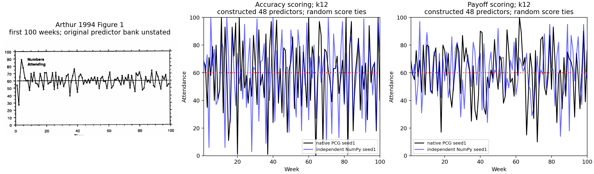
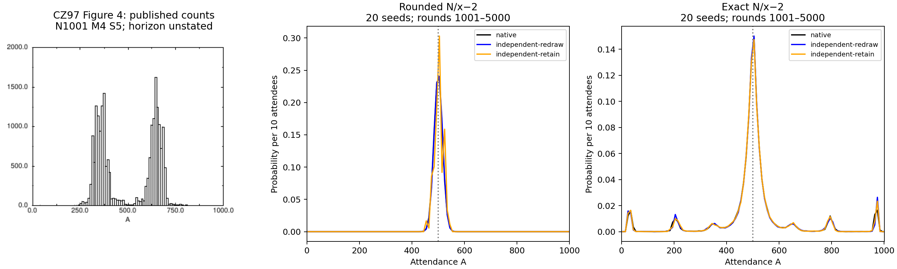
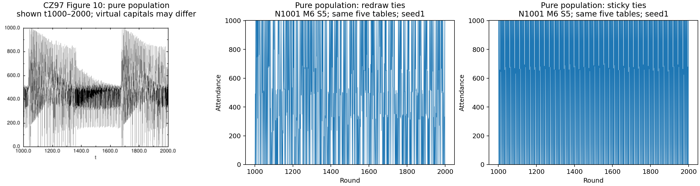

# Spike: El Farol and the minority game

**Following the Crowd, episode 9: “Nobody goes, it's too crowded”**

**Date:** 2026-10-02  
**Status:** source and numerical audit complete; storyboard and original music approved October 3. Episode built and verified: `~/Movies/Flump Studio/sugarscape-027-farol.mp4`, 960 × 540, 30 fps, 2,850 frames / 95 seconds.

**Sources:** Arthur (1994), *Inductive Reasoning and Bounded Rationality*; Challet & Zhang (1997), *Emergence of Cooperation and Organization in an Evolutionary Game*; Challet & Zhang (1998), *On the Minority Game*; Savit, Manuca & Riolo, the locally archived preprint underlying their 1999 work; Challet, Marsili & Ottino (2004), *Shedding Light on El Farol*. Milestone 23 is `farol`.

## What the audit establishes

The useful question is whether a crowd coordinates, rather than whether its average hits a target. One hundred agents deciding separately can average about 60 attendees while repeatedly overcrowding the bar. Random attendance with a known probability of 0.6 also averages 60. In the minority game, an intermediate memory can yield a much more even division than either short or long memory, without messages between agents.

The native reconstruction uses an explicit bank of 48 integer forecasts, distinct draws of 12 forecasts per agent, decayed absolute-error scoring with decay 0.9, and random choices among tied best forecasts. Arthur does not specify that complete bank, loss function, decay, or tie procedure; his text calls the resulting dynamics deterministic. The episode must introduce our choices as a reconstruction, rather than presenting every choice as Arthur's rule. Advice scoring rewards a forecast when its recommended action was appropriate, using the configured equality convention. Attendance of exactly 60 is crowded; the default advice is to stay at a forecast of exactly 60.

A negative lag-1 correlation establishes a tendency to alternate high and low attendance, not a persistent periodic orbit. Forecasts exactly equal to 60 explain why the fraction strictly above 60 need not equal the stay-home share. Small-library necessity is not established by the unarchived planning comparison. These are not separate demonstrations that Arthur's paper fails.

Challet & Zhang's inverse-payoff histogram remains a qualified mismatch. Their printed nearest-integer reward is zero for minorities of 401–500 in a population of 1,001. With zero starting scores, both independent tie variants and the native model remain in that zero-update region in the retained ensemble. The native rounded distribution is central; the exact-payoff alternative has a central peak and side peaks. Neither reproduces the printed two lobes around 350 and 650 under the stated probe choices. The original initialization and histogram horizon are not fully specified. Central mass alone is not a bimodality test.

The pure-population example associated with Fig. 10 does show extreme swings in the separate homogeneous-population experiment. An evolutionary comparison without measuring population purity does not test that illustration. The 1998 follow-up also reports diversity without mutation. Neither cloning nor an inverse-payoff discrepancy is needed in this short episode; retain their qualified results in the audit and ledger.

The native binary El Farol uses step-win scores, whereas the 2004 paper's Eq. 4 uses a linear signed update. It is an inspired qualitative variant, not an exact reconstruction of that figure. The episode's minority-game memory demonstration instead uses the ordinary unbiased game and the random-tie convention explicitly described in the Savit–Manuca–Riolo preprint. The three memory points do not locate a continuous critical point or prove complete scaling collapse.

## Figures and independent numerical checks

[Retained methods and numerical results](2026-10-02-farol-audit/numerical-review.md) accompany runnable separate implementations, per-seed summaries, histogram counts, and figure comparisons in [the audit directory](2026-10-02-farol-audit/README.md). Native and independent generators differ, so agreement is assessed across ensembles, not identical trajectories.

- Arthur Fig. 1: printed first 100 weeks beside native and independently reconstructed first-100 traces. Twenty seeds, 2,000 rounds, rounds 401–2,000 summarized. Accuracy: native mean 59.142, variance 694.336, lag-1 −0.4326; independent mean 59.114, variance 692.402, lag-1 −0.4338. Advice: native mean 59.922, variance 272.901, lag-1 −0.0557; independent mean 60.135, variance 275.341, lag-1 −0.0479.
- CZ97 Fig. 4: N = 1,001, M = 4, S = 5; 20 seeds, rounds 1,001–5,000. Rounded native/independent redraw fluctuation divided by N: 0.254/0.248. Exact: 21.730/21.896. Independent incumbent-retaining ties give the same qualitative distinction. Every retained rounded round gives zero reward. Published counts and normalized simulation frequencies use explicitly different vertical scales.
- CZ97 Fig. 10: the published pure-population trace beside direct homogeneous experiments. Twenty seeds, N = 1,001, M = 6, S = 5, identical strategy compositions, zero initial scores, rounds 1,001–2,000. RMS deviation from half: 408.4 under random reties, 487.8 under incumbent retention. This is a mechanism check with specified initialization, not identification of the paper's unstated parameters.
- Memory: N = 101, S = 2, M = 2, 6, 12, **32 seeds and 10,000 rounds**, matching the preprint's reported ensemble size and run length for its N = 101 memory figure. Variance divided by N is 1.344, 0.0631, 0.2424. Mean squared deviation from N/2 divided by N is 1.368, 0.06345, 0.24250. These statistics differ when a run's mean is off-center; the distinction is retained.
- Baselines: 20 seeds, N = 100, 2,000 rounds, last 1,600. Random p = 0.6 gives mean 59.981 and variance 23.849. Shared complete forecast bank gives mean 49.903, variance 2,499.337, and unanimous go/stay decisions in every retained round. This unanimity is measured for the specified configuration and window.







## Survey verdicts and their scope

Run `cd survey && cargo run --release -q -- --only farol`. The operational survey has 23 checks: 17 Holds, four Fails, two Weak. These verdicts describe the tests below; an operational Fails is not automatically a failed literal paper replication. The affected claim texts explicitly disclose that their interpretation was revised after the existing results were known; numerical rules are unchanged.

| Survey check | Verdict | What it supports |
|---|---|---|
| Arthur mean / fixed-bank k robustness | Holds / Holds | Mean near 60 with this bank and tested k; not robustness to all predictor libraries |
| Arthur lag-1 proxy | Fails | Strong antipersistence under this accuracy score; not proof of a persistent cycle |
| Strictly-above-60 share | Fails | Boundary mass matters; not an independent failure of the 40/60 ecology |
| Random mean / native advice variance comparison | Holds / Holds | Known-p coin baseline and lower variance under this advice score |
| Binary step-win: near-center variance / intermediate memory / shrinking mean interval | Holds / Holds / Holds | Qualitative variants; not the paper's linear Eq. 4 reproduction |
| Binary step-win bias comparison | Weak | One tested comparison weak; no universal bias claim |
| CZ97 Fig. 1 / mixed-memory / strategy-count / switching / replacement / memory-growth proxies | Holds (six checks) | Results in the stated regimes; no causation, saturation, or universal scope beyond the checks |
| CZ97 Fig. 4 central-mass proxy | Fails | Native rounded distribution is centered; actual shapes are checked separately |
| CZ97 Fig. 10 mutation-comparison proxy | Weak | Evolved variants; does not establish purity or test the illustrated pure population |
| Memory minimum movement / coarse location / scaling proxies | Holds (three checks) | Broad transition behavior, with discrete memory sampling |
| Best-agent average maxima | Fails | Finite-run maxima at tested memories; not a formal significance test of the preprint's broad claim |
| Ordinary minority game, true versus random history | Holds | Equivalence check at M = 3 and 6 in the ordinary unbiased game |

## How to film it

Use a felt bar area and a home area, with one identifiable agent per real model agent. The 100-agent bar scenes always have a visible “crowded at 60” marker. Every round's decisions happen simultaneously; movement must not suggest sequential observation or communication. After each decision, show actual attendance and update a reserved time trace and histogram. Put the caption in its own clear region; no floating window may cover it.

For the forecast explanation, reserve a small panel for one agent's actual held forecasts, selected forecast, and resulting action. “48 forecast types / 12 held each” labels our reconstruction. For advice scoring, compare two actual N = 100 recordings on the same attendance scale. For the random baseline, show the known p = 0.6 explicitly; it is supplied to the agents, not learned.

For the minority game, change to two equal felt areas A/B and **101** real agents. The smaller side wins; no fabricated crowd or omitted agents. Show the last M winning-side bits in a reserved strip, a real table lookup for a selected agent, and simultaneous movements. M = 2, 6, 12 comparisons keep N = 101 and S = 2 fixed. The distribution diagrams summarize the 32-run corpus; the animated example is labeled as one recorded run.

The implemented `farol` shot records per-agent choice, memory and actual selected strategy/predictor information, plus attendance, capacity, and the pre-decision public history. Timing regressions verify before-decision inputs against after-decision outcomes. The episode extends the histogram-on-felt and reserved-diagram pieces from earlier episodes.

## Approved storyboard (14 beats, 95 seconds)

Captions below are exact proposed text; `\n` means a line break. All filmed events come from actual recordings.

| # | Beat | Caption | Filming |
|---|---|---|---|
| 1 | bar | “100 Flumps consider a night out.\nThe bar is crowded at 60.” | Start at home; threshold marker |
| 2 | forecasts | “Each has a few forecasts,\nbuilt from past attendance.” | Actual bank and one agent's held forecasts |
| 3 | decide | “Go if the best forecast says fewer than 60.\nOtherwise, stay home.” | Actual selected forecast and simultaneous decision |
| 4 | react | “A quiet week can draw a crowd.\nA crowd can send many home.” | Recorded alternating example, labeled |
| 5 | mean | “Attendance averages about 60.\nBut the swings are wide.” | Accuracy trace and its ensemble distribution |
| 6 | coin | “A 60%-go coin also averages 60,\nwith much smaller swings.” | Random versus accuracy, same scale |
| 7 | advice | “Rate forecasts by whether their advice was right,\nand the swings shrink.” | Advice versus accuracy, same scale |
| 8 | shared | “Give everyone the same forecast bank,\nand they all go—or all stay home.” | Actual shared-bank trace; label measured window |
| 9 | minority | “Now there are two choices.\nThe smaller crowd wins.” | N = 101, S = 2; winning side indicated |
| 10 | memory | “Each follows its best-scoring strategy,\nusing the recent winning sides.” | Actual public bits and selected table lookup |
| 11 | short | “With short memories,\nthey crowd the same side.” | M = 2; individual recording and ensemble |
| 12 | middle | “An intermediate memory helps them split\nalmost evenly, without talking.” | M = 6; same population and scales |
| 13 | long | “Too much memory, and coordination\nfalls back near chance.” | M = 12, with random reference; labels restrict comparison |
| 14 | end | “Nobody goes, it's too crowded - After Arthur, 1994; Challet & Zhang, 1997\nndouglas.github.io/SugarScape” | One camera-facing Flump; one late blink |

## Measurement protocol for the approved build

The preceding probes are an exploratory audit; they informed this proposal. Before collecting the production corpus, freeze configurations, seeds, horizons, caption rules, and example-selection rules in `claims.py`. Use fresh seeds 1,001–1,020 for the N = 100 scenes and 2,001–2,032 for the N = 101 memory comparison, 2,000 and 10,000 rounds respectively, with the final 80% summarized. Any changed rule must say in its claim text that it was revised after the result was known.

Mean near 60: retain both per-seed means and ensemble mean, with the proposed ±2 attendance margin. Variance comparisons: paired accuracy/random and accuracy/advice ordering, reported with effect size and the existing statistical utilities. Shared-bank claim: retain every round's attendance and count all-or-none rounds; the caption changes if production measurements do not support its wording. Memory comparison: variance about each run's mean and squared deviation about N/2 retained separately; intermediate versus short/long comparisons tested with identical N and S. “Near chance” uses a declared ±0.05 margin around the random variance/N baseline 0.25. These prospective margins are chosen after the exploratory audit and fixed before the new corpus; they are not retrospective tests of the papers.

Select examples with deterministic corpus criteria fixed before measurement. Explain a rule with an actual pre/post-decision event. For comparisons, select the run nearest the ensemble median variance, tie-breaking by smallest seed. For shared-bank unanimity, use the first qualifying event after burn-in; publish its frequency alongside the example. Preserve failed outcomes and change unsupported captions instead of the data.

## Approved original tune: *The Empty Chair*

A light **schottische-inspired dance in G major and 4/4**, for clarinet, quiet accordion chords, and plucked acoustic-guitar bass. A recurring step pattern suits the bar's weekly routine: go out, reconsider, return. The subject visits neighboring chord tones and comes home; its shape stays recognizable while the distribution of notes changes.

One continuous score and one fitted tempo, 103 quarter notes per minute. Accordion and bass accompany the clarinet on the same grid; no independently timed cue recordings or backing ducks. Development can pass the same subject between instruments without concurrent competing melodies. A sparse variation leaves room around the subject, the intermediate-memory passage settles into an even pattern, and the return keeps that pattern while thinning the melody. The ending is a gentle G–D cadence, not a victory fanfare. Musical variation is arranged inside the score; it does not claim exact cue synchronization with an individual recorded switch.

Approved eight-bar subject and accompaniment; the built five-strain arrangement is retained in `studio/episodes/farol/tune.py`:

```abc
X:1
T:The Empty Chair
C:Original episode proposal
M:4/4
L:1/8
Q:1/4=104
K:G
V:lead name="clarinet"
%%MIDI program 71
%%MIDI control 7 88
V:chords name="accordion"
%%MIDI program 21
%%MIDI control 7 48
V:bass name="guitar"
%%MIDI program 24
%%MIDI control 7 65
[V:lead] G2 B2 d2 B2 | A2 c2 e2 c2 | B2 d2 g2 d2 | c2 A2 F2 D2 |
 G B d B G B d B | c e g e c e g e | A2 F2 D2 F2 | G4 z4 |
[V:chords] [GBd]4 z4 | [Ace]4 z4 | [GBd]4 z4 | [FAc]4 z4 |
 [GBd]4 z4 | [ceg]4 z4 | [FAc]4 z4 | [GBd]4 z4 |
[V:bass] G,,2 D,2 G,2 D,2 | A,,2 E,2 A,2 E,2 | G,,2 D,2 G,2 D,2 | D,,2 A,,2 D,2 A,,2 |
 G,,2 D,2 G,2 D,2 | C,2 G,2 C2 G,2 | D,,2 A,,2 D,2 A,,2 | G,,4 z4 |
```

The built five-strain, 40-bar form `ABCDE` fits the 95-second cut at 103 BPM. Each voice's eight bars fill 4/4; the ABC compiles with `abc2midi` without warnings. One continuous clarinet, quiet accordion and guitar score accompanies the whole episode.

## Verification

Full checks pass: workspace formatting and strict Clippy, 1,583 native tests (100 existing ignored), 72 WASM Node tests, web WASM build and TypeScript, 847 web tests, and 412 studio tests. Three real Blender regressions cover every filmed frame, all actual agents, reserved panels and captions, and the single late closing blink. Fresh measurements over 20 bar seeds and 32 minority seeds support all nine caption verdicts; retained results and selection provenance are in `studio/episodes/farol/measurements.md`. The source survey retains 17 Holds, four Fails and two Weak operational proxies with the qualifications above.

All fourteen first/middle/end composited stills were inspected before the full preview. The encoded movie has matched 95-second video/audio streams and passes complete FFmpeg decoding. Audio has one continuous stream, no clipping (peak −13.88 dBFS), and no near-silent interior 100-ms windows; the final fade is intentional.

## Approval and delivery

The user approved all fourteen captions and *The Empty Chair* on October 3. The verified current preview is `~/Movies/Flump Studio/sugarscape-027-farol.mp4`; there is one delivery export.
