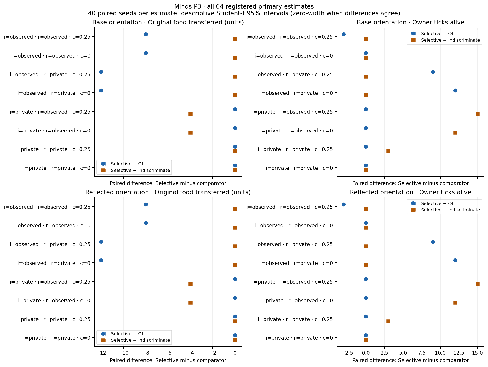
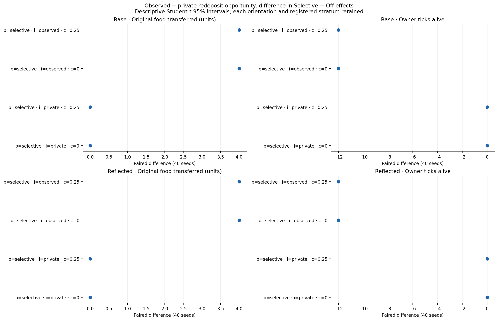
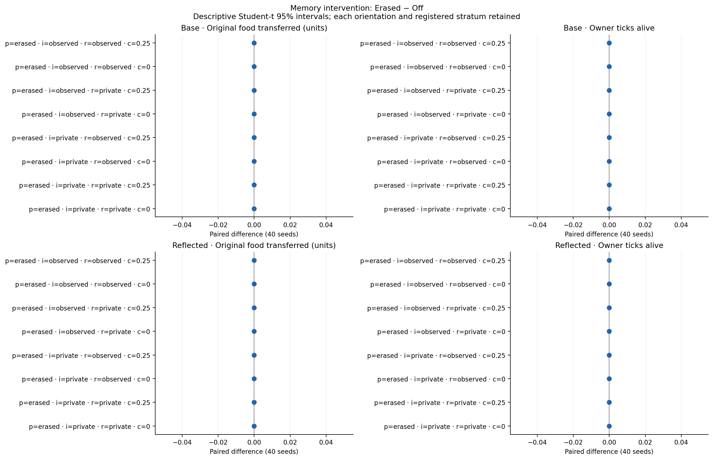
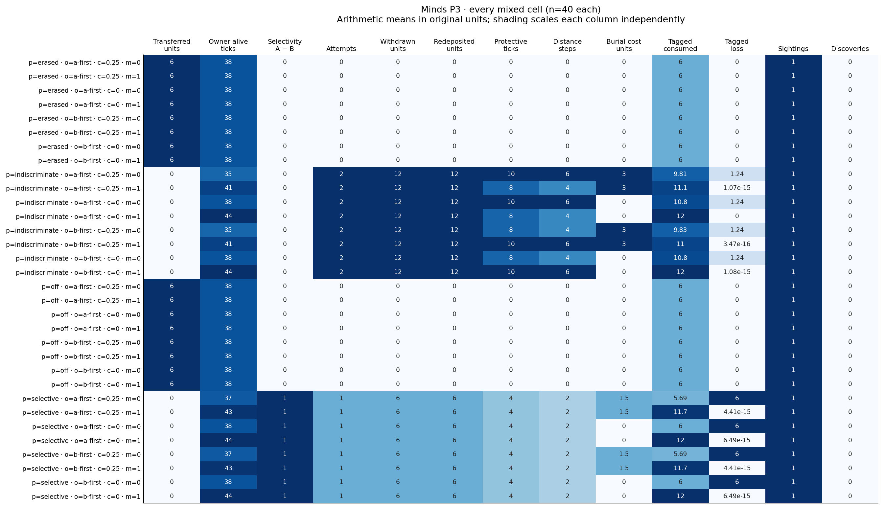
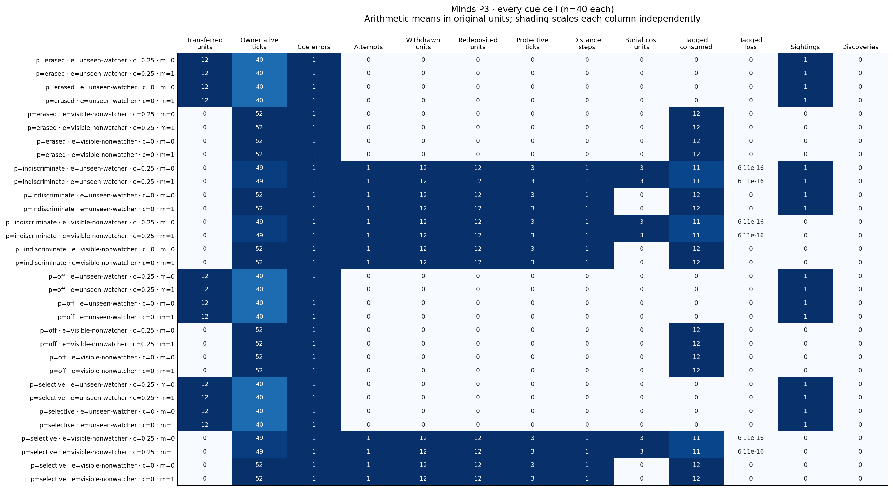
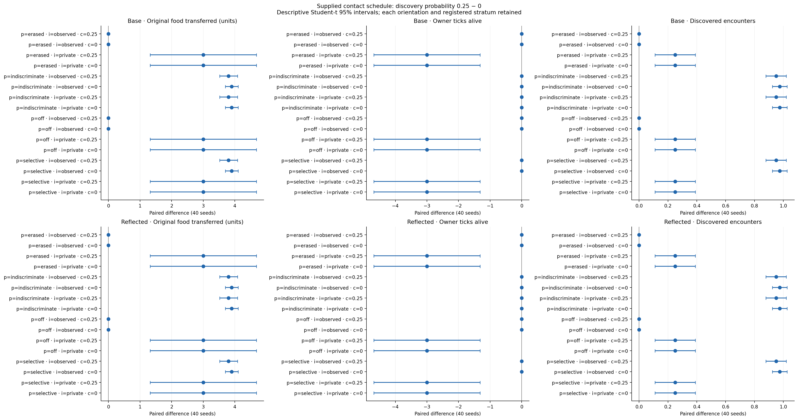
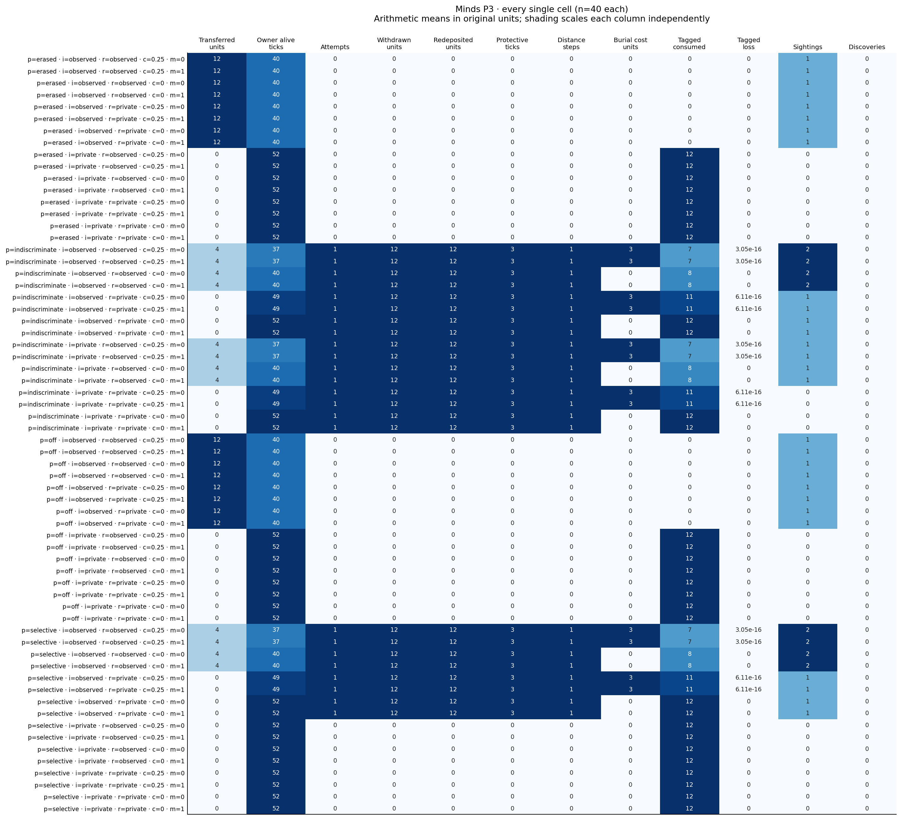
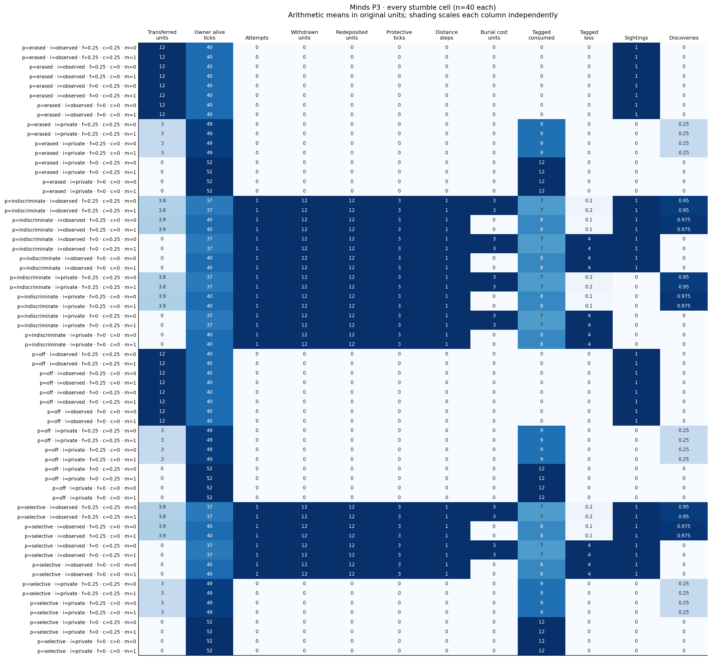

# Minds P3: costly re-caching findings

**Campaign label:** 2026-10-06 (America/New_York). **Execution and reporting UTC date:** 2026-10-07.
**Status:** complete fixed native campaign and saved-data reanalysis; findings and figures pending independent empirical and visual review. This reporting record does not change the original registration.
**Registration:** [design](2026-10-02-minds-protection-design.md), [fixed protocol](2026-10-02-minds-protection-protocol.md), [completed implementation plan](../plans/2026-10-02-minds-protection.md).
**Evidence:** [complete public packet](../../../survey/out/minds-protection-2026-10-06/README.md), [exact analysis](../../../survey/out/minds-protection-2026-10-06/analysis.json), [all comparisons and cells](../../../survey/out/minds-protection-2026-10-06/results.md), [reproducibility register](../../reproducibility.md#rr-p3-01).

## What this campaign measured

In the supplied single-cache laboratory, moving an initially observed cache to a private redeposit site reduced original food first transferred to the thief by 12 units and increased owner lifetime by 12 ticks with free reburial or 9 ticks with paid reburial, relative to Off. When the new deposit was observed, transfer still fell by 8 units, but lifetime changed by 0 ticks with free reburial and −3 ticks with paid reburial. These directions held separately in both registered orientations. Lower theft therefore did not always imply longer life.

Selective and Indiscriminate had identical single-cache primary outcomes when the initial cache was observed. When the initial cache was private, Selective did nothing and matched Off. Indiscriminate could unnecessarily expose the new cache and pay costs. This distinguishes the consequences of the supplied exposure rule from an advantage of moving all food.

The campaign contains all 192 registered cells and seeds 10001–10040 in each: single-cache 64, mixed-history 32, cue-error 32 and stumble 64, totaling 7,680 episodes. Every episode completed 64 ticks. Missing and unexpected raw files, fixture errors, ledger errors and unavailable food outcomes were zero. All 208 registered paired estimates retain n=40: 64 primary, 16 opportunity interactions, 32 Erased-minus-Off checks and 96 stumble contrasts. No cells or seeds were dropped.

Primary outcomes are original food **first transferred** to the thief, and owner **ticks alive at tick start**, including the death tick and capped at 64. They are separate endpoints. Survival at the horizon was zero in all cells; even the longest-lived owners died before tick 64. These results describe lifetime differences in a finite, unreplenished laboratory rather than population persistence.

Intervals are the registered paired Student-t descriptive 95% intervals. All single-cache primary differences were the same across the 40 seeds, so their intervals collapse to the mean. That does not establish biological certainty, statistical independence or transfer beyond the supplied world. Identical seeds pair initial worlds; different policies can consume different RNG draws after their actions diverge. No multiplicity-adjusted or overall Holds/Fails verdict is assigned.

## All single-cache primary strata

Negative food differences mean less original food transferred; positive lifetime differences mean the owner lived longer. Cost is the live reburial charge per unit (0 or 0.25), applied at tick 8 for every policy. “Later opportunity” is the assigned observer schedule; a policy with no relocation creates no new burial to observe. The table lists each orientation separately. Each entry is the paired mean; its descriptive 95% interval is `[mean, mean]`, n=40. Positive/zero/negative sign counts are 40/0/0, 0/40/0 or 0/0/40 according to its sign; the exact machine-readable records are retained in the analysis.

| Orientation | Initial visibility | Later opportunity | Cost | Selective − Off food | Selective − Off ticks | Selective − Indiscriminate food | Selective − Indiscriminate ticks |
|---|---|---|---:|---:|---:|---:|---:|
| Base | observed | observed | 0 | -8 | 0 | 0 | 0 |
| Base | observed | observed | 0.25 | -8 | -3 | 0 | 0 |
| Base | observed | private | 0 | -12 | 12 | 0 | 0 |
| Base | observed | private | 0.25 | -12 | 9 | 0 | 0 |
| Base | private | observed | 0 | 0 | 0 | -4 | 12 |
| Base | private | observed | 0.25 | 0 | 0 | -4 | 15 |
| Base | private | private | 0 | 0 | 0 | 0 | 0 |
| Base | private | private | 0.25 | 0 | 0 | 0 | 3 |
| Reflected | observed | observed | 0 | -8 | 0 | 0 | 0 |
| Reflected | observed | observed | 0.25 | -8 | -3 | 0 | 0 |
| Reflected | observed | private | 0 | -12 | 12 | 0 | 0 |
| Reflected | observed | private | 0.25 | -12 | 9 | 0 | 0 |
| Reflected | private | observed | 0 | 0 | 0 | -4 | 12 |
| Reflected | private | observed | 0.25 | 0 | 0 | -4 | 15 |
| Reflected | private | private | 0 | 0 | 0 | 0 | 0 |
| Reflected | private | private | 0.25 | 0 | 0 | 0 | 3 |

The initial-observed private-redeposit result combines changed location/information and ordinary owner recovery. Selective and Indiscriminate both perform one attempt: 12 gross units withdrawn and redeposited, three protective action ticks and one movement step. Their total environmental harvest is still eight units in this fixture; protective turns displace ordinary actions but do not reduce total harvest here. Free redeposit owners consume all 12 tagged units and live 52 ticks, versus 40 for Off. Paid redeposit charges three gross food units, of which one is attributed to the original cohort by the proportional accounting rule; owners consume 11 tagged units and live 49 ticks.

With renewed observation, owners consume eight tagged units (free) or seven (paid), and four tagged units reach the thief. The difference from Off is −8 transferred units, but owners live 40 or 37 ticks respectively. The eight-unit reduction cannot be credited wholly to food preserved in stock: tagged consumption and costs are explicitly separated. In these single-cache endpoints no tagged terminal loss remains. Tagged amounts and gross handling flows answer different questions; ordinary holdings mix tagged and unlabelled food, and withdrawal/reburial is not production or final beneficial recovery.

For initially private caches, Selective and Off transfer zero food and live 52 ticks regardless of assigned later opportunity or cost. Indiscriminate's private later opportunity transfers zero and yields 52 ticks free or 49 paid. Its observed later opportunity transfers four and yields 40 ticks free or 37 paid. Thus Selective minus Indiscriminate is (food 0, lifetime +3) for paid private redeposit; (−4, +12) for free observed redeposit; and (−4, +15) for paid observed redeposit. The free private-redeposit comparison is zero on both endpoints.

The registered observed-minus-private **difference in Selective-minus-Off effects** is +4 transferred units and −12 owner ticks after initially observed preparation, separately for both costs and orientations. After initially private preparation it is zero on both outcomes. This is an interaction within the fixed schedules, not a pooled estimate of re-observation in other worlds.

Erased makes no protective attempts and matches Off on all 32 registered single-cache intervention estimates: mean and interval zero, 0/40/0 signs. The current privacy cue is unchanged by erasure. The result verifies dependence on the supplied local event memory; it does not demonstrate acquired memory, learning or knowledge of another mind.

## Mixed histories: supplied selectivity and orientation-dependent economics

All 32 mixed cells retain both deposition orders, costs and orientations. Source A starts with six observed units and source B with six private units. Selective withdraws/redeposits six gross units from A and zero from B: `(A withdrawn/6) − (B withdrawn/6) = 1`, with zero attempts retained in the denominator. Indiscriminate withdraws/redeposits six from each and has selectivity zero; Off and Erased withdraw neither and also have selectivity zero. These are checks of programmed selection, not discoveries about social cognition. Every moving attempt completes without a recorded cancellation in this campaign.

Off and Erased lose A's six units to the thief, consume B's six and live 38 ticks in every stratum. Both moving policies transfer zero in every stratum, but owner lifetime differs strongly by orientation. Selective lives 38 free/37 paid in base orientation and 44 free/43 paid in reflection. Indiscriminate lives 38 free/35 paid in base orientation and 44 free/41 paid in reflection. These are separate cell endpoints, not newly judged economic contrasts. Reflecting the map does not reflect index tie-breaking, destination choice or later recovery paths. A food-saving appearance alone cannot explain the lifetime differences.

Selective takes four protective ticks and two movement steps and pays zero or 1.5 gross burial units. Indiscriminate takes ten protective ticks/six steps for base A-first and reflected B-first, and eight ticks/four steps for base B-first and reflected A-first; paid reburial costs three gross units. Source-specific distance is retained: the second indiscriminate source can require four rather than two steps. Moving more food therefore changes handling and route costs even when exposure selectivity remains zero.

The ledger reports base Selective terminal loss of six tagged units, and base Indiscriminate loss of approximately 1.241379; reflected moving-policy tagged terminal loss is zero within ledger tolerance. Selective consumes six tagged units free or 5.689655 paid in base orientation, versus 12 or 11.689655 in reflection. Indiscriminate consumes 10.758621 free in base orientation versus 12 in reflection; its paid tagged consumption/cost varies by deposition order and orientation. The complete source, phase and opportunity distributions in [figure inputs](../../../survey/out/minds-protection-2026-10-06/figure-inputs.json) retain those differences instead of averaging them away.

## Cue mismatch controls

Every cue cell records one initial cue error, across both policies that move and policies that do not. A visible nonwatcher supplies perceived exposure without a real initial sighting. Selective and Indiscriminate move 12 gross units and take three protective ticks/one step; Off and Erased do not. All transfer zero. Free relocation leaves lifetime at 52 ticks; paid relocation reduces it to 49, with three gross burial units charged and one tagged cost unit. The supplied cue can therefore prompt an economically unnecessary action.

An unseen long-vision watcher supplies a real initial sighting without perceived exposure. Selective, Off and Erased make no attempt, transfer 12 and live 40 ticks. Indiscriminate relocates despite the cue, transfers zero and lives 52 free/49 paid. No actual new sighting occurs on these private-redeposit schedules. Both orientations show these same cell endpoints; their separate rows remain visible.

## Stumble encounters: residual vulnerability on the supplied route

All 64 encounter cells use the registered contact schedule, including encounter ticks 18–25; observer ordinary behavior begins at tick 26. The figure below contains every one of the 96 find-0.25-minus-find-0 estimates, with the 32 policy/initial-visibility/cost/orientation strata kept separate. This is supplied contact, not emergent field search.

After initially observed preparation, Off/Erased transfer 12 by ordinary watching at either discovery probability: all three encounter contrasts are zero. Selective and Indiscriminate privately relocate and transfer zero at find 0. With find 0.25, original-food transfer rises to a mean 3.9 units free (39 positive/one zero seed; interval 3.697731–4.102269), or 3.8 paid (38 positive/two zero; interval 3.517639–4.082361). Discovery counts rise by 0.975 free (0.924433–1.025567) or 0.95 paid (0.879410–1.020590). Descriptive t intervals can extend beyond the bounded encounter mean's physical range and are retained without clipping. Lifetime contrasts remain zero: 40 ticks free or 37 paid at both discovery probabilities. Extra theft is not automatically an extra lifetime penalty in this schedule.

After private preparation, Off/Erased/Selective do not move. The discovery contrast raises mean transfer by three units (1.317019–4.682981), reduces lifetime by three ticks (−4.682981 to −1.317019), and raises discoveries by 0.25 (0.109752–0.390248): ten affected and 30 zero seeds in each cell. Indiscriminate has the same free/paid discovery patterns as the relocated initial-observed cells above. These numerical patterns repeat separately in both orientations, without pooling seeds or cells.

At find 0 the moving encounter cells already live only 40 free/37 paid, compared with 52/49 in the single-cache private-redeposit cells. Different release/contact schedules therefore matter before discovery is enabled. Their terminal tagged loss and recorded occupancy/opportunity behavior remain in the cell evidence. A zero discovery contrast in lifetime cannot establish that relocation has preserved all transported food for eventual consumption.

## Complete costs, opportunities and diagnostics

The [full results](../../../survey/out/minds-protection-2026-10-06/results.md) and [figure inputs](../../../survey/out/minds-protection-2026-10-06/figure-inputs.json) retain every cell's original-food transfer/consumption/cost/loss, gross withdrawal/redeposit, harvest, final holdings/stock, demand and actual consumption, protective actions/distance, old/new-site arrivals and raids, wasted raids, discoveries, sightings, cue errors, source fractions, restrictions, phase boundaries and opportunity records. Means and observed ranges are descriptive displays; categorical distributions preserve their per-episode frequencies. No new secondary confidence intervals or comparison families are introduced.

Across the campaign, recorded relocation cancellations are zero. That is a measured count within these opportunities, not evidence that unreachable paths, occupancy, source loss, no carrying room, expiry or owner death cannot cancel an attempt elsewhere. Construction/unit evidence covers those cases separately. Normal surplus burial is suppressed throughout; only scheduled initial deposition and completed relocation bury food. Initial owner/observer holdings are 44/96, metabolism one each, capacity 128 and reserve four. There are no new resources after the finite patches, no reproduction or replacement, and no larders, guards or additional controller families.

The following totals are an instrumentation census, not pooled economic effects. Attempts equal completed redeposit records here (3,360 total); 480 redeposits were actually sighted, 2,720 were vacant at release, and 1,600 were subsequently reached by the observer. Mixed records show occupied-at-release destinations, which must not be generalized from the single-cache vacancy check. Counts of old/new raids include wasted attempts, so a raid count is not an amount transferred.

| Panel | Episodes | Attempts / redeposits | Old / new arrivals | Old / new raids | Wasted raids | Discoveries | Cue errors | Sightings |
|---|---:|---:|---|---|---:|---:|---:|---:|
| Single | 2,560 | 960 | 1,440 / 480 | 1,280 / 480 | 640 | 0 | 0 | 1,760 |
| Mixed | 1,280 | 960 | 1,600 / 160 | 1,280 / 0 | 640 | 0 | 0 | 1,280 |
| Cue | 1,280 | 480 | 640 / 0 | 640 / 0 | 160 | 0 | 1,280 | 640 |
| Stumble | 2,560 | 960 | 2,560 / 960 | 1,280 / 0 | 640 | 582 | 0 | 1,280 |

Owner preparation restriction is eight ticks in every episode. Observer restriction is 12 ticks in single/cue, 20 in mixed and 18 before the supplied stumble encounters. Both preparation phases span ticks 0–7. Actual owner relocation phases are ticks 8–10 in single/cue/stumble, 8–11 for selective mixed and 8–15 or 8–17 for indiscriminate mixed. Ordinary owner action resumes afterward and ends with death; full cell-specific boundaries are retained. These are scheduling restrictions, not an in-world door or privileged deletion of observer memory. Assigned redeposit observation must be read alongside actual sightings; the owner never sees researcher truth. In single-cache moving cells, the owner has departed the destination at observer release, and observed-redeposit opportunities are actually witnessed/reached, while private opportunities are not witnessed.

All 192 duplicate diagnostics report 40 unique full exported biological trajectories, zero duplicate runs and largest group one. The duplicate check excludes wall-clock timing and clears fingerprints but includes frame actions and action ordering. Many outcome vectors and all primary paired differences nevertheless repeat across seeds. Full-frame uniqueness and endpoint degeneracy are different observations; neither proves independence or an effective sample size beyond the registered descriptive calculation.

Raw episode timing totals 8.163946403 seconds (mean 0.001063014, min 0.000832333, max 0.025888292 seconds). It includes world construction and biological steps and excludes archive I/O/analysis. The external campaign invocation takes 64.984866 seconds; fresh saved-data reanalysis takes 4.329124 seconds. These boundaries differ, so timing is computational description rather than a biological estimate or platform benchmark.

## Provenance and interpretation limits

Scientific source revision is `e733b989f253daf038f9f90a7030e2cf71ad8435`; registration revision is `7b1035161b13b1df7a5cc3934c01c5f2ee81d29c`. The frozen protocol SHA-256 is `e9ab9622a53c29920d01292ffbc713376315bd6f8d3f89c2c2b16ff8304ec42f`; binary SHA-256 is `a3e21584b44859da394906e9923be9fbd8d1eea06d9e46e5215fd1c9f8dc8454`. The public packet binds the prospective readiness report, actual independent **Approved** gate, command/exit/census, source archive, raw member inventory and byte-identical fresh reanalysis. Approval precedes the one scientific invocation; flags did not create approval. Scientific identity remains separate from later reporting commits.

Native readiness checks and source equivalence were verified prospectively. The original historical Vitest/WASM log and old review ledger remain unavailable; unchanged closure exports/parity/checkpoint blocks plus fresh native checks were accepted for this unchanged native-only campaign. There is no claim of a fresh WASM build/test or fabricated historical receipt. Raw envelopes total 571,055,314 bytes, with mode 0644 for all 7,680 members. Full raw/source/binary preservation belongs to the external archive; the public index intentionally keeps the original relative raw paths and does not pretend those files are embedded in this smaller reporting packet.

The mechanism combines supplied local event memory, fixed observation schedules and physical food handling. Its single-cache consequences vary with renewed observation and costs; mixed reflected geometry and encounter schedules reveal additional constraints on eventual consumption. Original food is allocated proportionally through mixed holdings, with first thief transfer absorbing and owner death closing remaining labels as loss. Gross transported/redeposited amounts do not establish that every original tagged unit remained usable: metabolism, costs, ordinary recovery and partial eventual consumption must be read alongside them.

The [source reading](../../studies/2026-10-02-minds-protection-reading.md) motivates qualitative interventions. This campaign reproduces no source-paper numerical target, and the original study's private recovery phase does not supply a survival-benefit target. Programmed selective movement is not learning, perspective taking, theory of mind or deception; the indiscriminate comparator is not the cited stress model. These bounded results neither replace Minds 9's costly-guard findings nor authorize unregistered tuning, new seeds or a general ecological claim. P4 and broader agency work remain separate future designs.
