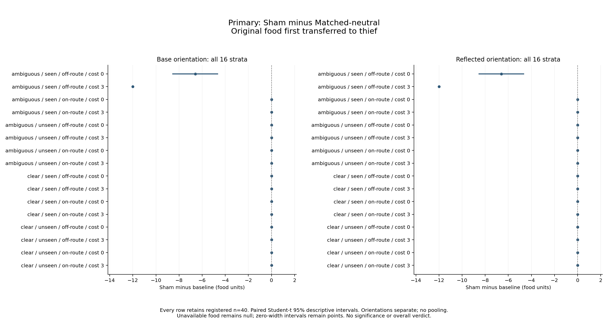
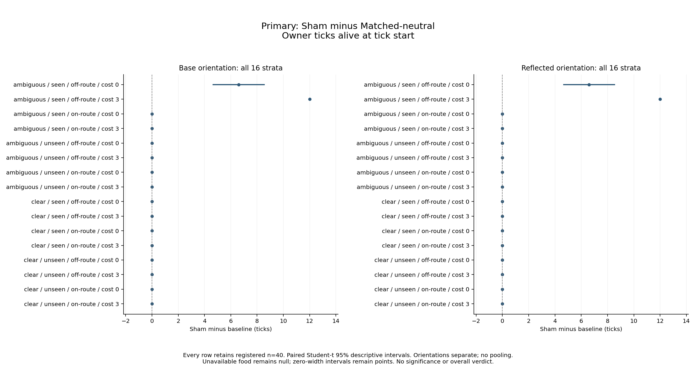
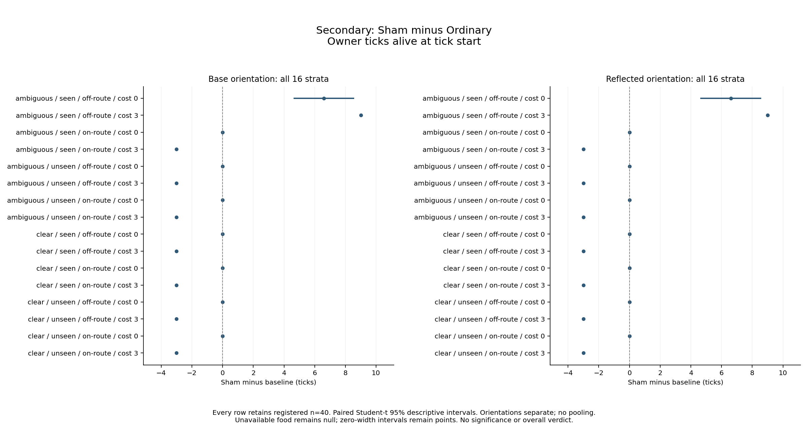

# Minds P4: supplied caching gestures, diversion and owner economics

**Status: MEASURED / INDEPENDENTLY EMPIRICALLY REVIEWED — Approved.** Measurement and strict saved-data reanalysis are complete. [Actual independent empirical review](../../../web/public/studies/minds-deception-2026-10-07/provenance/empirical-review.md) binds the unchanged scientific contents. Publication packaging, final integration review, remote CI/Pages/served verification and final archival remain pending.

**Logical study slug:** `minds-deception-2026-10-07`. Registration date: 2026-10-07; registered execution and reporting UTC date: 2026-10-08. Scientific source: `e10f98d99586d94f5adc8eab1f95b80e5c5b1865`. The separately accepted prospective gate preceded the sole registered launch. [All native estimates and cell tables](../../../web/public/studies/minds-deception-2026-10-07/results.md), [exact chart inputs](../../../web/public/studies/minds-deception-2026-10-07/figures/chart-inputs.json), [all-cell trace distributions](../../../web/public/studies/minds-deception-2026-10-07/cell-diagnostics.json), [projection coverage](../../../web/public/studies/minds-deception-2026-10-07/projection-receipt.json) and [reviewed provenance](../../../web/public/studies/minds-deception-2026-10-07/provenance/provenance-draft.json) accompany this report. Full unfiltered biological frames, endpoint lineage and original fingerprints remain in the immutable complete analysis identified below; the presentation projection is explicitly not a substitute for that full evidence.

## What the complete campaign measured

A supplied ambiguous, observed Sham gesture created a false estimate of 12 food units at an empty display site and an empty receiver inspection, in both layouts and both orientations. That behavioral effect alone did not establish an owner benefit. In the off-route layout, the resulting diversion delayed receiver arrival at the real cache and sometimes let the owner recover its original food. In the on-route layout, the empty display was already the receiver's first step toward the real cache: the false estimate and empty inspection occurred, but original-food transfer and owner lifetime were unchanged relative to the matched physical control.

The full matrix contains 96 cells × exactly 40 paired seed labels 20001–20040: Ordinary, MatchedNeutral and Sham; ambiguous/clear public view; display seen/unseen; on-route/off-route geometry; effort 0/3; base/reflected orientation. All 3,840 attempts completed 64 ticks, retaining 249,600 durable frames. Failed, invalid, partial, pending, unstarted and unavailable-lineage counts are zero. All 64 primary Sham-minus-MatchedNeutral and all 64 separately secondary Sham-minus-Ordinary estimates retain n=40. No cell, seed, death endpoint or zero/adverse estimate was dropped.

The endpoints are original food **first transferred** to the thief and owner **ticks alive at tick start**, including the death tick and capped at 64. Food handling, consumption and life are separate quantities. Every owner died before the horizon: endpoint lifetime is 37–52 ticks, with zero owners alive at tick 64. This finite, unreplenished two-body laboratory does not measure population persistence.

## Primary matched-control results: all strata retained

Negative food differences mean less original food first transferred to the thief; positive lifetime differences mean more owner ticks. The table below lists each nonzero primary stratum separately, without pooling orientations. Mean, interval and sign counts are copied from the accepted native saved-data analysis, not re-estimated by plotting/reporting.

| Orientation | Public view | Display | Layout | Effort | Sham − Matched food | Paired descriptive 95% interval | Food +/0/− | Sham − Matched ticks | Paired descriptive 95% interval | Ticks +/0/− |
|---|---|---|---|---:|---:|---|---|---:|---|---|
| Base | ambiguous | seen | off-route | 0 | −6.6 | [−8.533597470, −4.666402530] | 0/18/22 | +6.6 | [4.666402530, 8.533597470] | 22/18/0 |
| Reflected | ambiguous | seen | off-route | 0 | −6.6 | [−8.533597470, −4.666402530] | 0/18/22 | +6.6 | [4.666402530, 8.533597470] | 22/18/0 |
| Base | ambiguous | seen | off-route | 3 | −12 | [−12, −12] | 0/0/40 | +12 | [12, 12] | 40/0/0 |
| Reflected | ambiguous | seen | off-route | 3 | −12 | [−12, −12] | 0/0/40 | +12 | [12, 12] | 40/0/0 |

**All remaining 28 primary strata have exactly zero on both endpoints:** seen ambiguous on-route at both effort charges and both orientations; all clear-view strata; and all unseen-display strata. Each zero estimate has interval [0,0] and signs 0/40/0. Thus the complete primary family contains eight nonzero metric estimates and 56 zeros. The four figures and native tables show all 32 strata per metric/family, including these zeros.

Intervals are registered paired Student-t 95% **descriptive** intervals. Zero-width intervals represent repeated paired differences within this supplied fixture, not biological certainty or independent animal replication. No significance, multiplicity-adjusted conclusion, interaction inference, or overall Holds/Fails verdict is assigned.

## False estimate, diversion, physical food and life

The independent raw matched-control cross-check covers all 1,280 Sham/MatchedNeutral seed pairs: physical roles, stocks, deaths and actions (apart from the bout name) agree through frame 32, and both source/display sites are body-free at receiver release. The complete raw movement check records seven cardinal receiver steps from release to first source arrival for every seen ambiguous off-route Sham episode, versus three for its MatchedNeutral reference; on-route Sham and MatchedNeutral both move three. These physical checks distinguish the initial extra route from the separate transient occupancy after recovery. They do not independently identify a causal share for each later mechanism.

For seen ambiguous Sham, every episode retains a public cue of nominal 12 at the display, an actual transfer of zero and actual display stock zero. The owner physically buries 12 at preparation; the Sham action itself digs, buries and transfers zero. In each seen ambiguous layout/effort/orientation cell, all 40 receivers later select the empty display with remembered 12 and actual zero, arrive, inspect zero stock and record a wasted inspection. These are observations about the supplied cue and the normal local correction path, not evidence of sender access to receiver-private knowledge or learned intent.

Clear-view Sham records a visible transfer of zero at the empty display. Unseen Sham has no recorded public display observation. MatchedNeutral has no public display observation beyond the genuine initial cache observation. In these strata receivers retain/use the genuinely observed real source rather than a false display target, and Sham-minus-Matched economic/lifetime differences are zero. Absence of a cue or exposure is a control condition, not itself a benefit. The registered runs do not exhaust other animals, occluders, message channels, memory spans or free-world contact patterns.

In **off-route, seen ambiguous, free-display** cells, MatchedNeutral always transfers the original 12 units and lives 40 ticks. Sham has two retained outcomes per orientation: 22/40 owners recover and consume their original 12 units, transfer zero and live 52 ticks; 18/40 transfer all 12, fail to recover and live 40. Every receiver makes the empty display inspection. Receiver first source arrival is frame 39, 40 or 41, versus frame 35 for MatchedNeutral; physical owner recovery occurs at frame 39 in the successful 22 episodes; the following departure is recorded at frame 40. The source race and ordinary shuffled actor order matter: empty-site diversion occurs in all 40, whereas economic recovery occurs in only 22. Full original actions/roles/stocks and receiver choice records remain available for the exact race in each seed.

In **off-route, seen ambiguous, paid-display** cells, MatchedNeutral transfers 12 and lives 37; Sham recovers/consumes all 12, transfers zero and lives 49 in every seed, separately per orientation. The Sham charge is exactly three gross food units at display. It precedes source recovery and is charged to unlabelled holdings: endpoint original-cohort cost is zero, original-cohort consumption is 12, and tagged transfer/death loss are zero. Physical owner recovery occurs at frame 36, with departure at frame 37; receiver source arrival is frame 39–41. The charge changes ordinary owner balances and recovery timing as well as life. These traces do not establish that increasing gesture cost generally improves deception or supports an unregistered cross-cost optimum.

In **on-route, seen ambiguous** cells, all 40 receivers make the false empty-site inspection, but first real-source arrival remains frame 35, the same as MatchedNeutral. The display lies on the initial receiver route, creating zero extra movement distance in this geometry. Owners recover none of the original food; all 12 units reach the thief. Owner lifetime is 40 free or 37 paid, matching MatchedNeutral. This directly separates a false estimate/empty visit from food saved or longer life.

Across all 96 cells, owner environmental harvest totals eight gross units per episode. Neutral/Sham retain 20 scheduled owner restriction ticks, versus eight for Ordinary; all receivers retain 32 restriction ticks. Outward/return owner walks use normal gathering, so actual harvest/recovery timing cannot be replaced by an assumed effort-only story. No registered bout cancellation or failed recorded walk appears in the complete diagnostic distributions. Every physical recovery is followed by one successful next-frame departure action (22/40 free off-route seen ambiguous, 40/40 paid, separately per orientation). Initial empty-display diversion occurs without a recorded display target occupant, but post-recovery owner occupancy at the real source is a separate physical contribution that cannot be excluded. The owner occupies the recovered source during the recovery frame until the next-turn departure. Body occupancy can suppress a receiver source candidate before selection: for example, free base seed 20002 at frame 39 has the owner dig 12 at the source before the receiver acts; the receiver remains at its current site rather than selecting that occupied source. Thus zero target_occupant in selected positive-valued source choices does not prove the absence of body effects. The source race combines initial diversion, ordinary recovery and transient post-recovery occupancy under the common departure rule; no independent estimate isolates each contribution. Full physical recovery frames, raw roles/actions/receiver choices, and separate departure timing are retained in the corrected diagnostic projection. Blocked/dead/unreachable/unpaid/expired/truthful controls in prior verification remain construction evidence, not additional measured registered strata.

## Separate Ordinary reference and actual costs

The secondary food pattern matches the primary food pattern: −6.6 in free seen ambiguous off-route and −12 in paid seen ambiguous off-route, separately in base/reflected; all remaining 28 strata are zero. The secondary lifetime family is different because Ordinary pays no gesture charge and has no nonordinary route/bout. Its effort labels are physical aliases, not independent replications.

Secondary lifetime is +6.6 with the same [4.666402530,8.533597470] descriptive interval in the two free seen ambiguous off-route orientations, +9 with [9,9] in their paid counterparts, −3 with [−3,−3] in every other paid stratum (14 separately retained strata), and zero in every other free stratum (14). The two paid off-route Sham owners live 49 versus Ordinary's 40; the other paid Sham owners live 37 versus Ordinary's 40. A display can therefore be an actual lifetime cost when the cue is clear, unseen, or on the source route, despite the primary matched comparison being zero. This secondary comparison mixes the cue with its supplied schedule/cost reference; it cannot replace the primary physically matched contrast.

## Complete diagnostics, aliases and limitations

The immutable original Analysis has 3,840 complete endpoints, 96 complete cell rows and 1,760 biological groups, each with all 65 grouped frames. Its 114,400 stored group frames represent all 249,600 logical episode frames through explicitly checked memberships. Each individual cell has 40 distinct full biological group references, while 28 effective-alias groups connect different condition labels and four repeated 40-seed endpoint-vector groups connect equal outcomes. Original per-episode fingerprints and lineage remain in endpoint rows. Grouping removes only fingerprint strings from full biological frames; a distinct group or fingerprint is not proof of statistical independence. Ordinary cost/view/layout aliases and clear/unseen equivalents remain explicitly listed in the native tables and presentation files.

The compact presentation analysis preserves every endpoint/cohort, cell/seed/timing row, estimate, unavailable representation, repeated-endpoint group and effective alias. It explicitly references rather than embeds full biological frames, to avoid loading a 1,052,095,171-byte document into plotting memory. A streaming reader parsed the full source, hash-verified all bytes, scanned every group and checked all 3,840 memberships against the exact endpoint group references. Each group's frame-derived observations, choice/inspection/occupancy/recovery/action/cost/death/restriction diagnostics are retained in a separately marked diagnostic projection; all unfiltered roles/stocks/positions/choices remain in the unchanged full original. All 96 cell diagnostic distributions retain all 40 seeds, including unsuccessful recovery and zero/adverse outcomes. Nothing in that presentation projection silently reclassifies or omits registered outcomes.

Full original analysis SHA256: `14caedbb8ed105f1b65e3c07dc5aaed3428180b10122531fc4dc54c6ce00cf9b`. Exact native results SHA256: `b2ec0bcc72cdd6f2b82e46f26d16cc30f17294be2bab9a8af2a9eeaba0832470`. Fresh same-native saved-data outputs are byte-identical to both originals. Plotting copied native paired summaries and computed no paired estimates, additional confidence intervals or statistical tests.

This is a finite supplied-policy construction model: cue interpretation, gesture amount, physical schedule, observation opportunities and ordinary recovery are stipulated. It does not demonstrate learning, acquired deceptive intent, theory of mind, evolutionary stability or reproduction of numerical animal results. The unresolved 1998 citation trail remains a reading lead; no confirmed numerical animal target is registered. Reflected observations and different seed labels do not broaden this fixture into independent species/world replication.

Historical Task 4 test-first noncompliance remains disclosed despite the separately reviewed replacement/WB-1 repair. Existing source-map-js/third-party build-tool advisories and the browser-only democratic-peace Node skip remain disclosed in the prospective review; the native route did not use that JavaScript path, and this report makes no general security-remediation claim. Measurement/reporting audit, render-path/layout and empirical recovery/occupancy corrections are retained in provenance, with original study records unchanged. Independent empirical review identified that the action source_recovered flag marks the next-turn departure state, not the prior physical dig; the draft and all diagnostics were corrected test-first using actual-shaped raw trace regressions. The prior draft/diagnostics remain preserved separately. This correction changes no native endpoint, paired summary or chart input.

The [actual independent empirical review](../../../web/public/studies/minds-deception-2026-10-07/provenance/empirical-review.md) Approved these exact scientific contents with no open Critical or Important finding. The controller must complete final integration review, publication, remote/CI/Pages and served-byte verification, and final archival. This reporting copy records none of those later gates as complete. The [unchanged reviewed draft](../../../web/public/studies/minds-deception-2026-10-07/provenance/findings-draft.md), [original reviewed provenance](../../../web/public/studies/minds-deception-2026-10-07/provenance/provenance-draft.json), [publication provenance](../../../web/public/studies/minds-deception-2026-10-07/provenance.json) and [lossless evidence downloads](../../../web/public/studies/minds-deception-2026-10-07/archive/PUBLIC-ARCHIVE-MANIFEST.json) preserve the distinction between scientific review and later packaging.
