# Minds 10: supplied behavior trees, guards and task goals

**Status: measured; independently empirically accepted for faithful integration on 2026-10-09.** The [actual decision](acceptance/empirical-decision.json) has SHA256 `380236b10318774522196bb539e9fba40e46180cdca26ce997854661fd9180b1`; the [independent review](acceptance/empirical-review.md) records its scope. Integration review, remote publication and served-byte verification remain pending. Registration date: 2026-10-08. Collection/reporting UTC date: 2026-10-09. Scientific revision: `e67b8d293ffb21c3a6fb94daf727e69b7a7af51b`.

Retaining a supplied positive target changed the task/food/lifetime tradeoff when a better alternative appeared. At quota 20, Guarded Tree completed one tick earlier than Reactive Utility but gathered 12 fewer food units and lived 12 fewer ticks. At quota 40, it completed six ticks later, gathered 24 more units through overshoot, and lived eight more ticks before the 64-tick horizon cap. Both orientations retain these same separate results. Value guarding shortened completion by six ticks relative to Unguarded Tree in depleted-target/quota 20; it changed neither gathered food nor lifetime there. All four registered endpoint contrasts against Task GOAP and, separately, Legacy GOAP are zero. These results support bounded statements about supplied policies in this fixed rig, not a general controller winner.

The [full native analysis](analysis.json), [all 256 exact native estimates](results.md), [unchanged chart-input JSON](native-chart-inputs.json), [all 96 cell tables](all-cell-diagnostics.md), [all 3,840 endpoints](raw-endpoints.json), [raw timing distributions](raw-timing-distributions.json), [all 640 matched checks](raw-matched-checks.json), [protocol](protocol.md) and [manifest](manifest.json) are retained. [Provenance](provenance.json) binds exact source, binary, native outputs and plotting inputs. Full raw frames and all declared scientific inputs are also retained in the [lossless scientific archive](archive/README.md), built locally with complete member hash/mode roundtrip verification. The archive has an explicit public scientific cutoff; complete private operational originals remain preserved. Remote publication and served hashes are not yet verified.

## Complete registered matrix and endpoint definitions

The actual single collection contains 6 controllers × 4 scenarios × 2 quotas × 2 orientations = **96 cells**, each with all **40 seed labels 30001–30040**, totaling **3,840 episodes**. Controllers are Reactive Utility, Guarded Tree, Matched FSM, Unguarded Tree, Task GOAP and Legacy GOAP. Scenarios are stable, better alternative, depleted target and temporary obstacle. Quotas are 20 and 40; reflection maps x to 10−x. Every episode completed the registered 64 scene ticks: **249,600 saved frames /245,760 transitions**. Planned, attempted and complete counts are each 3,840; failed, invalid, partial, pending and unstarted are each zero. The retained raw archive contains 11,523 files /12,064,047,212 bytes. Exactly one collector invocation ran; no retry, resume or replacement seed occurred.

Task completion is separate from archive completeness: **3,360 tasks attained quota**, while **480 valid complete episodes have null first completion because the actor died before quota**. All 480 are depleted-target/quota 40 across six controllers and both orientations. All 40 labels remain in each contrast.

| Registered endpoint | Definition | Contrast direction |
|---|---|---|
| Quota attainment | Whether cumulative gross gathering reaches quota by completed tick 64; initial holdings excluded | Guarded minus comparator, proportion units; positive means more attainment |
| Restricted completion ticks | First attainment tick; valid unattained episodes receive the declared 64 cap | Negative means earlier attainment under the capped endpoint |
| Gross gathered | All actual food gathered through the 64-tick scene, including intervening-site harvest and quota overshoot | Positive means more gross food; not an independent utility score |
| Living ticks | Turns entered alive, including the death turn, capped at 64 | Positive means more observed living ticks within the horizon |

After attainment the actor stops gathering immediately and shares common idle hold/metabolism. Food is not clipped to quota, and computation is not charged as food or simulation time. First completions that exist range from 5 to 14 ticks; gross gathered ranges from 28 to 64, and living ticks from 44 to 64. **1,360 episodes are alive at 64 and hit the living-tick ceiling**. Lifetime after 64 is unobserved. Thus +24 food versus +8 living ticks in better-alternative/quota 40 reflects the cap, not a one-for-one independent survival confirmation.

There are four separately registered families, each 16 strata ×4 metrics =64 estimates: primary Guarded−Reactive Utility, secondary Guarded−Task GOAP, ablation Guarded−Unguarded, and legacy reference Guarded−Legacy GOAP. No family or orientation is pooled. All means, intervals and sign counts below are copied from native output. The native paired Student-t 95% intervals are descriptive; no significance, multiplicity-adjusted inference or overall verdict is assigned. **All 256 intervals have zero width**, **242 estimates are zero**, and 14 are nonzero. Repeated differences across supplied seed labels do not establish population certainty or independent animals.

## Primary: retained commitment can help completion and cost food

The table gives every nonzero primary stratum/metric combination through its three nonzero metrics. Attainment difference is zero in all 16 primary strata. Each displayed number has native interval `[value,value]`, n=40; a positive number has signs 40/0/0, a negative number 0/0/40. All other 12 primary strata have zero for every metric, interval [0,0], signs 0/40/0. Full explicit rows and intervals remain in the plots and native tables.

| Orientation | Scenario | Quota | Restricted completion difference | Gross food difference | Living-tick difference |
|---|---|---:|---:|---:|---:|
| Base | Better alternative | 20 | −1 | −12 | −12 |
| Reflected | Better alternative | 20 | −1 | −12 | −12 |
| Base | Better alternative | 40 | +6 | +24 | +8 |
| Reflected | Better alternative | 40 | +6 | +24 | +8 |

At quota 20 Guarded Tree completes at tick 5 with gross 28 and living 44, while Reactive Utility completes at tick 6 with gross 40 and living 56. At quota 40 Guarded completes at 12 with gross 64 and living 64 (alive at horizon), while Reactive completes at 6 with gross 40 and living 56. These actual registered endpoint rows explain why task speed, overshoot and finite-horizon life differ in direction. A common completion hold stops additional gathering, so faster task completion does not necessarily maximize gathered food.

The runtime enforces a closed 32-node, depth-8 tree and at most 64 visits per actor tick. One physical attempt is permitted; settlement of an already executed action is mandatory even when traversal budget runs out. Conditions are read-only, RNG-free and never Running. Genuine physical route failures create independent site deadlines through t+2, expiring at the start of t+3; value invalidation and empty arrival do not. These execution contracts are supplied software semantics, not learned recovery.

The registered contrasts are null in stable, depleted-target and temporary-obstacle strata at both quotas and orientations. A temporary obstacle does not by itself establish that a guarded representation improves performance. It changes the route in this rig without producing a primary endpoint advantage.

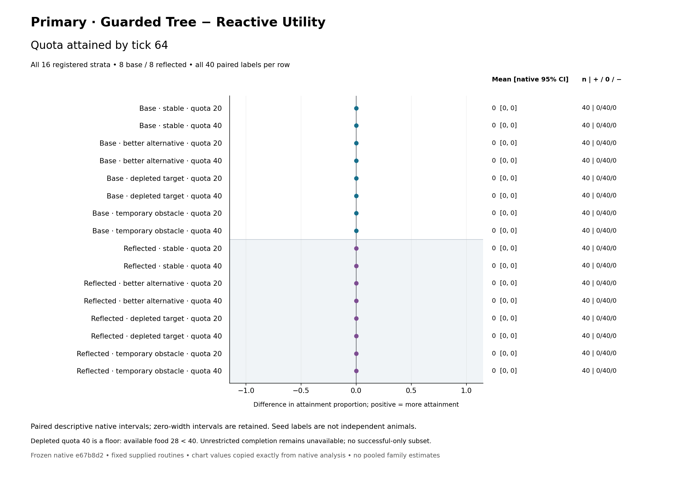

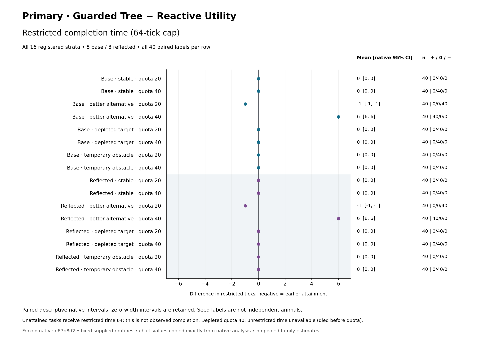

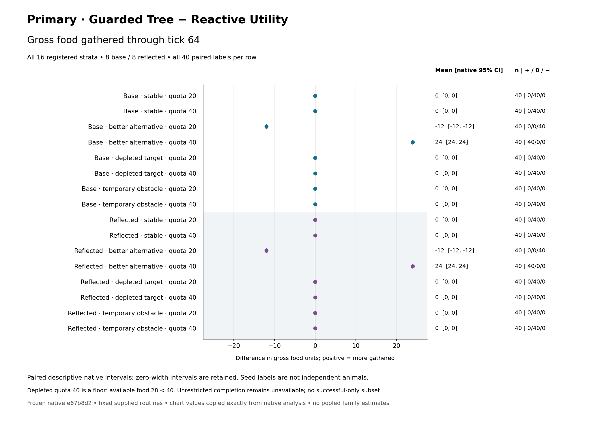

## Ablation: the value guard saves completion time in one declared setting

Guarded−Unguarded restricted completion is **−6 ticks**, interval **[−6,−6]**, signs **0/0/40**, n=40 in depleted-target/quota 20, separately in base and reflected orientation. Guarded completes at 6 and Unguarded at 12; both gather 28 and live 44. The other 14 ablation restricted-time rows are zero. All 16 attainment, all 16 food and all 16 lifetime ablation rows are zero. The complete family therefore retains two nonzero and 62 zero estimates.

The omitted positive-value check is the registered ablation; candidate presence and cooldown eligibility remain required. The interpretation concerns the supplied value guard and continuation contract. Reaching an empty selected site clears commitment but is not itself a physical-route failure and creates no cooldown. The final measured source includes that reviewed distinction.

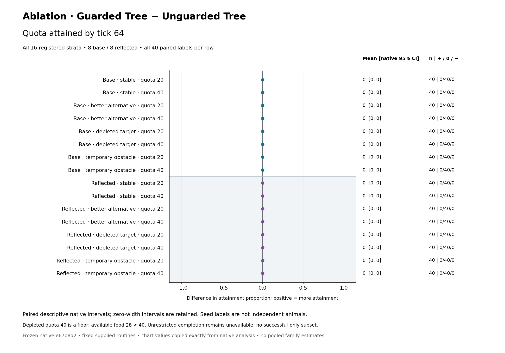

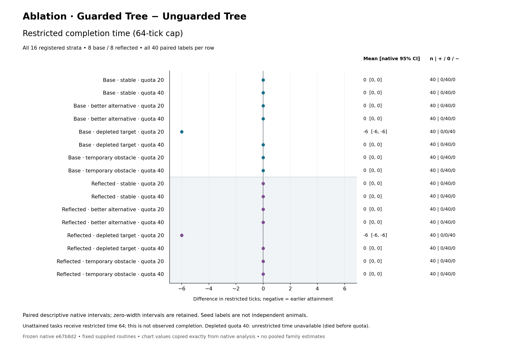

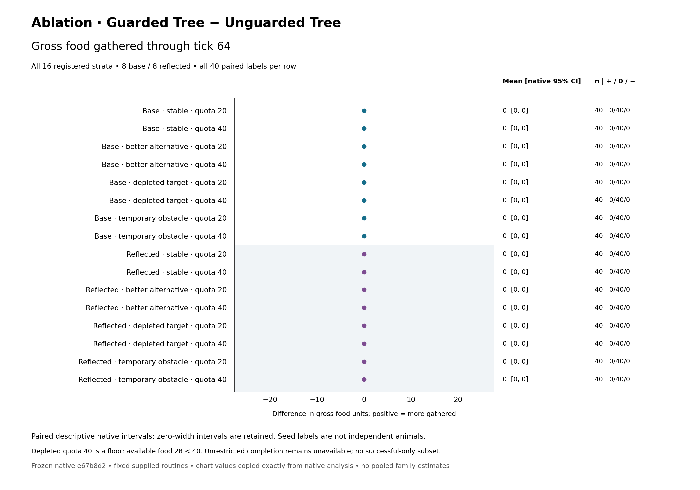

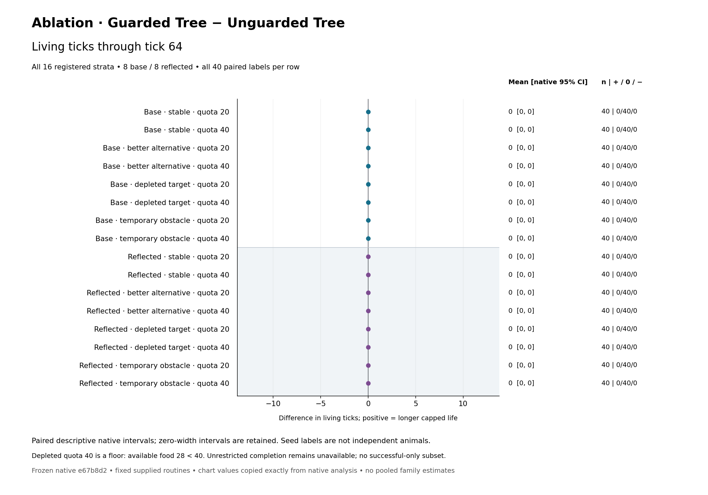

## Task GOAP and Legacy GOAP remain separate null references

All **64 Guarded−Task GOAP estimates** are zero: mean 0, interval [0,0], signs 0/40/0 and n=40 in every stratum/metric. All **64 Guarded−Legacy GOAP estimates** separately have that same result. This endpoint equality does not identify identical computation, goal definitions or runtime representation.

Task GOAP searches toward remaining task quota. Legacy GOAP retains the existing metabolism×initial-quota-horizon goal. Both use the existing own-plus-eight shortlist, half-value visible retention, Manhattan abstract travel cost plus its extra harvest tick, and a 4,096-expansion search limit. Those supplied choices differ from the tree's retained routine. A null economic/task contrast in this finite matrix does not make the two goals interchangeable in other environments.

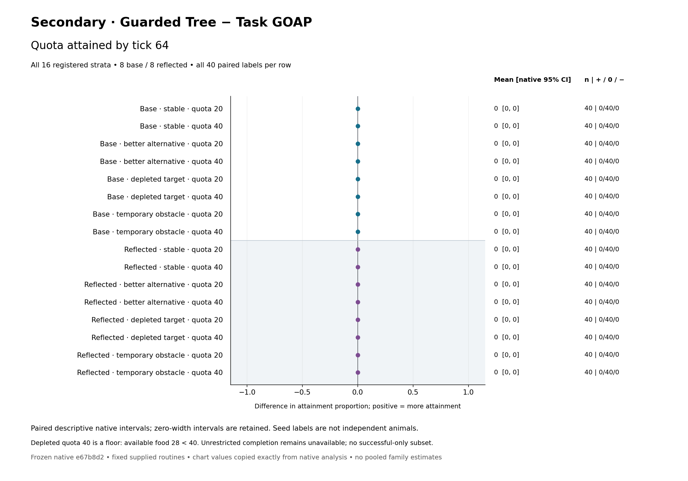

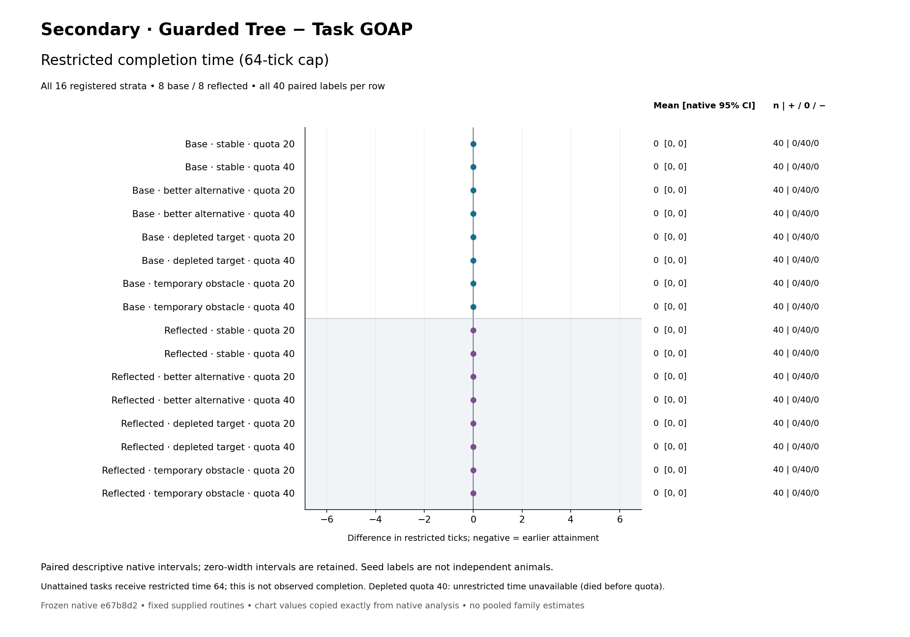

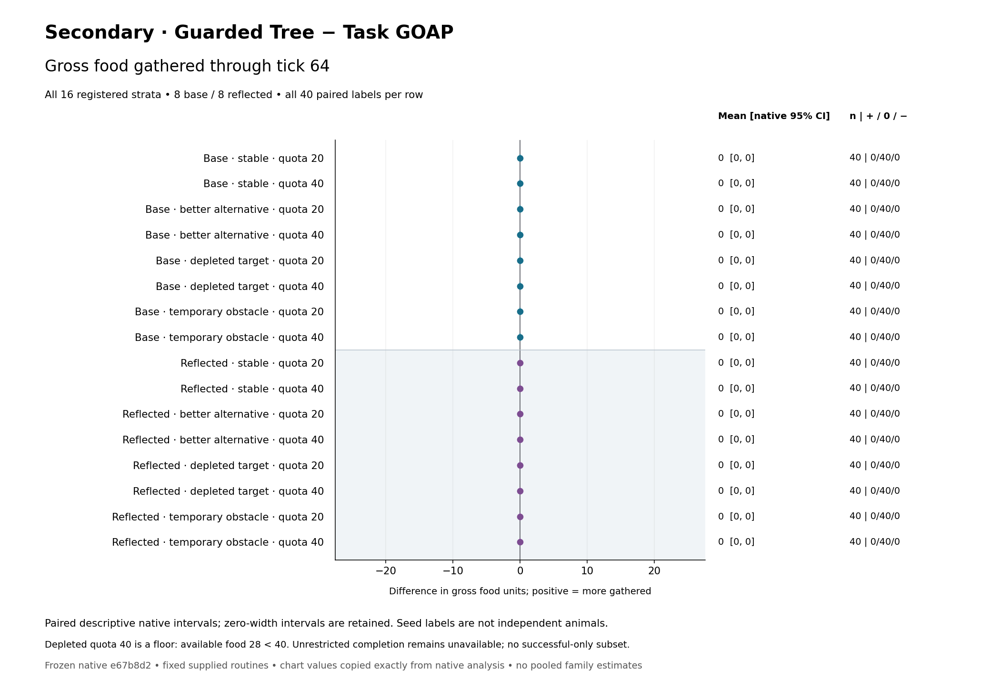

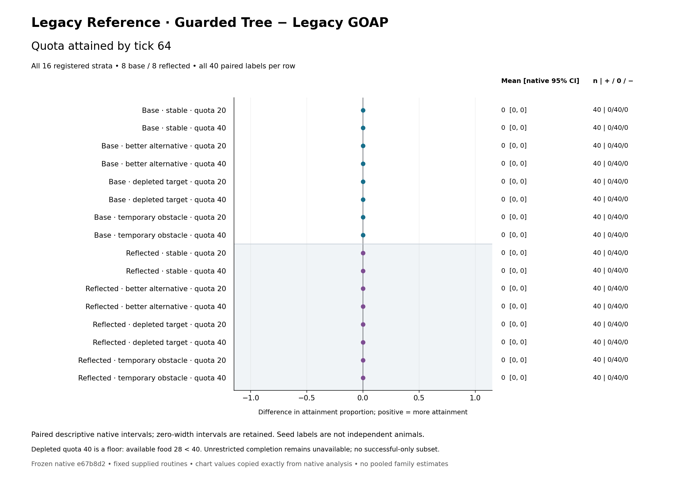

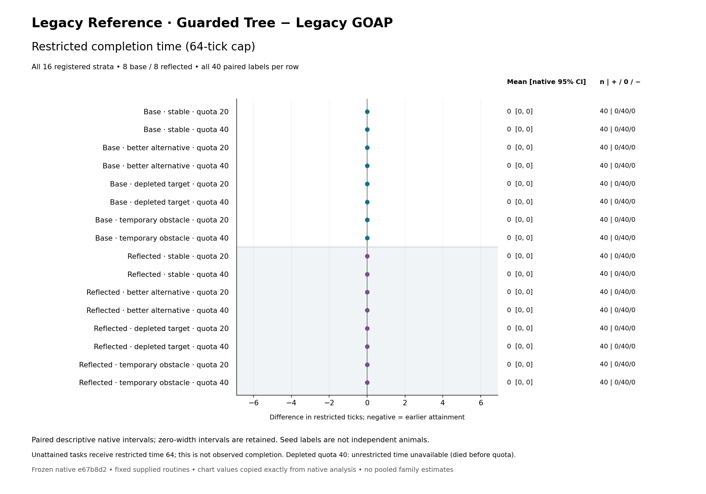

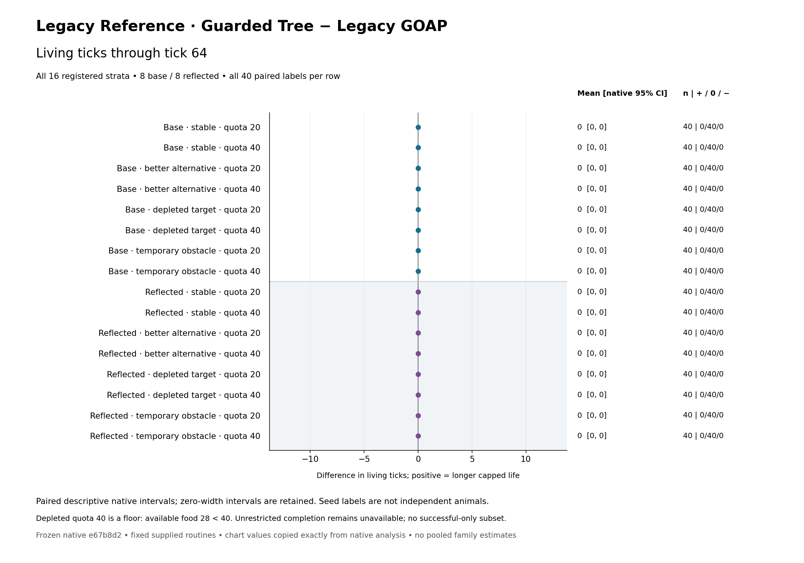

Every panel has a zero line, all eight base and eight reflected rows, native intervals, signs and n=40. PNG and SVG versions have identical data bindings; [asset inventory](figures/plot-inventory.json) lists all 32 files and [row bindings](figures/plot-row-bindings.json) map all 256 rows to both native analysis and chart-input indices. No scientific interval or estimate was recalculated in Python.

## Floors, unavailable completion and representation equivalence

Depleted-target/quota 40 has at most 28 available food, below quota 40. Every controller's first completion is null there. The restricted endpoint is 64 by definition; it is **not observed completion at tick 64**. Across four families, unrestricted-completion summaries have **56 available and eight unavailable** rows: the two depleted/quota 40 orientations in each family. All eight retain n=40 and all **320 unavailable seed/reason entries**, each `guarded=Some(DiedBeforeQuota); comparator=Some(DiedBeforeQuota)`. [Exact completion rows](completion-availability.json) and the [availability table](all-cell-diagnostics.md#unrestricted-completion-availability) preserve these nulls. Missing/invalid scientific episodes would instead make analysis unavailable; none occurred here.

All **640 Guarded Tree/Matched FSM checks** agree on the complete physical/task projection and exact canonical RNG continuation at all 65 frames per pair: **41,600 paired frames, zero differences**. Representation-specific hashes are deliberately not the equivalence target. The checks verify a tree representation of the supplied state machine; they do not supply 640 extra animals or an empirical claim of tree superiority.

The native analysis retains **40 full physical-trajectory duplicate groups and 28 cross-condition alias groups**. Duplicate signatures exclude representation, RNG and timing; exact RNG identities remain separately available. Shared seed labels, different full fingerprints and reflected copies are not independence tests. All groups and labels remain in [physical aliases](physical-aliases.json) and native analysis. Food and lifetime are linked by ordinary metabolism/holdings plus the horizon cap, so their signs are not independent corroboration.

## Fixed information, physical opportunities and oracle scope

The rig is an 11×11 grid with opaque boundary and 9×9 interior, one actor initially at (2,5), holdings 16, metabolism 1, vision 8 and map-prior span 128/share 1. Sites A(3,5), B(7,5), C(4,9) start with 4,24,24 food, capacities 4,24,36. There is no growback or ecological/social extension. Before action 3, better-alternative adds 12 to C, depleted-target drains B, and temporary-obstacle closes the food-free, actor-free (5,5) cell; the obstacle reopens before action 7. Stable has no event. Reflection transforms the geometry. Ordinary intervening-site gathering and one-step walking are retained.

The prospective complete construction audit used only seeds 7/8. All 2,948 positive candidate occurrences were connected; recorded-failure and cooldown filtering counts were both zero. Its 384 inspected action 3/action 7 sites were actor-free and food-free. This is construction opportunity evidence with its stated scope, not a substitute for the registered outcomes and not evidence that the fixed rig discriminates disconnected candidates or cooldown strategies. The registered raw audit separately checked all 245,760 transitions for arithmetic, permitted perception, movement and task accounting.

The retained hand derivation explains the designed conflict: at action 3 B's estimated score is 24/(1+3)=6. C's score is 24/(1+4) in stable and 36/(1+4) after the better-alternative addition. Guarded commitment can retain positive B while a fresh utility ranking chooses C. The obstacle hides B from the current cross-shaped sight but the supplied map memory retains 24; a connected detour exists. Candidates use permitted visible or remembered estimates; controllers do not read the intervention clock or researcher projections. Shared initial information does not imply identical post-treatment observations.

The separate 16-stratum exhaustive oracle visits 94,854 physical states and gives earliest quota 20/quota 40 completion bounds: stable 5/12, better-alternative 5/6, depleted 6/null, temporary-obstacle 6/13, separately in both orientations. Its omniscient free action choice omits the controller information restrictions, shortlist, tie RNG, representation, budget and computation cost. These are physical task lower bounds, not information-matched controller predictions or a compute optimum. The declared depleted floor and food/lifetime ceilings are retained; they cannot become evidence of successful adaptation.

## Actual work and timing

The [complete per-cell work and timing tables](all-cell-diagnostics.md) retain every controller/scenario/quota/orientation, all 40 episode denominators and full invocation counts. Exact values remain in native cell arrays and raw timing exports. Diagnostic min/median/max values are clearly secondary summaries of those saved arrays; they do not replace the registered scientific contrasts.

Across 245,760 scene turns, there are **50,480 active invocations**, **147,600 live completion holds** and **47,680 dead ticks**. Active includes a completing or dying action; hold means entered alive with quota already complete. Hold and dead turns have no measured controller invocation and are not zero-duration controller samples. No active duration, native work row, search-expansion count, controller episode total or native CI is null in this actual collection; unrestricted completion nulls remain separate. [Nullability census](native-nullability-census.json) records these exact counts.

Controller invocation timing ranges from **0.000002083 to 0.004178333 seconds**. Controller totals per episode range from **0.000035542 to 0.004456543 seconds**. These ranges describe all retained values, not pooled performance estimates. Episode envelope duration ranges from **0.319709291 to 1.010218459 seconds**. The wrapper timing includes live deadline expiry and controller work, excludes researcher observation projection, serialization and sink; the episode envelope includes constructor through the last frame sink/encoding/sync, excludes preconstructor identity checks and final outcome encoding/sync. The sole whole-writer wall interval is **8,707.411614 seconds** (08:06:30.678408–10:31:38.090022 UTC). The difference between these timing boundaries must not be attributed to controller cost.

For a concrete, explicitly single-cell example, stable/quota 20/base has five active calls per episode in all controllers. Guarded uses 26 node visits, 408 candidate evaluations, one target selection, five path queries and zero search expansions in every seed. Reactive uses zero tree-node visits, 810 candidate evaluations, five selections, five paths and zero expansions. Their observed median total controller times are 0.000054167 and 0.000042458 seconds respectively. Fewer ranking/selection operations therefore do not by themselves establish lower total observed time. Task GOAP in this same cell records 2,532 candidate evaluations and 22 expansions; Legacy GOAP 2,127 and 22. Counts reflect actual evaluation stages, including rescoring, rather than unique sites. This illustrative cell is not a family-level estimate or general timing ranking; all 95 other cells remain reported.

**No machine-isolation claim is made.** An actual 12,288-transition construction-helper check briefly overlapped early collection. Its tool exit 0 is retained, but its separate exact subprocess start/end interval was not captured and cannot be reconstructed. Subsequent monitoring was lightweight until collection exited. A later read-only process diagnostic was sandbox-denied with exit 126; CPU/RSS/stage profiling is unavailable. Measurement was not repeated to remove this history. Instrumentation overhead and host conditions remain part of the observations, and internal work counts were not independently reconstructed operation by operation.

## Reproducibility, confidentiality and remaining gates

A fresh independent prospective decision accepted the exact frozen candidate at 2026-10-09T08:01:44.176162 UTC before the sole collector started. Decision SHA256 is `a313aa5701f684af09839546dd0289167a7a219e8d830400b9116d9e6cf0fd4e`. Native binary SHA256 is `223b950a3eb4e210bc18e8e102b919c746ad0db8cfda1dc3e9fa1a320656a76e` (21,900,704 bytes, mode 100755). The launcher durably bound the decision/intent and rechecked clean frozen source, expected executable, private environment, protocol, manifest, configurations and absent output before construction.

After successful collection, the same accepted native executable performed one baseline saved analysis and one fresh saved reanalysis; both actual exits were 0 and both constructed no Worlds. Entire `analysis.json` and `results.md` outputs are byte-identical, totaling 22,208,832 bytes. [Exact byte comparison](native-analysis-byte-comparison.json) retains the result. Analysis SHA256 is `3a24716d45b938ecb3af8f6b9b777433baef3064f462a3a31af9daa024924cea`; results SHA256 is `835fe3b4ab730c70d512bd6e0be2f1e268290ac06a4856259f9c04bc0579437c`. The writer's final verification rehashed all 6,788 frozen packet files and 11,523 raw files without change. This reporting stage read the verified saved exports and ran no simulation or native analysis.

The frozen native build used rustc 1.98.1, aarch64-apple-darwin, release opt-level 3/DEBUG=false, locked/offline Cargo. The actual inherited and owned Cargo configurations yield two identical `--cfg tokio_unstable` declarations; this effective configuration is retained, not normalized after measurement. Source inventory SHA256 is `09aedae3cf1b213ba0b01d7da06c54acad1ac90c9f7280225aab9c9ec0e58f76`, 676-file compiled input SHA256 `cb403c31ca8d547facfa58d2e9dc22c2429cb37e99d611812c4207b611bd6f39`, native manifest SHA256 `138b000e4faf7bf6ec2ff40c9b249e846e0f168accee707ec46d94f38c87969a`, and protocol byte SHA256 `24bb95554afc458e42c41c25dd402ce6c480edece2e5f8c990596a2c225ac8bc`.

Raw environment and operational receipts contain inherited credentials and remain private and unchanged. Public metadata uses an explicit scientific allowlist and hashes of private originals; it does not claim public byte equality with unredacted private operational environments. [Archive cutoff proposal](archive-cutoff-proposal.json) identifies full scientific sources, raw simulation records, both native analyses and reporting artifacts for later lossless scientific packaging, while excluding private operational secrets. No full public archive is claimed to exist at this reporting gate. [Reproducing and file placement](REPRODUCING.md) explains the pending boundaries.

The validator checks saved actions/accounting without recomputing historical World fingerprints. Earlier semantic mutation/checkpoint/native-WASM gates have their stated scope. Saved native loading still requires the frozen source/executable paths. Historical early engineering command exits/output and a separate old environment snapshot remain unavailable; preserved wasm-pack version-check WARN, packaging INFO, browser-only Node skip and existing ignored tests were not silently normalized. No old study or failed history was overwritten.

The task, routine, guard, goal model and ontology are supplied. A tree is a representation and execution mechanism; a retained routine is not a learned skill. These data establish neither intelligence nor learned intent, animal cognition, independent biological replication, source-paper reproduction, universal controller dominance, compute optimality, or generalization outside this fixed rig. A fresh empirical reviewer must now assess the complete evidence, claims and all actual assets before reviewed integration, publication, served-byte verification and immutable archival.
